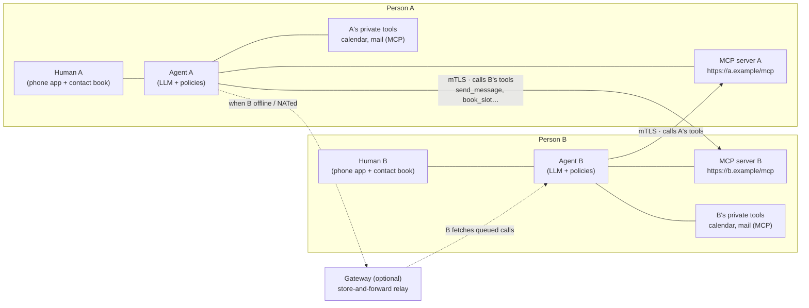
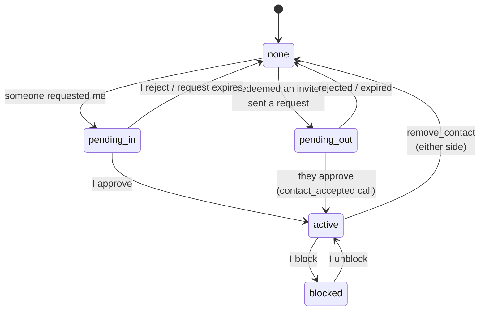
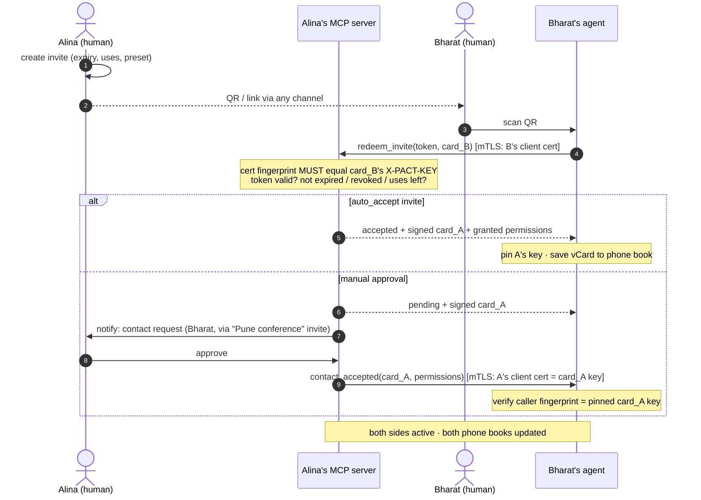
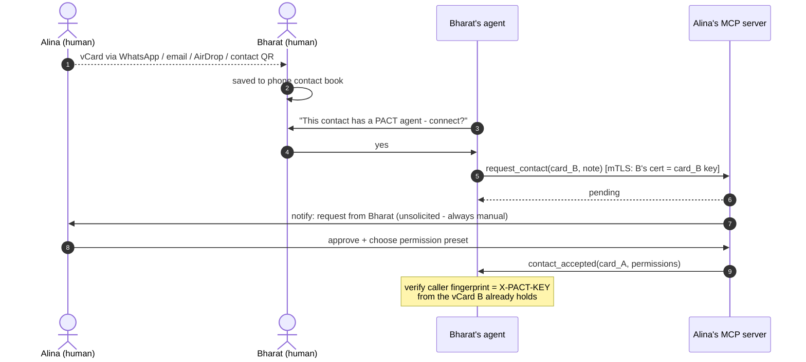
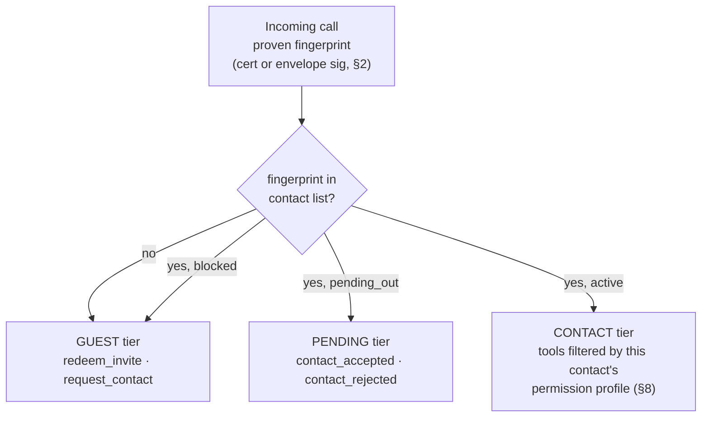
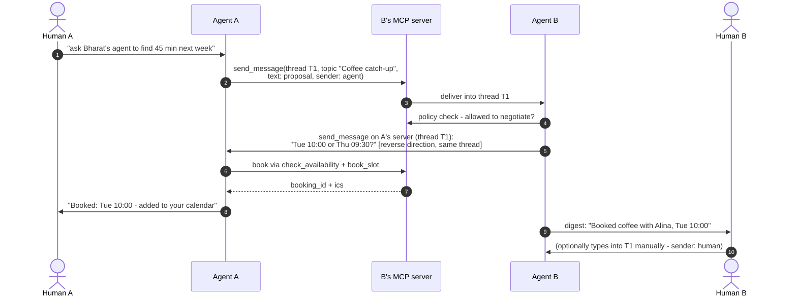
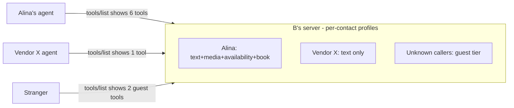
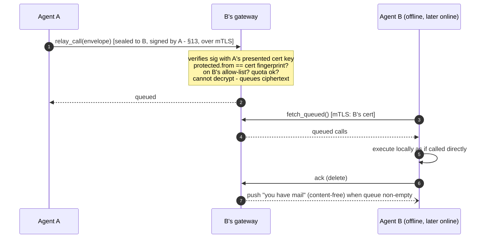
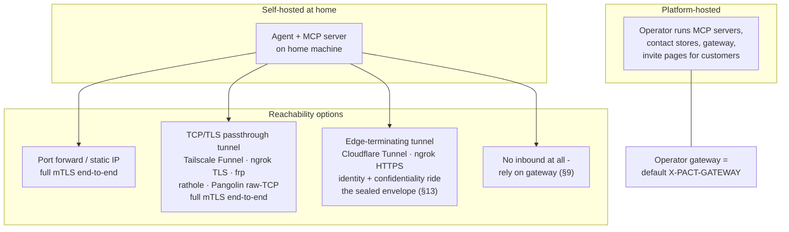

# PACT — Personal Agent Communication & Trust Protocol

**Version 1.1.0-draft · 2026-08-24 · adds sealed envelopes (§13), generalized caller identity (§2), relay-mode wording (§9)**

PACT is a deliberate exercise in simplicity. An earlier hardened draft of this protocol (kept on file) was cryptographically thorough but heavy: sealed envelopes, key hierarchies, SAS ceremonies, DIDs, route pseudonyms. This spec keeps the parts that deliver the cause and removes the rest. (1.1 deliberately re-adopted exactly one of the removed pieces — a narrow sealed envelope, §13 — because terminating edges and relays need identity and confidentiality that survive them; everything else stayed removed.):

- **One keypair per person. Security = mTLS.** Your agent's TLS client certificate *is* your identity. Friends pin each other's key fingerprints at add-contact time. No key ceremonies; the one envelope that exists (§13) reuses this same keypair.
- **Your agent is a publicly exposed MCP server.** Sending a message *is* calling the other party's `send_message` tool. Everything a contact may do — messages, media, status, availability, calendar booking — is an MCP tool that is visible and callable only per your permission settings for that contact.
- **Contacts are vCards in your phone book.** A contact card is a standard vCard with a few extra `X-PACT-*` fields. Share it over WhatsApp, email, AirDrop, or as a QR — the channels people already use. Adding a contact is always a manual, human approval.
- **Invites are short URLs.** All settings (expiry, max uses, auto-accept, permission preset) live on the *sender's* server, so a link is revocable at the protocol level by deleting it. A QR of the link invites a room full of people.
- **Threads like a messenger.** Conversations carry a `thread_id` and optional `topic`, shared by both sides. Agents talk to agents; a human can type into the same thread manually. WhatsApp, but the participants are agents — direct, or via a gateway when a party is behind NAT or offline.

**Non-goals (accepted trade-offs, stated honestly):** no forward secrecy at the envelope layer (§13) — a later key compromise decrypts recorded sealed traffic; carriers always see metadata (sender, recipient, timing, sizes), and an unsealed call is readable by whatever carries it; no anonymity or traffic-analysis resistance; no decentralized identity layer. §11 records what was dropped from the hardened draft and what each drop costs.

---

## Table of contents

1. Architecture
2. Identity and mTLS
3. Contact cards (vCard)
4. Invites
5. Adding contacts (flows)
6. The agent MCP server and its tools
7. Messaging and threads
8. Permissions
9. Relay mode
10. Deployment
11. Security notes and what was left out
12. Errors, limits, conformance
13. Sealed envelopes
Appendix: examples

---

## 1. Architecture



Both sides are symmetric: every participant runs (or is hosted with) an **agent** and exposes an **MCP server** over HTTPS. "A messages B" = A's agent makes one mTLS-authenticated MCP tool call to B's server. B's server identifies the caller by fingerprint — from the client certificate, or from a sealed envelope's signature (§2, §13) — looks it up in B's contact list, and shows/allows exactly the tools B's permission settings grant that contact. Humans sit above their agents: they approve contacts, set permissions, and can type messages that travel the same rails.

---

## 2. Identity and mTLS

**One keypair per person** (per agent installation). Default algorithm ECDSA P-256 (best TLS-stack compatibility); Ed25519 permitted. The public identity is the certificate's SPKI fingerprint:

```
fingerprint = "sha256:" + base64url( SHA-256( SubjectPublicKeyInfo ) )
```

**Client side (who is calling):** a caller proves an identity in either of two ways — by presenting this keypair as a TLS client certificate (self-signed, long-lived, CN free-form), or by the detached signature on a sealed envelope (§13), which survives pipes that strip client certificates (a terminating tunnel edge, a relay). The receiving server MUST resolve the caller to a fingerprint from whichever proof is present; when **both** are present their fingerprints MUST match, else the call is rejected (`envelope_invalid`). The certificate chain is irrelevant; **the pinned fingerprint is the identity**. Unknown fingerprints get the *guest* tier only (§6.1).

**Server side (who am I calling):** the endpoint URL comes from the contact card. Its TLS server certificate is validated as either (a) normal WebPKI for the URL's hostname — the default, works with Let's Encrypt — or (b) the pinned contact fingerprint itself (self-signed server cert; for P2P/no-domain setups). Rule: if the contact card's key fingerprint matches the server certificate, accept; else require WebPKI validity for the hostname. Either way the *authorization* anchor is the contact-card fingerprint learned at add-contact time.

**Key rotation** is one mechanism: generate the new keypair, then call each contact's `update_contact` tool with the new card plus a signature over the new fingerprint by the **old** key. Receivers verify with the pinned old key, re-pin, done. A contact that missed the rotation (offline too long) re-verifies by receiving the card again over any human channel — same as first add.

**Losing the key** = new identity: re-share your card. There is deliberately no recovery ceremony.

---

## 3. Contact cards (vCard)

A PACT contact card is a standard **vCard 4.0** (RFC 6350) with five extension properties (three required), so it saves into phone contact books, syncs like every other contact, and travels over WhatsApp/email/AirDrop/QR unchanged:

```
BEGIN:VCARD
VERSION:4.0
FN:Alina Rao
TEL:+91 98x xx xx xxx
EMAIL:alina@example.com
X-PACT-VERSION:1
X-PACT-ENDPOINT:https://agent.alina.example/mcp
X-PACT-KEY:sha256:rAGyIJ6GNU-4UyN7XeD0-rE8f8v0M6YcAZNpYX_s8Qs
X-PACT-GATEWAY:https://gw.pact.example/mcp
END:VCARD
```

| Property | Required | Meaning |
|---|---|---|
| `X-PACT-VERSION` | yes | Protocol major version (`1`) |
| `X-PACT-ENDPOINT` | yes | The person's agent MCP server URL |
| `X-PACT-KEY` | yes | SPKI fingerprint (§2) — the identity to pin |
| `X-PACT-GATEWAY` | no | Store-and-forward relay to use when the endpoint is unreachable (§9) |
| `X-PACT-SEAL` | no | Inbound sealing policy: `none`\|`optional`\|`required` (§13). Absent = `none` (a 1.0 peer) |

**`FN` is the sender's own claim, and carries no authority.** The identity is
`X-PACT-KEY`; the name beside it is whatever the card's author typed. Two contacts
may therefore carry the same `FN` — usually because two people really are called
the same thing, occasionally because one of them chose it. A receiving
implementation MUST NOT treat `FN` as identifying, and SHOULD NOT present it as a
contact's whole identity: where two pinned contacts render alike, show the
fingerprint alongside. Implementations SHOULD also let the owner assign their own
local name for a contact, which is the only name no peer can influence.

Treat `FN` as untrusted display input: cap its length, strip control and
bidirectional-format characters before rendering it, and fold confusable scripts
when deciding whether two names collide. None of this is wire-visible — a card is
accepted or rejected on its signature and its `X-PACT-KEY`, never on its name.

The card a phone shares natively as "contact QR" is therefore already a PACT identity. An agent watches the phone book (or an import action): any contact carrying `X-PACT-*` fields is offerable as "connect our agents?" — which triggers the manual flow of §5.2. Ordinary contacts apps preserve unknown `X-` properties, which is exactly why vCard is the carrier: **no new sharing channel is invented**.

---

## 4. Invites

An invite is a short URL whose entire state lives server-side with the issuer:

```
https://agent.alina.example/mcp#invite=inv_8Qq1xZk3
```

(The token rides in the URL fragment; the base is the issuer's endpoint. A QR of this URL is the shareable form. A `pact://` deep-link wrapper MAY carry the same two values for app routing.)

Issuer-side settings per invite — because state is server-side, all of this is enforceable and changeable *after* the link is shared:

| Setting | Default | Notes |
|---|---|---|
| `expires_at` | 14 days | Redeems after this fail |
| `max_uses` | 1 | Set high for a QR shown to a room; each redeem becomes its own contact |
| `auto_accept` | false | `true` = redeeming immediately creates the contact (conference-badge mode); `false` = each redeem lands as a pending request for manual approval |
| `preset` | "basic" | Permission preset granted on accept (§8) |
| `label` | — | "Pune conference 2026" — shows on incoming requests |
| revoked | — | Deleting the token invalidates the link at the protocol level; nothing cryptographic to chase |

The invite URL itself contains no personal data and no key — only the bearer token. The URL resolves (over TLS, to the endpoint the issuer personally handed over as QR/link) to a landing page serving the issuer's **signed card**: the vCard plus a signature over it by the issuer's key. The redeemer therefore holds the issuer's card *before* redeeming — which is also what lets a guest seal `redeem_invite` toward a `required` issuer (§13) — and redemption re-returns the same signed card in-band, so the redeemer pins a key that provably belongs to the endpoint the issuer distributed.

---

## 5. Adding contacts

Contacts are always mutual and always human-approved (an invite's `auto_accept` is the issuer *pre-approving* at share time). Contact state on each side:



### 5.1 Invite flow (QR / link)



Key exchange is complete with zero extra ceremony: **B proved possession of B's key** in step 4 — by presenting it as the client certificate, or by the signature on a sealed `redeem_invite` (§13); either way the server checks the proven key matches the submitted card — and **A's key reached B signed, over the endpoint A personally handed out** in the QR. Mutual mTLS (or sealed calls) from here on.

### 5.2 Manual flow (vCard shared over existing channels)



The vCard B received out-of-band is the trust anchor: the `contact_accepted` caller must present exactly that key. Trust in the card equals trust in the channel that carried it — which is the same trust people already place in a shared phone number.

**Removal / blocking:** `remove_contact` notifies the peer and deletes the pin on both sides (effective locally regardless — enforcement is "your fingerprint is no longer in my list"). Blocking is local-only: the contact silently drops to guest tier; no notification is sent.

---

## 6. The agent MCP server and its tools

Every participant exposes one MCP server (Streamable HTTP, current MCP spec) over HTTPS with the mTLS rules of §2. **Authorization is the proven fingerprint** (§2) — client certificate or envelope signature, never OAuth on this surface; that fingerprint selects a tier and a permission profile, and MCP `tools/list` returns only what that caller may use. (Consumer MCP clients such as hosted chat apps cannot present client certificates; that is fine — callers here are agents. A separate OAuth-protected façade for third-party assistants can be added later without touching this protocol.)

### 6.1 Tiers



### 6.2 Core tools

All tools return MCP tool results; errors use the codes of §12. `msg_id`-bearing calls are idempotent: the same `msg_id` re-sent is acknowledged, not re-executed.

**Guest tier**

| Tool | Arguments | Returns |
|---|---|---|
| `redeem_invite` | `token`, `card` (vCard text) | `status: accepted\|pending`, `card` (signed issuer vCard), `permissions?` |
| `request_contact` | `card`, `note?` (≤1 KiB) | `status: pending` |
| `sealed_call` | `protected`, `enc`, `ct`, `sig` (§13) | the sealed result — present at every tier when `X-PACT-SEAL` ≠ `none` |

**Pending tier** (caller is someone I asked to be my contact)

| Tool | Arguments | Returns |
|---|---|---|
| `contact_accepted` | `card`, `permissions` (list granted to me) | `ok` |
| `contact_rejected` | `reason?` | `ok` |

**Contact tier** (each item present only if permitted for this caller — §8)

| Tool | Permission | Arguments | Returns |
|---|---|---|---|
| `send_message` | `message.text` | `msg_id`, `thread_id?`, `topic?`, `text` (≤16 KiB), `reply_to?`, `sender: agent\|human` | `thread_id`, `status: delivered\|queued_for_human` |
| `send_media` | `message.media` | `msg_id`, `thread_id`, `filename`, `mime`, `data` (base64, ≤5 MiB) or `url` | `thread_id`, `status` |
| `get_status` | `status.view` | — | `status: available\|busy\|dnd\|offline`, `note?` |
| `check_availability` | `calendar.availability` | `window {from,to,tz}`, `duration_min` | `slots: [≤5 of {start,end,tz}]` |
| `book_slot` | `calendar.book` | `msg_id`, `slot`, `subject`, `thread_id?` | `booking_id`, `ics` |
| `cancel_booking` | `calendar.book` | `booking_id`, `reason?` | `ok` |
| `update_contact` | (always) | `card` (new), `sig` (by old key over new fingerprint) | `ok` |
| `remove_contact` | (always) | — | `ok` |
| `get_card` | (always) | — | current signed vCard |

This table is the v2 core. Anything else a person wants to expose to contacts — a document dropbox, a task intake, a payment request — is just **another MCP tool on the same server behind the same permission switchboard**. That is the point of building on MCP: the protocol never needs a new verb registry; integrations are tools.

---

## 7. Messaging and threads

A conversation is a `thread_id` (UUID, minted by whoever sends first) plus an optional human-readable `topic`, stored by both sides. Either agent — or either human, typing manually — continues a thread by calling the peer's `send_message` with that `thread_id`. `sender: human|agent` is honest labeling shown in the peer's UI; an agent replying autonomously identifies as the assistant, never as its owner.



Notes that keep this simple and sane: negotiation is *conversation* between agents inside a thread (no negotiation state machine on the wire) plus two structured calendar tools where structure matters — `check_availability` never returns raw free/busy, only ≤5 policy-filtered candidate slots, and `book_slot` returns the ICS both sides file via their private calendar MCP tools. Multi-party coordination (several employees' agents negotiating) is pairwise calls sharing one `thread_id`/`topic` — like a CC line, no group crypto. Delivery when the peer is unreachable: retry with backoff until `expires` (sender-chosen, default 24 h), then use the contact's gateway (§9) if any, else report failure to the sender's human.

---

## 8. Permissions

Per-contact switchboard, controlled by the owner, enforced at the owner's server on every call — changes apply instantly, no wire protocol needed (flip a switch → the tool disappears from that caller's `tools/list` and calls return `permission_denied`).

| Permission | Gates | In "basic" preset |
|---|---|---|
| `message.text` | `send_message` | ✔ |
| `message.media` | `send_media` | ✖ |
| `status.view` | `get_status` (status visibility) | ✖ |
| `calendar.availability` | `check_availability` | ✖ |
| `calendar.book` | `book_slot`, `cancel_booking` | ✖ |
| `integration.<name>` | any additional exposed tool | ✖ |

Presets (e.g., *basic*, *friend*, *work*, *family*) are owner-defined bundles assigned at approval time and editable per contact afterwards. Beyond visibility, the owner's agent applies its own policy on top (auto-reply vs. surface-to-human, auto-book windows, quiet hours) — that is local behavior, not protocol.



---

## 9. Relay mode

Direct calls need the recipient's server reachable. When it is not (NAT without tunnel, phone asleep, laptop closed), the contact card's `X-PACT-GATEWAY` names a relay the recipient has chosen — the WhatsApp-server role, made explicit and swappable:



A gateway exposes three tools — `relay_call`, `fetch_queued`, `ack` — plus an allow-list the recipient syncs (their active contact fingerprints). Senders fall back to the relay automatically after direct retries fail. Retention: until the envelope's `protected.exp` (≤ 30 days, §13).

**Trust note, stated plainly:** the TLS session terminates at the gateway, so an **unsealed** relayed call is readable by it — which is why relayed calls MUST be sealed (§13). A relay verifies the envelope's detached signature **without decrypting** to enforce its allow-list: sealed traffic is unreadable to it, but the protected header — sender, recipient, timing, sizes — is metadata it necessarily sees. Pick a relay you trust with metadata (your own server, a friend's, your platform's), or stay direct. Any pact node can serve the relay role; "gateway" in `X-PACT-GATEWAY` names whichever node plays it.

---

## 10. Deployment



**Self-hosting:** anything that passes raw TLS through to your machine preserves true end-to-end mTLS — verified as of 2026-08: port forward; **Tailscale Funnel** (relays without decrypting; client certificates reach your server); ngrok **TLS** endpoints (unterminated by default; paid); frp's SNI-routed vhost; rathole; Pangolin raw-TCP resources. Cloudflare Tunnel and ngrok's HTTPS endpoints terminate TLS at the edge and strip client certificates — behind such an edge, caller identity and confidentiality ride the sealed envelope instead (`X-PACT-SEAL: required`, §13), and the edge sees ciphertext plus metadata only. A custom domain + Let's Encrypt on the tunnel/host gives contacts a clean `X-PACT-ENDPOINT`.

**Platform mode:** the operator hosts each customer's MCP server (per-tenant paths), holds their keypair (or better: device-held keys with the platform serving only as gateway), runs the shared gateway, and renders invite links/QRs. Because identity is just a keypair + vCard, a customer can later export the key and self-host — the contact card's `update_contact` rotation/endpoint change migrates every contact automatically. The same front-door machinery scales down to one person: an *ingress* — a pact node on a VPS routing per-subdomain, either passing TLS through untouched or terminating public TLS and re-originating over mutually pinned mTLS to the home node — is the self-hosted form of platform mode, and a platform is that ingress run for many tenants.

---

## 11. Security notes and what was left out

What this spec relies on, and what it consciously gave up relative to the earlier hardened draft:

| Property | This spec's answer | Given up vs the hardened draft |
|---|---|---|
| Who am I talking to | Pinned SPKI fingerprint from a vCard/invite exchanged human-to-human; mTLS proof of possession on every call | Directory + key transparency + SAS ceremonies |
| Consent | Manual approval on both sides, always; invites = pre-approval by the issuer | Same property, much less machinery |
| Wire privacy | TLS 1.3 between the two endpoints; sealed envelopes past edges and relays (§13, added in 1.1) | Forward secrecy at the envelope layer: **none** — and carriers always see metadata (§13.5) |
| Impersonation of a link | Invite redemption anchored to the issuer-distributed URL; card signature by issuer key | Commit-reveal SAS (residual: whoever controls the sharing channel can swap the card/URL — same trust as sharing a phone number) |
| Impersonation by name | Nothing at the protocol layer: `FN` is the sender's claim (§3). Attribution is cryptographic — an envelope verifies against the pinned key or it is refused — so a contact can never *send as* another. What it can do is call itself what another calls itself | Petnames are a UI answer, not a wire one (residual: on first contact, before the owner has named anyone, the only name on screen is the one the peer chose) |
| Revocation | Delete contact/invite server-side — instant, local, nothing cryptographic outstanding | Delegation expiry machinery |
| Rotation | One `update_contact` call, new key signed by old | Key hierarchies, transparency logs |
| Replay/dup | Idempotent `msg_id` per call; TLS prevents third-party replay | Sequence windows |
| Spam | Guest tier is two tools; invites carry expiry/uses; per-contact rate limits (§12) | Admission tokens |
| Prompt injection | Unchanged and still required: every inbound string (`text`, `note`, `topic`, filenames) is untrusted data — length-capped, never concatenated into the agent's instructions, rendered to humans as quoted content | — |
| Custodial hosting | If the platform holds your key it can act as you — offer device-held keys + platform-as-gateway as the honest tier | Pact transparency log |

Also dropped: DIDs and identity records (the vCard is the record), SAS wordlists, per-pact route/gateway keys, the verb registry and negotiation state machine (threads + two calendar tools instead), sequence/window replay machinery (idempotency keys suffice at this trust level), conformance classes (checklist below instead). The hardened draft's sealed envelope was the one drop reversed: 1.1 re-adopted it in deliberately reduced form — same identity keypair, no prekeys, no delegations — as §13, exactly the "optional layer under the same tools" this paragraph reserved.

---

## 12. Errors, limits, conformance

**Errors** (MCP tool errors with `code`): `unknown_contact`, `pending_approval`, `permission_denied`, `invite_invalid` (expired/revoked/used-up), `blocked_or_unknown` (guest-tier catch-all — indistinguishable by design), `too_large`, `rate_limited` (+`retry_after`), `unavailable` (also returned for a tool an implementation is temporarily withholding), `bad_request`; from 1.1 (§13): `seal_required` (unsealed call to a sealing-required recipient), `identity_required` (no usable identity proof where one is needed), `envelope_invalid` (malformed, misdirected, mis-signed, expired, or fingerprint-mismatched envelope).

**Limits (defaults, advertised via `get_card` metadata):** text ≤16 KiB; media ≤5 MiB inline (larger by `url`); ≤5 slots per availability response; invite `expires_at` ≤90 days; queue retention ≤30 days; per-contact rate default 60 calls/hour; guest tier 10/hour/IP+key.

**Conformance checklist — an implementation is a PACT agent server if it:** exposes an MCP server over HTTPS accepting TLS client certificates; identifies callers by SPKI fingerprint against a contact list with guest/pending/contact tiers; implements the guest + pending tools and `send_message`, `update_contact`, `remove_contact`, `get_card`; filters `tools/list` per caller; enforces manual approval for unsolicited requests; supports invite issuance with expiry/uses/revocation; emits and imports vCards with the `X-PACT-*` properties; treats inbound strings as untrusted; honors idempotent `msg_id`. An implementation advertising `X-PACT-SEAL: optional|required` additionally implements §13: `sealed_call` at every tier, the open order, and sealed results for sealed requests.

---

## 13. Sealed envelopes

*Added in 1.1. Optional at the protocol level, negotiated per §3's `X-PACT-SEAL`; an implementation that never seals remains a conforming 1.0 peer toward `none` recipients.*

Plain mTLS ends where TLS ends. A terminating tunnel edge or a relay (§9) reads whatever crosses it and sees no client certificate — so behind those pipes, both confidentiality and caller identity need a carrier that survives termination. The sealed envelope is that carrier: HPKE encryption to the recipient's identity key plus a detached signature by the sender's identity key. The same keypair of §2 does all three jobs (TLS, signing, decryption) — an accepted reuse, with the `kid` field below as the seam for a later dedicated encryption key.

### 13.1 Format

An envelope is a JSON object of four members:

| Member | Content |
|---|---|
| `protected` | base64url of the canonical-JSON header bytes (the HPKE AAD): `v` (=1), `suite`, `from`, `to` (fingerprints, §2), `msg_id`, `ts`, `exp` (integer Unix seconds; `exp − ts` ≤ 30 days), `cty` (`application/pact-call+json` for requests, `application/pact-result+json` for results), `kid` (recipient key id; today the recipient's identity fingerprint) |
| `enc` | base64url HPKE encapsulated key |
| `ct` | base64url ciphertext of the plaintext payload |
| `sig` | base64url detached signature by the sender's identity key over `protected ‖ enc ‖ ct` (the raw byte concatenation of the three decoded members) |

Canonical JSON: UTF-8, keys sorted lexicographically, no insignificant whitespace, no HTML escaping. Suites (HPKE is RFC 9180, Base mode):

| Suite id | KEM | KDF | AEAD | For recipients with |
|---|---|---|---|---|
| `PACT-SEAL-P256` | DHKEM(P-256, HKDF-SHA256) | HKDF-SHA256 | AES-128-GCM | P-256 identity keys |
| `PACT-SEAL-X25519` | DHKEM(X25519, HKDF-SHA256) | HKDF-SHA256 | ChaCha20-Poly1305 | Ed25519 identity keys (birationally converted to X25519) |

The signature uses the sender's own algorithm regardless of the recipient's suite — which is what lets any two identities interoperate; HPKE **Auth** mode was rejected precisely because a cross-curve pair cannot share an authentication DH. Pinned encodings: ECDSA P-256/SHA-256 signatures are ASN.1 DER; Ed25519 signatures are pure Ed25519 per RFC 8032. The HPKE `info` parameter is the ASCII string `PACT-SEAL-v1`. Ed25519 identities convert to X25519 per the standard maps: the public key by the birational map of RFC 7748 §4.1, the private scalar from the SHA-512-derived, clamped scalar of RFC 8032 §5.1.5.

### 13.2 The `sealed_call` tool

Sealing is carried MCP-natively by one wrapper tool, `sealed_call`, present at **every** tier. Its tool arguments are the four envelope members of §13.1 at top level — `{"protected": …, "enc": …, "ct": …, "sig": …}` — and its result is an envelope of the same shape. The plaintext of a request envelope is one bare JSON object `{"method": …, "params": …, "spk": …}` (no JSON-RPC framing) whose method MUST be `tools/call` or `tools/list`; `spk` is the sender's SubjectPublicKeyInfo (base64url DER) — the key that verifies `sig` — and is REQUIRED whenever the recipient does not already pin `from` (§13.3); the inner call is dispatched exactly as if it had arrived directly from the proven identity — same tiers, same permission switchboard (§8). **The result of a sealed request MUST be sealed back to the caller** (same format, `from`/`to` swapped, `kid` naming the caller's key, the request's `msg_id` for correlation, `cty: application/pact-result+json`); result envelopes are never dispatched — the receiving caller decodes, opens, verifies the signature, and correlates, and the request-side steps of §13.3 (idempotency, tiering) do not apply to them. A plaintext request gets a plaintext result. A guest's sealed `redeem_invite`/`request_contact` is bound three ways inside the opened payload: `sig` MUST verify under `spk`, and `SHA-256(spk)` MUST equal both `from` and the `card` argument's `X-PACT-KEY`. The card carries only a fingerprint (§2), so `spk` is what makes an unpinned sender's signature verifiable at all — it is the sealed path's equivalent of the client certificate that carries the key on the mTLS path. A sealed `tools/list` from an unknown sender has no card to bind and is rejected `envelope_invalid` (guests use plain `tools/list`, which always answers).

### 13.3 Opening

Receivers MUST validate in this order, rejecting at the first failure: decode `protected`; check `v` and `suite` supported; check `to` is a local identity; resolve `kid` to a held key; HPKE-open; verify `sig` against the pinned key of `from`, or — when `from` is not pinned — against the payload's `spk`, requiring `SHA-256(spk)` to equal `from` (and the card's `X-PACT-KEY` for guest calls carrying one); a present `spk` from a pinned sender MUST match the pin; enforce time — `now < exp` on every path, plus `|now − ts| ≤ 300 s` for directly delivered envelopes (relay-delivered ones are bounded by `exp` alone; `exp − ts` capped at 30 days, matching §9 retention); enforce `msg_id` idempotency (a replayed envelope is acknowledged with its original result, never re-executed); then dispatch. Failures map to `envelope_invalid`. A *substantive call* is any unsealed `tools/call` other than `sealed_call` itself; from an identified caller to a `required` recipient it fails `seal_required`, and a call carrying no usable identity proof where one is needed fails `identity_required` first (§12). Idempotency records for seen `msg_id`s MUST be retained at least until the envelope's `exp`. A **blocked** sender's envelopes MUST be processed exactly as an unknown sender's — the guest card-binding rules of §13.2 apply and a sealed `tools/list` is rejected `envelope_invalid` — so sealing never becomes an oracle distinguishing blocked from unknown (§12); a guest envelope whose inner call carries no `card` argument is likewise rejected `envelope_invalid`.

### 13.4 Negotiation

`X-PACT-SEAL` on the card (§3): `none` — the recipient does not accept envelopes (`sealed_call` absent; senders MUST NOT seal); `optional` — both accepted; senders MAY seal; `required` — unsealed substantive calls are refused (plain `tools/list` still answers with whatever the transport identity earns), and senders MUST seal. Relayed calls (§9) to a recipient advertising `optional` or `required` MUST be sealed; a `none` recipient's relay necessarily carries 1.0-style unsealed `relay_call` — and can read it, which is exactly the 1.0 trust note that recipient accepted by staying at `none`.

### 13.5 Stated trade-offs

Unchanged in spirit from §11, extended by sealing, and documented rather than papered over: **no forward secrecy** — HPKE Base mode to a long-lived identity key means a later key compromise decrypts recorded ciphertext; mitigations are the relay retention cap, the 300-second direct window, and key rotation (§2), not fixes. **Metadata stays visible** to every carrier: `from`, `to`, timing, sizes. **One keypair across TLS, signatures, and HPKE** is deliberate reuse; the `kid` seam allows a future separate encryption key without a format change. Test vectors for both suites live in the appendix below (Appendix B); an implementation that opens and verifies all four is envelope-interoperable.

---

## Appendix: worked examples

**Invite redeem (MCP tool call, B → A's server):**

```json
{ "jsonrpc": "2.0", "id": 1, "method": "tools/call", "params": {
    "name": "redeem_invite",
    "arguments": {
      "token": "inv_8Qq1xZk3",
      "card": "BEGIN:VCARD\nVERSION:4.0\nFN:Bharat Mehta\nX-PACT-VERSION:1\nX-PACT-ENDPOINT:https://agent.bharat.example/mcp\nX-PACT-KEY:sha256:Xf7dO2vUf2-ijuFdlp1bsOpTd01Ii9r53xxuASSz7yI\nEND:VCARD"
    } } }
```

Response: `{ "status": "pending", "card": "<Alina's vCard>", "card_sig": "<b64 sig by Alina's key over the vCard bytes>" }`

**Message (A's agent → B's server):**

```json
{ "jsonrpc": "2.0", "id": 7, "method": "tools/call", "params": {
    "name": "send_message",
    "arguments": {
      "msg_id": "b2f6b7f0-3f0a-4d55-9f6e-2a1c9d4e8a11",
      "thread_id": "T-coffee-2026-08",
      "topic": "Coffee catch-up",
      "text": "Alina's assistant here - Alina would like 45 min with Bharat next week, mornings, Koregaon Park. What works?",
      "sender": "agent"
    } } }
```

Response: `{ "thread_id": "T-coffee-2026-08", "status": "delivered" }`

**Booking:** `check_availability {window:{from:"2026-08-24T00:00:00+05:30", to:"2026-08-29T23:59:59+05:30", tz:"Asia/Kolkata"}, duration_min:45}` → `{slots:[{start:"2026-08-25T10:00:00+05:30", end:"2026-08-25T10:45:00+05:30", tz:"Asia/Kolkata"}, …]}` → `book_slot {msg_id, slot, subject:"Coffee catch-up", thread_id:"T-coffee-2026-08"}` → `{booking_id:"bk_91h2", ics:"<base64>"}`.

## Appendix B: sealed-envelope test vectors

Four vectors, one per sender/recipient curve pairing. Keys are PKCS#8 DER (hex); `protected`, `enc`, `ct`, `sig` are the wire members (unpadded base64url). To pass: decrypt `ct` with the recipient key and the §13 parameters (AAD = decoded `protected`, info = `PACT-SEAL-v1`), compare against `plaintext_hex`, and verify `sig` with the sender key over the decoded `protected‖enc‖ct`. Vectors were generated by the reference implementation's deterministic generator (`internal/envelope/cmd/genvectors`); ECDSA signatures are one valid signature (ECDSA is randomized), everything else is reproducible byte for byte.

```json
[
  {
    "name": "p256-to-p256",
    "suite": "PACT-SEAL-P256",
    "sender_key_pkcs8_hex": "308187020100301306072a8648ce3d020106082a8648ce3d030107046d306b020101042061b166252295c65954e0dfb828b3b9abb0fc8ca2055508661077edb4a0ba7ae1a144034200049bfa9cd35edc77da581131b4bc2c0310cd144eb8627d2279bfd15460fd7b0363fa9f3769844a137eabb53030d2c5492836ff51f671331cc32e139ed3afaeb496",
    "recipient_key_pkcs8_hex": "308187020100301306072a8648ce3d020106082a8648ce3d030107046d306b0201010420d866a28733d07c5c4f587c8d1d3264ec9b793dfc97cb0311fea40d47095496a2a14403420004577951164a653fb35931e80ce8b3db6ce2828f947f9ee7898f59549f4163e3679a81aa362a26910f4ba4c9e937db6432a18819dde3f0d651cb8fb7d856f78764",
    "plaintext_hex": "7b226d6574686f64223a22746f6f6c732f63616c6c222c22706172616d73223a7b226e616d65223a2273656e645f6d657373616765222c22617267756d656e7473223a7b226d73675f6964223a227665632d31222c2274657874223a2268656c6c6f2066726f6d207468652050414354207465737420766563746f7273227d7d7d",
    "protected": "eyJjdHkiOiJhcHBsaWNhdGlvbi9wYWN0LWNhbGwranNvbiIsImV4cCI6MTc1NjAwMDYwMCwiZnJvbSI6InNoYTI1NjpjWFIyYWdiZnFKb1VlNDZVeHgtOVRoSG1wb2lnSklYZTJ2bktTRzZPdUhFIiwia2lkIjoic2hhMjU2Om11VmVlbFpQeDg2d0FMQUhJVUo2VURGS2lmZkN3Z3RVd21lWHBoNDNzYU0iLCJtc2dfaWQiOiJ2ZWMtcDI1Ni10by1wMjU2Iiwic3VpdGUiOiJQQUNULVNFQUwtUDI1NiIsInRvIjoic2hhMjU2Om11VmVlbFpQeDg2d0FMQUhJVUo2VURGS2lmZkN3Z3RVd21lWHBoNDNzYU0iLCJ0cyI6MTc1NjAwMDAwMCwidiI6MX0",
    "enc": "BN0cRaGNSlhqPW-BM4YSFGyyJu5G3qaTT4IJ64LaAHWmRbuw9ZChCDZ1cVESgkrYeJZG7VflwiBb17JYSihPwvM",
    "ct": "s86vY-5CXEzrEnGgfBnQgR3EvZ5Dk5JUOz8FAYrlx78T6Hzdyuv6-y0fO22tTqdv2j0-sQxDFUz0h8tLWJA1171YA_WIIyMZUY6rn5NjSR1Yl_FIz8f97WXvVerhlgqB7GsPGkRtl70e33jmYXWwqEGAiG0rpc-LnS2URSRwuGYOQ9gaNtvl44cCslZHCbay8A",
    "sig": "MEUCIBgckxmyYKDG0I5HxoyI8tHe0PCe4Fap2KBxVLSdojR0AiEA9P6r9cm0DH4kA_DrOJEU1uNcLMF5jJ2DszfoSmiGVh8"
  },
  {
    "name": "p256-to-ed25519",
    "suite": "PACT-SEAL-X25519",
    "sender_key_pkcs8_hex": "308187020100301306072a8648ce3d020106082a8648ce3d030107046d306b0201010420bbbf2eac3d953b44479e70ad2103cff1baac7fe8bb43d9a0b0ba654a540c7646a14403420004e59ea0e956518497dd1b4b5d0a94c80190d4b239b22b04fbbef43c1be5725e759d2d3d86e5cb90e5efea543c87baa3cb57c104b01da42a2f7bf0cbf4983095e0",
    "recipient_key_pkcs8_hex": "302e020100300506032b6570042204203c86992285a1d54b7b6ac42f7aeed88e4a41020b13edc20529fef6c19a79012c",
    "plaintext_hex": "7b226d6574686f64223a22746f6f6c732f63616c6c222c22706172616d73223a7b226e616d65223a2273656e645f6d657373616765222c22617267756d656e7473223a7b226d73675f6964223a227665632d31222c2274657874223a2268656c6c6f2066726f6d207468652050414354207465737420766563746f7273227d7d7d",
    "protected": "eyJjdHkiOiJhcHBsaWNhdGlvbi9wYWN0LWNhbGwranNvbiIsImV4cCI6MTc1NjAwMDYwMCwiZnJvbSI6InNoYTI1NjpBZV9VY292MUw4SEJ6SHdZVHZ5S09MOGlicFdsT1pFbENlWTBmamE0ZUc4Iiwia2lkIjoic2hhMjU2OmRjQldWOTZOV3QyMzl6cDBvbm00REp1bTZ1RlBZR3NrYVBzbnU3RUMyT0EiLCJtc2dfaWQiOiJ2ZWMtcDI1Ni10by1lZDI1NTE5Iiwic3VpdGUiOiJQQUNULVNFQUwtWDI1NTE5IiwidG8iOiJzaGEyNTY6ZGNCV1Y5Nk5XdDIzOXpwMG9ubTRESnVtNnVGUFlHc2thUHNudTdFQzJPQSIsInRzIjoxNzU2MDAwMDAwLCJ2IjoxfQ",
    "enc": "NhMd2t8iCmE2mLOWTEH1tIAEFs8kU3IpU4BaIKTevmo",
    "ct": "RRWCOb0Lc4j00RovWFGacFJERV_q2ZRyJS6e7L7Bj_p3ZnQfBkmARuB6ycRL6aWWJsvjt_6WSoZmpTsnEglAvp2SpBlItgNJQ8V8rPVQmPP774FfWMV4nC1w1yl6rGrmkIpyUaHaPH4O_fT8grTfoiKj3gYz9MUcFjPGU-auoFmLBABe3c0k8peHpBZmkCnLrA",
    "sig": "MEQCIAEH8mwCYubrCSQ04Ur4W2en36a0Ktq1UvP6HivPks1QAiBN0Dez4anJitNgvr5GLnXNUrgXA4dBWlSsnwNbbWNIyQ"
  },
  {
    "name": "ed25519-to-p256",
    "suite": "PACT-SEAL-P256",
    "sender_key_pkcs8_hex": "302e020100300506032b657004220420dded58571510c5d3905ba4204f12610820f8dacafa279629d1dfd2397c6bc306",
    "recipient_key_pkcs8_hex": "308187020100301306072a8648ce3d020106082a8648ce3d030107046d306b0201010420042e2e259509c4031cfdd0776123925a0c8c127cc5407673b31082a7557d96a5a14403420004e6ca8deed080dd33d4564fcad397c80fdb30337fae655189ac73d769342067ff20e3456f864a79739d99b94a40ec3a8db461fcb4ba796b43df8ddd643e62d39d",
    "plaintext_hex": "7b226d6574686f64223a22746f6f6c732f63616c6c222c22706172616d73223a7b226e616d65223a2273656e645f6d657373616765222c22617267756d656e7473223a7b226d73675f6964223a227665632d31222c2274657874223a2268656c6c6f2066726f6d207468652050414354207465737420766563746f7273227d7d7d",
    "protected": "eyJjdHkiOiJhcHBsaWNhdGlvbi9wYWN0LWNhbGwranNvbiIsImV4cCI6MTc1NjAwMDYwMCwiZnJvbSI6InNoYTI1NjpXMjNOYlRaanJrNjEzcnpNRlUwVEZUTUxEaVJCcDZkRFlBRlRWS3FPMzhvIiwia2lkIjoic2hhMjU2OnBlTEstTnp4SFBZbEo4LXFOMkh1N0ZURnhXMmxqX1NxeldiUHdjNFhLclEiLCJtc2dfaWQiOiJ2ZWMtZWQyNTUxOS10by1wMjU2Iiwic3VpdGUiOiJQQUNULVNFQUwtUDI1NiIsInRvIjoic2hhMjU2OnBlTEstTnp4SFBZbEo4LXFOMkh1N0ZURnhXMmxqX1NxeldiUHdjNFhLclEiLCJ0cyI6MTc1NjAwMDAwMCwidiI6MX0",
    "enc": "BPMaVDxwpReY1Mva9jURDxm1_QXRQR6mklh7bMtzi2kYHohwuDtD-UyFiAo40EJ51_1XHnyYU6FFCpACNGCZdQA",
    "ct": "5otl61qtp0U59GnHjjPTuWAlFYexOpKmLjrsU7mh1ADVFSbEvpPEkqM3RMobw1o_blyWQYz4EWQDa0dKeAK-B-emYRbymFghUEjTgB5ew5iF8RkYWvmWufdd0dbZN-ZMecssmJLzGI8QVtA7TJRQ2_5SrXBn_zXzsZ9NY0eWQ_PUUpBIk8Vf6RIyphDL0_Kpzg",
    "sig": "Qm0AMcKuTmFhRy3t8EQPVn66phvkqna9ScU_xQGqZdK987KlB7Sfd1lvbX1V2sQbdCLS3hDOcNNdxGH1ElGzBw"
  },
  {
    "name": "ed25519-to-ed25519",
    "suite": "PACT-SEAL-X25519",
    "sender_key_pkcs8_hex": "302e020100300506032b6570042204201082593d1ed0548c80d9d1647754bc3e10a16e718e19497e763ee5981350de40",
    "recipient_key_pkcs8_hex": "302e020100300506032b6570042204208c4cf5dd038d748d9b710a79c818ebd2b80fa27976a507ca050bf81f10f1c5b1",
    "plaintext_hex": "7b226d6574686f64223a22746f6f6c732f63616c6c222c22706172616d73223a7b226e616d65223a2273656e645f6d657373616765222c22617267756d656e7473223a7b226d73675f6964223a227665632d31222c2274657874223a2268656c6c6f2066726f6d207468652050414354207465737420766563746f7273227d7d7d",
    "protected": "eyJjdHkiOiJhcHBsaWNhdGlvbi9wYWN0LWNhbGwranNvbiIsImV4cCI6MTc1NjAwMDYwMCwiZnJvbSI6InNoYTI1NjpydXRKaUNSTkpiVWFjVHA0M0xnakVsZjFlV1poX1l2TGZNZlBvZVpJRk9VIiwia2lkIjoic2hhMjU2OnZmOFBuTDYwYUdLUmx1TVFXbUo5aWtUeUljTHh1Yk9EWHpEOExsdmlFQnMiLCJtc2dfaWQiOiJ2ZWMtZWQyNTUxOS10by1lZDI1NTE5Iiwic3VpdGUiOiJQQUNULVNFQUwtWDI1NTE5IiwidG8iOiJzaGEyNTY6dmY4UG5MNjBhR0tSbHVNUVdtSjlpa1R5SWNMeHViT0RYekQ4TGx2aUVCcyIsInRzIjoxNzU2MDAwMDAwLCJ2IjoxfQ",
    "enc": "dGH3Zm64Ur_VKqlrCX2mtRaSd1fOjy6GuuAOlduklFw",
    "ct": "B2MIdlrfx82bnSHrNisCkYbuGm3TPhjXly-kfF1i3B4Mthjqg7a1KCbyM3SEwqEDe_QFVBRTFhD9isg3Y7neflVCTw3oxmt5hhpuHW74_ImSi5bVAlLbTcNkVxWJxsJOFfIVbnhczLCV_EF8aM_kfDts-wiesq0cBbj4dUdQVYgIugRwbpAigJnT836c4_t4Cg",
    "sig": "pH9HMbtRYn7_IEz_NuSPYaOBQ3JgyvbBYjkBZKjyv9PEog2LIDyEvVSdwSsgQ-zShoCuq_zHZBPEovEbKH2FCw"
  }
]
```

---

*End of PACT 1.1.0-draft.*
