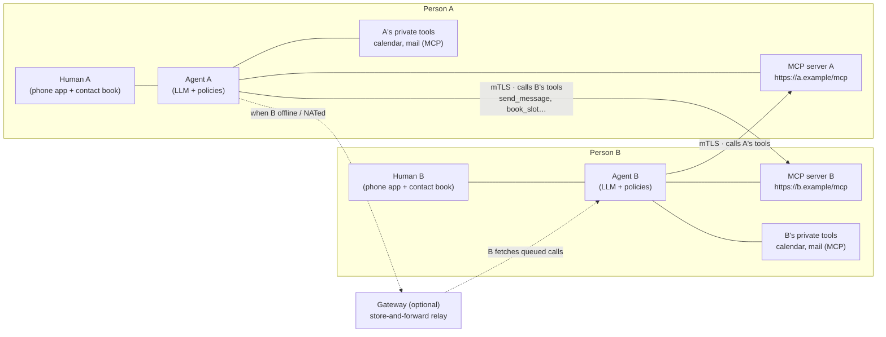
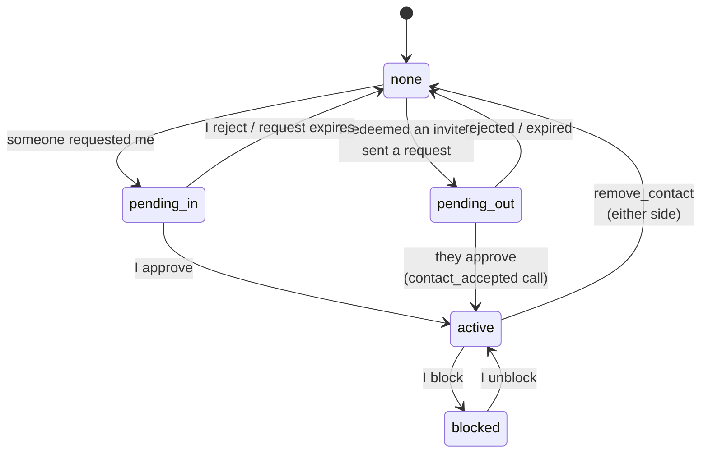
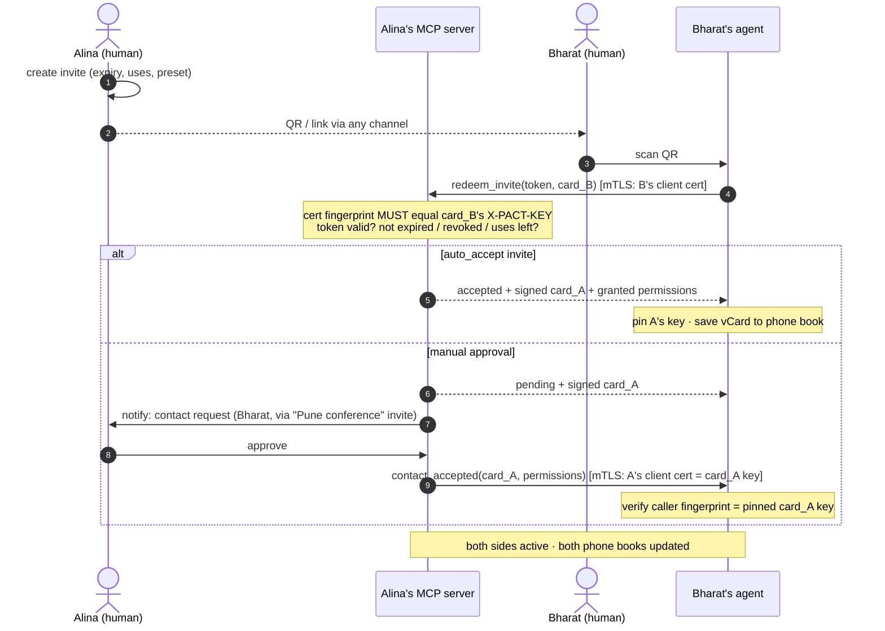
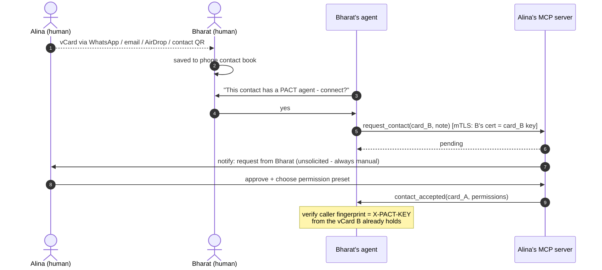
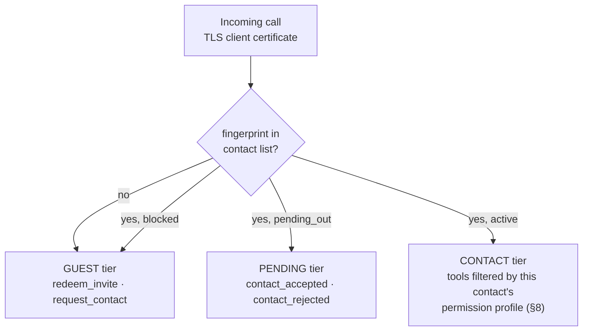
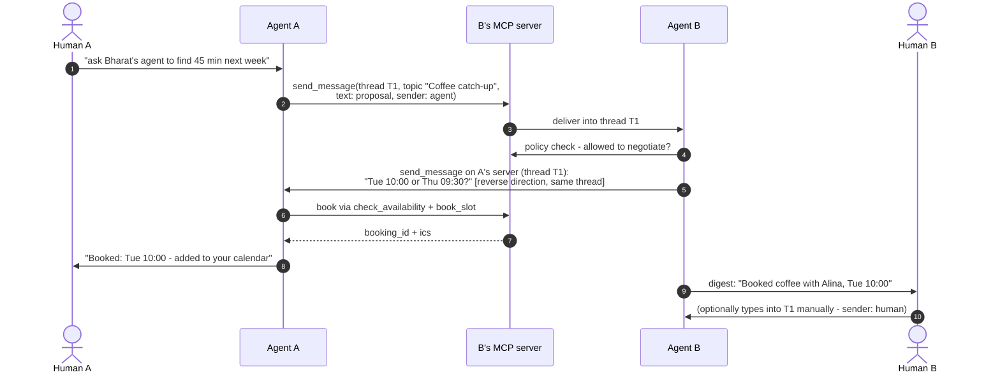
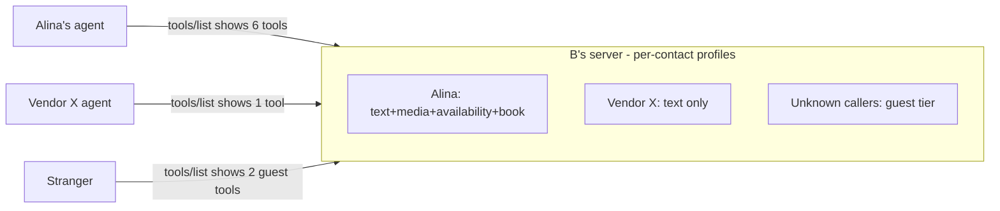
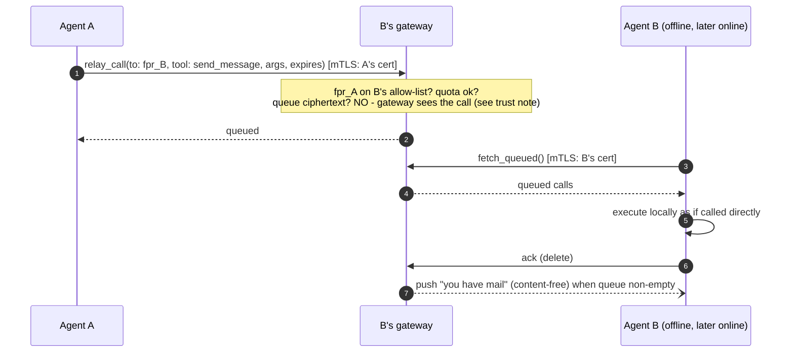
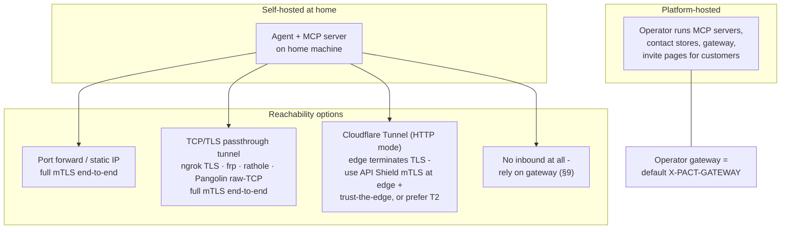

# PACT 1.0 — Simple Agent-to-Agent Messaging over MCP + mTLS

**Version 1.0.0 · 2026-08-23 · first public version**

PACT is a deliberate exercise in simplicity. An earlier hardened draft of this protocol (kept on file) was cryptographically thorough but heavy: sealed envelopes, key hierarchies, SAS ceremonies, DIDs, route pseudonyms. This spec keeps the parts that deliver the cause and removes the rest:

- **One keypair per person. Security = mTLS.** Your agent's TLS client certificate *is* your identity. Friends pin each other's key fingerprints at add-contact time. No envelope crypto, no key ceremonies.
- **Your agent is a publicly exposed MCP server.** Sending a message *is* calling the other party's `send_message` tool. Everything a contact may do — messages, media, status, availability, calendar booking — is an MCP tool that is visible and callable only per your permission settings for that contact.
- **Contacts are vCards in your phone book.** A contact card is a standard vCard with three extra `X-PACT-*` fields. Share it over WhatsApp, email, AirDrop, or as a QR — the channels people already use. Adding a contact is always a manual, human approval.
- **Invites are short URLs.** All settings (expiry, max uses, auto-accept, permission preset) live on the *sender's* server, so a link is revocable at the protocol level by deleting it. A QR of the link invites a room full of people.
- **Threads like a messenger.** Conversations carry a `thread_id` and optional `topic`, shared by both sides. Agents talk to agents; a human can type into the same thread manually. WhatsApp, but the participants are agents — direct, or via a gateway when a party is behind NAT or offline.

**Non-goals (accepted trade-offs, stated honestly):** no end-to-end encryption beyond the TLS session — a relay/gateway you route through can read traffic, so you choose gateways you trust (or connect direct); no anonymity or metadata hiding; no decentralized identity layer. §11 records what was dropped from the hardened draft and what each drop costs.

---

## Table of contents

1. Architecture
2. Identity and mTLS
3. Contact cards (vCard)
4. Invites
5. Adding contacts (flows)
6. The agent MCP server and its tools
7. Messaging and threads
8. Permissions
9. Gateway mode
10. Deployment
11. Security notes and what was left out
12. Errors, limits, conformance
Appendix: examples

---

## 1. Architecture



Both sides are symmetric: every participant runs (or is hosted with) an **agent** and exposes an **MCP server** over HTTPS. "A messages B" = A's agent makes one mTLS-authenticated MCP tool call to B's server. B's server identifies the caller by the client certificate, looks the fingerprint up in B's contact list, and shows/allows exactly the tools B's permission settings grant that contact. Humans sit above their agents: they approve contacts, set permissions, and can type messages that travel the same rails.

---

## 2. Identity and mTLS

**One keypair per person** (per agent installation). Default algorithm ECDSA P-256 (best TLS-stack compatibility); Ed25519 permitted. The public identity is the certificate's SPKI fingerprint:

```
fingerprint = "sha256:" + base64url( SHA-256( SubjectPublicKeyInfo ) )
```

**Client side (who is calling):** every call to a peer's MCP server presents this keypair as a TLS client certificate (self-signed, long-lived, CN free-form). The receiving server MUST match the presented certificate's fingerprint against its contact list — the certificate chain is irrelevant; **the pinned fingerprint is the identity**. Unknown fingerprints get the *guest* tier only (§6.1).

**Server side (who am I calling):** the endpoint URL comes from the contact card. Its TLS server certificate is validated as either (a) normal WebPKI for the URL's hostname — the default, works with Let's Encrypt — or (b) the pinned contact fingerprint itself (self-signed server cert; for P2P/no-domain setups). Rule: if the contact card's key fingerprint matches the server certificate, accept; else require WebPKI validity for the hostname. Either way the *authorization* anchor is the contact-card fingerprint learned at add-contact time.

**Key rotation** is one mechanism: generate the new keypair, then call each contact's `update_contact` tool with the new card plus a signature over the new fingerprint by the **old** key. Receivers verify with the pinned old key, re-pin, done. A contact that missed the rotation (offline too long) re-verifies by receiving the card again over any human channel — same as first add.

**Losing the key** = new identity: re-share your card. There is deliberately no recovery ceremony.

---

## 3. Contact cards (vCard)

A PACT contact card is a standard **vCard 4.0** (RFC 6350) with three extension properties, so it saves into phone contact books, syncs like every other contact, and travels over WhatsApp/email/AirDrop/QR unchanged:

```
BEGIN:VCARD
VERSION:4.0
FN:Alina Rao
TEL:+91 98x xx xx xxx
EMAIL:alina@example.com
X-PACT-VERSION:1
X-PACT-ENDPOINT:https://agent.alina.example/mcp
X-PACT-KEY:sha256:rAGyIJ6GNU-4UyN7XeD0-rE8f8v0M6YcAZNpYX_s8Qs
X-PACT-GATEWAY:https://gw.pact.example/mcp
END:VCARD
```

| Property | Required | Meaning |
|---|---|---|
| `X-PACT-VERSION` | yes | Protocol major version (`1`) |
| `X-PACT-ENDPOINT` | yes | The person's agent MCP server URL |
| `X-PACT-KEY` | yes | SPKI fingerprint (§2) — the identity to pin |
| `X-PACT-GATEWAY` | no | Store-and-forward relay to use when the endpoint is unreachable (§9) |

The card a phone shares natively as "contact QR" is therefore already a PACT identity. An agent watches the phone book (or an import action): any contact carrying `X-PACT-*` fields is offerable as "connect our agents?" — which triggers the manual flow of §5.2. Ordinary contacts apps preserve unknown `X-` properties, which is exactly why vCard is the carrier: **no new sharing channel is invented**.

---

## 4. Invites

An invite is a short URL whose entire state lives server-side with the issuer:

```
https://agent.alina.example/mcp#invite=inv_8Qq1xZk3
```

(The token rides in the URL fragment; the base is the issuer's endpoint. A QR of this URL is the shareable form. A `pact://` deep-link wrapper MAY carry the same two values for app routing.)

Issuer-side settings per invite — because state is server-side, all of this is enforceable and changeable *after* the link is shared:

| Setting | Default | Notes |
|---|---|---|
| `expires_at` | 14 days | Redeems after this fail |
| `max_uses` | 1 | Set high for a QR shown to a room; each redeem becomes its own contact |
| `auto_accept` | false | `true` = redeeming immediately creates the contact (conference-badge mode); `false` = each redeem lands as a pending request for manual approval |
| `preset` | "basic" | Permission preset granted on accept (§8) |
| `label` | — | "Pune conference 2026" — shows on incoming requests |
| revoked | — | Deleting the token invalidates the link at the protocol level; nothing cryptographic to chase |

The invite URL itself contains no personal data and no key. Everything sensitive is exchanged only during redemption, over TLS to the issuer's endpoint — whose authenticity is anchored by the URL the issuer personally handed over (QR/link). Redemption returns the issuer's **signed card**: the vCard plus a signature over it by the issuer's key, so the redeemer pins a key that provably belongs to the endpoint that the issuer distributed.

---

## 5. Adding contacts

Contacts are always mutual and always human-approved (an invite's `auto_accept` is the issuer *pre-approving* at share time). Contact state on each side:



### 5.1 Invite flow (QR / link)



Key exchange is complete with zero extra ceremony: **B proved possession of B's key** by presenting it as the client certificate in step 4 (the server checks it matches the submitted card), and **A's key reached B signed, over the endpoint A personally handed out** in the QR. Mutual mTLS from here on.

### 5.2 Manual flow (vCard shared over existing channels)



The vCard B received out-of-band is the trust anchor: the `contact_accepted` caller must present exactly that key. Trust in the card equals trust in the channel that carried it — which is the same trust people already place in a shared phone number.

**Removal / blocking:** `remove_contact` notifies the peer and deletes the pin on both sides (effective locally regardless — enforcement is "your fingerprint is no longer in my list"). Blocking is local-only: the contact silently drops to guest tier; no notification is sent.
---

## 6. The agent MCP server and its tools

Every participant exposes one MCP server (Streamable HTTP, current MCP spec) over HTTPS with the mTLS rules of §2. **Authorization is the transport identity** — no OAuth on this surface; the caller's certificate fingerprint selects a tier and a permission profile, and MCP `tools/list` returns only what that caller may use. (Consumer MCP clients such as hosted chat apps cannot present client certificates; that is fine — callers here are agents. A separate OAuth-protected façade for third-party assistants can be added later without touching this protocol.)

### 6.1 Tiers



### 6.2 Core tools

All tools return MCP tool results; errors use the codes of §12. `msg_id`-bearing calls are idempotent: the same `msg_id` re-sent is acknowledged, not re-executed.

**Guest tier**

| Tool | Arguments | Returns |
|---|---|---|
| `redeem_invite` | `token`, `card` (vCard text) | `status: accepted\|pending`, `card` (signed issuer vCard), `permissions?` |
| `request_contact` | `card`, `note?` (≤1 KiB) | `status: pending` |

**Pending tier** (caller is someone I asked to be my contact)

| Tool | Arguments | Returns |
|---|---|---|
| `contact_accepted` | `card`, `permissions` (list granted to me) | `ok` |
| `contact_rejected` | `reason?` | `ok` |

**Contact tier** (each item present only if permitted for this caller — §8)

| Tool | Permission | Arguments | Returns |
|---|---|---|---|
| `send_message` | `message.text` | `msg_id`, `thread_id?`, `topic?`, `text` (≤16 KiB), `reply_to?`, `sender: agent\|human` | `thread_id`, `status: delivered\|queued_for_human` |
| `send_media` | `message.media` | `msg_id`, `thread_id`, `filename`, `mime`, `data` (base64, ≤5 MiB) or `url` | `thread_id`, `status` |
| `get_status` | `status.view` | — | `status: available\|busy\|dnd\|offline`, `note?` |
| `check_availability` | `calendar.availability` | `window {from,to,tz}`, `duration_min` | `slots: [≤5 of {start,end,tz}]` |
| `book_slot` | `calendar.book` | `msg_id`, `slot`, `subject`, `thread_id?` | `booking_id`, `ics` |
| `cancel_booking` | `calendar.book` | `booking_id`, `reason?` | `ok` |
| `update_contact` | (always) | `card` (new), `sig` (by old key over new fingerprint) | `ok` |
| `remove_contact` | (always) | — | `ok` |
| `get_card` | (always) | — | current signed vCard |

This table is the v2 core. Anything else a person wants to expose to contacts — a document dropbox, a task intake, a payment request — is just **another MCP tool on the same server behind the same permission switchboard**. That is the point of building on MCP: the protocol never needs a new verb registry; integrations are tools.

---

## 7. Messaging and threads

A conversation is a `thread_id` (UUID, minted by whoever sends first) plus an optional human-readable `topic`, stored by both sides. Either agent — or either human, typing manually — continues a thread by calling the peer's `send_message` with that `thread_id`. `sender: human|agent` is honest labeling shown in the peer's UI; an agent replying autonomously identifies as the assistant, never as its owner.



Notes that keep this simple and sane: negotiation is *conversation* between agents inside a thread (no negotiation state machine on the wire) plus two structured calendar tools where structure matters — `check_availability` never returns raw free/busy, only ≤5 policy-filtered candidate slots, and `book_slot` returns the ICS both sides file via their private calendar MCP tools. Multi-party coordination (several employees' agents negotiating) is pairwise calls sharing one `thread_id`/`topic` — like a CC line, no group crypto. Delivery when the peer is unreachable: retry with backoff until `expires` (sender-chosen, default 24 h), then use the contact's gateway (§9) if any, else report failure to the sender's human.

---

## 8. Permissions

Per-contact switchboard, controlled by the owner, enforced at the owner's server on every call — changes apply instantly, no wire protocol needed (flip a switch → the tool disappears from that caller's `tools/list` and calls return `permission_denied`).

| Permission | Gates | In "basic" preset |
|---|---|---|
| `message.text` | `send_message` | ✔ |
| `message.media` | `send_media` | ✖ |
| `status.view` | `get_status` (status visibility) | ✖ |
| `calendar.availability` | `check_availability` | ✖ |
| `calendar.book` | `book_slot`, `cancel_booking` | ✖ |
| `integration.<name>` | any additional exposed tool | ✖ |

Presets (e.g., *basic*, *friend*, *work*, *family*) are owner-defined bundles assigned at approval time and editable per contact afterwards. Beyond visibility, the owner's agent applies its own policy on top (auto-reply vs. surface-to-human, auto-book windows, quiet hours) — that is local behavior, not protocol.



---

## 9. Gateway mode

Direct calls need the recipient's server reachable. When it is not (NAT without tunnel, phone asleep, laptop closed), the contact card's `X-PACT-GATEWAY` names a relay the recipient has chosen — the WhatsApp-server role, made explicit and swappable:



A gateway exposes three tools — `relay_call`, `fetch_queued`, `ack` — plus an allow-list the recipient syncs (their active contact fingerprints). Senders fall back to the gateway automatically after direct retries fail. Retention: `min(expires, 30 days)`.

**Trust note, stated plainly:** with plain mTLS the TLS session terminates at the gateway, so **the gateway can read relayed traffic**. That is the accepted trade-off: pick a gateway you trust (your own server, your company's, your platform's) exactly as employees trust their mail server — or stay direct. Sensitive exchanges between two online agents never need a gateway. (If end-to-end-past-the-gateway ever becomes a requirement, the hardened draft's sealed envelope drops back in as an optional layer without changing anything else here.)

---

## 10. Deployment



**Self-hosting:** anything that passes raw TLS through to your machine preserves true end-to-end mTLS (port forward; ngrok TLS endpoints with `terminate_at: agent`; frp/rathole; Pangolin raw-TCP resources). Cloudflare Tunnel in ordinary HTTP mode terminates TLS at the edge — client certificates are then validated *by the edge* (API Shield/Access mTLS) and asserted to your origin in headers; that works, but the edge joins your trust set, same class of trade-off as a gateway. A custom domain + Let's Encrypt on the tunnel/host gives contacts a clean `X-PACT-ENDPOINT`.

**Platform mode:** the operator hosts each customer's MCP server (per-tenant paths), holds their keypair (or better: device-held keys with the platform serving only as gateway), runs the shared gateway, and renders invite links/QRs. Because identity is just a keypair + vCard, a customer can later export the key and self-host — the contact card's `update_contact` rotation/endpoint change migrates every contact automatically.

---

## 11. Security notes and what was left out

What this spec relies on, and what it consciously gave up relative to the earlier hardened draft:

| Property | This spec's answer | Given up vs the hardened draft |
|---|---|---|
| Who am I talking to | Pinned SPKI fingerprint from a vCard/invite exchanged human-to-human; mTLS proof of possession on every call | Directory + key transparency + SAS ceremonies |
| Consent | Manual approval on both sides, always; invites = pre-approval by the issuer | Same property, much less machinery |
| Wire privacy | TLS 1.3 between the two endpoints | End-to-end past relays: **gone** — gateways can read (§9); choose them accordingly |
| Impersonation of a link | Invite redemption anchored to the issuer-distributed URL; card signature by issuer key | Commit-reveal SAS (residual: whoever controls the sharing channel can swap the card/URL — same trust as sharing a phone number) |
| Revocation | Delete contact/invite server-side — instant, local, nothing cryptographic outstanding | Delegation expiry machinery |
| Rotation | One `update_contact` call, new key signed by old | Key hierarchies, transparency logs |
| Replay/dup | Idempotent `msg_id` per call; TLS prevents third-party replay | Sequence windows |
| Spam | Guest tier is two tools; invites carry expiry/uses; per-contact rate limits (§12) | Admission tokens |
| Prompt injection | Unchanged and still required: every inbound string (`text`, `note`, `topic`, filenames) is untrusted data — length-capped, never concatenated into the agent's instructions, rendered to humans as quoted content | — |
| Custodial hosting | If the platform holds your key it can act as you — offer device-held keys + platform-as-gateway as the honest tier | Pact transparency log |

Also dropped: DIDs and identity records (the vCard is the record), sealed envelopes and suites, SAS wordlists, per-pact route/gateway keys, the verb registry and negotiation state machine (threads + two calendar tools instead), sequence/window replay machinery (idempotency keys suffice at this trust level), conformance classes (checklist below instead). The hardened draft remains on file; its envelope can return later as an optional layer under the same tools if a deployment ever needs gateway-proof confidentiality.

---

## 12. Errors, limits, conformance

**Errors** (MCP tool errors with `code`): `unknown_contact`, `pending_approval`, `permission_denied`, `invite_invalid` (expired/revoked/used-up), `blocked_or_unknown` (guest-tier catch-all — indistinguishable by design), `too_large`, `rate_limited` (+`retry_after`), `unavailable`, `bad_request`.

**Limits (defaults, advertised via `get_card` metadata):** text ≤16 KiB; media ≤5 MiB inline (larger by `url`); ≤5 slots per availability response; invite `expires_at` ≤90 days; queue retention ≤30 days; per-contact rate default 60 calls/hour; guest tier 10/hour/IP+key.

**Conformance checklist — an implementation is a PACT agent server if it:** exposes an MCP server over HTTPS accepting TLS client certificates; identifies callers by SPKI fingerprint against a contact list with guest/pending/contact tiers; implements the guest + pending tools and `send_message`, `update_contact`, `remove_contact`, `get_card`; filters `tools/list` per caller; enforces manual approval for unsolicited requests; supports invite issuance with expiry/uses/revocation; emits and imports vCards with the `X-PACT-*` properties; treats inbound strings as untrusted; honors idempotent `msg_id`.

---

## Appendix: worked examples

**Invite redeem (MCP tool call, B → A's server):**

```json
{ "jsonrpc": "2.0", "id": 1, "method": "tools/call", "params": {
    "name": "redeem_invite",
    "arguments": {
      "token": "inv_8Qq1xZk3",
      "card": "BEGIN:VCARD\nVERSION:4.0\nFN:Bharat Mehta\nX-PACT-VERSION:1\nX-PACT-ENDPOINT:https://agent.bharat.example/mcp\nX-PACT-KEY:sha256:Xf7dO2vUf2-ijuFdlp1bsOpTd01Ii9r53xxuASSz7yI\nEND:VCARD"
    } } }
```

Response: `{ "status": "pending", "card": "<Alina's vCard>", "card_sig": "<b64 sig by Alina's key over the vCard bytes>" }`

**Message (A's agent → B's server):**

```json
{ "jsonrpc": "2.0", "id": 7, "method": "tools/call", "params": {
    "name": "send_message",
    "arguments": {
      "msg_id": "b2f6b7f0-3f0a-4d55-9f6e-2a1c9d4e8a11",
      "thread_id": "T-coffee-2026-08",
      "topic": "Coffee catch-up",
      "text": "Alina's assistant here - Alina would like 45 min with Bharat next week, mornings, Koregaon Park. What works?",
      "sender": "agent"
    } } }
```

Response: `{ "thread_id": "T-coffee-2026-08", "status": "delivered" }`

**Booking:** `check_availability {window:{from:"2026-08-24T00:00:00+05:30", to:"2026-08-29T23:59:59+05:30", tz:"Asia/Kolkata"}, duration_min:45}` → `{slots:[{start:"2026-08-25T10:00:00+05:30", end:"2026-08-25T10:45:00+05:30", tz:"Asia/Kolkata"}, …]}` → `book_slot {msg_id, slot, subject:"Coffee catch-up", thread_id:"T-coffee-2026-08"}` → `{booking_id:"bk_91h2", ics:"<base64>"}`.

*End of PACT 1.0.0.*
