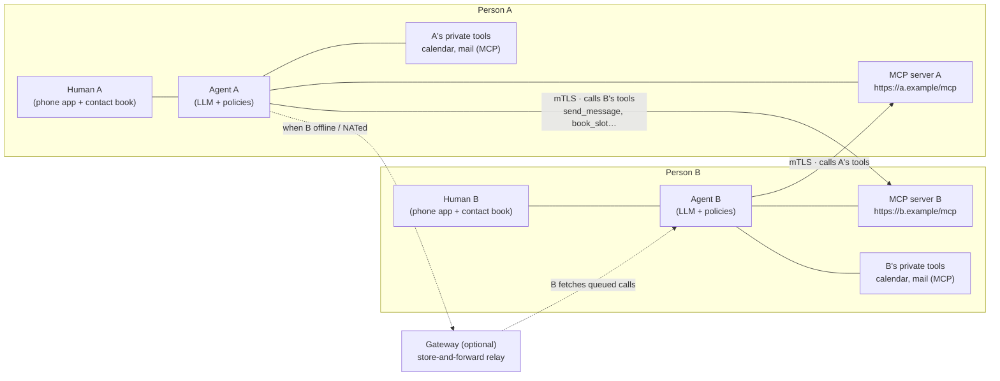
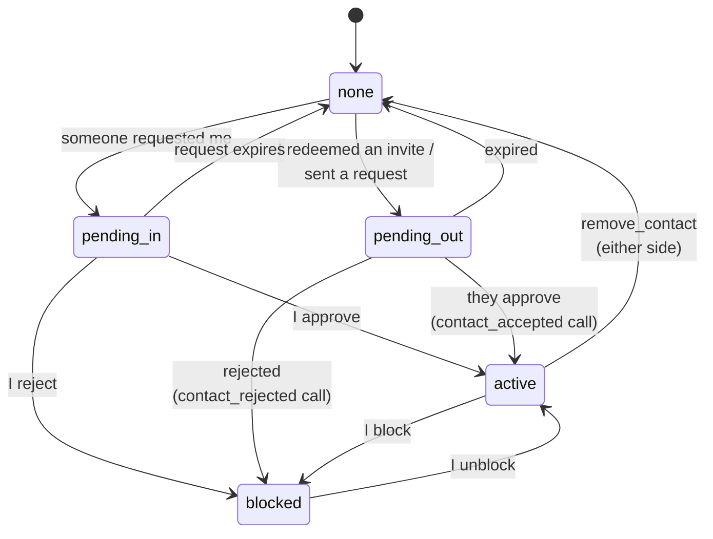
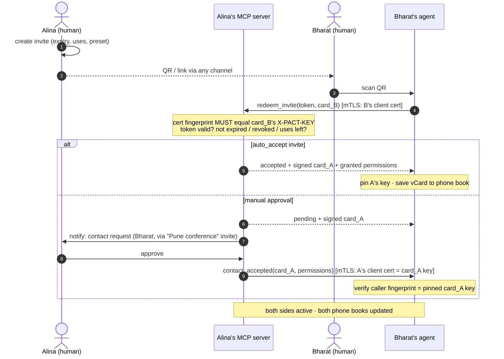
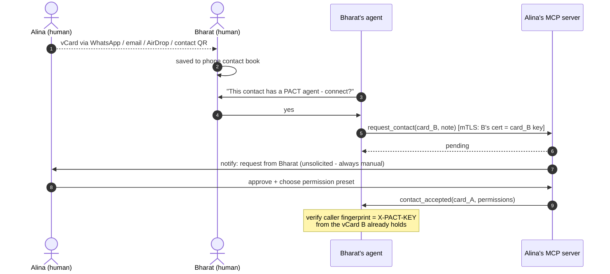
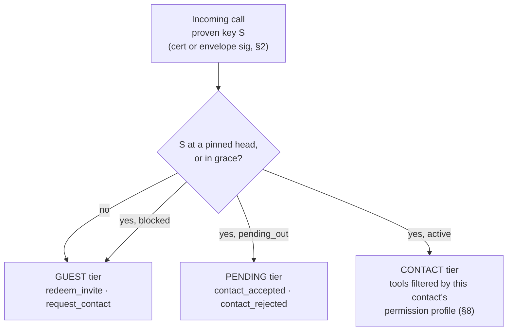
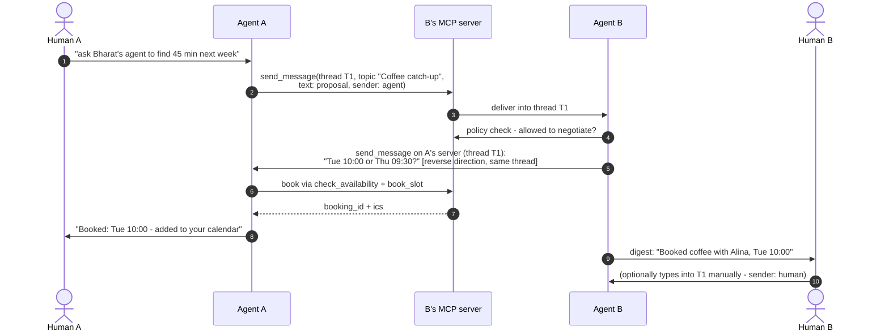
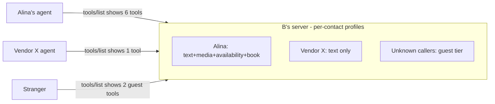
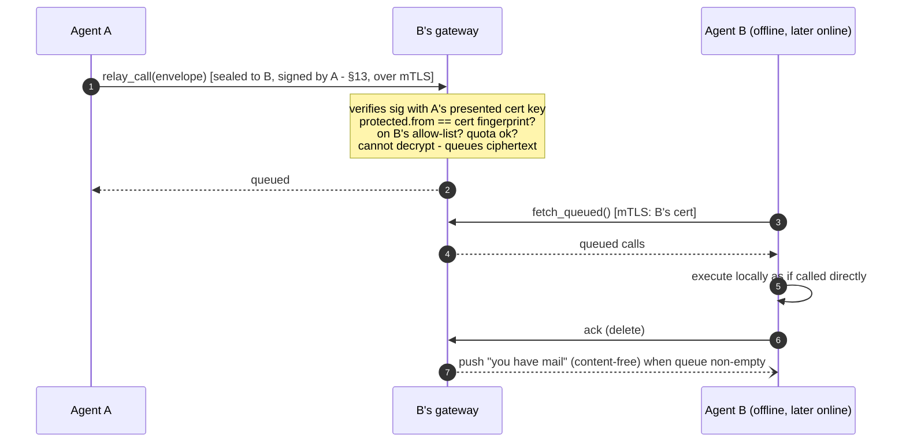
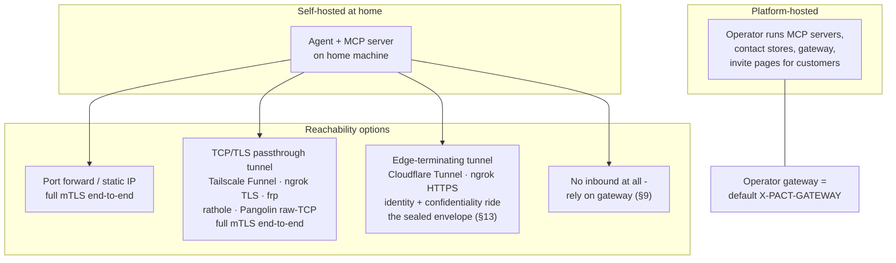
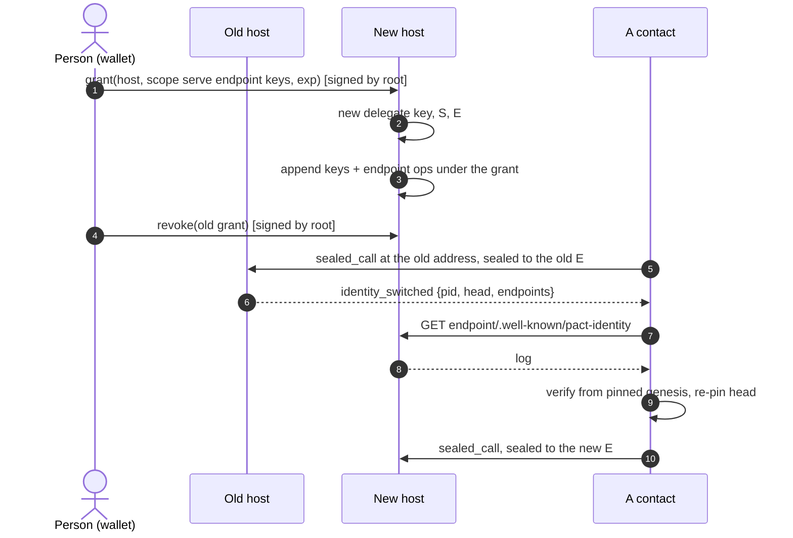

# PACT — Personal Agent Communication & Trust Protocol

**Version 2.0.0-draft · 2026-09-12 · the identity generation: a person-held root, hosting by grant, and a self-certifying identity log (§2, §3, §13, §14, Appendix C)**

PACT is a deliberate exercise in simplicity. An earlier hardened draft of this protocol (kept on file) was cryptographically thorough but heavy: sealed envelopes, key hierarchies, SAS ceremonies, DIDs, route pseudonyms. This spec keeps the parts that deliver the cause and removes the rest. 1.1 re-adopted exactly one of the removed pieces — a narrow sealed envelope, §13 — because terminating edges and relays need identity and confidentiality that survive them. 2.0 re-adopts a second, for a reason of the same kind: an identity that belongs to a person rather than to whoever hosts it needs the key that *controls* it separated from the keys that *serve* it, and a record of that control anyone can verify. That is §14: a root key the person holds, a grant that lets a host serve the identity for a time, and a small signed log. Still no DIDs, no SAS, no prekeys, no ceremonies, no directory.

- **The identity is the person's; the host serves it.** An identity is the hash of a genesis operation the person signed with a root key that lives in their wallet and does nothing else. The host they choose holds the online keys — one for TLS and signatures, one for sealing — under a grant the root signed, scoped and expiring. Contacts pin the identity, learn its current keys and address from its log, and never have to be told when any of them change. Moving to another host is one signature, and no host can delay or block it (§14).
- **Your agent is a publicly exposed MCP server.** Sending a message *is* calling the other party's `send_message` tool. Everything a contact may do — messages, media, status, availability, calendar booking — is an MCP tool that is visible and callable only per your permission settings for that contact.
- **Contacts are vCards in your phone book.** A contact card is a standard vCard with a few extra `X-PACT-*` fields. Share it over WhatsApp, email, AirDrop, or as a QR — the channels people already use. Adding a contact is always a manual, human approval.
- **Invites are short URLs.** All settings (expiry, max uses, auto-accept, permission preset) live on the *sender's* server, so a link is revocable at the protocol level by deleting it. A QR of the link invites a room full of people.
- **Threads like a messenger.** Conversations carry a `thread_id` and optional `topic`, shared by both sides. Agents talk to agents; a human can type into the same thread manually. WhatsApp, but the participants are agents — direct, or via a gateway when a party is behind NAT or offline.

**Non-goals (accepted trade-offs, stated honestly):** no forward secrecy at the envelope layer (§13) — a later key compromise decrypts recorded sealed traffic, bounded in 2.0 by the sealing key's turnover; carriers always see metadata (sender, recipient, timing, sizes), and an unsealed call is readable by whatever carries it; no anonymity or traffic-analysis resistance; no directory — a bare identifier resolves to nothing, every relationship starts from a card or an invite; no recovery of a lost root — the person's backups are the only copy. §11 records what was dropped from the hardened draft and what each drop costs.

---

## Table of contents

1. Architecture
2. Identity and mTLS
3. Contact cards (vCard)
4. Invites
5. Adding contacts (flows)
6. The agent MCP server and its tools
7. Messaging and threads
8. Permissions
9. Relay mode
10. Deployment
11. Security notes and what was left out
12. Errors, limits, conformance
13. Sealed envelopes
14. Identity operations and the log
Appendix A: worked examples
Appendix B: sealed-envelope test vectors
Appendix C: coexistence with 1.x

---

## 1. Architecture



Both sides are symmetric: every participant runs (or is hosted with) an **agent** and exposes an **MCP server** over HTTPS. "A messages B" = A's agent makes one mTLS-authenticated MCP tool call to B's server. B's server identifies the caller by fingerprint — from the client certificate, or from a sealed envelope's signature (§2, §13) — looks it up in B's contact list, and shows/allows exactly the tools B's permission settings grant that contact. Humans sit above their agents: they approve contacts, set permissions, and can type messages that travel the same rails.

---

## 2. Identity, keys and mTLS

An identity is a **pid**: the hash of a signed genesis operation (§14). The person who signed it holds the **root** key that controls it. A **host** — the person's own machine, or a platform — serves the identity under a **grant** the root signed, and holds two online keys for it: the **signing key** `S`, which is the TLS keypair and signs every call, and the **sealing key** `E`, which contacts seal to (§13). What 1.x called *the* keypair is `S`; what 1.x pinned is now learned from the log and re-learned whenever it changes.

| Key | Held by | Algorithm | Does |
|---|---|---|---|
| root, one or two in priority order | the person, in a wallet | Ed25519; P-256 permitted for a root held in a passkey | signs operations, nothing else |
| delegate | the host, one per identity | Ed25519 | signs the host's operations within its grant |
| `S` | the host | ECDSA P-256 or Ed25519 | TLS client and server certificate; the detached signature on envelopes |
| `E` | the host | X25519 | the HPKE recipient key; turned over on demand and on every move, the previous kept 30 days |

Fingerprints keep their 1.x form and name keys everywhere — a key id (`kid`) is:

```
kid = "sha256:" + base64url( SHA-256( SubjectPublicKeyInfo ) )
```

**Key distribution:** the card pins the pid and states the current head; sealing (§13) and signature verification need the *keys*, which the log at the identity's endpoint carries in full (§14.4). The full `spki` of `S` still travels wherever a card does — the invite landing's machine view (§4), the `redeem_invite` result, the `get_card` result, and a sealed request's `spk` (§13.2) — so that a receiver holding only a card can verify a first signature before it has fetched the log. A receiver MUST verify that `SHA-256(spki)` equals the card's `X-PACT-KEY` before using distributed key bytes for anything, and MUST verify the log before pinning.

**Client side (who is calling):** a caller proves possession of `S` in either of two ways — by presenting it as a TLS client certificate (self-signed, long-lived, CN free-form), or by the detached signature on a sealed envelope (§13), which survives pipes that strip client certificates. The receiving server MUST resolve the proven key to a pid through its pins: the key is `S` at the pinned head, or a retired `S` still within its grace (§14.3), of exactly one pinned identity. When both proofs are present their keys MUST match, else `envelope_invalid`. **The pid is the identity; the proven key is how it speaks today.** A key that resolves to no pin gets the *guest* tier only (§6.1).

**Server side (who am I calling):** the endpoint URL comes from the log (§14.4), seeded by the card. Its TLS server certificate is validated as either (a) normal WebPKI for the URL's hostname — the default, works with Let's Encrypt — or (b) the contact's current `S` itself (self-signed server certificate; for P2P/no-domain setups). Rule: if the certificate's key is the contact's `S` at the pinned head, accept; else require WebPKI validity for the hostname. Either way the *authorization* anchor is the pid pinned at add-contact time, which no key change moves.

**Key turnover** is a `keys` operation in the log (§14.2), signed by the host's delegate under its grant or by the root: the new `S` or `E` is published with its kid, the previous `E` keeps a grace of 30 days so late envelopes still open, and the previous `S` keeps the same grace so calls in flight still verify. Nothing is announced. Every request and every response carries its author's current head (§13.1), so a contact learns of the turnover on the next exchange in either direction and re-verifies the log from its pinned genesis before accepting the new key. The 1.x `update_contact` rotation remains for 1.x peers (Appendix C) and for a 2.0 host that chooses to send it as a courtesy; it is never what authorizes a 2.0 key.

**Losing keys.** A lost or compromised `S` or `E` is a turnover: the host publishes new ones, and a revoked or lapsed host cannot (§14.3). A lost **root** is the end of the identity: re-share a new card from a new identity. There is deliberately no recovery ceremony; the person's own backups of the wallet are the only copy, and the wallet says so once, when the root is made.

---

## 3. Contact cards (vCard)

A PACT contact card is a standard **vCard 4.0** (RFC 6350) with a few extension properties, so it saves into phone contact books, syncs like every other contact, and travels over WhatsApp/email/AirDrop/QR unchanged. It is a summary of the identity's current state and a bootstrap for fetching its log; it is never a proof on its own (§14.4):

```
BEGIN:VCARD
VERSION:4.0
FN:Alina Rao
TEL:+91 98x xx xx xxx
EMAIL:alina@example.com
X-PACT-VERSION:2
X-PACT-ID:pact:k7q3xw2m5p4r6t8y9a2b3c4d
X-PACT-HEAD:u1B9vQ2ZkXo3mE8tR6yL1cN4pS7wA0dF9gH2jK5nB8s
X-PACT-ENDPOINT:https://agent.alina.example/mcp
X-PACT-KEY:sha256:rAGyIJ6GNU-4UyN7XeD0-rE8f8v0M6YcAZNpYX_s8Qs
X-PACT-ENC:sha256:9hZtQ1mVb3xR7cL0pW4nY8sD2fG6kJ5aE1iO3uT9lM0
X-PACT-GATEWAY:https://gw.pact.example
X-PACT-SEAL:required
END:VCARD
```

| Property | Required | Meaning |
|---|---|---|
| `X-PACT-VERSION` | yes | Protocol major version: `2`. A 2.0 receiver also accepts `1` (Appendix C) |
| `X-PACT-ID` | yes in 2.0 | The pid (§14.1) — the identity to pin |
| `X-PACT-HEAD` | yes in 2.0 | The hash of the log's head when the card was made; a receiver that holds a newer head keeps it |
| `X-PACT-ENDPOINT` | yes, unless gateway | The identity's agent MCP server URL; the log is served under it (§14.4). May be absent when `X-PACT-GATEWAY` is present (a relay-assisted node, §10's T4) |
| `X-PACT-KEY` | yes | Fingerprint of `S`, the current signing key (§2). In 1.x this was the identity; in 2.0 it is what the identity currently speaks with |
| `X-PACT-ENC` | yes in 2.0 | Fingerprint of `E`, the current sealing key |
| `X-PACT-GATEWAY` | no | Store-and-forward relay to use when the endpoint is unreachable — a base URL; the relay surface hangs under it (§9) |
| `X-PACT-SEAL` | no | Inbound sealing policy: `none`\|`optional`\|`required` (§13). Absent = `none` |

Every value is short by design: 32-byte keys and 32-byte hashes, so a full card stays near 500 bytes and fits a QR code that scans at arm's length. Anything larger — a post-quantum key, when one arrives — belongs in the log, which is fetched, never scanned.

**`FN` is the sender's own claim, and carries no authority.** The identity is
`X-PACT-ID`; the name beside it is whatever the card's author typed. Two contacts
may therefore carry the same `FN` — usually because two people really are called
the same thing, occasionally because one of them chose it. A receiving
implementation MUST NOT treat `FN` as identifying, and SHOULD NOT present it as a
contact's whole identity: where two pinned contacts render alike, show the
fingerprint alongside. Implementations SHOULD also let the owner assign their own
local name for a contact, which is the only name no peer can influence.

Treat `FN` as untrusted display input: cap its length, strip control and
bidirectional-format characters before rendering it, and fold confusable scripts
when deciding whether two names collide. None of this is wire-visible — a card is
accepted or rejected on its signature and its `X-PACT-KEY`, never on its name.

Intake is strict exactly where identity or reachability is at stake. A receiver MUST reject a card without `X-PACT-KEY`, a card whose `X-PACT-VERSION` names a major version it does not implement, a `2` card without `X-PACT-ID`, and a card carrying neither `X-PACT-ENDPOINT` nor `X-PACT-GATEWAY` — each with `bad_request`. There is no key to pin, no version in common, or no way to ever reach the peer; accepting such a card only defers the failure to a worse moment. A `2` card is not pinned on receipt: the receiver fetches the log at the endpoint, verifies it from the genesis that hashes to `X-PACT-ID` (§14.3), and pins the head; a card whose keys or endpoint disagree with the verified head is rejected `bad_request`. Unknown `X-PACT-*` properties are preserved and ignored, which is how minor versions stay compatible — and how a 2.0 identity's card reaches a 1.x phone book intact (Appendix C).

The card a phone shares natively as "contact QR" is therefore already a PACT identity. An agent watches the phone book (or an import action): any contact carrying `X-PACT-*` fields is offerable as "connect our agents?" — which triggers the manual flow of §5.2. Ordinary contacts apps preserve unknown `X-` properties, which is exactly why vCard is the carrier: **no new sharing channel is invented**.

---

## 4. Invites

An invite is a short URL whose entire state lives server-side with the issuer:

```
https://agent.alina.example/i/inv_8Qq1xZk3
```

(The token is a path segment on the issuer's host — `/i/<token>` — because the landing below is served by the issuer, and a URL *fragment* never reaches a server. A QR of this URL is the shareable form. A `pact://` deep-link wrapper MAY carry the same two values for app routing.)

Issuer-side settings per invite — because state is server-side, all of this is enforceable and changeable *after* the link is shared:

| Setting | Default | Notes |
|---|---|---|
| `expires_at` | 14 days | Redeems after this fail |
| `max_uses` | 1 | Set high for a QR shown to a room; each redeem becomes its own contact |
| `auto_accept` | false | `true` = redeeming immediately creates the contact (conference-badge mode); `false` = each redeem lands as a pending request for manual approval |
| `preset` | "basic" | Permission preset granted on accept (§8) |
| `label` | — | "Pune conference 2026" — shows on incoming requests |
| revoked | — | Deleting the token invalidates the link at the protocol level; nothing cryptographic to chase |

The invite URL itself contains no personal data and no key — only the bearer token. The URL resolves (over TLS, to the endpoint the issuer personally handed over as QR/link) to a landing page serving the issuer's **signed card**: the vCard plus a signature over it by the issuer's key. The same URL serves two audiences by content negotiation: a browser gets the human landing page; a client sending `Accept: application/pact-invite+json` (or appending `?format=json`) gets `{"card","card_sig","spki"}` — the signed card plus the issuer's full public key (`spki`, base64url DER), which the redeemer MUST verify against the card's `X-PACT-KEY` per §2 before use. An unknown, revoked, expired, or used-up token answers with one indistinguishable not-found on both views. The redeemer therefore holds the issuer's card *before* redeeming — which is also what lets a guest seal `redeem_invite` toward a `required` issuer (§13) — and redemption re-returns the same signed card in-band, so the redeemer pins a key that provably belongs to the endpoint the issuer distributed.

---

## 5. Adding contacts

Contacts are always mutual and always human-approved (an invite's `auto_accept` is the issuer *pre-approving* at share time). Contact state on each side:



### 5.1 Invite flow (QR / link)



Key exchange is complete with zero extra ceremony: **B proved possession of B's key** in step 4 — by presenting it as the client certificate, or by the signature on a sealed `redeem_invite` (§13); either way the server checks the proven key matches the submitted card — and **A's key reached B signed, over the endpoint A personally handed out** in the QR. Mutual mTLS (or sealed calls) from here on.

### 5.2 Manual flow (vCard shared over existing channels)



The vCard B received out-of-band is the trust anchor: the `contact_accepted` caller must present exactly that key. Trust in the card equals trust in the channel that carried it — which is the same trust people already place in a shared phone number.

**What "pin" means in 2.0.** In both flows the thing pinned is the card's `X-PACT-ID`, and pinning has one more step than in 1.x: before an agent stores the pin it fetches the identity's log from the card's endpoint, verifies it from the genesis that hashes to that pid (§14.3), and records the head. The key a caller proves — as a client certificate or an envelope signature — is checked against `S` at that head, and "the same key" in the notes above means the key the verified log names, not merely the key the card shows. A card that cannot be verified is not a contact; it is a piece of paper.

**Rejection:** declining a request is a demotion, not a deletion. The requester's row moves to `blocked`, so a rejected stranger cannot simply knock again — their next `request_contact` receives the same `{"status": "pending"}` any stranger gets, while nothing is recorded and the owner is never bothered: blocked MUST be indistinguishable from never-met (§12). The rejecting side MAY tell the peer by calling the pending-tier `contact_rejected` tool (§6.2), the mirror of `contact_accepted`; the default is silence. A requester that receives `contact_rejected` moves its own `pending_out` row to `blocked` — its record that the approach was declined and is not to be repeated.

**Removal / blocking:** `remove_contact` notifies the peer and deletes the pin on both sides (effective locally regardless — enforcement is "your fingerprint is no longer in my list"). Blocking is local-only: the contact silently drops to guest tier; no notification is sent.

---

## 6. The agent MCP server and its tools

Every participant exposes one MCP server (Streamable HTTP, current MCP spec) over HTTPS with the mTLS rules of §2. **Authorization is the proven fingerprint** (§2) — client certificate or envelope signature, never OAuth on this surface; that fingerprint selects a tier and a permission profile, and MCP `tools/list` returns only what that caller may use. (Consumer MCP clients such as hosted chat apps cannot present client certificates; that is fine — callers here are agents. A separate OAuth-protected façade for third-party assistants can be added later without touching this protocol.)

### 6.1 Tiers



### 6.2 Core tools

All tools return MCP tool results; errors use the codes of §12. `msg_id`-bearing calls are idempotent: the same `msg_id` re-sent is acknowledged, not re-executed. A `msg_id` MUST be a non-empty string — idempotency keyed on nothing protects nothing.

**Guest tier**

| Tool | Arguments | Returns |
|---|---|---|
| `redeem_invite` | `token`, `card` (vCard text) | `status: accepted\|pending`, `card` (signed issuer vCard), `card_sig`, `spki` (§2), `permissions?` |
| `request_contact` | `card`, `note?` (≤1 KiB) | `status: pending` |
| `sealed_call` | `protected`, `enc`, `ct`, `sig` (§13) | the sealed result — present at every tier when `X-PACT-SEAL` ≠ `none` |

**Pending tier** (caller is someone I asked to be my contact)

| Tool | Arguments | Returns |
|---|---|---|
| `contact_accepted` | `card`, `permissions` (list granted to me) | `ok` |
| `contact_rejected` | `reason?` | `ok` |

**Contact tier** (each item present only if permitted for this caller — §8)

| Tool | Permission | Arguments | Returns |
|---|---|---|---|
| `send_message` | `message.text` | `msg_id`, `thread_id?`, `topic?`, `text` (≤16 KiB), `reply_to?`, `sender: agent\|human` | `thread_id`, `status: delivered\|queued_for_human` |
| `send_media` | `message.media` | `msg_id`, `thread_id`, `filename`, `mime`, `data` (base64, ≤5 MiB) or `url`, `sender: agent\|human` | `thread_id`, `status` |
| `get_status` | `status.view` | — | `status: available\|busy\|dnd\|offline`, `note?` |
| `check_availability` | `calendar.availability` | `window {from,to,tz}`, `duration_min` | `slots: [≤5 of {start,end,tz}]` |
| `book_slot` | `calendar.book` | `msg_id`, `slot`, `subject`, `thread_id?` | `booking_id`, `ics` |
| `cancel_booking` | `calendar.book` | `booking_id`, `reason?` | `ok` |
| `update_contact` | (always) | `card` (new), `sig` (by old key over new fingerprint) | `ok` — a 1.x rotation or card refresh; a 2.0 receiver treats it as a hint to fetch the caller's log and never as authority for a key (§2, Appendix C) |
| `remove_contact` | (always) | — | `ok` |
| `get_card` | (always) | — | `card` (current signed vCard), `card_sig`, `spki` (§2), `head` (§14), `limits` (§12) |

Small print that keeps the table honest: `sender` on `send_media` labels exactly as on `send_message`, and on both it defaults to `agent` when absent — the safe direction; a node never invents a `human` claim. `get_status` answers from that fixed four-value vocabulary; an implementation whose upstream presence source knows richer states MUST map any state not listed to `busy`. `url` media is recorded, never fetched on receipt: fetching is an explicit owner action, made with resolve-and-vet address guards (private ranges refused), not a side effect a sender can trigger.

This table is the v2 core. Anything else a person wants to expose to contacts — a document dropbox, a task intake, a payment request — is just **another MCP tool on the same server behind the same permission switchboard**. That is the point of building on MCP: the protocol never needs a new verb registry; integrations are tools.

---

## 7. Messaging and threads

A conversation is a `thread_id` (UUID, minted by whoever sends first) plus an optional human-readable `topic`, stored by both sides. Either agent — or either human, typing manually — continues a thread by calling the peer's `send_message` with that `thread_id`. `sender: human|agent` is honest labeling shown in the peer's UI; an agent replying autonomously identifies as the assistant, never as its owner.



Notes that keep this simple and sane: negotiation is *conversation* between agents inside a thread (no negotiation state machine on the wire) plus two structured calendar tools where structure matters — `check_availability` never returns raw free/busy, only ≤5 policy-filtered candidate slots, and `book_slot` returns the ICS both sides file via their private calendar MCP tools. A `thread_id` belongs to the contact that first used it: a `send_message` from any other contact carrying that `thread_id` is refused `bad_request` — without this rule, thread placement is an impersonation vector, one contact writing into the middle of another's conversation. Multi-party coordination (several employees' agents negotiating) is therefore parallel per-contact threads sharing a `topic` string — still like a CC line, no group crypto, but each line is its own thread. Delivery when the peer is unreachable: retry with backoff until `expires` (sender-chosen, default 24 h), then use the contact's gateway (§9) if any, else report failure to the sender's human.

---

## 8. Permissions

Per-contact switchboard, controlled by the owner, enforced at the owner's server on every call — changes apply instantly, no wire protocol needed (flip a switch → the tool disappears from that caller's `tools/list` and calls return `permission_denied`).

| Permission | Gates | In "basic" preset |
|---|---|---|
| `message.text` | `send_message` | ✔ |
| `message.media` | `send_media` | ✖ |
| `status.view` | `get_status` (status visibility) | ✖ |
| `calendar.availability` | `check_availability` | ✖ |
| `calendar.book` | `book_slot`, `cancel_booking` | ✖ |
| `integration.<name>` | any additional exposed tool | ✖ |

`integration.<name>` is one switch per integration, not per tool: it gates **every** tool that integration exposes, and those tools appear in a contact's `tools/list` under passthrough names of the form `<slug>_<tool>`. Integration grants sit outside preset bundles in both directions — no bundle names them, so applying a preset never grants one and never revokes one; they are always an explicit per-contact decision.

Presets are owner-editable bundles assigned at approval time and adjustable per contact afterwards; four ship as documented defaults:

| Preset | Grants |
|---|---|
| `basic` | `message.text` |
| `work` | `message.text` · `calendar.availability` · `calendar.book` |
| `friend` | `message.text` · `message.media` · `status.view` · `calendar.availability` · `calendar.book` |
| `family` | the same bundle as `friend` — the distinction is the owner's to draw, not the protocol's |

A preset is a label for a bundle, not a lock: hand-toggle one switch and the grant is bespoke. Beyond visibility, the owner's agent applies its own policy on top (auto-reply vs. surface-to-human, auto-book windows, quiet hours) — that is local behavior, not protocol.



---

## 9. Relay mode

Direct calls need the recipient's server reachable. When it is not (NAT without tunnel, phone asleep, laptop closed), the contact card's `X-PACT-GATEWAY` names a relay the recipient has chosen — the WhatsApp-server role, made explicit and swappable:



A relay is three tools and one control endpoint, mounted under the card's `X-PACT-GATEWAY` base URL: the MCP surface at `<gateway>/relay/mcp`, the allow-list at `<gateway>/relay/allowlist`. All of it requires a client certificate — a relay cannot run behind a terminating edge, because without the certificate key there is nothing to verify a sender's signature with (`identity_required`). Senders fall back to the relay automatically after direct retries fail.

| Tool | Arguments | Returns | Errors |
|---|---|---|---|
| `relay_call` | `envelope` (§13.1); `to?` — if present, MUST equal `protected.to` | `status: queued`, `id`, `expires_at` | `envelope_invalid`, `permission_denied`, `rate_limited`, `bad_request` |
| `fetch_queued` | — | `items: [{id, envelope, queued_at}]`, bounded per fetch | — |
| `ack` | `id` | `deleted: true\|false` | `bad_request` |

`relay_call` verifies without opening: `sig` MUST verify under the caller's own certificate key, and that key's fingerprint MUST be on the recipient's allow-list. In 2.0 `protected.from` is a pid (§13.1) and the allow-list is a list of key fingerprints — the recipient syncs the current `S` of each active contact, and refreshes it when a contact's head moves — so the relay checks the key it can see and never has to resolve a pid. An unlisted sender and an unknown recipient receive the same `permission_denied` — a relay is not an oracle for who it serves. `fetch_queued` and `ack` answer only for the caller's own queue: identity is the certificate, so nothing in the arguments names a recipient and nothing can be forged. The allow-list is synced by a recipient-authenticated `POST` of `{"senders": [fingerprints]}` to the control endpoint, replacing the previous list — a node's active contacts, and only its own list. A queued item lives `min(protected.exp, 30 days)` from queueing. A relay SHOULD bound per-recipient queue depth and MAY refuse `relay_call` with `rate_limited` when a queue is full. When a recipient is connected the relay MAY push a content-free "you have mail" wake — never the envelope itself; a recipient without push polls.

**Trust note, stated plainly:** the TLS session terminates at the gateway, so an **unsealed** relayed call is readable by it — which is why relayed calls MUST be sealed (§13). A relay verifies the envelope's detached signature **without decrypting** to enforce its allow-list: sealed traffic is unreadable to it, but the protected header — sender, recipient, timing, sizes — is metadata it necessarily sees. Pick a relay you trust with metadata (your own server, a friend's, your platform's), or stay direct. Any pact node can serve the relay role; "gateway" in `X-PACT-GATEWAY` names whichever node plays it.

---

## 10. Deployment



**Self-hosting:** anything that passes raw TLS through to your machine preserves true end-to-end mTLS — verified as of 2026-08: port forward; **Tailscale Funnel** (relays without decrypting; client certificates reach your server); ngrok **TLS** endpoints (unterminated by default; paid); frp's SNI-routed vhost; rathole; Pangolin raw-TCP resources. Cloudflare Tunnel and ngrok's HTTPS endpoints terminate TLS at the edge and strip client certificates — behind such an edge, caller identity and confidentiality ride the sealed envelope instead (`X-PACT-SEAL: required`, §13), and the edge sees ciphertext plus metadata only. A custom domain + Let's Encrypt on the tunnel/host gives contacts a clean `X-PACT-ENDPOINT`.

**Platform mode:** the operator hosts each customer's MCP server (per-tenant paths), runs the shared gateway, and renders invite links/QRs. It holds the customer's online keys `S` and `E` under a grant the customer's root signed (§14), and never the root: a customer who leaves signs a grant for the next host, that host publishes its own keys and endpoint in the log, and every contact learns of it on the next exchange. The operator keeps the lineage of every key it ever served (§14.5) so a contact who calls the old address is pointed onward. A platform that has no wallet to ask — a person arriving with nothing — makes the first identity in the person's browser: the root is generated, the genesis and the first grant are signed, and the wallet is downloaded before anything else happens; no server sees a root. The same front-door machinery scales down to one person: an *ingress* — a pact node on a VPS routing per-subdomain, either passing TLS through untouched or terminating public TLS and re-originating over mutually pinned mTLS to the home node — is the self-hosted form of platform mode, and a platform is that ingress run for many tenants.

---

## 11. Security notes and what was left out

What this spec relies on, and what it consciously gave up relative to the earlier hardened draft:

| Property | This spec's answer | Given up vs the hardened draft |
|---|---|---|
| Who am I talking to | A pid pinned from a vCard/invite exchanged human-to-human, its current keys learned from a log verified from the genesis hash; proof of possession of the current `S` on every call | Directory + SAS ceremonies. 2.0 re-adopted a self-certifying log — the transparency of one identity, verified by its contacts, with no directory to trust |
| Consent | Manual approval on both sides, always; invites = pre-approval by the issuer | Same property, much less machinery |
| Wire privacy | TLS 1.3 between the two endpoints; sealed envelopes past edges and relays (§13, added in 1.1) | Forward secrecy at the envelope layer: **none** — and carriers always see metadata (§13.5) |
| Impersonation of a link | Invite redemption anchored to the issuer-distributed URL; card signature by issuer key | Commit-reveal SAS (residual: whoever controls the sharing channel can swap the card/URL — same trust as sharing a phone number) |
| Impersonation by name | Nothing at the protocol layer: `FN` is the sender's claim (§3). Attribution is cryptographic — an envelope verifies against the pinned key or it is refused — so a contact can never *send as* another. What it can do is call itself what another calls itself | Petnames are a UI answer, not a wire one (residual: on first contact, before the owner has named anyone, the only name on screen is the one the peer chose) |
| Revocation | Delete contact/invite server-side — instant, local, nothing cryptographic outstanding | Delegation expiry machinery |
| Rotation | A `keys` operation in the log, learned on the next exchange; the root outranks the host and the host outranks nobody | Nothing further; 2.0 is the small hierarchy the hardened draft wanted, three keys deep and no wider |
| Replay/dup | Idempotent `msg_id` per call; TLS prevents third-party replay | Sequence windows |
| Spam | Guest tier is two tools; invites carry expiry/uses; per-contact rate limits (§12) | Admission tokens |
| Prompt injection | Unchanged and still required: every inbound string (`text`, `note`, `topic`, filenames) is untrusted data — length-capped, never concatenated into the agent's instructions, rendered to humans as quoted content | — |
| Custodial hosting | The host holds `S` and `E` and can act as you while its grant lives — as every hosted service can — but never the root: its grant is scoped, expires, is revocable, and every key it publishes is in a log the person's wallet can compare against | A platform-run transparency log; 2.0 puts the log with the identity instead |

Also dropped: DIDs, SAS wordlists, per-pact route/gateway keys, the verb registry and negotiation state machine (threads + two calendar tools instead), sequence/window replay machinery (idempotency keys suffice at this trust level), conformance classes (checklist below instead). Two drops were reversed, each for a reason stated where it lives: 1.1 re-adopted the sealed envelope in reduced form as §13; 2.0 re-adopted an identity record, in the smallest form that lets a person leave a host — a root, a grant, and a log, §14 — with no directory, no prekeys and no ceremony.

---

## 12. Errors, limits, conformance

**Errors** (MCP tool errors with `code`): `unknown_contact`, `pending_approval`, `permission_denied`, `invite_invalid` (expired/revoked/used-up), `blocked_or_unknown` (guest-tier catch-all — indistinguishable by design), `too_large`, `rate_limited` (+`retry_after`, integer seconds), `unavailable` (also returned for a tool an implementation is temporarily withholding), `bad_request`; from 1.1 (§13): `seal_required` (unsealed call to a sealing-required recipient), `identity_required` (no usable identity proof where one is needed), `envelope_invalid` (malformed, misdirected, mis-signed, expired, or fingerprint-mismatched envelope); from 1.2: `seal_not_accepted` (a sealed call to a recipient whose card says `X-PACT-SEAL: none` — the sender was told not to seal, §13.4); from 2.0: `identity_switched` (the call reached a retired key or an old address; the error's data carries `pid`, `head` and `endpoints`, which the caller verifies against the log before re-pinning and resending, §14.5) and `log_invalid` (a log that fails §14.3, named with the failing rule).

**Limits are defaults — operator-tunable, and discoverable:** the numbers below are what an untuned node enforces; an operator may raise or lower them, and the values in force are advertised as a `limits` object in the `get_card` result with members `text_bytes`, `note_bytes`, `media_inline_bytes`, `availability_slots`, `invite_ttl_days`, `contact_calls_per_hour`, `guest_calls_per_hour`. Defaults: text ≤16 KiB; media ≤5 MiB inline (larger by `url`); ≤5 slots per availability response; invite `expires_at` ≤90 days; a relayed queue item lives `min(envelope exp, 30 days)` (§9); per-contact rate 60 calls/hour; guest tier 10/hour per IP+key — and when one dimension is missing (no client address behind a relay, no key on a bare probe), the remaining dimension still budgets alone; neither absence buys an unmetered path.

**Conformance checklist — an implementation is a PACT agent server if it:** exposes an MCP server over HTTPS accepting TLS client certificates; identifies callers by SPKI fingerprint against a contact list with guest/pending/contact tiers; implements the guest + pending tools and `send_message`, `update_contact`, `remove_contact`, `get_card`; filters `tools/list` per caller; enforces manual approval for unsolicited requests; supports invite issuance with expiry/uses/revocation; emits and imports vCards with the `X-PACT-*` properties; treats inbound strings as untrusted; honors idempotent `msg_id`. An implementation advertising `X-PACT-SEAL: optional|required` additionally implements §13: `sealed_call` at every tier, the open order, and sealed results for sealed requests. **A 2.0 implementation** additionally: serves each identity's log under its endpoint and verifies every log it pins with the acceptance and fork rules of §14.3, passing the shared vectors; carries its head in every envelope it emits and catches up on every newer head it receives; publishes its keys and endpoint through `keys` and `endpoint` operations under a grant; keeps the lineage of every key and address it ever served and answers calls at retired ones with `identity_switched`; accepts `1` cards and envelopes from pinned 1.x contacts per Appendix C. A wallet is a 2.0 implementation if it holds a root and nothing a host holds, signs only from an explicit user action, and renders every operation as text the person can read before signing.

---

## 13. Sealed envelopes

*Added in 1.1. Optional at the protocol level, negotiated per §3's `X-PACT-SEAL`; an implementation that never seals remains a conforming 1.0 peer toward `none` recipients.*

Plain mTLS ends where TLS ends. A terminating tunnel edge or a relay (§9) reads whatever crosses it and sees no client certificate — so behind those pipes, both confidentiality and caller identity need a carrier that survives termination. The sealed envelope is that carrier: HPKE encryption to the recipient's sealing key `E` plus a detached signature by the sender's signing key `S`. In 1.x one keypair did all three jobs and `kid` was the seam for a separate sealing key; 2.0 takes the seam — `E` is its own key, turned over without touching `S` — and the signature stays detached, because a relay must verify a sender without opening what it carries (§9).

### 13.1 Format

An envelope is a JSON object of four members:

| Member | Content |
|---|---|
| `protected` | base64url of the canonical-JSON header bytes (the HPKE AAD): `v` (=2), `suite`, `from`, `to` (pids, §14.1), `head` (the author's current log head, §14), `ekid` (the recipient `E` this is sealed to), `msg_id`, `ts`, `exp` (integer Unix seconds; `exp − ts` ≤ 30 days), `cty` (`application/pact-call+json` for requests, `application/pact-result+json` for results). A `v: 1` header carries the 1.x members instead — `from`, `to` as key fingerprints and `kid` in place of `ekid` — and is accepted from a pinned 1.x contact (Appendix C) |
| `enc` | base64url HPKE encapsulated key |
| `ct` | base64url ciphertext of the plaintext payload |
| `sig` | base64url detached signature by the sender's `S` over `protected ‖ enc ‖ ct` (the raw byte concatenation of the three decoded members) |

`head` is what makes announcements unnecessary: every request and every result carries its author's head, and a receiver that holds an older pin fetches the log, verifies from its pinned genesis, and advances (§14.4). `ekid` is what lets a retired `E` be refused before anything is opened, and refused usefully — with `identity_switched` and the current head (§14.5).

Canonical JSON: UTF-8, keys sorted lexicographically, no insignificant whitespace, no HTML escaping. Suites (HPKE is RFC 9180, Base mode):

| Suite id | KEM | KDF | AEAD | For recipients with |
|---|---|---|---|---|
| `PACT-SEAL-P256` | DHKEM(P-256, HKDF-SHA256) | HKDF-SHA256 | AES-128-GCM | 1.x recipients with P-256 identity keys |
| `PACT-SEAL-X25519` | DHKEM(X25519, HKDF-SHA256) | HKDF-SHA256 | ChaCha20-Poly1305 | every 2.0 recipient (`E` is X25519), and 1.x recipients with Ed25519 identity keys (birationally converted) |

The signature uses the sender's own algorithm regardless of the recipient's suite — which is what lets any two identities interoperate; HPKE **Auth** mode was rejected precisely because a cross-curve pair cannot share an authentication DH. Pinned encodings: ECDSA P-256/SHA-256 signatures are ASN.1 DER; Ed25519 signatures are pure Ed25519 per RFC 8032. The HPKE `info` parameter is the ASCII string `PACT-SEAL-v2` for a `v: 2` header and `PACT-SEAL-v1` for a `v: 1` header, so an envelope of one generation can never open as the other. 1.x Ed25519 identities convert to X25519 per the standard maps: the public key by the birational map of RFC 7748 §4.1, the private scalar from the SHA-512-derived, clamped scalar of RFC 8032 §5.1.5; a 2.0 `E` is a native X25519 key and needs no conversion.

`msg_id` is REQUIRED and MUST be non-empty — replay protection keyed on an empty string protects nothing. A protected header carrying a member not listed for its `v` MUST be rejected (`envelope_invalid`): the header is the AAD, and two implementations that disagree about what was signed cannot interoperate.

### 13.2 The `sealed_call` tool

Sealing is carried MCP-natively by one wrapper tool, `sealed_call`, present at **every** tier. Its tool arguments are the four envelope members of §13.1 at top level — `{"protected": …, "enc": …, "ct": …, "sig": …}` — and its result is an envelope of the same shape. The plaintext of a request envelope is one bare JSON object `{"method": …, "params": …, "spk": …}` (no JSON-RPC framing) whose method MUST be `tools/call` or `tools/list`; `spk` is the sender's SubjectPublicKeyInfo (base64url DER) — the key that verifies `sig` — and is REQUIRED whenever the recipient does not already pin `from` (§13.3); the inner call is dispatched exactly as if it had arrived directly from the proven identity — same tiers, same permission switchboard (§8). **The result of a sealed request MUST be sealed back to the caller** (same format, `from`/`to` swapped, `kid` naming the caller's key, the request's `msg_id` for correlation, `cty: application/pact-result+json`); result envelopes are never dispatched — the receiving caller decodes, opens, verifies the signature, and correlates, and the request-side steps of §13.3 (idempotency, tiering) do not apply to them. A plaintext request gets a plaintext result. A guest's sealed `redeem_invite`/`request_contact` is bound three ways inside the opened payload: `sig` MUST verify under `spk`, and `SHA-256(spk)` MUST equal both `from` and the `card` argument's `X-PACT-KEY`. The card carries only a fingerprint (§2), so `spk` is what makes an unpinned sender's signature verifiable at all — it is the sealed path's equivalent of the client certificate that carries the key on the mTLS path. A sealed `tools/list` from an unknown sender has no card to bind and is rejected `envelope_invalid` (guests use plain `tools/list`, which always answers). Error results follow the sealing rule too: once a request envelope has been successfully opened, an error result MUST be sealed back like any other result — a plaintext error is only for an envelope that could not be opened at all, where there is no proven key to seal toward. `cty` is what binds direction: `application/pact-call+json` envelopes are dispatched, `application/pact-result+json` envelopes are only ever correlated, and an envelope whose `cty` does not match its position is rejected `envelope_invalid`.

### 13.3 Opening

Receivers MUST validate in this order, rejecting at the first failure: decode `protected`; check `v` and `suite` supported; check `to` is a local identity; resolve `ekid` (`kid` for `v: 1`) to a held `E` — a current one, or a retired one still within its grace — and otherwise answer `identity_switched` with the current head and endpoints rather than `envelope_invalid`, since the sender is a contact holding a stale pin; HPKE-open; verify `sig` against the `S` pinned for `from` — the `S` at the pinned head, or a retired `S` within grace — or, when `from` is not pinned, against the payload's `spk`, requiring `SHA-256(spk)` to equal the guest's card `X-PACT-KEY` and the card's `X-PACT-ID` to equal `from`; a present `spk` from a pinned sender MUST match the pin; when `head` is newer than the pinned head, fetch the sender's log, verify continuity from the pinned genesis (§14.3), advance the pin, and verify `sig` again against the `S` it names; enforce time — `now < exp` on every path, plus `|now − ts| ≤ 300 s` for directly delivered envelopes (relay-delivered ones are bounded by `exp` alone; `exp − ts` capped at 30 days, matching §9 retention); enforce `msg_id` idempotency (a replayed envelope is acknowledged with its original result, never re-executed); then dispatch. Failures map to `envelope_invalid`. A *substantive call* is any unsealed `tools/call` other than `sealed_call` itself; from an identified caller to a `required` recipient it fails `seal_required`, and a call carrying no usable identity proof where one is needed fails `identity_required` first (§12). Idempotency records for seen `msg_id`s MUST be retained at least until the envelope's `exp`, and the recipient MUST enforce envelope idempotency on relay-fetched envelopes too — they are exactly the ones whose freshness is bounded by `exp` alone, so skipping the check there rebuilds the replay window the 300-second rule closes on the direct path. Envelope `msg_id`s and the inner call's `msg_id`s are separate namespaces; implementations SHOULD prefix envelope idempotency keys (`env:`) so one store serves both without collision. A **blocked** sender's envelopes MUST be processed exactly as an unknown sender's — the guest card-binding rules of §13.2 apply and a sealed `tools/list` is rejected `envelope_invalid` — so sealing never becomes an oracle distinguishing blocked from unknown (§12); a guest envelope whose inner call carries no `card` argument is likewise rejected `envelope_invalid`.

### 13.4 Negotiation

`X-PACT-SEAL` on the card (§3): `none` — the recipient does not accept envelopes (`sealed_call` absent; senders MUST NOT seal); `optional` — both accepted; senders MAY seal; `required` — unsealed substantive calls are refused (plain `tools/list` still answers with whatever the transport identity earns), and senders MUST seal. Relayed calls (§9) to a recipient advertising `optional` or `required` MUST be sealed; a `none` recipient's relay necessarily carries 1.0-style unsealed `relay_call` — and can read it, which is exactly the 1.0 trust note that recipient accepted by staying at `none`. A node MAY additionally require transport client certificates (a `client_cert` posture knob) and refuse a certificate-less `sealed_call` with `identity_required`. That is an owner's hardening choice about their own front door, not a protocol contradiction: the envelope still proves who is calling; the certificate requirement decides who may knock at all. Such a node is unreachable through terminating edges by construction — which is sometimes exactly the point.

### 13.5 Stated trade-offs

Unchanged in spirit from §11, extended by sealing, and documented rather than papered over: **no forward secrecy** — HPKE Base mode to a long-lived key means a later compromise of `E` decrypts ciphertext recorded while it was current; mitigations are the relay retention cap, the 300-second direct window, and the turnover of `E` (§2, §14.2), which bounds the exposure to one key's lifetime, not fixes. **Metadata stays visible** to every carrier: `from`, `to`, `head`, timing, sizes. **`S` does TLS and signatures, `E` does sealing**; 2.0 spent the `kid` seam 1.1 reserved. Test vectors for both suites and both header generations live in Appendix B; an implementation that opens and verifies all of them is envelope-interoperable.

---

## 14. Identity operations and the log

*Added in 2.0.* An identity is controlled by its person and served by a host of the person's choosing; the log is how everyone else can tell which keys and which address are the identity's right now, without asking anyone. It is a chain of signed operations that anyone verifies from the identifier alone, served by the host under the identity's endpoint, mirrored by the person's wallet, and cached by every contact at the head it last verified. There is no directory. Nothing is announced: every exchange carries its author's head, and a host remembers where every key and address it ever served has gone.

### 14.1 The identifier and the operation

```
pid = "pact:" + base32lower( SHA-256( canonical(genesis) ) )[0:24]
```

An operation is a JSON object; its canonical bytes are the RFC 8785 canonical form of the object with `sig` absent, and those bytes are what is hashed for `prev` and signed for `sig`:

```
{ "v": 2, "type": …, "pid": …, "prev": <base64url SHA-256 of the previous operation, null in the genesis>,
  "iat": <integer seconds, never decreasing along the chain>, "body": { … },
  "signer": <kid of the signing key>, "sig": <base64url> }
```

Signatures are Ed25519 over the canonical bytes, or ECDSA P-256 with SHA-256 for a P-256 root; a root held in a WebAuthn passkey signs the SHA-256 of the canonical bytes as its challenge, and `sig` then carries the whole assertion (`authenticatorData`, `clientDataJSON`, `signature`) so a verifier checks it without reproducing the browser's framing.

### 14.2 Operation types

| Type | Body | Who may sign | Effect |
|---|---|---|---|
| `genesis` | `roots[]` — one or two SPKI in priority order — and `min_version` | a key listed in `roots` | creates the identity; its hash is the pid |
| `rotate` | the new `roots[]` | a current root of equal or higher priority than any root it removes | replaces the controllers; the recovery from a stolen lower root |
| `grant` | `kind` (`host`), `grantee` kid and SPKI, `scope[]`, `nbf`, `exp`, `salt` | a root | authorises a delegate within scope until `exp` |
| `revoke` | the hash of the `grant` | a root | ends a grant at once |
| `keys` | `S` and `E` as SPKI with kids, `grace_until` for the previous `E` | a delegate with `keys` in scope, or a root | publishes or turns over the online keys |
| `endpoint` | `endpoints[]`, URLs in priority order | a delegate with `endpoint` in scope, or a root | names where the identity answers |

Grant scopes are `serve`, `endpoint` and `keys`. No grant may carry `rotate`, `grant` or `revoke`; a verifier rejects one that does. A verifier ignores an operation type it does not know when a root signed it and refuses it from a delegate, which is how types are added without a new log generation.

### 14.3 Acceptance and forks

A verifier holding a pid and a list of operations accepts them in order, and refuses at the first failure, naming the rule:

1. The genesis's canonical bytes hash to the pid, and its signature verifies under a key in its own `roots`.
2. Each later operation's `prev` is the hash of the operation accepted before it, its `pid` matches, and its `iat` does not decrease.
3. The signer is a current root; or the signer is the grantee of a `grant` accepted earlier, not revoked, whose scope includes this type, and — when this operation is a new head being received — whose `exp` is later than the verifier's clock now. Operations accepted before a lapse stay accepted; a lapsed host keeps serving with the keys it had and can publish nothing new, which is the *freeze*.
4. A `rotate` removes a root only if signed by a root of equal or higher priority than the one removed.
5. **Forks.** When two operations share a `prev`, the branch whose diverging operation is signed by the higher-priority root wins; any root outranks any delegate; equal signers tie-break on the lower hash. The rule needs no clock and no directory, so every verifier with the same operations reaches the same head.
6. The state at the head is the roots, the live grants, `S`, `E` with its grace, and the endpoints. A card is checked against it; a call is checked against it.

A verifier never trusts a host, a card, a lineage answer, or a wallet. It trusts the genesis hash it was handed and the rules after it.

### 14.4 Serving and catching up

A host serves an identity's log at `<endpoint>/.well-known/pact-identity`, cacheable, with the head as its ETag. The card says where the endpoint is; the log's location is derived from it and never carried in the card. Every envelope carries its author's `head` (§13.1); a receiver whose pin is older fetches the log, verifies continuity from the genesis it already trusts, advances the pin, and re-checks the signature against the `S` the new head names. A move, a key turnover or a change of host is therefore learned from the first exchange after it, whichever side started it. A sender whose pin is more than 30 days old refreshes the log before sealing.

### 14.5 Lineage and `identity_switched`

A host keeps, for every identity it has ever served, the mapping from each key id and each address the identity had to its current head — after the identity has left, and without limit of time. It serves it at `/.well-known/pact-identity/by-key/<kid>` for anyone who arrives holding only a fingerprint (a 1.x pin, Appendix C), and it answers a call sealed to a retired `E`, or made at an address it no longer serves the identity at, with `identity_switched` carrying `pid`, `head` and `endpoints`. That answer proves nothing: the caller fetches the log at the named endpoint, verifies it from its own pinned genesis, and only then re-pins and resends. A forged pointer leads to a log that fails rule 1. The one contact pull cannot reach is one that only ever receives and whose old host vanished without keeping lineage; it needs a fresh card, and a host that keeps lineage makes that not happen.

### 14.6 Moving, and the wallet

Moving is the person signing a `grant` for the new host, the new host generating its delegate key, `S` and `E` and publishing `keys` and `endpoint` under it, and the person revoking the old grant. Nothing the move needs is in the old host's hands, so the old host cannot delay or block it; keeping the lineage is the courtesy a good host extends to a person who left.



The wallet holds the root and nothing a host holds. It signs only from an explicit user action, renders every operation as text the person can read before signing, and keeps its own copy of every operation it signed and of the person's contact book, so both outlive any host. A person with no wallet gets one from the first host's sign-up page, generated in the browser: the root is made there, the genesis and the first grant are signed there, the wallet is downloaded before anything else happens, and no server sees a root. A grant is renewed by the same action as a fresh sign-in; the recommended lifetime is one year. Losing every root ends the identity; the wallet says so once, when the root is made, and the contact book it keeps is what lets the person re-request every contact from a new one.

---

## Appendix A: worked examples

**Invite redeem (MCP tool call, B → A's server):**

```json
{ "jsonrpc": "2.0", "id": 1, "method": "tools/call", "params": {
    "name": "redeem_invite",
    "arguments": {
      "token": "inv_8Qq1xZk3",
      "card": "BEGIN:VCARD\nVERSION:4.0\nFN:Bharat Mehta\nX-PACT-VERSION:1\nX-PACT-ENDPOINT:https://agent.bharat.example/mcp\nX-PACT-KEY:sha256:Xf7dO2vUf2-ijuFdlp1bsOpTd01Ii9r53xxuASSz7yI\nEND:VCARD"
    } } }
```

Response: `{ "status": "pending", "card": "<Alina's vCard>", "card_sig": "<b64 sig by Alina's key over the vCard bytes>", "spki": "<b64url DER SubjectPublicKeyInfo of Alina's key>" }`

**Message (A's agent → B's server):**

```json
{ "jsonrpc": "2.0", "id": 7, "method": "tools/call", "params": {
    "name": "send_message",
    "arguments": {
      "msg_id": "b2f6b7f0-3f0a-4d55-9f6e-2a1c9d4e8a11",
      "thread_id": "T-coffee-2026-08",
      "topic": "Coffee catch-up",
      "text": "Alina's assistant here - Alina would like 45 min with Bharat next week, mornings, Koregaon Park. What works?",
      "sender": "agent"
    } } }
```

Response: `{ "thread_id": "T-coffee-2026-08", "status": "delivered" }`

**Booking:** `check_availability {window:{from:"2026-08-24T00:00:00+05:30", to:"2026-08-29T23:59:59+05:30", tz:"Asia/Kolkata"}, duration_min:45}` → `{slots:[{start:"2026-08-25T10:00:00+05:30", end:"2026-08-25T10:45:00+05:30", tz:"Asia/Kolkata"}, …]}` → `book_slot {msg_id, slot, subject:"Coffee catch-up", thread_id:"T-coffee-2026-08"}` → `{booking_id:"bk_91h2", ics:"<base64>"}`.

## Appendix B: sealed-envelope test vectors

Four `v: 1` vectors, one per sender/recipient curve pairing, which a 2.0 implementation must still open from pinned 1.x contacts (Appendix C). Keys are PKCS#8 DER (hex); `protected`, `enc`, `ct`, `sig` are the wire members (unpadded base64url). To pass: decrypt `ct` with the recipient key and the §13 parameters (AAD = decoded `protected`, info = `PACT-SEAL-v1`), compare against `plaintext_hex`, and verify `sig` with the sender key over the decoded `protected‖enc‖ct`. The `v: 2` vectors — an X25519 `E` as recipient, `head` and `ekid` in the header, info `PACT-SEAL-v2` — and the §14 log vectors (a genesis, a grant, a `keys` turnover, a fork resolved by priority, a lapse) are added when the reference implementation's generator produces them; until then this draft carries the rules and not the bytes. Vectors were generated by the reference implementation's deterministic generator (`internal/envelope/cmd/genvectors`); ECDSA signatures are one valid signature (ECDSA is randomized), everything else is reproducible byte for byte.

```json
[
  {
    "name": "p256-to-p256",
    "suite": "PACT-SEAL-P256",
    "sender_key_pkcs8_hex": "308187020100301306072a8648ce3d020106082a8648ce3d030107046d306b020101042061b166252295c65954e0dfb828b3b9abb0fc8ca2055508661077edb4a0ba7ae1a144034200049bfa9cd35edc77da581131b4bc2c0310cd144eb8627d2279bfd15460fd7b0363fa9f3769844a137eabb53030d2c5492836ff51f671331cc32e139ed3afaeb496",
    "recipient_key_pkcs8_hex": "308187020100301306072a8648ce3d020106082a8648ce3d030107046d306b0201010420d866a28733d07c5c4f587c8d1d3264ec9b793dfc97cb0311fea40d47095496a2a14403420004577951164a653fb35931e80ce8b3db6ce2828f947f9ee7898f59549f4163e3679a81aa362a26910f4ba4c9e937db6432a18819dde3f0d651cb8fb7d856f78764",
    "plaintext_hex": "7b226d6574686f64223a22746f6f6c732f63616c6c222c22706172616d73223a7b226e616d65223a2273656e645f6d657373616765222c22617267756d656e7473223a7b226d73675f6964223a227665632d31222c2274657874223a2268656c6c6f2066726f6d207468652050414354207465737420766563746f7273227d7d7d",
    "protected": "eyJjdHkiOiJhcHBsaWNhdGlvbi9wYWN0LWNhbGwranNvbiIsImV4cCI6MTc1NjAwMDYwMCwiZnJvbSI6InNoYTI1NjpjWFIyYWdiZnFKb1VlNDZVeHgtOVRoSG1wb2lnSklYZTJ2bktTRzZPdUhFIiwia2lkIjoic2hhMjU2Om11VmVlbFpQeDg2d0FMQUhJVUo2VURGS2lmZkN3Z3RVd21lWHBoNDNzYU0iLCJtc2dfaWQiOiJ2ZWMtcDI1Ni10by1wMjU2Iiwic3VpdGUiOiJQQUNULVNFQUwtUDI1NiIsInRvIjoic2hhMjU2Om11VmVlbFpQeDg2d0FMQUhJVUo2VURGS2lmZkN3Z3RVd21lWHBoNDNzYU0iLCJ0cyI6MTc1NjAwMDAwMCwidiI6MX0",
    "enc": "BN0cRaGNSlhqPW-BM4YSFGyyJu5G3qaTT4IJ64LaAHWmRbuw9ZChCDZ1cVESgkrYeJZG7VflwiBb17JYSihPwvM",
    "ct": "s86vY-5CXEzrEnGgfBnQgR3EvZ5Dk5JUOz8FAYrlx78T6Hzdyuv6-y0fO22tTqdv2j0-sQxDFUz0h8tLWJA1171YA_WIIyMZUY6rn5NjSR1Yl_FIz8f97WXvVerhlgqB7GsPGkRtl70e33jmYXWwqEGAiG0rpc-LnS2URSRwuGYOQ9gaNtvl44cCslZHCbay8A",
    "sig": "MEUCIBgckxmyYKDG0I5HxoyI8tHe0PCe4Fap2KBxVLSdojR0AiEA9P6r9cm0DH4kA_DrOJEU1uNcLMF5jJ2DszfoSmiGVh8"
  },
  {
    "name": "p256-to-ed25519",
    "suite": "PACT-SEAL-X25519",
    "sender_key_pkcs8_hex": "308187020100301306072a8648ce3d020106082a8648ce3d030107046d306b0201010420bbbf2eac3d953b44479e70ad2103cff1baac7fe8bb43d9a0b0ba654a540c7646a14403420004e59ea0e956518497dd1b4b5d0a94c80190d4b239b22b04fbbef43c1be5725e759d2d3d86e5cb90e5efea543c87baa3cb57c104b01da42a2f7bf0cbf4983095e0",
    "recipient_key_pkcs8_hex": "302e020100300506032b6570042204203c86992285a1d54b7b6ac42f7aeed88e4a41020b13edc20529fef6c19a79012c",
    "plaintext_hex": "7b226d6574686f64223a22746f6f6c732f63616c6c222c22706172616d73223a7b226e616d65223a2273656e645f6d657373616765222c22617267756d656e7473223a7b226d73675f6964223a227665632d31222c2274657874223a2268656c6c6f2066726f6d207468652050414354207465737420766563746f7273227d7d7d",
    "protected": "eyJjdHkiOiJhcHBsaWNhdGlvbi9wYWN0LWNhbGwranNvbiIsImV4cCI6MTc1NjAwMDYwMCwiZnJvbSI6InNoYTI1NjpBZV9VY292MUw4SEJ6SHdZVHZ5S09MOGlicFdsT1pFbENlWTBmamE0ZUc4Iiwia2lkIjoic2hhMjU2OmRjQldWOTZOV3QyMzl6cDBvbm00REp1bTZ1RlBZR3NrYVBzbnU3RUMyT0EiLCJtc2dfaWQiOiJ2ZWMtcDI1Ni10by1lZDI1NTE5Iiwic3VpdGUiOiJQQUNULVNFQUwtWDI1NTE5IiwidG8iOiJzaGEyNTY6ZGNCV1Y5Nk5XdDIzOXpwMG9ubTRESnVtNnVGUFlHc2thUHNudTdFQzJPQSIsInRzIjoxNzU2MDAwMDAwLCJ2IjoxfQ",
    "enc": "NhMd2t8iCmE2mLOWTEH1tIAEFs8kU3IpU4BaIKTevmo",
    "ct": "RRWCOb0Lc4j00RovWFGacFJERV_q2ZRyJS6e7L7Bj_p3ZnQfBkmARuB6ycRL6aWWJsvjt_6WSoZmpTsnEglAvp2SpBlItgNJQ8V8rPVQmPP774FfWMV4nC1w1yl6rGrmkIpyUaHaPH4O_fT8grTfoiKj3gYz9MUcFjPGU-auoFmLBABe3c0k8peHpBZmkCnLrA",
    "sig": "MEQCIAEH8mwCYubrCSQ04Ur4W2en36a0Ktq1UvP6HivPks1QAiBN0Dez4anJitNgvr5GLnXNUrgXA4dBWlSsnwNbbWNIyQ"
  },
  {
    "name": "ed25519-to-p256",
    "suite": "PACT-SEAL-P256",
    "sender_key_pkcs8_hex": "302e020100300506032b657004220420dded58571510c5d3905ba4204f12610820f8dacafa279629d1dfd2397c6bc306",
    "recipient_key_pkcs8_hex": "308187020100301306072a8648ce3d020106082a8648ce3d030107046d306b0201010420042e2e259509c4031cfdd0776123925a0c8c127cc5407673b31082a7557d96a5a14403420004e6ca8deed080dd33d4564fcad397c80fdb30337fae655189ac73d769342067ff20e3456f864a79739d99b94a40ec3a8db461fcb4ba796b43df8ddd643e62d39d",
    "plaintext_hex": "7b226d6574686f64223a22746f6f6c732f63616c6c222c22706172616d73223a7b226e616d65223a2273656e645f6d657373616765222c22617267756d656e7473223a7b226d73675f6964223a227665632d31222c2274657874223a2268656c6c6f2066726f6d207468652050414354207465737420766563746f7273227d7d7d",
    "protected": "eyJjdHkiOiJhcHBsaWNhdGlvbi9wYWN0LWNhbGwranNvbiIsImV4cCI6MTc1NjAwMDYwMCwiZnJvbSI6InNoYTI1NjpXMjNOYlRaanJrNjEzcnpNRlUwVEZUTUxEaVJCcDZkRFlBRlRWS3FPMzhvIiwia2lkIjoic2hhMjU2OnBlTEstTnp4SFBZbEo4LXFOMkh1N0ZURnhXMmxqX1NxeldiUHdjNFhLclEiLCJtc2dfaWQiOiJ2ZWMtZWQyNTUxOS10by1wMjU2Iiwic3VpdGUiOiJQQUNULVNFQUwtUDI1NiIsInRvIjoic2hhMjU2OnBlTEstTnp4SFBZbEo4LXFOMkh1N0ZURnhXMmxqX1NxeldiUHdjNFhLclEiLCJ0cyI6MTc1NjAwMDAwMCwidiI6MX0",
    "enc": "BPMaVDxwpReY1Mva9jURDxm1_QXRQR6mklh7bMtzi2kYHohwuDtD-UyFiAo40EJ51_1XHnyYU6FFCpACNGCZdQA",
    "ct": "5otl61qtp0U59GnHjjPTuWAlFYexOpKmLjrsU7mh1ADVFSbEvpPEkqM3RMobw1o_blyWQYz4EWQDa0dKeAK-B-emYRbymFghUEjTgB5ew5iF8RkYWvmWufdd0dbZN-ZMecssmJLzGI8QVtA7TJRQ2_5SrXBn_zXzsZ9NY0eWQ_PUUpBIk8Vf6RIyphDL0_Kpzg",
    "sig": "Qm0AMcKuTmFhRy3t8EQPVn66phvkqna9ScU_xQGqZdK987KlB7Sfd1lvbX1V2sQbdCLS3hDOcNNdxGH1ElGzBw"
  },
  {
    "name": "ed25519-to-ed25519",
    "suite": "PACT-SEAL-X25519",
    "sender_key_pkcs8_hex": "302e020100300506032b6570042204201082593d1ed0548c80d9d1647754bc3e10a16e718e19497e763ee5981350de40",
    "recipient_key_pkcs8_hex": "302e020100300506032b6570042204208c4cf5dd038d748d9b710a79c818ebd2b80fa27976a507ca050bf81f10f1c5b1",
    "plaintext_hex": "7b226d6574686f64223a22746f6f6c732f63616c6c222c22706172616d73223a7b226e616d65223a2273656e645f6d657373616765222c22617267756d656e7473223a7b226d73675f6964223a227665632d31222c2274657874223a2268656c6c6f2066726f6d207468652050414354207465737420766563746f7273227d7d7d",
    "protected": "eyJjdHkiOiJhcHBsaWNhdGlvbi9wYWN0LWNhbGwranNvbiIsImV4cCI6MTc1NjAwMDYwMCwiZnJvbSI6InNoYTI1NjpydXRKaUNSTkpiVWFjVHA0M0xnakVsZjFlV1poX1l2TGZNZlBvZVpJRk9VIiwia2lkIjoic2hhMjU2OnZmOFBuTDYwYUdLUmx1TVFXbUo5aWtUeUljTHh1Yk9EWHpEOExsdmlFQnMiLCJtc2dfaWQiOiJ2ZWMtZWQyNTUxOS10by1lZDI1NTE5Iiwic3VpdGUiOiJQQUNULVNFQUwtWDI1NTE5IiwidG8iOiJzaGEyNTY6dmY4UG5MNjBhR0tSbHVNUVdtSjlpa1R5SWNMeHViT0RYekQ4TGx2aUVCcyIsInRzIjoxNzU2MDAwMDAwLCJ2IjoxfQ",
    "enc": "dGH3Zm64Ur_VKqlrCX2mtRaSd1fOjy6GuuAOlduklFw",
    "ct": "B2MIdlrfx82bnSHrNisCkYbuGm3TPhjXly-kfF1i3B4Mthjqg7a1KCbyM3SEwqEDe_QFVBRTFhD9isg3Y7neflVCTw3oxmt5hhpuHW74_ImSi5bVAlLbTcNkVxWJxsJOFfIVbnhczLCV_EF8aM_kfDts-wiesq0cBbj4dUdQVYgIugRwbpAigJnT836c4_t4Cg",
    "sig": "pH9HMbtRYn7_IEz_NuSPYaOBQ3JgyvbBYjkBZKjyv9PEog2LIDyEvVSdwSsgQ-zShoCuq_zHZBPEovEbKH2FCw"
  }
]
```

---

## Appendix C: coexistence with 1.x

A 2.0 identity and a 1.x peer must keep talking, because a contact book full of 1.x pins is exactly what a person brings to 2.0. The rules, each the smallest that works:

| Situation | Rule |
|---|---|
| A 2.0 identity's card reaches a 1.x phone book or agent | 1.x rejects any `X-PACT-VERSION` other than `1` and preserves unknown `X-` properties. A 2.0 host therefore MAY emit a **compatibility card** toward known 1.x peers: `X-PACT-VERSION:1`, `X-PACT-KEY` = the current `S`, and the 2.0 properties (`X-PACT-ID`, `X-PACT-HEAD`, `X-PACT-ENC`) carried as extras. The 1.x peer pins `S` as it always has; a 2.0 peer receiving the same card recognises `X-PACT-ID` and verifies the log |
| A 1.x contact holds a fingerprint pin of a 2.0 identity's `S` | It is a valid pin for as long as that `S` is current or in grace. When `S` turns over, the 2.0 host sends the 1.x rotation — `update_contact` with the new card and the old `S`'s signature over the new fingerprint — to every pinned 1.x contact, exactly as 1.2 §2 specifies, and keeps the old `S` for the grace. The log authorises the turnover; the 1.x call is how a 1.x peer hears of it |
| A 1.x contact calls the 2.0 identity | Its client certificate or `v: 1` envelope proves a fingerprint; the 2.0 receiver resolves it as a pinned 1.x contact (§6.1) and opens `v: 1` envelopes with info `PACT-SEAL-v1`. A 2.0 identity keeps accepting `v: 1` from pinned 1.x contacts until the date its genesis `min_version` names, after which they are refused `envelope_invalid` and must be re-added from a 2.0 card |
| A 2.0 identity calls a 1.x contact | It presents `S` as its client certificate, seals `v: 1` to the contact's pinned identity key with the suite that key needs (the P-256 suite survives for this), and signs with `S`. The 1.x peer sees a 1.x call |
| A 1.x peer arrives with a stale fingerprint after a move | The old host's lineage answers `/.well-known/pact-identity/by-key/<kid>` with the pid and head, and a call at the old address gets `identity_switched`; a 1.x peer that understands neither needs the card again over a human channel, which is what 1.2 §2 already required of a contact that missed a rotation |
| A 1.x node that upgrades to 2.0 with an existing identity | Its identity key becomes `S`. The person makes a root, signs a genesis, and the node signs `keys` naming that `S` and `endpoint` naming its address, so every existing pin of `S` stays valid and every contact that upgrades learns the pid from the log on its next exchange. Nothing is re-shared |

The `X-PACT-VERSION` major moves to `2` with this generation because the envelope header changed shape; the compatibility card is the one place a 2.0 implementation writes `1`, and only toward a peer it knows to be 1.x.

---

*End of PACT 2.0.0-draft.*
