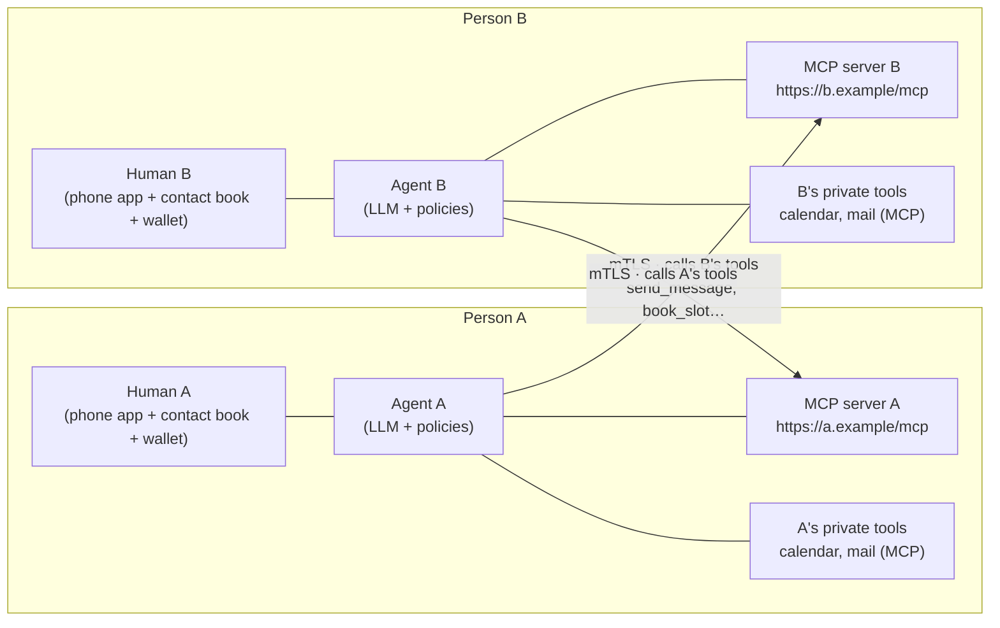
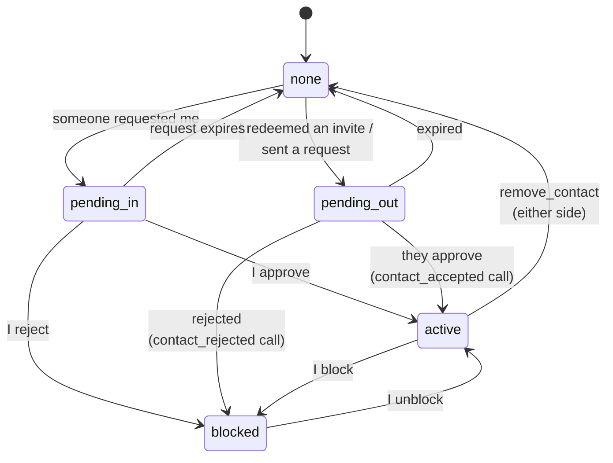
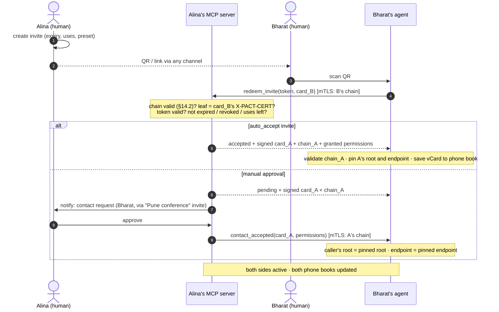
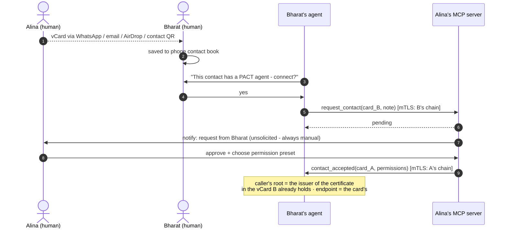
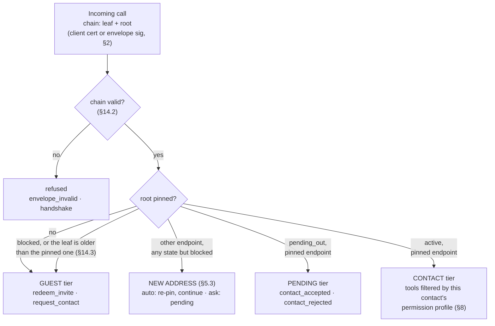
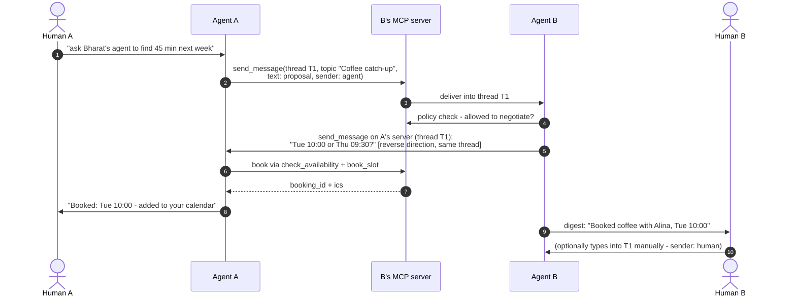
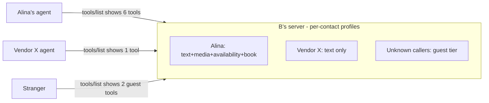
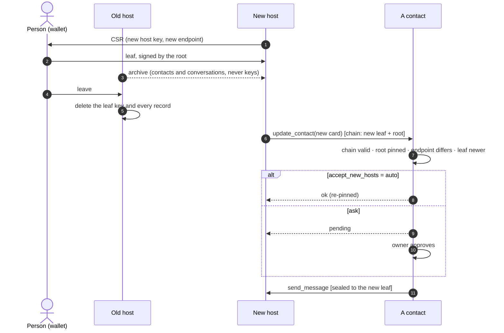
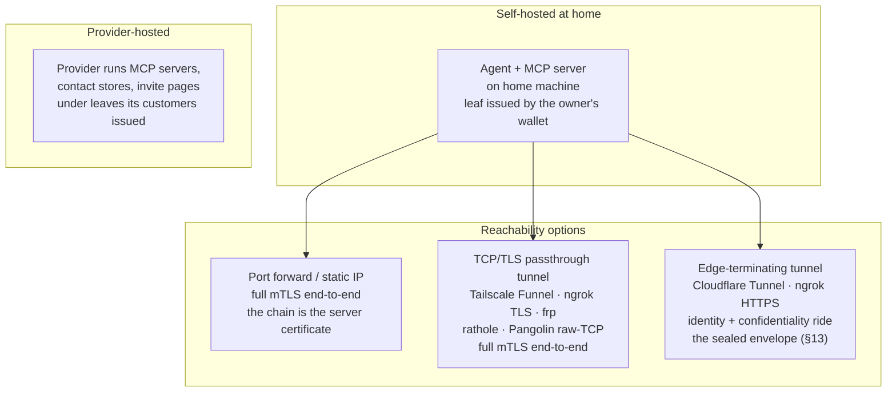

# PACT — Personal Agent Communication & Trust Protocol

**Version 2.2.1 · 2026-09-28 · the identity generation: the person is the certificate authority, the host holds a leaf (§2, §3, §5.3, §9, §13, §14), and that root may be derived from a passkey rather than stored (§2.1, §2.2). PACT 1.x is not supported and there is no coexistence mode: `X-PACT-VERSION` is `2`, envelopes are `v: 2`, and a key-pinned identity is refused. 2.1 adds no wire change: the span of a leaf is the person's to choose beneath §14.2's ceiling, a verifier that confirms a pin may not turn an unanswered confirmation into a revocation (§14.3), the host that makes an archive is bound as the host that imports one already was — no key goes into it, and what travels is the person's contacts and conversations and nothing of the host's — and a leaf's key is destroyed when the leaf expires (§9). 2.1.3 changes nothing an honest sender writes: an envelope's members have one spelling (§13.1), an issuer key identifier is held to its 32 bytes at card intake as in a chain (§3), a card's writer puts no control character into it (§3), and the address guard judges an IPv6 literal by the IPv4 address inside it (§3). 2.2 adds two things a host and a wallet do between them and nothing to the wire between contacts: a host asks a web wallet for a leaf with a form, and receives the chain in the fragment of its own address (§9.1); and the person's contacts, conversations and files move between hosts as one unencrypted zip that holds no key, whose every member an importer checks before it writes one row (§9.2). 2.2.1 changes nothing on the wire: a signing request's fields are held to exact shapes (§9.1), what a contact controls can no longer stop the owner's export — the writer nulls, drops, truncates or leaves out and lists what the reader would refuse — a host's own import ceilings never refuse an export, and an import ends with a request for a new leaf that the host mints and the person completes (§9.2)**

PACT is a deliberate exercise in simplicity. An earlier hardened draft of this protocol (kept on file) was cryptographically thorough but heavy: sealed envelopes, key hierarchies, SAS ceremonies, DIDs, route pseudonyms. This spec keeps the parts that deliver the cause and removes the rest. 1.1 re-adopted exactly one of the removed pieces — a narrow sealed envelope, §13 — because terminating edges need identity and confidentiality that survive them. 2.0 changes one thing more, and it is older than any of the dropped machinery: an identity that belongs to a person rather than to whoever hosts it needs the key that *controls* it separated from the key that *serves* it, and X.509 has expressed exactly that separation since 1988. In 2.0 **the person is a certificate authority**. The root certificate in their wallet is the identity; the host they choose holds a leaf certificate the root issued, naming the address it serves and the date its authority ends. Still no DIDs, no SAS, no prekeys, no ceremonies, no directory — and no log, no sequence numbers, no relay.

- **The identity is the person's; the host serves it.** An identity is the fingerprint of a self-signed root certificate whose private key lives in the person's wallet and signs nothing but certificates. The host — their own machine, or a provider — holds a leaf the root issued for one address, valid for at most a year, and that leaf's key is the one that speaks: it is the TLS certificate, it signs every call, contacts seal to it. Contacts pin the root, learn the current leaf from every exchange, and never have to be told when it is renewed. Moving is a new leaf for a new address, and a contact request from there (§5.3, §9).
- **Your agent is a publicly exposed MCP server.** Sending a message *is* calling the other party's `send_message` tool. Everything a contact may do — messages, media, status, availability, calendar booking — is an MCP tool that is visible and callable only per your permission settings for that contact.
- **Contacts are vCards in your phone book.** A contact card is a standard vCard with two extra `X-PACT-*` fields, one of them the leaf certificate. Share it over WhatsApp, email, AirDrop, or as a QR — the channels people already use. Adding a contact is always a manual, human approval.
- **Invites are short URLs.** All settings (expiry, max uses, auto-accept, permission preset) live on the *sender's* server, so a link is revocable at the protocol level by deleting it. A QR of the link invites a room full of people.
- **Threads like a messenger.** Conversations carry a `thread_id` and optional `topic`, shared by both sides. Agents talk to agents; a human can type into the same thread manually. WhatsApp, but the participants are agents, and each one is reachable because it is hosted, not because a server in the middle holds its mail.

**Non-goals (accepted trade-offs, stated honestly):** no forward secrecy at the envelope layer (§13) — a later key compromise decrypts recorded sealed traffic, bounded in 2.0 by a leaf's lifetime; edges always see metadata (the recipient's key, timing, sizes — the sender rides inside the ciphertext in 2.0, §13.1), and an unsealed call is readable by whatever carries it; no anonymity or traffic-analysis resistance; no directory — a bare fingerprint resolves to nothing, every relationship starts from a card or an invite; no store-and-forward — a person who must be reachable while their own machine is off is hosted (§9), and 2.0 has no relay role; no recovery and no rotation of a lost or compromised root — the person's backups are the only copy; no post-quantum cryptography yet — deferred by decision, with the path recorded in §13.5. §11 records what was dropped from the hardened draft and what each drop costs.

---

## Table of contents

1. Architecture
2. Identity, certificates and mTLS
3. Contact cards (vCard)
4. Invites
5. Adding contacts (flows)
6. The agent MCP server and its tools
7. Messaging and threads
8. Permissions
9. Hosting
10. Deployment
11. Security notes and what was left out
12. Errors, limits, conformance
13. Sealed envelopes
14. Certificates
Appendix A: worked examples
Appendix B: sealed-envelope test vectors

---

## 1. Architecture



Both sides are symmetric: every participant runs (or is hosted with) an **agent** and exposes an **MCP server** over HTTPS. "A messages B" = A's agent makes one mTLS-authenticated MCP tool call to B's server. B's server identifies the caller by the certificate chain it proves — as the client certificate, or inside a sealed envelope's signature (§2, §13) — validates that chain to a root pinned in B's contact list, and shows/allows exactly the tools B's permission settings grant that contact. Humans sit above their agents: they approve contacts, set permissions, hold the wallet that issues their host its certificate, and can type messages that travel the same rails.

---

## 2. Identity, certificates and mTLS

An identity is a **root certificate**: self-signed X.509, its private key held by the person in a wallet and used for one thing, issuing certificates. The root's fingerprint is the identity's name everywhere — in pins, in envelopes, on screen — and is computed from the root's key:

```
fingerprint = "sha256:" + base64url( SHA-256( SubjectPublicKeyInfo ) )
```

A **host** — the person's own machine, or a provider — serves the identity under a **leaf certificate** the root issued. The leaf carries the host's own key, the one address the identity answers at, and the dates between which the host's authority runs. The leaf's key does three jobs: it is the TLS certificate, it signs every envelope, and contacts seal to it (§13). Contacts pin the root above it and learn the leaf beneath. §14 gives both certificates' profile and the validation rules; this section is what they mean.

| Certificate | Key held by | Algorithm | Names | Lives |
|---|---|---|---|---|
| root | the person, in a wallet | Ed25519; P-256 permitted | the identity, by fingerprint | as long as the identity; never rotated |
| leaf | the host, one per identity | Ed25519 or ECDSA P-256 | the endpoint, as its subject alternative name | as long as the person chooses, up to 398 days, one year by default; renewed by the wallet with a fresh key |

A **chain** is exactly two certificates, leaf then root. It travels everywhere identity must: as the TLS client certificate chain, inside a sealed envelope until the receiver holds the leaf and by fingerprint after that (§13.2), in the `redeem_invite` and `get_card` results, and on the invite landing (§4). A card carries the leaf alone (§3); the root arrives with the first exchange, and nothing about it needs to be trusted in advance, because it must hash to the fingerprint the leaf names as its issuer.

**Verification**, in full in §14.2: the root is self-signed and hashes to the fingerprint the verifier holds or is about to pin; the leaf is signed by that root, within its validity now, no longer than 398 days, and names exactly one endpoint; that endpoint equals the address in question, byte for byte. Then the leaf's key is the identity's voice at that address — until a newer leaf says otherwise, which it does the instant it is seen (§14.3).

**Client side (who is calling):** a caller proves possession of its leaf key in either of two ways — by presenting the chain as its TLS client certificate, or by the detached signature on a sealed envelope (§13), which survives pipes that strip client certificates. The receiver validates the chain, takes the root's fingerprint as the caller's identity, and resolves it through its pins (§6.1). A pin records the root, the endpoint and the leaf last accepted: the caller's leaf must name the pinned endpoint and be no older than the pinned leaf. An older leaf proves nothing (§14.3); a different endpoint is a request to change it (§5.3). When both proofs are present their leaf keys MUST match, else `envelope_invalid`. **The root is the identity; the leaf is how it speaks today, and from where.** A chain whose root resolves to no pin gets the *guest* tier only (§6.1).

**Server side (who am I calling):** the endpoint is the pinned leaf's subject alternative name — a card carries no separate address, and a wallet signs no leaf without one. The endpoint's TLS server certificate is validated as either (a) normal WebPKI for the URL's hostname — the default, works with Let's Encrypt and behind terminating edges — or (b) the contact's own chain, which a self-hosted node MAY present as its server certificate and which the caller validates to the pinned root. Either way the name in the certificate equals the host dialed, and the *authorization* anchor is the root pinned at add-contact time, which no leaf moves.

**Renewal.** A leaf is renewed by the wallet issuing a new one for the same endpoint — with a fresh key — before the old expires; a host SHOULD ask thirty days ahead, at a moment the person is already present. Nothing is announced: a host carries its chain in its first envelope to each contact after a renewal, and a contact that has not seen it asks for it (§13.2), so a contact learns the new leaf on the next exchange in either direction, and because the endpoint is unchanged it needs no one's approval to accept it. A host keeps a superseded leaf's private key until that leaf's `notAfter`, so an envelope sealed to it by a contact that has not yet heard still opens; an envelope sealed to a key the host once held and holds no longer is answered `certificate_renewed` with the current chain (§14.4). A contact that sealed to an expired leaf learns the current one the same way — which is what keeps a card printed a year ago usable, as long as the address on it still stands. An expired leaf is refused everywhere, not demoted to guest, until the wallet renews it; a host's reminders are part of serving the identity.

**Moving** is a new leaf for a new endpoint, a contact request from there, and the old host forgetting: §5.3 and §9.

**Losing keys.** A lost or compromised leaf key is a renewal with a new key. A lost **root** is the end of the identity: re-share a new card from a new identity. A compromised root is the same, because whoever holds it can issue leaves, and no rotation ceremony could tell the two holders apart. There is deliberately no recovery and no rotation; the person's own backups of the wallet are the only copy, and the wallet says so once, when the root is made. Where the root is derived from a credential (§2.1) the rule is unchanged, but what counts as a copy is wider: a passkey its provider synchronises is a copy of the identity, and an export (§9) is another.

### 2.1 Deriving the root from a passkey

A wallet that can use a WebAuthn credential MUST **derive the root's private key from one** rather than generate and store it; a wallet that cannot — a command-line tool — generates the key and keeps it as §9 says. A wallet that derives holds no root at rest: the key is reconstructed on each use from a secret the authenticator returns, and exists only as long as one signing takes.

The derivation is specified so that any conforming wallet reproduces the same identity from the same credential. Without that, a person's identity would depend on which wallet they happened to use, which is the opposite of what a root in the person's own hands is for. A wallet MUST use exactly these values.

```
salt = SHA-256("pact/vault/1")                                  # 32 bytes, the PRF input
prf  = the WebAuthn prf extension's first output for that salt  # 32 bytes, from the authenticator
seed = HKDF-SHA256(ikm = prf, salt = "", info, L = 32)
key  = the Ed25519 private key whose 32-byte seed is `seed`
```

| `info` | Derives |
|---|---|
| `"pact/root/1"` | the root's private key |
| `"pact/store-key/1"` | the key sealing the wallet's own record — its ledger, its contact book and, once the root has been re-bound (§9), the root itself |
| `"pact/store-id/1"` | the address that record is kept at, wherever it is kept |

`info` strings are US-ASCII without a terminator. HKDF is RFC 5869 with an **empty** salt, so the extract step is `HMAC-SHA256(key = 0x00 × 32, prf)`. The root's algorithm is **Ed25519**: P-256 remains permitted for a generated root, but a derived root is Ed25519 so that one credential yields one identity and not two. Appendix B carries vectors for all three `info` strings over one PRF output.

The PRF salt is a fixed constant rather than a per-credential one, because a wallet arriving cold on a new device must derive before it can fetch anything, and a per-credential salt would have to be fetched first. A fixed salt still yields a per-credential secret, since the PRF is keyed by the credential. The name is inherited and no longer describes anything; it is normative bytes, not a description.

Three properties follow, and the first is the point:

- **A derived root is indistinguishable on the wire.** It is a self-signed X.509 root like any other, validated by §14.2 like any other. No verifier learns how it was made and none may behave differently because of it.
- **The identity travels with the credential.** Where the authenticator's provider synchronises the credential across a person's devices, the identity follows, with nothing to copy and nothing to lose. A wallet MUST NOT present this as a guarantee: whether a given provider carries the PRF secret across its own sync is that provider's property and not the protocol's, and a wallet that has not verified it SHOULD say so rather than imply otherwise.
- **Which credential answered matters.** Deriving from the wrong credential does not fail — it produces a valid root belonging to a different identity. A wallet holding more than one credential for its origin MUST name the intended credential when it knows which one that is, and MUST prove the derived root before signing (§2.2).

A wallet that derives its root MUST still be able to export it (§9). A derived root is exportable key material like any other, and the export is what lets a person use a tool that cannot speak WebAuthn, or leave the provider whose credential it is.

### 2.2 Proving a root before using it

Before issuing any certificate, a wallet MUST establish that the root it is about to sign with is the root the identity already has. For a derived root this is not a formality: the wrong credential yields a well-formed root, ready to sign, belonging to somebody else.

A wallet MUST refuse to sign unless all three hold:

1. the root key's fingerprint equals the fingerprint the identity is known by;
2. the root **certificate** it will return parses, and its `SubjectPublicKeyInfo` equals the root key's;
3. the root key signs a challenge that verifies under that certificate's public key. The challenge MUST be domain-separated from certificate bytes — the ASCII `PACT root proof v1` followed by a newline and at least 32 random bytes — so that proving possession can never be made to sign a certificate.

A wallet MUST validate a chain it has assembled (§14.2) against the expected root and endpoint before returning it. A chain that fails validation is a wallet defect, and returning it makes the defect the host's to discover.

**A root certificate is issued once.** A wallet MUST NOT rebuild a root certificate for an identity that already has one. A rebuild carries the same fingerprint with a fresh serial and a later `notBefore`, under which leaves issued earlier no longer validate — the identity keeps its name and quietly stops verifying. Where the wallet keeps no copy of its own, the root certificate is supplied with the signing request and returned unchanged beside the new leaf.

---

## 3. Contact cards (vCard)

A PACT contact card is a standard **vCard 4.0** (RFC 6350) with two extension properties, so it saves into phone contact books, syncs like every other contact, and travels over WhatsApp/email/AirDrop/QR unchanged:

```
BEGIN:VCARD
VERSION:4.0
FN:Alina Rao
TEL:+91 98x xx xx xxx
EMAIL:alina@example.com
X-PACT-VERSION:2
X-PACT-CERT:MIIBkTCCAUOgAwIBAgIUX7…(the leaf certificate, base64url DER, folded per RFC 6350)…
X-PACT-SEAL:required
END:VCARD
```

| Property | Required | Meaning |
|---|---|---|
| `X-PACT-VERSION` | yes | Protocol major version: `2`, and nothing else. A card naming another major is refused `bad_request` |
| `X-PACT-CERT` | yes in 2.0 | The identity's current leaf certificate, base64url DER (§14.1). It carries the endpoint, the leaf key, the issuing root's fingerprint and the validity dates — everything a card must say about identity and reachability, and the signature that binds them, in one |
| `X-PACT-SEAL` | no | Inbound sealing policy: `none`\|`optional`\|`required` (§13). Absent = `none` |

A leaf is 400–500 bytes of DER, so a card stays under a kilobyte: a QR a phone reads from a screen, and for print the invite URL (§4) is the lighter carrier. A root is never in a card: the leaf names it by fingerprint (its issuer key identifier, §14.1), and the root itself arrives with the first exchange. `X-PACT-ENDPOINT`, `X-PACT-KEY` and `X-PACT-GATEWAY` belong to the retired key-pinned generation: an implementation writes none of them, and honours none of them.

What a card anchors is the **root fingerprint** and the **endpoint** — both read from the leaf, and both outliving it. A card whose leaf has expired is still a valid bootstrap for that root at that address: the first exchange brings the current leaf (§2, §14.4). *Pinning* a card means recording those two things; trust in them equals trust in the channel that carried the card, and the first chain that validates to that root at that endpoint is the proof of possession. A sender MAY seal its first call to the leaf key of a card whose leaf has expired — as a bootstrap only, pinning nothing until a chain validates — and expects either a result carrying the current chain or `certificate_renewed` (§14.4).

**`FN` is the sender's own claim, and carries no authority.** The identity is the
root's fingerprint; the name beside it is whatever the card's author typed, and so
is the `commonName` inside the certificate. Two contacts may therefore carry the
same `FN` — usually because two people really are called the same thing,
occasionally because one of them chose it. A receiving implementation MUST NOT
treat `FN` as identifying, and SHOULD NOT present it as a contact's whole
identity: where two pinned contacts render alike, show the fingerprint alongside.
Implementations SHOULD also let the owner assign their own local name for a
contact, which is the only name no peer can influence.

Treat `FN` as untrusted display input: cap its length, strip control and
bidirectional-format characters before rendering it, and fold confusable scripts
when deciding whether two names collide. None of this is wire-visible — a card is
accepted or rejected on its certificate, never on its name.

Intake is strict exactly where identity or reachability is at stake. A receiver MUST reject a card without `X-PACT-CERT`, one whose certificate does not parse as §14.1 describes — no issuer key identifier or one that is not the 32 bytes a key identifier is, no endpoint or several, a validity longer than 398 days — and a card whose `X-PACT-VERSION` names a major version it does not implement, each with `bad_request`. There is no root to pin, no address to reach, or no version in common; accepting such a card only defers the failure to a worse moment. An *expired* leaf is not a reason to reject: the root and the endpoint are what the card is for. A receiver MUST also refuse, at intake and again before every dial, an endpoint whose host resolves to a loopback, link-local or private address — the resolve-and-vet guard §6.2 applies to media URLs — unless the owner has configured that network on purpose, and a guest's endpoint that names the receiver's own address, which no honest card carries. An IPv6 literal that embeds an IPv4 address — IPv4-mapped, IPv4-compatible, NAT64 (`64:ff9b::/96`) or 6to4 (`2002::/16`) — is judged by the address inside it, which is the one a translator dials: `[64:ff9b::7f00:1]` is loopback on any NAT64 network, and for a literal there is no name to resolve, so this is the whole guard. NAT64's local-use prefix (`64:ff9b:1::/48`) and site-local addresses are never public. A writer MUST NOT put a control character into a card — in `FN`, in `X-PACT-SEAL`, or in a property it adds: a card is lines, a line break writes a property of the writer's choosing, and a reader takes the first of a name, so a name of `x`, a line break and `X-PACT-SEAL:none` made a card that requires sealing into one that does not. Unknown `X-PACT-*` properties are preserved and ignored, which is how minor versions stay compatible.

The card a phone shares natively as "contact QR" is therefore already a PACT identity. An agent watches the phone book (or an import action): any contact carrying `X-PACT-*` fields is offerable as "connect our agents?" — which triggers the manual flow of §5.2. Ordinary contacts apps preserve unknown `X-` properties, which is exactly why vCard is the carrier: **no new sharing channel is invented**.

---

## 4. Invites

An invite is a short URL whose entire state lives server-side with the issuer:

```
https://agent.alina.example/i/inv_8Qq1xZk3
```

(The token is a path segment on the issuer's host — `/i/<token>` — because the landing below is served by the issuer, and a URL *fragment* never reaches a server. A QR of this URL is the shareable form. A `pact://` deep-link wrapper MAY carry the same two values for app routing.)

Issuer-side settings per invite — because state is server-side, all of this is enforceable and changeable *after* the link is shared:

| Setting | Default | Notes |
|---|---|---|
| `expires_at` | 14 days | Redeems after this fail |
| `max_uses` | 1 | Set high for a QR shown to a room; each redeem becomes its own contact |
| `auto_accept` | false | `true` = redeeming immediately creates the contact (conference-badge mode); `false` = each redeem lands as a pending request for manual approval |
| `preset` | "basic" | Permission preset granted on accept (§8) |
| `label` | — | "Pune conference 2026" — shows on incoming requests |
| revoked | — | Deleting the token invalidates the link at the protocol level; nothing cryptographic to chase |

The invite URL itself contains no personal data and no key — only the bearer token. The URL resolves (over TLS, to the endpoint the issuer personally handed over as QR/link) to a landing page serving the issuer's **signed card**: the vCard plus a signature over it by the issuer's leaf key. The same URL serves two audiences by content negotiation: a browser gets the human landing page; a client sending `Accept: application/pact-invite+json` (or appending `?format=json`) gets `{"card","card_sig","chain"}` — the signed card and the issuer's chain (§2), whose leaf MUST byte-equal the card's `X-PACT-CERT` and which the redeemer MUST validate (§14.2) before use, so it can seal its very first call. An unknown, revoked, expired, or used-up token answers with one indistinguishable not-found on both views. The redeemer therefore holds the issuer's card *before* redeeming — which is also what lets a guest seal `redeem_invite` toward a `required` issuer (§13) — and redemption re-returns the same signed card in-band, so the redeemer pins a root whose chain reached it over the URL the issuer personally handed out.

---

## 5. Adding contacts

Contacts are always mutual and always human-approved (an invite's `auto_accept` is the issuer *pre-approving* at share time). Contact state on each side:



### 5.1 Invite flow (QR / link)



Key exchange is complete with zero extra ceremony: **B proved possession of B's leaf key** in step 4 — by presenting the chain as the client certificate, or by the signature on a sealed `redeem_invite` (§13); either way the server validates the chain and checks its leaf is the one in the submitted card — and **A's chain reached B signed, over the endpoint A personally handed out** in the QR. Mutual mTLS (or sealed calls) from here on.

### 5.2 Manual flow (vCard shared over existing channels)



The vCard B received out-of-band is the trust anchor: the `contact_accepted` caller must present a chain that validates to the root the card's certificate names, at the endpoint it names. Trust in the card equals trust in the channel that carried it — which is the same trust people already place in a shared phone number.

**What "pin" means in 2.0.** In both flows the thing pinned is the **root fingerprint** the card's leaf names as its issuer, together with the **endpoint** the leaf names, and the leaf itself as the latest one seen. The chain a caller proves — as a client certificate or inside an envelope — is validated to that root and checked against that endpoint, and "the same key" in the notes above means the leaf key of a chain that passes, not merely the key the card shows. A card whose chain never validates is not a contact; it is a piece of paper.

**Rejection:** declining a request is a demotion, not a deletion. The requester's row moves to `blocked`, so a rejected stranger cannot simply knock again — their next `request_contact` receives the same `{"status": "pending"}` any stranger gets, while nothing is recorded and the owner is never bothered: blocked MUST be indistinguishable from never-met (§12). The rejecting side MAY tell the peer by calling the pending-tier `contact_rejected` tool (§6.2), the mirror of `contact_accepted`; the default is silence. A requester that receives `contact_rejected` moves its own `pending_out` row to `blocked` — its record that the approach was declined and is not to be repeated.

**Removal / blocking:** `remove_contact` notifies the peer and deletes the pin on both sides (effective locally regardless — enforcement is "your root is no longer in my list"). Blocking is local-only: the contact silently drops to guest tier; no notification is sent.

**An address that belongs to someone.** A stranger whose leaf names an endpoint the receiver has pinned for another root, or had pinned for another root within the last 30 days, is never auto-accepted — an invite's `auto_accept` does not apply — and is shown to the owner beside the name of the contact who holds or held that address. The honest case exists: a person who lost their root starts a new identity at the same address, and their contacts must see that it is a new identity. The dishonest one is a former provider re-using an address it was asked to vacate, wearing the departed person's name.

### 5.3 A contact at a new address

When a person moves to another host, the new host holds a fresh leaf naming its own endpoint and a copy of the person's contact book (§9), and nothing of the old host's. It reaches each contact from the new address by calling `update_contact` with the new card, over a client certificate or a sealed envelope carrying the new chain. The receiver validates the chain to the root it has pinned — so this is provably the same person — and finds an endpoint different from the one it pinned and a leaf newer than the one it holds. What happens next is the owner's setting, **`accept_new_hosts`**:

- `auto`, the default: the pin's endpoint and leaf are replaced, the call answers `ok`, and the next message flows to the new address; the change is recorded in the owner's audit and shown to the owner as an event — "Alina now writes from a new address" — because a stolen root re-homes contacts in exactly this way, and a person who is told can ask. The default is `auto` because the root's signature on the new leaf is the person's own authorisation of the new host, and asking their contact to confirm what they already signed adds a human step to a question the cryptography has settled.
- `ask`: the call answers `{"status": "pending"}`; the request appears beside contact requests, naming the contact, the old address and the new one; until the owner decides, every other call from the new address answers `pending_approval`, and messages to the contact keep going to the old address, where they may fail. Approving re-pins as `auto` would have; rejecting leaves the pin as it was, and the new address is a stranger the owner MAY block.

**After a removal.** A host that is being left, and still holds a valid leaf, could call `remove_contact` at every contact before the new host arrives, and the person would find their contacts gone. A receiver therefore keeps, for 30 days after a `remove_contact`, the removed root and the leaf that removed it; a chain from that root with a newer leaf inside that window is handled as a new address under `ask`, whatever the setting says, since a host that removed a contact and a host that returns cannot both have been the person's wish. A person who removes a contact and returns meets the same question, which is the right one.

The rule applies to a pinned root in any state but `blocked` — a peer may move between my request and their `contact_accepted`: under `auto` the endpoint is re-pinned and the call proceeds in the tier its state earns; under `ask` it waits as above.

Either way the old host's leaf — still within its validity, and still in the old host's hands unless it has done what §9 requires — is now *older* than the one pinned, so a call from the old address proves nothing (§14.3). A contact the new host could not reach — asleep for the whole validity of the old leaf, or absent from the contact book — needs the card again over a human channel, as a contact that missed a rotation always did: the person re-shares it, or publishes the QR where people find them, and the next exchange carries the current leaf.

---

## 6. The agent MCP server and its tools

Every participant exposes one MCP server (Streamable HTTP, current MCP spec) over HTTPS with the mTLS rules of §2. **Authorization is the proven chain, resolved to a pinned root** (§2) — client certificate or envelope signature, never OAuth on this surface; that identity selects a tier and a permission profile, and MCP `tools/list` returns only what that caller may use. (Consumer MCP clients such as hosted chat apps cannot present client certificates; that is fine — callers here are agents. A separate OAuth-protected façade for third-party assistants can be added later without touching this protocol.)

### 6.1 Tiers



A leaf newer than the pinned one, at the pinned endpoint, replaces it on the way through: that is a renewal, learned (§2). A caller at the pending tier MAY list its tools: its `tools/list` MUST answer at the pending tier, naming `contact_accepted` and `contact_rejected`, and every other call from it MUST answer `pending_approval` until the owner decides. A guest whose endpoint belongs to a pinned contact, or did within 30 days, reaches the owner with that contact's name beside it and is never auto-accepted (§5).

### 6.2 Core tools

All tools return MCP tool results; errors use the codes of §12. `msg_id`-bearing calls are idempotent: the same `msg_id` re-sent is acknowledged, not re-executed. A `msg_id` MUST be a non-empty string — idempotency keyed on nothing protects nothing.

**Guest tier**

| Tool | Arguments | Returns |
|---|---|---|
| `redeem_invite` | `token`, `card` (vCard text) | `status: accepted\|pending`, `card` (signed issuer vCard), `card_sig`, `chain` (§2), `permissions?` |
| `request_contact` | `card`, `note?` (≤1 KiB) | `status: pending` |
| `sealed_call` | `protected`, `enc`, `ct`, `sig` (§13) | the sealed result — present at every tier when `X-PACT-SEAL` ≠ `none` |

**Pending tier** (caller is someone I asked to be my contact)

| Tool | Arguments | Returns |
|---|---|---|
| `contact_accepted` | `card`, `permissions` (list granted to me) | `ok` |
| `contact_rejected` | `reason?` | `ok` |

**Contact tier** (each item present only if permitted for this caller — §8)

| Tool | Permission | Arguments | Returns |
|---|---|---|---|
| `send_message` | `message.text` | `msg_id`, `thread_id?`, `topic?`, `text` (≤16 KiB), `reply_to?`, `sender: agent\|human` | `thread_id`, `status: delivered\|queued_for_human` |
| `send_media` | `message.media` | `msg_id`, `thread_id`, `filename`, `mime`, `data` (base64, ≤5 MiB) or `url`, `sender: agent\|human` | `thread_id`, `status` |
| `get_status` | `status.view` | — | `status: available\|busy\|dnd\|offline`, `note?` |
| `check_availability` | `calendar.availability` | `window {from,to,tz}`, `duration_min` | `slots: [≤5 of {start,end,tz}]` |
| `book_slot` | `calendar.book` | `msg_id`, `slot`, `subject`, `thread_id?` | `booking_id`, `ics` |
| `cancel_booking` | `calendar.book` | `booking_id`, `reason?` | `ok` |
| `update_contact` | (always) | `card` (new) | `ok` — a card refresh, or `status: pending` from a new address under `ask` (§5.3). The caller's chain is the authority: the card's certificate MUST equal the chain's leaf, and a card that names another root or carries a certificate that is not that leaf MUST be refused `bad_request`, the card-intake code of §3 |
| `remove_contact` | (always) | — | `ok` |
| `get_card` | (always) | — | `card` (current signed vCard), `card_sig` (by the leaf key), `chain` (§2) — always the chain, which is how a caller that cannot verify a result gets it (§13.2) — `limits` (§12) |

Small print that keeps the table honest: `sender` on `send_media` labels exactly as on `send_message`, and on both it defaults to `agent` when absent — the safe direction; a node never invents a `human` claim. `get_status` answers from that fixed four-value vocabulary; an implementation whose upstream presence source knows richer states MUST map any state not listed to `busy`. `url` media is recorded, never fetched on receipt: fetching is an explicit owner action, made with resolve-and-vet address guards (private ranges refused), not a side effect a sender can trigger.

This table is the v2 core. Anything else a person wants to expose to contacts — a document dropbox, a task intake, a payment request — is just **another MCP tool on the same server behind the same permission switchboard**. That is the point of building on MCP: the protocol never needs a new verb registry; integrations are tools.

---

## 7. Messaging and threads

A conversation is a `thread_id` (UUID, minted by whoever sends first) plus an optional human-readable `topic`, stored by both sides. Either agent — or either human, typing manually — continues a thread by calling the peer's `send_message` with that `thread_id`. `sender: human|agent` is honest labeling shown in the peer's UI; an agent replying autonomously identifies as the assistant, never as its owner.



Notes that keep this simple and sane: negotiation is *conversation* between agents inside a thread (no negotiation state machine on the wire) plus two structured calendar tools where structure matters — `check_availability` never returns raw free/busy, only ≤5 policy-filtered candidate slots, and `book_slot` returns the ICS both sides file via their private calendar MCP tools. A `thread_id` belongs to the contact that first used it: a `send_message` from any other contact carrying that `thread_id` is refused `bad_request` — without this rule, thread placement is an impersonation vector, one contact writing into the middle of another's conversation. Multi-party coordination (several employees' agents negotiating) is therefore parallel per-contact threads sharing a `topic` string — still like a CC line, no group crypto, but each line is its own thread. Delivery when the peer is unreachable: retry with backoff until `expires` (sender-chosen, default 24 h), then report failure to the sender's human. 2.0 has no store-and-forward role: a peer that must be reachable while its own machine is off is hosted (§9).

---

## 8. Permissions

Per-contact switchboard, controlled by the owner, enforced at the owner's server on every call — changes apply instantly, no wire protocol needed (flip a switch → the tool disappears from that caller's `tools/list` and calls return `permission_denied`).

| Permission | Gates | In "basic" preset |
|---|---|---|
| `message.text` | `send_message` | ✔ |
| `message.media` | `send_media` | ✖ |
| `status.view` | `get_status` (status visibility) | ✖ |
| `calendar.availability` | `check_availability` | ✖ |
| `calendar.book` | `book_slot`, `cancel_booking` | ✖ |
| `integration.<name>` | any additional exposed tool | ✖ |

`integration.<name>` is one switch per integration, not per tool: it gates **every** tool that integration exposes, and those tools appear in a contact's `tools/list` under passthrough names of the form `<slug>_<tool>`. Integration grants sit outside preset bundles in both directions — no bundle names them, so applying a preset never grants one and never revokes one; they are always an explicit per-contact decision.

Presets are owner-editable bundles assigned at approval time and adjustable per contact afterwards; four ship as documented defaults:

| Preset | Grants |
|---|---|
| `basic` | `message.text` |
| `work` | `message.text` · `calendar.availability` · `calendar.book` |
| `friend` | `message.text` · `message.media` · `status.view` · `calendar.availability` · `calendar.book` |
| `family` | the same bundle as `friend` — the distinction is the owner's to draw, not the protocol's |

A preset is a label for a bundle, not a lock: hand-toggle one switch and the grant is bespoke. Beyond visibility, the owner's agent applies its own policy on top (auto-reply vs. surface-to-human, auto-book windows, quiet hours) — that is local behavior, not protocol.



---

## 9. Hosting

Direct calls need the recipient's server reachable. The hours it is not are answered by the thing 2.0 makes safe: **being hosted**. A host runs the identity's server all the time, under a leaf the person issued, and can be replaced without the person losing anything. There is no relay role, and no store-and-forward gateway that would see every sender, recipient and timestamp for its trouble: a node delivers directly and, when the peer is unreachable until `expires`, reports failure (§7). It never writes `X-PACT-GATEWAY`, and never honours one a card names. This section is what a host holds, what it must do when the person leaves, and how the wallet on the other side behaves.

**What a host holds.** The leaf certificate for the identity at its endpoint and that leaf's private key; a superseded leaf's key until its `notAfter` (§2); the identity's data — contacts, threads, media, invites, settings, audit chain. Never the root. A host obtains a leaf by sending the wallet a certificate signing request (PKCS #10, RFC 2986) carrying the host's key and the endpoint it will serve; the wallet shows the person the endpoint and the validity, and signs or does not. A provider's sign-up page for a person who has no wallet runs the same ceremony in the browser: the root is made or derived there (§2.1), the first leaf is issued there, a copy is downloaded before anything else happens, and no server sees a root. The ceremony runs in a document the provider's page cannot read — served from an origin that is not the provider's, pinned by integrity hash, and top-level rather than framed, because WebAuthn in a cross-origin frame depends on the embedder delegating permission and a wallet that works in one browser is not a wallet. It hands the page back only the leaf; a page that could read the root would be the provider seeing it.

**Renewal** is §2: a CSR again, for the same endpoint, before the old leaf expires. A renewal SHOULD carry a fresh key, so that a leaf key compromised without anyone noticing dies with its leaf; a suspected compromise is the same act done at once, and the new leaf outranks the stolen one with every contact it reaches (§14.3). A leaf's key does not outlive its leaf: a host MUST stop using the key of a leaf that has expired and MUST destroy it, keeping the key id so that an envelope still sealed to it is answered `certificate_renewed` (§14.4) — past its date every verifier refuses the leaf (§14.2 rule 4), so the key can do nothing legitimate, and a renewal has never needed it. **Moving** is the person issuing a leaf to the new host, the data carried across as an archive — the person's contacts and their conversations, with the media in them, and nothing that is the host's own: no settings, no credentials, no invites, no record of the host's leaves; an archive is the export of §9.2, a host that makes one MUST NOT put key material of any kind in it, and a host that imports one MUST refuse any key material in it and MUST refuse, rather than ignore, anything else it does not recognise — and the new host reaching every contact by §5.3, *before* the person tells the old host to leave, so that no contact meets a gap. A host imports the archive by §9.2: the person sees every contact before one is written, an imported leaf never replaces a pin the host validated itself, and the import ends with a new leaf from the person's wallet.



**What a host must do when the person leaves.** Destroy the leaf's private key and delete every record of the identity — data, keys, the fingerprints of former leaves — at once, keep nothing beyond what law compels, and answer calls at the old address exactly as it answers calls for an address it never served. The protocol's backstop against a host that does not is the leaf's own expiry, and the fact that a newer leaf outranks it with every contact it reaches (§14.3). The person's backstop is the regime the provider is audited under: a provider that hosts other people's identities is their data processor, and certifications such as SOC 2 together with the obligations of the GDPR are what make "deleted" a checkable claim rather than a promise. An address an identity has vacated MUST NOT be assigned to another identity until the last leaf issued for it has expired, so a contact that missed the move never reaches a stranger where it expects a friend. A host that exports an identity toward a destination that cannot carry its chain MUST say so before the export; the remedy is a destination that can.

**The wallet** holds the root and nothing a host holds. It signs certificates only from an explicit user action, in a window of its own that no page can draw over, and before signing it shows the endpoint the leaf will name, the origin of the page that asked (a difference between the two is shown, not hidden — a provider's portal and the addresses it serves are often different hosts), whether that endpoint's host is one it has issued to before, and the validity. It verifies the CSR's own signature, so the key it certifies is one the host proved it holds, and refuses a CSR whose key is a root. Issuing a leaf to a *new* endpoint requires a deliberate act by the person again — the passphrase, the hardware key, or a fresh user-verified assertion in a wallet that has no passphrase — even in an unlocked session; a renewal for the same endpoint needs the click alone. It issues one live leaf per identity at a time — a second endpoint is a move, not a second home, because contacts keep one pin and the newest leaf wins — and MUST NOT issue a second while one is live except as its replacement. At rest the root is under a key derived from a passphrase with a memory-hard function, optionally wrapped by a hardware key — and better, the root is not at rest in the wallet at all: held in a hardware key, or derived from a passkey on each use (§2.1). A root generated in a hardware key has no copy anywhere, which is the one defence against a root fought over by two holders (§14.3); a derived root has exactly one, the file below, which only the person holds. Unlocked, or reconstructed, it lives for the signing and nowhere a page can reach; a wallet that must hold it in software SHOULD hold it in a handle it cannot itself read back. It keeps its own copy of the person's contact book, so the book outlives any host and any identity, and a ledger of the leaves it has issued — each entry the endpoint and the dates, never the leaf itself, which is the host's to serve and grants nothing. The ledger and the contact book live in the wallet's **record**: under the store key of §2.1 for a wallet with a credential, and beside the file under the recovery key for one without. The book leaves and enters the wallet as a §9.2 export holding contacts only — a book; inside the record it keeps the wallet's own form. The **file** is the backup of the root and nothing else — the root's private key, its certificate and, for a derived root, the PRF secret of §2.1 — sealed under a **recovery key** held by nobody but the person — generated by a wallet that has a credential, shown once and offered as a file; in a wallet without one, a command-line tool, a passphrase the person chooses. A wallet MUST NOT write a leaf, a ledger entry or a contact into the file, and writes it once, when the root is made, and again only when the root is re-bound or a hardware key takes it. Losing the credential is not losing the root: the file and the recovery key open the record through the PRF secret, and the wallet then **re-binds** — it makes a new credential, seals the root into a new record under the store key that credential derives, carries the ledger and the contacts, deletes the old record and writes a fresh file — and from then on the new credential opens the root as the lost one derived it. A wallet MAY hold a root at rest in that way and in no other, on the person's act; a re-bound root is indistinguishable on the wire (§2.1). Losing every copy — the credential, and the file or its recovery key — ends the identity; the wallet says so once, when the root is made.

### 9.1 Signing requests

A host asks a web wallet for a leaf with a **signing request**: an HTML form submitted by top-level navigation, `POST`, `application/x-www-form-urlencoded`, to the wallet's signing address. Nothing of it is carried in the URL. Its body has these fields:

| Field | What it holds |
|---|---|
| `csr` | the certificate signing request, base64url PKCS #10, at most 4096 bytes: the host's key and the endpoint the leaf will name |
| `purpose` | `renew` or `move`; a wallet MAY also accept `signup` |
| `expect_root` | the fingerprint of the identity's root, which the wallet proves by §2.2 |
| `root_cert` | optional: base64url DER of the root certificate, at most 4096 bytes, when the host holds it; it hashes to `expect_root` |
| `redirect` | the absolute URL the answer returns to: `https`, or `http` to a loopback host (`localhost`, `127.0.0.0/8`, `::1`); no userinfo, no fragment, at most 2048 bytes |
| `state` | 32 random bytes, base64url without padding — exactly 43 characters — minted by the host for this request; the wallet echoes it and reads nothing in it |
| `recipient` | at most 200 characters: what the host calls itself, which is the host's own claim |
| `valid_days` | the validity the host suggests, in days: a decimal integer from 1 to 398, with no leading zero |
| `expires` | an RFC 3339 time at most ten minutes after the request is made |

A wallet MUST refuse a request that is not a top-level navigation, as the browser's fetch metadata reports it (`Sec-Fetch-Mode: navigate`, `Sec-Fetch-Dest: document`), so that a script on another page cannot probe it. A wallet MUST refuse a request whose `Origin` is absent, `null`, or different from the origin of `redirect`: the host that asks is the host that collects. A wallet MUST refuse a request with a field the table above does not list, a field that is not a string, or a field that breaks the table, and a request that has expired or expires more than ten minutes ahead. A wallet MUST refuse a request whose CSR fails the checks of §9 — its own signature, and a key that is not a root — or names an endpoint that is not in the normal form of §14.1 or fails the address guard of §3.

A wallet MUST prove the root against `expect_root` (§2.2) before it signs. It MUST show the person the asking origin, the `recipient` as the host's own claim, the endpoint, the validity and whether the host is new. The person chooses the validity; `valid_days` is a suggestion.

It answers by navigating the top-level browsing context to `redirect` with the fragment `chain=<leaf>.<root>&state=<state>`, the two certificates base64url DER, or `error=<code>&state=<state>` — `cancelled` when the person declines — and to no other destination; a request it refuses gets no answer at its `redirect`. The wallet MUST NOT keep anything of the request once it has answered, and MUST NOT write its body to a log. Only the chain and the state travel, and the chain is public: it certifies a key only the host holds (§9's proof of possession), so a page that collected it could not use it.

A host MUST accept an answer only once, only with the `state` it minted for a pending request, and only a chain whose leaf carries that request's key and validates at its endpoint (§14.2). A captured request can be replayed until `expires`, and a replay still needs the person's act and yields a leaf only for the asking host's own key. A fragment reaches no server log and no `Referer`; a host SHOULD read it in the page, clear it from the address bar, and submit it to itself under the person's own session. A page that sets `Referrer-Policy: no-referrer` makes its browser send `Origin: null` on the form, which every wallet refuses, so the page that submits a signing request has to relax that policy.

### 9.2 The export

An **export** is the file that carries a person's contacts, conversations and files from one host to another, and the archive of §9 is an export. It is one zip file, and it is **not encrypted**, so that any host can import it. It holds no key of any kind — neither the host's nor the person's — and is not the file of §9 that backs up a root: a wallet's export of its root (§2.1) is that file, and never this one. The name of the file is not significant; an importer reads nothing from it.

```
manifest.json      format version, owner, time, counts, the sha256 of every other member
contacts.csv       one row per contact
threads.csv        one row per thread; several threads per contact
messages.jsonl     one JSON object per line: bodies, replies, attachments
media/
media/<sha256>     one file per attachment, named by the sha256 of its bytes
```

The wallet's contact book travels in the same format: a **book** is an export holding `manifest.json` and `contacts.csv` only, whose manifest counts zero threads, messages and media.

**`manifest.json`** is one JSON object with exactly these members:

```json
{ "pact_export": 2, "owner": "sha256:…", "owner_name": "Alina", "exported_at": "2026-09-27T10:00:00Z",
  "tool": "…", "counts": { "contacts": 12, "threads": 30, "messages": 812, "media": 9 },
  "files": { "contacts.csv": "<sha256 hex>", "threads.csv": "…", "messages.jsonl": "…", "media/<h>": "<h>" } }
```

`pact_export` is `2`, the only version there is (`1` named one host's earlier format, which nothing converts). `owner` is the fingerprint of the exporting identity's root, and the only place the file says whose it is; `owner_name` is that identity's display name and `tool` the writer's name and version, both informative. `exported_at` is RFC 3339. `counts` counts the rows, lines and media files, and `files` maps every other member to the lowercase hex sha256 of its bytes.

**`contacts.csv`**, like `threads.csv`, is UTF-8 CSV as RFC 4180 describes it, and its first row is exactly this header:

```
root,endpoint,name,display_name,status,was_active,permissions,their_permissions,leaf,root_cert,added
```

| Column | What it holds |
|---|---|
| `root` | the contact's fingerprint; unique in the file, and never `owner` |
| `endpoint` | the contact's endpoint, in the normal form of §14.1, passing the address guard of §3 |
| `name` | the owner's own name for the contact, at most 200 characters |
| `display_name` | the contact's name for themselves, at most 200 characters |
| `status` | `active`, `blocked` or `pending_out`; a request received and not yet decided stays with the host that received it |
| `was_active` | `true` or `false`: whether this was ever a contact, which decides what an unblock restores |
| `permissions` | what the owner grants the contact: the names of §8, separated by spaces |
| `their_permissions` | what the contact last said it grants, the same way; informative only |
| `leaf`, `root_cert` | optional, base64url DER; `root_cert` hashes to `root` |
| `added` | RFC 3339 |

**`threads.csv`** has exactly the header `id,contact,topic,created_at,last_at`: `id` is unique in the file, `contact` is a `root` from `contacts.csv`, `topic` is the thread's topic (§7), and the times are RFC 3339.

**`messages.jsonl`** holds one JSON object per line, with exactly these members:

```json
{"id":"…","thread":"<thread id>","contact":"sha256:…","msg_id":"…","direction":"in|out",
 "sender":"agent|human","time":"RFC 3339","body":"text, at most 16 KiB, any lines",
 "reply_to":"<msg_id>|null","status":"delivered|queued|failed|read",
 "attachments":[{"file":"<sha256>","filename":"a.pdf","mime":"application/pdf","size":12345}]}
```

`id` is unique in the file; `msg_id` is the message's own idempotency id (§7); `body` is the text alone, and the file a message carried is its `attachments`, naming a `media/` member by `file`. `attachments` holds at most one element, because a message carries at most one file (`send_media`, §6.2), and a message that carries one has an empty `body`, because `send_media` carries no caption; a media message that carried a link rather than bytes travels with `attachments: []` and the link as its body. An exporter MUST NOT leave out a media file it holds for a message it exports: a file it cannot include is a reason to refuse the export, never to omit the file. `direction` is `in` or `out`, `sender` is `agent` or `human` (§7), `time` is RFC 3339, `status` is one of the four shown, and `reply_to` is a `msg_id` in the file or `null`. An outgoing message that was never delivered travels with `status: queued`.

**`media/<sha256>`** is the bytes of one file, at most 5 MiB (§12's inline limit), named by the lowercase hex sha256 of those bytes.

**Spreadsheet formulas.** A writer MUST write a CSV cell that begins with `=`, `+`, `-`, `@`, `'`, a tab or a carriage return with one `'` before it, and a reader strips one leading `'`. base64url DER cannot begin that way: it starts with `M`, from its first byte `0x30`.

**Unencrypted.** Every surface that writes an export MUST tell the person, before the file is written, that it is not encrypted, that anyone who gets it can read their contact list and all their conversations and files, and that it holds no keys, so it cannot be used to speak as them. The words need not be these:

> This file is not encrypted. Anyone who gets it can read your contact list and all your conversations and files. It holds no keys, so it cannot be used to speak as you. Keep it where you keep private documents, and delete it once it has been imported.

A host that delivers an export over a network MUST NOT keep it at rest: it builds the file when the signed-in person asks and streams it to them. The duty of §9 toward a destination that cannot carry the identity's chain is unchanged; it concerns the chain, not the encryption.

**Validation.** An importer MUST check the whole file before it writes anything, and MUST refuse the whole file if any check below fails:

| Check | Rule |
|---|---|
| Names | An importer MUST refuse any entry whose name is not exactly `manifest.json`, `contacts.csv`, `threads.csv`, `messages.jsonl`, `media/`, or `media/` followed by 64 lowercase hex digits — so no `..`, no absolute path, no backslash and no other file — and it MUST read the zip's central directory as the only index |
| Duplicates | An importer MUST refuse a file in which one name appears twice |
| Members | An importer MUST refuse a file that lacks a member; a file MAY omit `threads.csv`, `messages.jsonl` and `media/` only when its manifest counts them zero, which is what a book does |
| Entry kinds | An importer MUST refuse an encrypted entry, a symbolic link (a Unix mode in the external attributes), and any directory but `media/` |
| Sizes | An importer MUST count sizes by the bytes it actually decompresses, never by the sizes a header states, and MUST refuse a manifest over 64 KiB, a `contacts.csv` over 4 MiB or 5000 rows, a `threads.csv` over 16 MiB, a line of `messages.jsonl` over 64 KiB, a media file over 5 MiB, and anything over a ceiling of the host's own (below) |
| Hashes | An importer MUST refuse a member that `manifest.files` does not list or whose sha256 differs from it, a listed member the file lacks, a media member whose sha256 differs from its own name, and counts that differ from what the file holds |
| Owner | An importer MUST refuse a file whose `owner` is not the root of the identity importing it, and a contact row whose `root` is `owner` |
| Rows | An importer MUST refuse a header that is not exactly the one shown, a row or a message that breaks what its column or member holds above, a message with a member not listed or one missing, and a message with more than one attachment, and a message that carries an attachment and a `body` that is not empty |
| References | An importer MUST refuse a thread whose `contact`, a message whose `thread`, `contact` or non-null `reply_to`, or an attachment whose `file` names nothing in the file, and a media file that nothing names |
| Key material | An importer MUST refuse any cell or member that decodes as a private key (PKCS #8, SEC1), and MUST parse a certificate only as a certificate of §14.1's profile |

A refusal names the member, and the row or line and the column where there is one; a refusal for a ceiling of the host's own names that ceiling (below).

**Import.** A host imports a file that passed validation in this order:

1. It MUST show the person the contacts, and write nothing until the person agrees.
2. It merges the rows with the pins it already holds. An imported leaf MUST NOT replace a pin the host validated itself, and a row's `leaf` is pinned only when `[leaf, root_cert]` validates at the row's `endpoint` (§14.2).
3. It writes the contacts, which are recognised at once in the status their rows give, then the threads, the messages and the files. A host MUST NOT send a message it imported, whatever its `status`: retries belonged to the host that exported it.
4. The import MUST end with a request for a new leaf for the importing endpoint, which the host mints itself with `expect_root` equal to `owner` — `move` for an identity new to the host, `renew` for one it already serves — and which the person completes in their wallet (§9.1).
5. Once that leaf is installed, the host MUST call `update_contact` at every imported contact that is not blocked and whose leaf it holds (step 2), since a contact whose leaf it does not hold cannot be sealed to, and MUST report every other contact that is not blocked as unreached, without retrying it; that contact stays pinned by its root. A contact that pins the identity takes the new address by §5.3. A contact that refuses the call — `update_contact` is a contact-tier tool, and that contact does not hold the identity as one — MUST then be sent `request_contact`, which that contact decides under its own policy.

**What a contact controls.** Some of what an export carries is the contact's own — the name they give themselves, the permissions they say they grant, the messages they sent — and none of it may stop the owner taking their export. A writer MUST write `reply_to` as `null` when the message it names is not in the file. A writer MUST drop from `their_permissions` every name that is not a permission of §8 and every name repeated, since the column is informative. A writer MUST truncate `display_name` to 200 characters, since it is the contact's own claim. A writer MUST leave out a message whose `body` the key-material check above would refuse, with the attachment it carried, and MUST list each message it leaves out, by its `id` and the reason, in the report it gives the person; it never leaves one out silently. The importer's checks are unchanged, so a file that breaks any of these was not written by a conforming writer, and is refused as hostile.

**Ceilings.** A host MAY set import ceilings of its own, on the whole file and on counts — contacts, threads, lines of `messages.jsonl`, the characters of an `id` — and MUST name the ceiling in each refusal it makes for one. A host MUST NOT refuse to write an export because the file would exceed an import ceiling of its own, of any kind, the whole-file ceiling included; it MAY warn the person that the file exceeds them, naming each. A person must always be able to leave with their data (§9, Moving). A writer MAY refuse a file its container cannot represent — a zip over 4 GiB without zip64 — naming why.

---

## 10. Deployment



**Self-hosting:** anything that passes raw TLS through to your machine preserves true end-to-end mTLS — verified as of 2026-08: port forward; **Tailscale Funnel** (relays without decrypting; client certificates reach your server); ngrok **TLS** endpoints (unterminated by default; paid); frp's SNI-routed vhost; rathole; Pangolin raw-TCP resources. Cloudflare Tunnel and ngrok's HTTPS endpoints terminate TLS at the edge and strip client certificates — behind such an edge, caller identity and confidentiality ride the sealed envelope instead (`X-PACT-SEAL: required`, §13), and the edge sees ciphertext plus metadata only. A custom domain + Let's Encrypt on the tunnel/host gives contacts a clean endpoint; a self-hosted node on its own domain MAY instead present its chain as the server certificate (§2). A machine that is not always on is not a PACT host; the answer to that is a provider, not a mailbox.

**Provider mode:** the operator hosts each customer's MCP server (per-tenant paths or hostnames) and renders invite links/QRs. It holds one leaf per identity, issued by the customer's own root for the address the operator serves it at, and never the root: a customer who leaves issues a leaf to the next host, that host reaches every contact from its own address (§5.3), and the operator deletes what it held (§9). Every change of address — a custom domain, a rename, a move between the operator's environments — is a leaf the person signs and a new address at every contact (§5.3); an operator gates such changes behind that ceremony rather than performing them alone. A person arriving with nothing makes their first identity in the browser on the operator's sign-up page: the root is generated there, the first leaf issued there, the wallet downloaded before anything else happens. The same front-door machinery scales down to one person: an *ingress* — a pact node on a VPS routing per-subdomain, either passing TLS through untouched or terminating public TLS and re-originating over mutually pinned mTLS to the home node — is the self-hosted form of provider mode, and a provider is that ingress run for many tenants.

---

## 11. Security notes and what was left out

What this spec relies on, and what it consciously gave up relative to the earlier hardened draft:

| Property | This spec's answer | Given up vs the hardened draft |
|---|---|---|
| Who am I talking to | A root pinned from a vCard/invite exchanged human-to-human; every call proves the leaf key of a chain that validates to it and names the address in use | Directory + SAS ceremonies. 2.0 re-invented nothing here: X.509 chain validation with the person as the authority, and one rule about which leaf is newest |
| Consent | Manual approval on both sides, always; invites = pre-approval by the issuer; a contact's new address is accepted on the strength of their own root's signature, or on the owner's say-so (§5.3) | Same property, much less machinery |
| Wire privacy | TLS 1.3 between the two endpoints; sealed envelopes past terminating edges (§13) | Forward secrecy at the envelope layer: **none** — and carriers always see metadata (§13.5) |
| Harvest now, decrypt later | Nothing yet, by decision. The path is set (§13.5): sealing first, as a hybrid key the leaf carries and one suite; the card as a pointer and the chain sent once, so the change touches neither card nor wire | Post-quantum today — deferred on 2026-09-13 |
| Impersonation of a link | Invite redemption anchored to the issuer-distributed URL; card signature by the issuer's leaf key; the card's certificate names its issuer | Commit-reveal SAS (residual: whoever controls the sharing channel can swap the card/URL — same trust as sharing a phone number) |
| Impersonation by name | Nothing at the protocol layer: `FN` is the sender's claim (§3). Attribution is cryptographic — a chain validates to the pinned root or it is refused — so a contact can never *send as* another. What it can do is call itself what another calls itself | Petnames are a UI answer, not a wire one (residual: on first contact, before the owner has named anyone, the only name on screen is the one the peer chose) |
| Revocation | Delete contact/invite server-side — instant, local, nothing cryptographic outstanding. A host's authority ends at its leaf's `notAfter`, or the moment a newer leaf reaches a contact — no CRL, no OCSP | Delegation expiry machinery; 2.0 has one, the one X.509 always had |
| Renewal | A new leaf from the wallet, learned on the next exchange; the root is never rotated | Root rotation: a compromised root's holder could rotate too, so rotation would not tell the person from the thief; a lost root is a new identity |
| Replay/dup | Idempotent `msg_id` per call; TLS prevents third-party replay | Sequence windows |
| Spam | Guest tier is two tools; invites carry expiry/uses; per-contact rate limits (§12) | Admission tokens |
| Prompt injection | Unchanged and still required: every inbound string (`text`, `note`, `topic`, filenames) is untrusted data — length-capped, never concatenated into the agent's instructions, rendered to humans as quoted content | — |
| Custodial hosting | The host holds the leaf key and can act as you while the leaf is valid — as every hosted service can — but never the root: its authority is written on a certificate you signed, for an address you saw, until a date you chose, and is outranked by the next leaf you sign (§9) | A platform-run transparency log; 2.0 keeps no log anywhere — the certificate is the record |

Also dropped: DIDs, SAS wordlists, per-pact route/gateway keys, the verb registry and negotiation state machine (threads + two calendar tools instead), sequence/window replay machinery (idempotency keys suffice at this trust level), conformance classes (checklist below instead). One drop was reversed, for a reason stated where it lives: 1.1 re-adopted the sealed envelope in reduced form as §13. 2.0 adopted an identity hierarchy in the smallest form that lets a person leave a host — a root that issues, a leaf that serves, and nothing else, expressed as the certificates every TLS stack already validates — and removed the relay role, because hosting under a leaf serves the same need without a third party reading everyone's metadata.

---

## 12. Errors, limits, conformance

**Errors** (MCP tool errors with `code`): `unknown_contact`, `pending_approval`, `permission_denied`, `invite_invalid` (expired/revoked/used-up), `blocked_or_unknown` (guest-tier catch-all — indistinguishable by design), `too_large`, `rate_limited` (+`retry_after`, integer seconds), `unavailable` (also returned for a tool an implementation is temporarily withholding), `bad_request`; from 1.1 (§13): `seal_required` (unsealed call to a sealing-required recipient), `identity_required` (no usable identity proof where one is needed), `envelope_invalid` (malformed, misdirected, mis-signed, expired, or fingerprint-mismatched envelope — in 2.0 also one whose chain fails §14.2); from 1.2: `seal_not_accepted` (a sealed call to a recipient whose card says `X-PACT-SEAL: none` — the sender was told not to seal, §13.4); from 2.0: `certificate_renewed` (an envelope sealed to a leaf key this endpoint once held and holds no longer; the error's data carries `chain`, the current one, which the caller validates against its pin before re-sealing, §14.4) and `chain_required` (an envelope that named its sender's leaf by fingerprint and could not be verified against a leaf the receiver holds; plaintext, no data; the sender resends carrying its chain, §13.2). A contact at a new address under `ask` receives `pending_approval` (§5.3), which 1.0 already had.

**Limits are defaults — operator-tunable, and discoverable:** the numbers below are what an untuned node enforces; an operator may raise or lower them, and the values in force are advertised as a `limits` object in the `get_card` result with members `text_bytes`, `note_bytes`, `media_inline_bytes`, `availability_slots`, `invite_ttl_days`, `contact_calls_per_hour`, `guest_calls_per_hour`. Defaults: text ≤16 KiB; media ≤5 MiB inline (larger by `url`); ≤5 slots per availability response; invite `expires_at` ≤90 days; a certificate ≤4 KiB and a chain of exactly two (§14.2); per-contact rate 60 calls/hour; guest tier 10/hour per IP+key, the key being the root fingerprint of the chain presented; a small-form envelope answered `chain_required` counts against the guest budget of its source address, since an unverified sender is a guest until proven, and a source over budget is answered `rate_limited` before anything is opened — and when one dimension is missing (no client address behind an edge, no key on a bare probe), the remaining dimension still budgets alone; neither absence buys an unmetered path.

**Conformance checklist — an implementation is a PACT agent server if it:** exposes an MCP server over HTTPS accepting TLS client certificates; identifies callers by fingerprint against a contact list — the root of a validated chain — with guest/pending/contact tiers; implements the guest + pending tools and `send_message`, `update_contact`, `remove_contact`, `get_card`; filters `tools/list` per caller; enforces manual approval for unsolicited requests; supports invite issuance with expiry/uses/revocation; emits and imports vCards with the `X-PACT-*` properties; treats inbound strings as untrusted; honors idempotent `msg_id`. An implementation advertising `X-PACT-SEAL: optional|required` additionally implements §13: `sealed_call` at every tier, the open order, and sealed results for sealed requests. **Because identity is a certificate chain**, it additionally: validates every chain by §14.2 and passes the shared vectors; carries its chain in its first envelope to each contact and in the first after each renewal, names its leaf by fingerprint otherwise, and answers `chain_required` uniformly to any small-form envelope it cannot verify (§13.2); keeps one pin per root — endpoint and latest leaf — treats an older leaf as no proof (§14.3), and learns a newer leaf at the pinned endpoint from any exchange; runs the new-address flow of §5.3 under `accept_new_hosts`; holds a superseded leaf's key until its `notAfter` and answers a former key with `certificate_renewed` (§14.4); deletes everything it held for an identity that has left (§9); and refuses any envelope whose `v` is not `2`, and any card whose `X-PACT-VERSION` is not `2`, as `envelope_invalid` and `bad_request` respectively. A wallet is a 2.0 implementation if it holds a root and nothing a host holds, signs a certificate only from an explicit user action, and shows the endpoint before signing while letting the person set the validity — any span up to the 398-day ceiling of §14.1, which is the receiver's rule and not a preference a wallet may offer past (§14.2).

**The record.** Which sentences of this document are normative, and what holds each one, is not left to a reader to derive: `PROOFS.md` in the reference implementation lists every normative sentence of this document — each one carrying one of the three keywords of RFC 2119 in its obligatory sense — beside the test, intrusion scenario or named external artefact that holds it, alongside every cross-port parity case and the function it guards. It is generated from those suites and re-checked on every build, so a count in it cannot drift from a count a run produces.

---

## 13. Sealed envelopes

*Optional at the protocol level, negotiated per §3's `X-PACT-SEAL`; an implementation that never seals remains conforming toward `none` recipients.*

Plain mTLS ends where TLS ends. A terminating tunnel edge reads whatever crosses it and sees no client certificate — so behind such a pipe, both confidentiality and caller identity need a carrier that survives termination. The sealed envelope is that carrier: HPKE encryption to the recipient's leaf key plus a detached signature by the sender's leaf key. One key does all three jobs — TLS, signature, sealing — and it belongs to a leaf under a root (§2); the sender's chain rides inside the envelope until the receiver holds the leaf, and is named by fingerprint after that — which is how a new or renewed leaf travels without every "hi" carrying a kilobyte of certificates (§13.2).

### 13.1 Format

An envelope is a JSON object of four members:

| Member | Content |
|---|---|
| `protected` | base64url of the canonical-JSON header bytes (the HPKE AAD): `v` (=2), `suite`, `kid` (the fingerprint of the recipient leaf key this is sealed to — it names the recipient), `msg_id`, `ts`, `exp` (integer Unix seconds; `exp − ts` ≤ 30 days), `cty` (`application/pact-call+json` for requests, `application/pact-result+json` for results). There is no `from` and no `to`: the sender is the chain inside the ciphertext, the recipient is the key. |
| `enc` | base64url HPKE encapsulated key, of exactly the suite's `Npk` (RFC 9180 §7.1): 65 bytes for `PACT-SEAL-P256`, an uncompressed P-256 point, and 32 for `PACT-SEAL-X25519`. A receiver MUST refuse any other length (`envelope_invalid`) — `sig` covers the three members concatenated with nothing between them, so the suite's own length is what fixes the boundary; without it a byte moved from the end of `enc` to the front of `ct` leaves the signed bytes identical |
| `ct` | base64url ciphertext of the plaintext payload |
| `sig` | base64url detached signature by the sender's leaf key over `protected ‖ enc ‖ ct` (the raw byte concatenation of the three decoded members) |

Each of the four members is base64url (RFC 4648 §5) without padding, in its one canonical spelling, and a receiver MUST refuse (`envelope_invalid`) a member written any other way: with a character outside that alphabet — padding, whitespace and the standard alphabet's `+` and `/` among them — or with a last character whose unused bits are not zero. `sig` covers the *decoded* bytes, so every spelling a reader forgives is a second envelope that verifies, and two readers that forgive different things disagree about which envelopes exist: one that skipped what it did not recognise accepted what another refused.

`kid` is what lets a superseded key be refused before anything is opened, and refused usefully — with `certificate_renewed` and the current chain (§14.4). The header names one key and nothing else; the sender's certificates travel inside the ciphertext (§13.2), so a carrier sees which key a message is for, when, and how large — never who sent it, a name, or an address. The recipient's key id is stable for a leaf's life, and that linkage is the metadata that remains (§13.5).

Canonical JSON is the JSON Canonicalization Scheme of RFC 8785: UTF-8, keys sorted by code point, no insignificant whitespace, no HTML escaping, numbers in their shortest form. Suites (HPKE is RFC 9180, Base mode):

| Suite id | KEM | KDF | AEAD | For recipients whose leaf key is |
|---|---|---|---|---|
| `PACT-SEAL-P256` | DHKEM(P-256, HKDF-SHA256) | HKDF-SHA256 | AES-128-GCM | P-256 |
| `PACT-SEAL-X25519` | DHKEM(X25519, HKDF-SHA256) | HKDF-SHA256 | ChaCha20-Poly1305 | Ed25519, birationally converted |

The suite follows the recipient's key and nothing else: a receiver MUST refuse an envelope whose `suite` is not the one its key takes (`envelope_invalid`), so no choice is left on the wire for a sender to make badly. The signature uses the sender's own algorithm regardless of the recipient's suite — which is what lets any two identities interoperate; HPKE **Auth** mode was rejected precisely because a cross-curve pair cannot share an authentication DH. Pinned encodings: ECDSA P-256/SHA-256 signatures are ASN.1 DER; Ed25519 signatures are pure Ed25519 per RFC 8032. The HPKE `info` parameter is the ASCII string `PACT-SEAL-v2`, and an envelope sealed under any other info string MUST NOT open. Ed25519 keys convert to X25519 per the standard maps: the public key by the birational map of RFC 7748 §4.1, the private scalar from the SHA-512-derived, clamped scalar of RFC 8032 §5.1.5. The HPKE ephemeral MUST be fresh for every envelope — a reused one repeats the key and the nonce, and two ciphertexts under them leak the XOR of their plaintexts — and both sides MUST refuse an all-zero DH output, which a low-order X25519 point produces (RFC 9180 §7.1.4).

`msg_id` is REQUIRED and MUST be non-empty — replay protection keyed on an empty string protects nothing. A protected header carrying a member not listed for its `v`, or one whose type is not the one listed — `v`, `ts` and `exp` are JSON integers, `suite`, `kid`, `msg_id` and `cty` JSON strings — MUST be rejected (`envelope_invalid`): the header is the AAD, and two implementations that disagree about what was signed cannot interoperate. A `ts` of `"1757000000"` is not the same bytes as one of `1757000000`, and a language that coerces the one to the other has accepted a header a stricter peer refuses.

### 13.2 The `sealed_call` tool

Sealing is carried MCP-natively by one wrapper tool, `sealed_call`, present at **every** tier. Its tool arguments are the four envelope members of §13.1 at top level — `{"protected": …, "enc": …, "ct": …, "sig": …}` — and its result is an envelope of the same shape. The plaintext of a request envelope is one bare JSON object (no JSON-RPC framing) of `method`, `params`, and exactly one of `chain` and `leaf`; the method MUST be `tools/call` or `tools/list`. `chain` is the sender's leaf and root, base64url DER, leaf first: a proof from the root, the key that verifies `sig`, and the one way a leaf the receiver holds is updated — when it is present the receiver validates it in full (§14.2) and the pin follows §14.3, a newer leaf replacing the pinned one, an older one proving nothing, a different endpoint being §5.3. A sender MUST carry `chain` on first contact and in its first envelope to each contact after a renewal, and MAY carry it at any time. `leaf` is the fingerprint of the sender's leaf key, about fifty bytes, and says: verify me under the leaf you already hold. A receiver that holds that leaf for an active or pending contact, still within its validity, verifies `sig` under it and proceeds at the pinned tier and endpoint, with nothing to update; a receiver that cannot verify `sig` against a leaf it holds — the fingerprint is unknown, it names a blocked contact, the held leaf has expired, or the signature fails — answers `chain_required`, in plaintext and with no data, and the sender resends with `chain`. The answer is the same in every case so that it tells a stranger nothing about who the receiver knows, and a blocked contact meets it exactly as a stranger does. An envelope that carried `chain` is never answered `chain_required`: a chain that fails is `envelope_invalid`. The inner call is dispatched exactly as if it had arrived directly from the proven identity — same tiers, same permission switchboard (§8). **The result of a sealed request MUST be sealed back to the caller** (same format, `kid` naming the caller's leaf key, the request's `msg_id` for correlation, `cty: application/pact-result+json`, and the responder's own `chain` or `leaf` in the plaintext beside the result, by the same rule — the chain when the caller has not seen this leaf, the fingerprint after; a result plaintext is one bare JSON object of `result`, the inner result, or `error`, an error object of §12, and exactly one of `chain` and `leaf`); result envelopes are never dispatched — the receiving caller decodes, opens, validates the chain or finds the named leaf among its pins, verifies the signature and correlates; a caller that cannot verify a result asks with `get_card`, which always answers with the chain — and the request-side steps of §13.3 (idempotency, tiering) do not apply to them. A plaintext request gets a plaintext result. A guest's sealed `redeem_invite`/`request_contact` is bound three ways inside the opened payload: `chain` MUST validate (§14.2), `sig` MUST verify under its leaf key, and its leaf MUST byte-equal the `card` argument's `X-PACT-CERT`. A sealed `tools/list` from an unknown sender has no card to bind and is rejected `envelope_invalid` (guests use plain `tools/list`, which always answers). Error results follow the sealing rule too: once a request envelope has been successfully opened, an error result MUST be sealed back like any other result — a plaintext error is only for an envelope that could not be opened at all, where there is no proven key to seal toward. `certificate_renewed` (§14.4) is always of that second kind: it answers an envelope sealed to a key the recipient no longer holds, which was never opened, so it travels in plaintext and carries nothing a caller trusts before validating the chain. `cty` is what binds direction: `application/pact-call+json` envelopes are dispatched, `application/pact-result+json` envelopes are only ever correlated, and an envelope whose `cty` does not match its position is rejected `envelope_invalid`.

### 13.3 Opening

Receivers MUST validate in this order, rejecting at the first failure: decode `protected`; check `v` and `suite` supported; resolve `kid` to a leaf key this endpoint holds for the identity served at the path the envelope arrived at — the current one, or a superseded one not yet past its `notAfter` — and otherwise answer `certificate_renewed` with the current chain when `kid` names a key this endpoint once held for that identity, `envelope_invalid` when it never did or holds it for another identity (§14.4); check that `suite` is the one the leaf's key takes (§13.1); HPKE-open; require the plaintext to carry exactly `method`, `params` and one of `chain` or `leaf`; with `leaf`, find the leaf it names among the pins of active and pending contacts and verify `sig` under its key, answering `chain_required` to any failure, and proceed at that pin's tier and endpoint; with `chain`, validate it (§14.2), verify `sig` under its leaf key, and resolve the tier (§6.1) — when the chain's root is pinned, a leaf older than the pinned one is a guest, a different endpoint is §5.3, a newer leaf at the pinned endpoint replaces it; when it is not pinned, apply the guest binding of §13.2; enforce time — `now < exp`, and `|now − ts| ≤ 300 s`, since every 2.0 envelope is delivered directly; enforce `msg_id` idempotency (a replayed envelope is acknowledged with its original result, never re-executed); then dispatch. Failures map to `envelope_invalid`. Any header whose `v` is not `2` is rejected with `envelope_invalid`. A *substantive call* is any unsealed `tools/call` other than `sealed_call` itself; from an identified caller to a `required` recipient it fails `seal_required`, and a call carrying no usable identity proof where one is needed fails `identity_required` first (§12). Idempotency records for seen `msg_id`s MUST be retained until `min(exp, ts + 300 s)` — the end of the window in which the envelope could be presented again and accepted. Nothing later than `ts + 300 s` passes the skew check, so a record held past that point protects nothing, and `exp − ts` may be thirty days: bounding retention by `exp` alone would let a sender choose how long every receiver must remember it. Envelope `msg_id`s and the inner call's `msg_id`s are separate namespaces; implementations SHOULD prefix envelope idempotency keys (`env:`) so one store serves both without collision. A **blocked** sender's envelopes MUST be processed exactly as an unknown sender's — the guest card-binding rules of §13.2 apply and a sealed `tools/list` is rejected `envelope_invalid` — so sealing never becomes an oracle distinguishing blocked from unknown (§12); a guest envelope whose inner call carries no `card` argument is likewise rejected `envelope_invalid`.

### 13.4 Negotiation

`X-PACT-SEAL` on the card (§3): `none` — the recipient does not accept envelopes (`sealed_call` absent; senders MUST NOT seal); `optional` — both accepted; senders MAY seal; `required` — unsealed substantive calls are refused (plain `tools/list` still answers with whatever the transport identity earns), and senders MUST seal. A node MAY additionally require transport client certificates (a `client_cert` posture knob) and refuse a certificate-less `sealed_call` with `identity_required`. That is an owner's hardening choice about their own front door, not a protocol contradiction: the envelope still proves who is calling; the certificate requirement decides who may knock at all. Such a node is unreachable through terminating edges by construction — which is sometimes exactly the point.

### 13.5 Stated trade-offs

Unchanged in spirit from §11, extended by sealing, and documented rather than papered over: **no forward secrecy** — HPKE Base mode to a long-lived key means a later compromise of a leaf key decrypts ciphertext recorded while it was current; mitigations are the 300-second window and the leaf's lifetime — a leaf key lives at most 398 days, and a renewal with a fresh key retires it — which bound the exposure, not fix it. **Post-quantum: deferred**, by decision on 2026-09-13, with the path settled so the change is small when it comes. Sealing goes first, since recorded ciphertext is exposed today while a forger would need the computer today: a hybrid KEM key (X25519 with ML-KEM-768, the X-Wing combiner) carried in the leaf as an extension, and one 2.0 suite in place of these two; it was built and proven against this document before being set aside. Signatures go later, FN-DSA-512 preferred once standardised. Two structural changes keep both off the card and the wire: the card as a pointer — root fingerprint and endpoint, the chain fetched from the endpoint — and the chain sent once, a leaf fingerprint inside the ciphertext thereafter and `chain_required` when a receiver lacks it. A root's algorithm can only change through a successor root the old root signs, which must be designed before it is needed. **Metadata is not nothing:** a carrier sees `kid`, timing and sizes, and can tie every message to one recipient key for that leaf's life; it no longer sees who sent it. **One leaf key does TLS, signatures and sealing**; `kid` names it. That key signs exactly four structures — a TLS handshake, a certificate signing request, a card, an envelope — each distinguishable by its first bytes, and an implementation MUST NOT sign anything else with it. The `v: 2` and certificate vectors live in Appendix B; an implementation that opens and verifies all of them is envelope-interoperable.

---

## 14. Certificates

*Added in 2.0.* Two X.509 certificates, one rule about which leaf is newest, and one answer for a caller holding an old key. Everything a verifier needs is in the chain it is handed; nothing is fetched, and there is no directory.

### 14.1 Profile

Both certificates are X.509 v3 (RFC 5280). Keys are Ed25519 (RFC 8410) or ECDSA P-256; signatures are Ed25519 or ECDSA with SHA-256, in the encodings §13.1 pins. A certificate's `signatureAlgorithm` MUST be its issuer key's own algorithm; a verifier takes the algorithm from the key, never from the certificate, so a mismatch is simply a certificate the key did not sign. The algorithm identifier inside the `tbsCertificate` and the outer `signatureAlgorithm` MUST be byte-equal and carry no parameters, as RFC 5280 §4.1.1.2 requires — a certificate that reads one way to a verifier of this profile and another to a TLS stack is exactly what §14.1 exists to exclude. An ECDSA signature `(r, s)` has a twin, `(r, n − s)`, that verifies under the same key over the same bytes and that anybody can compute with no key at all; on a certificate it is a second byte string for one leaf — same key, same fingerprint, same endpoint, same `notBefore` — which §14.3 reads as a conflict. So an ECDSA signature on a certificate MUST be the twin with `s ≤ n/2`, the *low-S* form: an issuer normalises what it signs, including a signature a hardware token made, and a verifier refuses the other twin as outside the profile, at card intake as much as in a chain. The rule is the certificate's alone: an envelope's, a request's or a card's signature is verified and never pinned or compared as bytes, so its twin harms nobody. A **key identifier** is the 32-byte SHA-256 of the SubjectPublicKeyInfo — the bytes a fingerprint (§2) encodes — used for `subjectKeyIdentifier` and `authorityKeyIdentifier` alike, so the leaf's issuer key identifier *is* the root's fingerprint.

| | Root | Leaf |
|---|---|---|
| issued by | itself | the root |
| `subject` | one `commonName`, untrusted (§3) — the wallet fills it with the person's chosen name | one `commonName`, untrusted |
| `serialNumber` | random, at least 64 bits | random, at least 64 bits |
| validity | `notBefore` at creation; `notAfter` `99991231235959Z`, RFC 5280's "no well-defined expiration" — a root is never rotated | `notBefore` the later of one hour before issuance and one second after the previous leaf's `notBefore` — the wallet knows every leaf it issued, so a verifier whose clock runs a little behind still accepts, and no leaf is superseded by its own predecessor; `notAfter` at most 398 days after `notBefore`, RECOMMENDED one year |
| `basicConstraints` | critical; `cA` true; `pathLenConstraint` 0 | critical; `cA` false |
| `keyUsage` | critical; `keyCertSign` only | critical; `digitalSignature`, plus `keyAgreement` for a P-256 key |
| `extendedKeyUsage` | — | `serverAuth`, `clientAuth` |
| `subjectAltName` | — | exactly one `uniformResourceIdentifier`: the endpoint, an `https` URL in RFC 3986 normal form — lowercase scheme and host, no default port, dot segments removed, percent-encoding uppercase and minimal, a non-empty path, no userinfo, query, fragment or trailing slash — the one string the host advertises and callers dial. MAY add the `dNSName` of that URL's host, for TLS stacks that match names; a `dNSName` that differs from the URI's host is a refusal |
| `subjectKeyIdentifier` | its key identifier | its key identifier |
| `authorityKeyIdentifier` | — | the root's key identifier, and nothing else |

A **chain** is the leaf followed by the root and nothing else; a verifier refuses any other length. The profile is exact: a certificate that carries an extension not listed here, critical or not, a duplicated extension, a name of another shape, a signature algorithm other than its issuer key's own, an ECDSA signature in the high-S form, a validity field that is not a date that exists (`260230120000Z` is refused, not read as 2 March), an extension whose value is not the type RFC 5280 gives it (a `keyUsage` that is not a BIT STRING, a `subjectAltName` that is not a SEQUENCE) or does not fill its OCTET STRING, a `basicConstraints` that is anything but DER's own three spellings of it — empty, `TRUE`, or `TRUE` and a path length read in full — a non-minimal DER length, or a byte after its end is not a PACT certificate. An exact profile closes the whole class of things one parser sees and another does not, rather than one instance at a time. There is no CRL, no OCSP and no policy: revocation is the next leaf (§14.3), and expiry is expiry.

### 14.2 Chain validation

A verifier handed a chain applies these in order and refuses at the first failure — `envelope_invalid` in an envelope, a refused handshake for a client certificate, `bad_request` for a card:

1. The chain has exactly two certificates, and each matches §14.1 exactly — the first as a leaf, the second as a root: the fields, the algorithms, the extensions and their criticality, nothing more, in strict DER with nothing after the end. A single self-signed certificate is not a chain, and is refused: there is no root above it to pin.
2. The second is a root: self-signed, its signature verifying under its own key, `cA` true, `keyCertSign` set. Its key identifier is computed from its key as §14.1 defines, never read from the certificate, and its fingerprint is the identity. When the verifier already holds a fingerprint for the identity in question — from a pin, or from the issuer key identifier of a card's certificate — the two MUST be equal.
3. The first is a leaf: its signature verifies under the root's key, its `authorityKeyIdentifier` equals the root's computed key identifier, `cA` false, `digitalSignature` set.
4. The verifier's clock is within the leaf's `notBefore` and `notAfter`, and `notAfter − notBefore` is at most 398 days.
5. The leaf's `subjectAltName` holds exactly one URI, an `https` URL: the endpoint. When the verifier knows which address is in question — the URL it dialed, the endpoint it pinned, the endpoint in the card — the URI MUST equal it byte for byte — both are the normal form of §14.1, so nothing is normalised at comparison time. A mismatch is a refusal, never a warning. A `dNSName` beside the URI MUST equal its host, and the address guard of §3 — no loopback, link-local or private host; never the verifier's own endpoint from a guest — applies before any dial.
6. The leaf's key is then the proven key: what `sig` must verify under (§13), what a client certificate must present, what to seal to.

A verifier never trusts a host, a card, or a provider. It trusts the fingerprint it pinned and the rules above. The rules govern a chain the verifier validates; the key a sender seals its first call to is read from a card, needs no validation, and may belong to an expired leaf (§3).

Rule 4 checks the leaf's dates and **only** the leaf's. A root's validity is deliberately not part of chain validation: a root is never rotated, its `notAfter` is fixed by the profile, and its `notBefore` carries no trust, because what identifies the person is the fingerprint of the key and not a date the same key wrote. A verifier therefore MUST NOT refuse a chain on the root's `notBefore` — including a root whose `notBefore` is later than the leaf's, which is the ordinary case for a new identity, since §14.1 backdates a first leaf up to an hour for clock skew while the root was made minutes ago. This is a deliberate departure from RFC 5280 path validation, which requires every certificate in a path to be valid at the time of use; it is written down because an implementation that reaches for a general X.509 path validator would refuse chains a conforming PACT implementation accepts, and a parser differential is a parser differential whichever direction it runs in (§14.1).

**The 398 days are the verifier's rule, not the issuer's setting.** How long a leaf lasts, beneath that ceiling, is the person's own decision and a wallet asks them for it (§12); one year is a default, not the answer. The ceiling is different in kind, and an implementation that offered it as a preference would be offering nothing: rule 4 is applied by the *receiver*, so a longer certificate is not a longer-lived identity but one every conforming contact refuses, and the person would learn that from their contacts rather than from their wallet. It is also the one thing in this protocol that withdraws a host's authority without anybody's cooperation — there is no revocation list and no responder to ask (§11), so §9's backstop against a host that will not destroy a key it was asked to destroy is that key's certificate running out, and a newer leaf only outranks the old one with contacts it actually reaches (§14.3), never shortening the certificate's own life. A ceiling a host's own tenant could raise would remove the guarantee from the person it protects.

### 14.3 The newest leaf wins

For each pinned identity a verifier keeps the endpoint and the latest leaf it accepted. A leaf whose `notBefore` is earlier than the pinned leaf's is **superseded**: a caller presenting it resolves to no pin and gets the guest tier (§6.1), a result carrying it is `envelope_invalid`, and nothing is sealed to it. A leaf with a later `notBefore` at the pinned endpoint replaces the pinned one as it passes — a renewal; at another endpoint it is a new address (§5.3). Equal `notBefore` and equal bytes is the pinned leaf; equal `notBefore` and different bytes is refused.

The rule is absolute. A newer leaf from the root takes priority the instant it is seen, whatever the validity of the older one: at that contact the older leaf's cycle is over — retired, rogue, or stolen — and nothing it does afterwards is the identity's. There is no dampener and no grace, because any delay would be time a compromised leaf keeps speaking. Only the root can produce a leaf with a later `notBefore`, so no host can outrank the person, and a host that has been replaced can outrank nobody who has seen its replacement. What the rule cannot do is reach a contact that has seen nothing new: that contact goes on accepting the old leaf until its `notAfter` — the reason a leaf's validity is short, and the reason a host that has been left must delete the key (§9).

**A newer leaf arrives on use, and needs no poll.** The residual above is bounded by the leaf's own life rather than by a freshness sweep, and deliberately so: nothing here asks a verifier to go looking. The protocol already delivers a renewal at the moment it matters, which is when two parties actually exchange — a host carries its chain in its first envelope to each contact after a renewal (§13.2), an envelope sealed to a key the host no longer holds is answered `certificate_renewed` with the current chain (§14.4), and `get_card` carries the chain at the contact tier (§6.1). A contact that talks to an identity learns its current leaf by talking to it. A contact that never talks to it has nothing to learn, because it is not calling anyone.

What that leaves, stated plainly rather than swept: an attacker holding a leaf key stolen from a host can call a contact that has not heard of the renewal, and that contact's pinned leaf *is* the stolen one, so it is accepted — until that leaf's `notAfter`. This is §14.5's second row and it is not new. What bounds it is the leaf's lifetime, which is the person's own choice (§2, §14.1): someone who wants a tighter window over a host they trust less signs a shorter leaf, and the ceiling of §14.2 is the longest that window can ever be. A revocation list would close the case at the cost this protocol declines to pay — a third party that learns who talks to whom, and a responder every conversation depends on reaching.

A verifier that does confirm a pin, by whatever means and at whatever moment it chooses, MUST NOT treat an unanswered or failed confirmation as a reason to refuse a contact or to un-pin one: an endpoint that is down, slow, or behind a network the verifier cannot reach at this moment is not a compromised endpoint, and a rule that turned unreachability into revocation would hand any carrier the power to disconnect two people by dropping one request. The pin stands and the leaf's `notAfter` remains the only deadline that refuses on its own. A sequence number would add nothing that `notBefore` does not already carry, signed by the root; the wallet keeps it monotonic across the leaves it issues (§14.1).

### 14.4 `certificate_renewed`

An endpoint keeps the key identifiers of every leaf it has held for an identity it still serves — fingerprints, never keys past their `notAfter`. An envelope whose `kid` names one of them and no key it still holds is answered, in plaintext, with `certificate_renewed` and data `{"chain": [leaf, root]}`: the identity's current chain at this endpoint. The caller validates it (§14.2) against the root it holds and the address it dialed, updates its pin, and re-seals. A `kid` the endpoint never held is `envelope_invalid` with nothing attached — which is also what an identity that has left gets at its old address, because a host that has been left keeps nothing (§9). The answer proves nothing by itself; only the chain's validation does, and a forged one fails rule 2. A caller follows `certificate_renewed` at most once per call, and only when the chain it carries is newer than or equal to its pin (§14.3): an older chain, a chain to another root, or a chain naming another address is discarded and the call fails as it would have. A `kid` this endpoint holds for a *different* identity is `envelope_invalid`, never opened and never answered with a chain — a provider serving many identities on one origin must not let one identity's key answer at another's path.

### 14.5 Compromise cases

What an attacker can hold, what stops each, and what each still costs. Every row names rules that live elsewhere in this document; the table is the checklist, not a new mechanism. `vectors/intrude.mjs` in the repository replays each row, and the corner cases around it, against the seed implementation, and reports which attacks are blocked and which succeed by decision.

| The attacker holds | What stops it | What remains |
|---|---|---|
| **The root**, from a stolen and opened vault | Nothing cryptographic, by decision: whoever holds the root is the person. What makes the theft hard is the passphrase and memory-hard derivation, the hardware wrap, the wallet's own window, and the deliberate act asked again for a new endpoint (§9). What lets contacts notice a move the person never made is `ask` and the event shown under `auto` (§5.3). What ends a war between two holders is nothing a rule can do — the newest leaf wins for whoever minted last (§14.3), so a fought-over root is abandoned — and what prevents one is a root there is no vault to steal: a hardware key, or a root derived from a passkey (§2.1), where an opened vault yields nothing because there is none | a new identity, re-shared over human channels; the wallet's contact book is the list to call |
| **A leaf key**, from a host | The key speaks only from its one address and can neither issue nor move; a renewal with a fresh key outranks it with every contact it reaches (§14.3); a leaf expires within the span the person chose, at most 398 days, which is the bound on the whole case and the reason to choose it deliberately (§2) | contacts that exchange nothing until then; ciphertext recorded to that key (§13.5) |
| **The current host** itself, rogue | As every hosted service: bounded to one address and one date by the leaf, unable to change either, and answerable to the wallet's contact book and the export the person can take anywhere | what it does while it serves — reads, sends, refuses to renew — shows only in its audit chain and in silence |
| **A former host's leaf**, still valid after a move | Newest leaf wins with every contact reached; the campaign runs before the old host is told; the removal tombstone defeats a scorched-earth `remove_contact` (§5.3); the address is not reassigned until the leaf expires; the duty to delete, audited (§9) | contacts the campaign never reached, until the leaf expires |
| **The sign-up page**, keeping the root it made | The ceremony runs where the page cannot read, open-source and integrity-pinned (§9); a page that derives its root (§2.1) never has one to keep and holds the key only in a handle it cannot read back, for one signing; a person who will not trust it brings a wallet | the same trust as any web wallet, for the seconds it signs |
| **A CSR** for an address of the attacker's choosing | The wallet shows the endpoint, the asking origin, and whether the host is new; verifies proof of possession; demands the passphrase for a new endpoint (§9) | a person who signs what they did not read |
| **The wire**, as a carrier or edge | Sealing; the sender inside the ciphertext (§13.1) | messages tied to one recipient leaf for its life; no forward secrecy; nothing post-quantum yet (§13.5) |
| **A certificate** that reads one way to one parser and another to the next | The exact profile and strict DER of §14.1: nothing unlisted, nothing duplicated, nothing trailing, the declared algorithm the issuer key's own | nothing |
| **A card altered in transit** so that its leaf is the same certificate in other bytes — an ECDSA signature swapped for its twin — pinning a leaf the real host can never match, where reading the fingerprint aloud (§3) finds nothing wrong | §14.1 admits one twin only, the low-S one, and refuses the other at card intake; Ed25519 signatures have no twin under strict verification | nothing: the altered card is refused, which its sender notices |
| **A forged or replayed `certificate_renewed`** | Validation to the caller's own pin, the newest-leaf rule, the dialed address, one follow per call (§14.4) | nothing |
| **A card** naming a hostile, internal, or borrowed address | The address guard at intake and before every dial (§3, §14.2); a guest's endpoint never equals the receiver's own; a guest at an address that belongs or lately belonged to a pinned contact is never auto-accepted and is shown beside that contact's name (§5) | a person who approves a stranger whose card wears a friend's name at a fresh address |
| **Free roots**, flooding `request_contact`, or guessed fingerprints in the small form | Two guest tools, rate-limited by address and root (§12); human approval; invites with expiry and uses. A guessed fingerprint still needs that leaf's key to sign, gets `chain_required` whatever it guessed, moves no state, and spends the source's guest budget | a flood still costs the receiver the work of refusing it |
| **A planted row**, in an export from a former host | No key enters, and a file carrying anything unexpected is refused whole (§9.2); the person sees every contact before one is written; an imported leaf never replaces a pin the host validated itself; the import ends with a new leaf from the person's wallet (§9.2) | a row the person did not notice in the review, recognised as a contact until they remove it |
| **An unlocked wallet**, driven by a page | Signing only from the wallet's own window after a click; a deliberate act again for a new endpoint (§9); the leaf key signs nothing but its four structures (§13.5), and a root proves possession over bytes that can never be a certificate (§2.2) | a renewal for the same endpoint, which changes nothing a contact sees |

---

## Appendix A: worked examples

The examples below are the 2.0 wire shapes:

```json
{ "jsonrpc": "2.0", "id": 1, "method": "tools/call", "params": {
    "name": "redeem_invite",
    "arguments": {
      "token": "inv_8Qq1xZk3",
      "card": "BEGIN:VCARD\nVERSION:4.0\nFN:Bharat Mehta\nX-PACT-VERSION:2\nX-PACT-CERT:MIIBkTCCAUOgAwIBAgIUX7…\nX-PACT-SEAL:required\nEND:VCARD"
    } } }
```

Response: `{ "status": "pending", "card": "<Alina's 2.0 vCard>", "card_sig": "<b64 sig by Alina's leaf key over the vCard bytes>", "chain": ["<b64url DER of Alina's leaf>", "<b64url DER of Alina's root>"] }` — and before pinning, Bharat's agent validates the chain (§14.2): the root's fingerprint equals the issuer key identifier in the card's certificate, the leaf byte-equals the card's `X-PACT-CERT`, and the leaf names the endpoint Bharat's agent will call from now on.

**Message (A's agent → B's server):**

```json
{ "jsonrpc": "2.0", "id": 7, "method": "tools/call", "params": {
    "name": "send_message",
    "arguments": {
      "msg_id": "b2f6b7f0-3f0a-4d55-9f6e-2a1c9d4e8a11",
      "thread_id": "T-coffee-2026-08",
      "topic": "Coffee catch-up",
      "text": "Alina's assistant here - Alina would like 45 min with Bharat next week, mornings, Koregaon Park. What works?",
      "sender": "agent"
    } } }
```

Response: `{ "thread_id": "T-coffee-2026-08", "status": "delivered" }`

**Booking:** `check_availability {window:{from:"2026-08-24T00:00:00+05:30", to:"2026-08-29T23:59:59+05:30", tz:"Asia/Kolkata"}, duration_min:45}` → `{slots:[{start:"2026-08-25T10:00:00+05:30", end:"2026-08-25T10:45:00+05:30", tz:"Asia/Kolkata"}, …]}` → `book_slot {msg_id, slot, subject:"Coffee catch-up", thread_id:"T-coffee-2026-08"}` → `{booking_id:"bk_91h2", ics:"<base64>"}`.

## Appendix B: sealed-envelope test vectors

**The 2.0 vectors.** Generated by `vectors/gen.mjs` in this repository — every key derives from a label, so the certificates and the Ed25519 signatures reproduce byte for byte, and ECDSA signatures are one valid signature — and proven against this document by `vectors/check.mjs`. Seven certificates to the §14.1 profile (two roots, two valid leaves, an expired leaf, a 404-day leaf, a successor leaf under a fresh key); twelve chain cases, each refusal naming the §14.2 rule it fails; four §14.3 comparisons; three `certificate_renewed` answers, two of them discarded; and three `v: 2` envelopes with a header of `v`, `suite`, `kid`, `msg_id`, `ts`, `exp` and `cty`: two, one each way, in the full form with the sender's chain inside the plaintext, and one in the small form of §13.2 that names the sender's leaf by fingerprint. To pass the envelopes: open `ct` with the recipient leaf key (`leaf_keys_pkcs8_hex`) and the §13 parameters (AAD = decoded `protected`, info = `PACT-SEAL-v2`), compare against `plaintext_hex`, then either validate the `chain` in the plaintext and verify `sig` under its leaf key, or, for the small form, verify `sig` under the key of the leaf the fingerprint names — `leaf_a`, which a receiver holding Alina as a contact already has — over the decoded `protected‖enc‖ct`. The root private keys are not in the vectors, because a verifier never needs one; the leaf keys are, so the envelopes open. The `derivation` block (§2.1) is the one place a root's seed appears, and it belongs to a throwaway identity that exists in no certificate here: a derivation vector without its seed could only say *wrong*, never which of the two steps was wrong, and the two steps are exactly what an implementation gets wrong. It gives, for one PRF output, the seed each `info` string produces and — for `pact/root/1` — the Ed25519 key and the identity that seed is. The three seeds must come out unrelated; a port that dropped `info` from the expand step would reproduce nothing else in this block.

```json
{
  "generated_by": "vectors/gen.mjs (every key derives from a label; what Ed25519 signs reproduces byte for byte; an ECDSA signature is one valid signature and is NEW EACH RUN, so root_b, leaf_b, leaf_b_twin and the P-256 envelope differ in their signature bytes from one generation to the next, and are to be verified, never compared)",
  "now": "2026-09-13T12:00:00Z",
  "certificates": {
    "root_a": {
      "der_hex": "308201313081e4a0030201020209009902956916dc1741300506032b657030143112301006035504030c09416c696e612052616f3020170d3236303930313030303030305a180f39393939313233313233353935395a30143112301006035504030c09416c696e612052616f302a300506032b65700321000cb85b79f8e09ac5e8264d833c151113b1002f17dcc1bf5c4497d24b7cffd3b0a351304f30120603551d130101ff040830060101ff020100300e0603551d0f0101ff04040302020430290603551d0e04220420633cfd0fb6be62a0e97c519bafa4abf363a5f8b4f37f3db26bffc320abad9bec300506032b65700341006af142b4666634fcdd49896354d52a763bae899b3f42f7c059070078078d993435bd09ab85c9c8f60e0721a85280b10e8169fbaee2ba52feca3bf9c8460b6501",
      "note": "Ed25519 root, self-signed, CN \"Alina Rao\", notAfter 9999-12-31"
    },
    "root_b": {
      "der_hex": "308201783082011ea003020102020900e51123c1ee85d6e0300a06082a8648ce3d04030230173115301306035504030c0c426861726174204d656874613020170d3236303930313030303030305a180f39393939313233313233353935395a30173115301306035504030c0c426861726174204d656874613059301306072a8648ce3d020106082a8648ce3d0301070342000400b37ef8a33dc093cc42687c60aef3f73ab71289ef82625e1482531d848714e35f3c490ba6e9a3a028c023815fba8209f0f511a4b78b420ca45fac122bdbce27a351304f30120603551d130101ff040830060101ff020100300e0603551d0f0101ff04040302020430290603551d0e04220420f53e3a50e4c41653c2db3189679a867339db836d79c5b0ba6f1704d13e50a2b3300a06082a8648ce3d0403020348003045022100bfb96c140ffd9df58e46f70efa29d351923a8fdd879a993b94838dfaa1c389450220273cf249d6eb874640cb3d466efe6f12659ca2db79cafb8afd9beb898ea73fe4",
      "note": "P-256 root, self-signed, CN \"Bharat Mehta\""
    },
    "leaf_a": {
      "der_hex": "308201b93082016ba003020102020900ea540e3161472cf5300506032b657030143112301006035504030c09416c696e612052616f301e170d3236303930313030303030305a170d3237303930313030303030305a30143112301006035504030c09416c696e612052616f302a300506032b65700321004eeb9d16157a525df7081d67dd25af338526e6b6cec2fa43e4536a0c4213cff4a381d93081d6300c0603551d130101ff04023000300e0603551d0f0101ff040403020780301d0603551d250416301406082b0601050507030106082b06010505070302303f0603551d1104383036861f68747470733a2f2f6167656e742e616c696e612e6578616d706c652f6d637082136167656e742e616c696e612e6578616d706c6530290603551d0e042204203579fc22b8c43dd0ffb01278a0e62b4d5507e487c10830d9cd4a25af989f0252302b0603551d23042430228020633cfd0fb6be62a0e97c519bafa4abf363a5f8b4f37f3db26bffc320abad9bec300506032b65700341001f1e6119b4ba1d267976806265c7942799a8f0a53e5e350f68436ee06f22d4685b4907b7a324c91e43eb9d8c49c92272f482a4bad8a10ada15b77122ffb7c100",
      "note": "Ed25519 leaf under root_a for https://agent.alina.example/mcp, 2026-09-01 to 2027-09-01, with a dNSName beside the URI"
    },
    "leaf_b": {
      "der_hex": "308201ea30820190a003020102020862cf0a32fd882130300a06082a8648ce3d04030230173115301306035504030c0c426861726174204d65687461301e170d3236303930313030303030305a170d3237303930313030303030305a30173115301306035504030c0c426861726174204d656874613059301306072a8648ce3d020106082a8648ce3d03010703420004d6e652937ca86505559bc84e4936573de2d110833c4718cef004a203c054a92dcdfb5e5765ebc267dc3d241783447ba3b58cec954ea8ca5f24fdb8963dca1897a381c53081c2300c0603551d130101ff04023000300e0603551d0f0101ff040403020388301d0603551d250416301406082b0601050507030106082b06010505070302302b0603551d1104243022862068747470733a2f2f6167656e742e6268617261742e6578616d706c652f6d637030290603551d0e04220420aeecb55b2b35908f453ec115bda1f469a90d0b45336ca53451212c95313db25f302b0603551d23042430228020f53e3a50e4c41653c2db3189679a867339db836d79c5b0ba6f1704d13e50a2b3300a06082a8648ce3d0403020348003045022100bb8260fac6457a4912714bf7f9b4893c895900a74249dc1cf497f97169373d1e022003b8e408bbb93fc9a7ed13b6d292b4706d469c8bd04c2cf9f3d1391a497fe181",
      "note": "P-256 leaf under root_b for https://agent.bharat.example/mcp, 2026-09-01 to 2027-09-01, keyUsage digitalSignature+keyAgreement"
    },
    "leaf_a_expired": {
      "der_hex": "308201a330820155a00302010202080c2ba902f1b494b2300506032b657030143112301006035504030c09416c696e612052616f301e170d3235303630313030303030305a170d3236303630313030303030305a30143112301006035504030c09416c696e612052616f302a300506032b65700321004eeb9d16157a525df7081d67dd25af338526e6b6cec2fa43e4536a0c4213cff4a381c43081c1300c0603551d130101ff04023000300e0603551d0f0101ff040403020780301d0603551d250416301406082b0601050507030106082b06010505070302302a0603551d1104233021861f68747470733a2f2f6167656e742e616c696e612e6578616d706c652f6d637030290603551d0e042204203579fc22b8c43dd0ffb01278a0e62b4d5507e487c10830d9cd4a25af989f0252302b0603551d23042430228020633cfd0fb6be62a0e97c519bafa4abf363a5f8b4f37f3db26bffc320abad9bec300506032b657003410078253e01125b5a8f0245cba04cce5b195a601ebae8f640e5b6cd36433a5dcd4cc00944a7d621e0545727fcedce09577a62653b4a06b76f4e669dc340f53a0d05",
      "note": "leaf_a's key and endpoint, 2025-06-01 to 2026-06-01: expired at NOW"
    },
    "leaf_a_long": {
      "der_hex": "308201a430820156a003020102020900bca80aa75de7cf1e300506032b657030143112301006035504030c09416c696e612052616f301e170d3236303930313030303030305a170d3237313031303030303030305a30143112301006035504030c09416c696e612052616f302a300506032b65700321004eeb9d16157a525df7081d67dd25af338526e6b6cec2fa43e4536a0c4213cff4a381c43081c1300c0603551d130101ff04023000300e0603551d0f0101ff040403020780301d0603551d250416301406082b0601050507030106082b06010505070302302a0603551d1104233021861f68747470733a2f2f6167656e742e616c696e612e6578616d706c652f6d637030290603551d0e042204203579fc22b8c43dd0ffb01278a0e62b4d5507e487c10830d9cd4a25af989f0252302b0603551d23042430228020633cfd0fb6be62a0e97c519bafa4abf363a5f8b4f37f3db26bffc320abad9bec300506032b65700341007a65be17bf2783484755224e3ed383682c3979b1053743d7fad98f023c2dcc2694546b3f25f6ca6f85dd7c8f805d1ab6432c442ca2a872c9560019910b409404",
      "note": "leaf_a's key and endpoint, 2026-09-01 to 2027-10-10: 404 days"
    },
    "leaf_a_next": {
      "der_hex": "308201a330820155a0030201020208184ebda4c22a39ae300506032b657030143112301006035504030c09416c696e612052616f301e170d3237303830323030303030305a170d3238303830313030303030305a30143112301006035504030c09416c696e612052616f302a300506032b6570032100eaea799849559930c97b850037b8c8eca3a623a1c96d8f9d3a4ee9ef3c4b4b9fa381c43081c1300c0603551d130101ff04023000300e0603551d0f0101ff040403020780301d0603551d250416301406082b0601050507030106082b06010505070302302a0603551d1104233021861f68747470733a2f2f6167656e742e616c696e612e6578616d706c652f6d637030290603551d0e042204204046e58de3045443592671cdddbc9b1826cc1429527e4c61a7bedafa6a6c24cf302b0603551d23042430228020633cfd0fb6be62a0e97c519bafa4abf363a5f8b4f37f3db26bffc320abad9bec300506032b657003410050368ac0d4b906fd8080544016dfe1a842e90bd3625fd197863e4e70c0684fcfdbdff406dbb31475020c389b4d07a9ed959ffb5a67d93320503ef8e38dcd2402",
      "note": "a fresh key for the same endpoint, 2027-08-02 to 2028-08-01: the renewal that supersedes leaf_a"
    },
    "leaf_b_twin": {
      "der_hex": "308201eb30820190a003020102020862cf0a32fd882130300a06082a8648ce3d04030230173115301306035504030c0c426861726174204d65687461301e170d3236303930313030303030305a170d3237303930313030303030305a30173115301306035504030c0c426861726174204d656874613059301306072a8648ce3d020106082a8648ce3d03010703420004d6e652937ca86505559bc84e4936573de2d110833c4718cef004a203c054a92dcdfb5e5765ebc267dc3d241783447ba3b58cec954ea8ca5f24fdb8963dca1897a381c53081c2300c0603551d130101ff04023000300e0603551d0f0101ff040403020388301d0603551d250416301406082b0601050507030106082b06010505070302302b0603551d1104243022862068747470733a2f2f6167656e742e6268617261742e6578616d706c652f6d637030290603551d0e04220420aeecb55b2b35908f453ec115bda1f469a90d0b45336ca53451212c95313db25f302b0603551d23042430228020f53e3a50e4c41653c2db3189679a867339db836d79c5b0ba6f1704d13e50a2b3300a06082a8648ce3d0403020349003046022100fe19c7d257048a4b92311ee9b834e3196458536975963bcf368416573836ff7e022100839f8cd13aee03f65673508abe03f9769c22781dd204be29098aac860668ecc3",
      "note": "leaf_b's TBS under the OTHER twin of an ECDSA signature, (r, n − s): it verifies under root_b and is refused by the profile (§14.1: low-S)",
      "refused": true
    },
    "leaf_a_feb30": {
      "der_hex": "308201a430820156a003020102020900de7fe857145b30bb300506032b657030143112301006035504030c09416c696e612052616f301e170d3236303233303132303030305a170d3237303330313030303030305a30143112301006035504030c09416c696e612052616f302a300506032b65700321004eeb9d16157a525df7081d67dd25af338526e6b6cec2fa43e4536a0c4213cff4a381c43081c1300c0603551d130101ff04023000300e0603551d0f0101ff040403020780301d0603551d250416301406082b0601050507030106082b06010505070302302a0603551d1104233021861f68747470733a2f2f6167656e742e616c696e612e6578616d706c652f6d637030290603551d0e042204203579fc22b8c43dd0ffb01278a0e62b4d5507e487c10830d9cd4a25af989f0252302b0603551d23042430228020633cfd0fb6be62a0e97c519bafa4abf363a5f8b4f37f3db26bffc320abad9bec300506032b65700341006d96b89618bb98c7bd0083956cab648d528b5cf42ccfa41d7c293c7a5ae1eef1b8aba3ea93f7c330e280b3c58ec4d7e05d5bb485facf59edd04d5eb3a7042a0a",
      "note": "leaf_a's key and endpoint with a notBefore of 260230120000Z, 30 February: refused, not read as 2 March (§14.1)",
      "refused": true
    },
    "leaf_a_aki3": {
      "der_hex": "3082018730820139a003020102020900b134d8a0c4474f83300506032b657030143112301006035504030c09416c696e612052616f301e170d3236303930313030303030305a170d3237303930313030303030305a30143112301006035504030c09416c696e612052616f302a300506032b65700321004eeb9d16157a525df7081d67dd25af338526e6b6cec2fa43e4536a0c4213cff4a381a73081a4300c0603551d130101ff04023000300e0603551d0f0101ff040403020780301d0603551d250416301406082b0601050507030106082b06010505070302302a0603551d1104233021861f68747470733a2f2f6167656e742e616c696e612e6578616d706c652f6d637030290603551d0e042204203579fc22b8c43dd0ffb01278a0e62b4d5507e487c10830d9cd4a25af989f0252300e0603551d23040730058003010203300506032b65700341004301ca81eabaab8b7bd9ff7f00900beb90b9e88f1b8f96782550a6dd0878338d8fdf43f5ac264e10ba70b89d43dfed57c3e7f937f1b9f44e19d8822751be490b",
      "note": "leaf_a's key and endpoint with an authorityKeyIdentifier of three bytes, 01 02 03: refused, because a key identifier is 32 bytes (§14.1), at card intake as much as in a chain",
      "refused": true
    }
  },
  "leaf_keys_pkcs8_hex": {
    "leaf_a": "302e020100300506032b6570042204204896ed640768ccb301df47585afe0488dd5095d2c325c68c3b08d66c085b4272",
    "leaf_a_next": "302e020100300506032b657004220420595eb444aaa52fea62576f1d2e89e82af0b6d111582b6b371008e4a8ff072633",
    "leaf_b": "3041020100301306072a8648ce3d020106082a8648ce3d0301070427302502010104206a261bbb098c126fe60dcc26a72045d97db5079d52cd59826220705150ad60d7"
  },
  "chain_cases": [
    {
      "name": "alina valid",
      "chain": [
        "leaf_a",
        "root_a"
      ],
      "expected_root": "sha256:Yzz9D7a-YqDpfFGbr6Sr82Ol-LTzfz2ya__DIKutm-w",
      "expected_endpoint": "https://agent.alina.example/mcp",
      "now": "2026-09-13T12:00:00Z",
      "expect": "accept"
    },
    {
      "name": "bharat valid",
      "chain": [
        "leaf_b",
        "root_b"
      ],
      "expected_root": "sha256:9T46UOTEFlPC2zGJZ5qGcznbg215xbC6bxcE0T5QorM",
      "expected_endpoint": "https://agent.bharat.example/mcp",
      "now": "2026-09-13T12:00:00Z",
      "expect": "accept"
    },
    {
      "name": "first contact, no expectation",
      "chain": [
        "leaf_a",
        "root_a"
      ],
      "now": "2026-09-13T12:00:00Z",
      "expect": "accept"
    },
    {
      "name": "chain of three",
      "chain": [
        "leaf_a",
        "root_a",
        "root_a"
      ],
      "now": "2026-09-13T12:00:00Z",
      "expect": "refuse",
      "rule": 1
    },
    {
      "name": "single certificate is not a chain",
      "chain": [
        "root_a"
      ],
      "now": "2026-09-13T12:00:00Z",
      "expect": "refuse",
      "rule": 1
    },
    {
      "name": "leaf presented as root",
      "chain": [
        "leaf_a",
        "leaf_a"
      ],
      "now": "2026-09-13T12:00:00Z",
      "expect": "refuse",
      "rule": 1
    },
    {
      "name": "root is not the one pinned",
      "chain": [
        "leaf_a",
        "root_a"
      ],
      "expected_root": "sha256:9T46UOTEFlPC2zGJZ5qGcznbg215xbC6bxcE0T5QorM",
      "now": "2026-09-13T12:00:00Z",
      "expect": "refuse",
      "rule": 2
    },
    {
      "name": "leaf under the wrong root",
      "chain": [
        "leaf_a",
        "root_b"
      ],
      "now": "2026-09-13T12:00:00Z",
      "expect": "refuse",
      "rule": 3
    },
    {
      "name": "expired leaf",
      "chain": [
        "leaf_a_expired",
        "root_a"
      ],
      "now": "2026-09-13T12:00:00Z",
      "expect": "refuse",
      "rule": 4
    },
    {
      "name": "leaf not yet valid",
      "chain": [
        "leaf_a_next",
        "root_a"
      ],
      "now": "2026-09-13T12:00:00Z",
      "expect": "refuse",
      "rule": 4
    },
    {
      "name": "leaf longer than 398 days",
      "chain": [
        "leaf_a_long",
        "root_a"
      ],
      "now": "2026-09-13T12:00:00Z",
      "expect": "refuse",
      "rule": 4
    },
    {
      "name": "endpoint mismatch",
      "chain": [
        "leaf_a",
        "root_a"
      ],
      "expected_endpoint": "https://agent.alina.example/mcp/",
      "now": "2026-09-13T12:00:00Z",
      "expect": "refuse",
      "rule": 5
    },
    {
      "name": "an ECDSA signature swapped for its twin",
      "chain": [
        "leaf_b_twin",
        "root_b"
      ],
      "now": "2026-09-13T12:00:00Z",
      "expect": "refuse",
      "rule": 1
    },
    {
      "name": "a validity field that is not a date",
      "chain": [
        "leaf_a_feb30",
        "root_a"
      ],
      "now": "2026-09-13T12:00:00Z",
      "expect": "refuse",
      "rule": 1
    },
    {
      "name": "an issuer key identifier that is not 32 bytes",
      "chain": [
        "leaf_a_aki3",
        "root_a"
      ],
      "now": "2026-09-13T12:00:00Z",
      "expect": "refuse",
      "rule": 1
    }
  ],
  "newest_leaf_cases": [
    {
      "pinned": "leaf_a",
      "presented": "leaf_a",
      "expect": "same"
    },
    {
      "pinned": "leaf_a",
      "presented": "leaf_a_next",
      "expect": "newer"
    },
    {
      "pinned": "leaf_a_next",
      "presented": "leaf_a",
      "expect": "superseded"
    },
    {
      "pinned": "leaf_a",
      "presented": "leaf_a_long",
      "expect": "conflict"
    }
  ],
  "certificate_renewed_cases": [
    {
      "name": "renewal followed",
      "pinned_leaf": "leaf_a",
      "dialed": "https://agent.alina.example/mcp",
      "now": "2027-08-15T12:00:00Z",
      "answer": {
        "code": "certificate_renewed",
        "data": {
          "chain": [
            "MIIBozCCAVWgAwIBAgIIGE69pMIqOa4wBQYDK2VwMBQxEjAQBgNVBAMMCUFsaW5hIFJhbzAeFw0yNzA4MDIwMDAwMDBaFw0yODA4MDEwMDAwMDBaMBQxEjAQBgNVBAMMCUFsaW5hIFJhbzAqMAUGAytlcAMhAOrqeZhJVZkwyXuFADe4yOyjpiOhyW2PnTpO6e88S0ufo4HEMIHBMAwGA1UdEwEB_wQCMAAwDgYDVR0PAQH_BAQDAgeAMB0GA1UdJQQWMBQGCCsGAQUFBwMBBggrBgEFBQcDAjAqBgNVHREEIzAhhh9odHRwczovL2FnZW50LmFsaW5hLmV4YW1wbGUvbWNwMCkGA1UdDgQiBCBARuWN4wRUQ1kmcc3dvJsYJswUKVJ-TGGnvtr6amwkzzArBgNVHSMEJDAigCBjPP0Ptr5ioOl8UZuvpKvzY6X4tPN_PbJr_8Mgq62b7DAFBgMrZXADQQBQNorA1LkG_YCAVEAW3-GoQukL02Jf0ZeGPk5wwGhPz9vf9AbbsxR1Agw4m00Hqe2Vn_taZ9kzIFA--OONzSQC",
            "MIIBMTCB5KADAgECAgkAmQKVaRbcF0EwBQYDK2VwMBQxEjAQBgNVBAMMCUFsaW5hIFJhbzAgFw0yNjA5MDEwMDAwMDBaGA85OTk5MTIzMTIzNTk1OVowFDESMBAGA1UEAwwJQWxpbmEgUmFvMCowBQYDK2VwAyEADLhbefjgmsXoJk2DPBURE7EALxfcwb9cRJfSS3z_07CjUTBPMBIGA1UdEwEB_wQIMAYBAf8CAQAwDgYDVR0PAQH_BAQDAgIEMCkGA1UdDgQiBCBjPP0Ptr5ioOl8UZuvpKvzY6X4tPN_PbJr_8Mgq62b7DAFBgMrZXADQQBq8UK0ZmY0_N1JiWNU1Sp2O66Jmz9C98BZBwB4B42ZNDW9CauFycj2DgchqFKAsQ6Bafuu4rpS_so7-chGC2UB"
          ]
        }
      },
      "expect": "follow"
    },
    {
      "name": "older chain discarded",
      "pinned_leaf": "leaf_a_next",
      "dialed": "https://agent.alina.example/mcp",
      "now": "2027-08-15T12:00:00Z",
      "answer": {
        "code": "certificate_renewed",
        "data": {
          "chain": [
            "MIIBuTCCAWugAwIBAgIJAOpUDjFhRyz1MAUGAytlcDAUMRIwEAYDVQQDDAlBbGluYSBSYW8wHhcNMjYwOTAxMDAwMDAwWhcNMjcwOTAxMDAwMDAwWjAUMRIwEAYDVQQDDAlBbGluYSBSYW8wKjAFBgMrZXADIQBO650WFXpSXfcIHWfdJa8zhSbmts7C-kPkU2oMQhPP9KOB2TCB1jAMBgNVHRMBAf8EAjAAMA4GA1UdDwEB_wQEAwIHgDAdBgNVHSUEFjAUBggrBgEFBQcDAQYIKwYBBQUHAwIwPwYDVR0RBDgwNoYfaHR0cHM6Ly9hZ2VudC5hbGluYS5leGFtcGxlL21jcIITYWdlbnQuYWxpbmEuZXhhbXBsZTApBgNVHQ4EIgQgNXn8IrjEPdD_sBJ4oOYrTVUH5IfBCDDZzUolr5ifAlIwKwYDVR0jBCQwIoAgYzz9D7a-YqDpfFGbr6Sr82Ol-LTzfz2ya__DIKutm-wwBQYDK2VwA0EAHx5hGbS6HSZ5doBiZceUJ5mo8KU-XjUPaENu4G8i1GhbSQe3oyTJHkPrnYxJySJy9IKkutihCtoVt3Ei_7fBAA",
            "MIIBMTCB5KADAgECAgkAmQKVaRbcF0EwBQYDK2VwMBQxEjAQBgNVBAMMCUFsaW5hIFJhbzAgFw0yNjA5MDEwMDAwMDBaGA85OTk5MTIzMTIzNTk1OVowFDESMBAGA1UEAwwJQWxpbmEgUmFvMCowBQYDK2VwAyEADLhbefjgmsXoJk2DPBURE7EALxfcwb9cRJfSS3z_07CjUTBPMBIGA1UdEwEB_wQIMAYBAf8CAQAwDgYDVR0PAQH_BAQDAgIEMCkGA1UdDgQiBCBjPP0Ptr5ioOl8UZuvpKvzY6X4tPN_PbJr_8Mgq62b7DAFBgMrZXADQQBq8UK0ZmY0_N1JiWNU1Sp2O66Jmz9C98BZBwB4B42ZNDW9CauFycj2DgchqFKAsQ6Bafuu4rpS_so7-chGC2UB"
          ]
        }
      },
      "expect": "discard"
    },
    {
      "name": "another root discarded",
      "pinned_leaf": "leaf_a",
      "dialed": "https://agent.alina.example/mcp",
      "now": "2026-09-13T12:00:00Z",
      "answer": {
        "code": "certificate_renewed",
        "data": {
          "chain": [
            "MIIB6jCCAZCgAwIBAgIIYs8KMv2IITAwCgYIKoZIzj0EAwIwFzEVMBMGA1UEAwwMQmhhcmF0IE1laHRhMB4XDTI2MDkwMTAwMDAwMFoXDTI3MDkwMTAwMDAwMFowFzEVMBMGA1UEAwwMQmhhcmF0IE1laHRhMFkwEwYHKoZIzj0CAQYIKoZIzj0DAQcDQgAE1uZSk3yoZQVVm8hOSTZXPeLREIM8RxjO8ASiA8BUqS3N-15XZevCZ9w9JBeDRHujtYzslU6oyl8k_biWPcoYl6OBxTCBwjAMBgNVHRMBAf8EAjAAMA4GA1UdDwEB_wQEAwIDiDAdBgNVHSUEFjAUBggrBgEFBQcDAQYIKwYBBQUHAwIwKwYDVR0RBCQwIoYgaHR0cHM6Ly9hZ2VudC5iaGFyYXQuZXhhbXBsZS9tY3AwKQYDVR0OBCIEIK7stVsrNZCPRT7BFb2h9GmpDQtFM2ylNFEhLJUxPbJfMCsGA1UdIwQkMCKAIPU-OlDkxBZTwtsxiWeahnM524NtecWwum8XBNE-UKKzMAoGCCqGSM49BAMCA0gAMEUCIQC7gmD6xkV6SRJxS_f5tIk8iVkAp0JJ3Bz0l_lxaTc9HgIgA7jkCLu5P8mn7RO20pK0cG1GnIvQTCz589E5Gkl_4YE",
            "MIIBeDCCAR6gAwIBAgIJAOURI8HuhdbgMAoGCCqGSM49BAMCMBcxFTATBgNVBAMMDEJoYXJhdCBNZWh0YTAgFw0yNjA5MDEwMDAwMDBaGA85OTk5MTIzMTIzNTk1OVowFzEVMBMGA1UEAwwMQmhhcmF0IE1laHRhMFkwEwYHKoZIzj0CAQYIKoZIzj0DAQcDQgAEALN--KM9wJPMQmh8YK7z9zq3EonvgmJeFIJTHYSHFONfPEkLpumjoCjAI4FfuoIJ8PURpLeLQgykX6wSK9vOJ6NRME8wEgYDVR0TAQH_BAgwBgEB_wIBADAOBgNVHQ8BAf8EBAMCAgQwKQYDVR0OBCIEIPU-OlDkxBZTwtsxiWeahnM524NtecWwum8XBNE-UKKzMAoGCCqGSM49BAMCA0gAMEUCIQC_uWwUD_2d9Y5G9w76KdNRkjqP3YeamTuUg436ocOJRQIgJzzySdbrh0ZAyz1Gbv5vEmWcott5yvuK_ZvriY6nP-Q"
          ]
        }
      },
      "expect": "discard"
    }
  ],
  "envelopes": [
    {
      "name": "alina-to-bharat",
      "form": "chain",
      "suite": "PACT-SEAL-P256",
      "sender_chain": [
        "leaf_a",
        "root_a"
      ],
      "recipient_chain": [
        "leaf_b",
        "root_b"
      ],
      "plaintext_hex": "7b226d6574686f64223a22746f6f6c732f63616c6c222c22706172616d73223a7b226e616d65223a2273656e645f6d657373616765222c22617267756d656e7473223a7b226d73675f6964223a227665632d31222c2274657874223a2268656c6c6f2066726f6d207468652050414354207465737420766563746f7273227d7d2c22636861696e223a5b224d4949427554434341577567417749424167494a414f7055446a466852797a314d4155474179746c634441554d524977454159445651514444416c4262476c7559534253595738774868634e4d6a59774f5441784d4441774d4441775768634e4d6a63774f5441784d4441774d444177576a41554d524977454159445651514444416c4262476c7559534253595738774b6a414642674d725a5841444951424f363530574658705358666349485766644a61387a6853626d747337432d6b506b55326f4d51685050394b4f4232544342316a414d42674e5648524d4241663845416a41414d41344741315564447745425f775145417749486744416442674e5648535545466a4155426767724267454642516344415159494b77594242515548417749775077594456523052424467774e6f59666148523063484d364c7939685a3256756443356862476c755953356c654746746347786c4c32316a634949545957646c626e517559577870626d45755a586868625842735a54417042674e5648513445496751674e586e3849726a455064445f73424a346f4f597254565548354966424344445a7a556f6c72356966416c49774b7759445652306a42435177496f4167597a7a394437612d59714470664647627236537238324f6c2d4c547a667a3279615f5f44494b75746d2d7777425159444b32567741304541487835684762533648535a35646f42695a6365554a356d6f384b552d586a555061454e753447386931476862535165336f79544a486b50726e59784a79534a7939494b6b7574696843746f56743345695f3766424141222c224d4949424d544342354b41444167454341676b416d514b566152626346304577425159444b3256774d425178456a415142674e5642414d4d435546736157356849464a68627a4167467730794e6a41354d4445774d4441774d444261474138354f546b354d54497a4d54497a4e546b314f566f77464445534d424147413155454177774a51577870626d4567556d46764d436f77425159444b32567741794541444c686265666a676d73586f4a6b324450425552453745414c78666377623963524a665353337a5f3037436a555442504d42494741315564457745425f7751494d415942416638434151417744675944565230504151485f42415144416749454d436b4741315564446751694243426a50503050747235696f4f6c38555a7576704b767a5936583474504e5f50624a725f384d67713632623744414642674d725a5841445151427138554b305a6d59305f4e314a69574e55315370324f36364a6d7a39433938425a427742344234325a4e4457394361754679636a324467636871464b417351364261667575347270535f736f372d63684743325542225d7d",
      "protected": "eyJjdHkiOiJhcHBsaWNhdGlvbi9wYWN0LWNhbGwranNvbiIsImV4cCI6MTc4OTMwMTQwMCwia2lkIjoic2hhMjU2OnJ1eTFXeXMxa0k5RlBzRVZ2YUgwYWFrTkMwVXpiS1UwVVNFc2xURTlzbDgiLCJtc2dfaWQiOiJ2ZWMtdjItYWxpbmEtdG8tYmhhcmF0Iiwic3VpdGUiOiJQQUNULVNFQUwtUDI1NiIsInRzIjoxNzg5MzAwODAwLCJ2IjoyfQ",
      "enc": "BIHpdaySdBS69p43wRjx3w1S6XcZ1x7YIJFHBXrSQkTkK84FF7AekPuBNJAV_ya7eip_LpzAYQPP6iQwJFP8kHE",
      "ct": "YY1GT1KZASR2k3io8jiw17dI-Lc-H-ev2_qq-aTlTxLDsdFeZtlLHKNDzS_AybxcvXUXKzM-dtOs3EPMYbmwJDnZ2JzvCYOzkucFkKnEx0gaGIdjzGBMnd11emLYklXu8hXZj_UemMm7GM1C1Pc1cueNwd3gTumIW9pR1Nps4m5xNU09hiUzftW0mR1a4jZrne99L2JkMFj_79h4UP8NwPZ9Gr5AA3cr0LMadFXL4BouMogonR27lYEYHwJJH57l4nNREjUGECs7yE5oeZnXgx_vi1aVbu_bzHszER7DWU2WNRnmj4RcRTJ1FuTCLGcs5IJyFr_13H_G7R5IM7wHSHKRF9lFzcxJLlxVBKq-53kqz5nII_Ocgk6LxxmDt55gTTlJiOVCmEILGIuXo8bd_bySFSujKc0GAlKweArbIbPExQKrbGMz5cxqvW_qz51S67oUyIgyZoB_xcW1_v8-mqWY3KzgmEspiAFgZgFdNU_gMerWLvuesYFYL4wCEzH_fKo3tHj0yNSdpYkYjp81ojFHFVMEJOY-wM3s8QEzZthtCLodZCUbijD2CLjGuD403q50brBFLGWJw9de0TGr8_6O-1Yg1xQJI0pNwYAIf2oGeDC30G_774ES7vIGVWnIX7WQWNWJFgxDeEqxDczhPxGRdxTbg8SvhfjmCkfj70rR0fPzu95i6VLC0o8lhjsWbTpvXajx9z0hf-95ZK1OKDF4XlIBDVvt8J20lpinLFB1nK-irbjoR2WG64ChPRmAd_wXk9tCqZMgqFNznDfk7EW1RPT5MdmdZIdbIUxxnrHWTpIK3YUHww81A51Ud0YQQiKJZvDAz8U244WVyCNmcY_9D6K1lvoF6uwqt-CTyRrZfXm6QCmNi5EcNy-_54gRKodYXQieAZvbVKSpcWJ9sbzzwd0GdCuv15TZ9FTluNSYjvzTWwBKZfC_H5BbETra-aUkmcRhkSqjN5JLI63OvQGV-42_GSz3qlpVEowLmJmC28mYlC-B92afv3ETrx-f7I09d8dFiw-GAiNmmt4fPIXmniB1b6Rw8cbrmtmHt9SosVv7W7oWXeLBoF9vzNU4v0NY9mcilLQhrro9UFFnV-p-R-AqCktBjCHAvJU1NoY7Co7aiIr2DSDuc_hikA8dpm9_tOAy-XkCbIrNOszVTlhbEDLSTTsvis8TVbpdVmNMIThIZedmba-1fJdpci4L-oiVSrU6nc-5qU7xCWYlHQ6E8lLEOKShrYTevx7r19wAx2Vx8s4l_Ydggfyozd5kNSNH6nLyQquriOKxAvzowhT573fynQkj6Wb9cL1zbBrPHEAie6ld4GYiqG-9NZJ8HkVswCnDXce0Iz_9f8D3_q8mJKsOvDU1zntBDdy2Bn0IbVURp-4-Hz7KVqhqeizg21vhVfQYpeFYheO_7dTkxmbots_1WbGlSrPHUjerOjwYe9gZ8dKxSWjCx-B2fguCDPHcoH65nIAr-6k1xi6JppotGHwWgwEiGd0trZ_zI9EQg3cqZAsfLYWeja1-LoW2eV_R9qPHKr3D2f7PkCk_",
      "sig": "LEEcFHOTEIw3Dd6q7UoDPPIdttaCO6JC7ebYeFuJp8FLSnK4Vdya7lHWrTq-UDg2J2WuXVGwgAC0SrJxT-fWCg"
    },
    {
      "name": "bharat-to-alina",
      "form": "chain",
      "suite": "PACT-SEAL-X25519",
      "sender_chain": [
        "leaf_b",
        "root_b"
      ],
      "recipient_chain": [
        "leaf_a",
        "root_a"
      ],
      "plaintext_hex": "7b226d6574686f64223a22746f6f6c732f63616c6c222c22706172616d73223a7b226e616d65223a2273656e645f6d657373616765222c22617267756d656e7473223a7b226d73675f6964223a227665632d31222c2274657874223a2268656c6c6f2066726f6d207468652050414354207465737420766563746f7273227d7d2c22636861696e223a5b224d494942366a4343415a436741774942416749495973384b4d76324949544177436759494b6f5a497a6a304541774977467a45564d424d47413155454177774d516d6868636d46304945316c614852684d423458445449324d446b774d5441774d4441774d466f58445449334d446b774d5441774d4441774d466f77467a45564d424d47413155454177774d516d6868636d46304945316c614852684d466b77457759484b6f5a497a6a3043415159494b6f5a497a6a3044415163445167414531755a536b33796f5a5156566d38684f53545a5850654c5245494d3852786a4f38415369413842557153334e2d3135585a6576435a3977394a4265445248756a74597a736c55366f796c386b5f62695750636f596c364f4278544342776a414d42674e5648524d4241663845416a41414d41344741315564447745425f775145417749446944416442674e5648535545466a4155426767724267454642516344415159494b77594242515548417749774b7759445652305242435177496f59676148523063484d364c7939685a3256756443356961474679595851755a586868625842735a533974593341774b5159445652304f42434945494b3773745673724e5a4350525437424662326839476d70445174464d32796c4e4645684c4a557850624a664d437347413155644977516b4d434b414950552d4f6c446b78425a547774737869576561686e4d3532344e7465635777756d3858424e452d554b4b7a4d416f4743437147534d343942414d43413067414d45554349514337676d4436786b563653524a78535f663574496b3869566b4170304a4a33427a306c5f6c78615463394867496741376a6b434c753550386d6e37524f3230704b30634731476e49765154437a3538394535476b6c5f345945222c224d4949426544434341523667417749424167494a414f555249384875686462674d416f4743437147534d343942414d434d4263784654415442674e5642414d4d44454a6f59584a686443424e5a57683059544167467730794e6a41354d4445774d4441774d444261474138354f546b354d54497a4d54497a4e546b314f566f77467a45564d424d47413155454177774d516d6868636d46304945316c614852684d466b77457759484b6f5a497a6a3043415159494b6f5a497a6a30444151634451674145414c4e2d2d4b4d39774a504d516d6838594b377a397a7133456f6e76676d4a6546494a5448595348464f4e6650456b4c70756d6a6f436a4149344666756f494a38505552704c654c5167796b583677534b39764f4a364e524d45387745675944565230544151485f42416777426745425f7749424144414f42674e56485138424166384542414d43416751774b5159445652304f424349454950552d4f6c446b78425a547774737869576561686e4d3532344e7465635777756d3858424e452d554b4b7a4d416f4743437147534d343942414d43413067414d4555434951435f75577755445f326439593547397737364b644e526b6a7150335965616d547555673433366f634f4a525149674a7a7a795364627268305a41797a314762763576456d57636f7474357976754b5f5a76726959366e502d51225d7d",
      "protected": "eyJjdHkiOiJhcHBsaWNhdGlvbi9wYWN0LWNhbGwranNvbiIsImV4cCI6MTc4OTMwMTQwMCwia2lkIjoic2hhMjU2Ok5YbjhJcmpFUGREX3NCSjRvT1lyVFZVSDVJZkJDRERaelVvbHI1aWZBbEkiLCJtc2dfaWQiOiJ2ZWMtdjItYmhhcmF0LXRvLWFsaW5hIiwic3VpdGUiOiJQQUNULVNFQUwtWDI1NTE5IiwidHMiOjE3ODkzMDA4MDAsInYiOjJ9",
      "enc": "ONDliYD_Vv7GIRpI2JMbs-pgXM3Ljgmt9ST_7JFNh2c",
      "ct": "rSJZpz8qaZzW4OXlO9JxAvHHzeAIOSUqDbmM-8IJX6rEhSPaQ3To4Qv-o1Zp9S-DqzTJRL1mrWNDLVojO2pvWWFtFbnXMRtz_Ebb0onLgswe3gXpmrrFNAURxi0r_tPH2L-2iJHl4ZJnbWLC5TO82UQxNPB6kr4ePoW-_Z-Xg1wIHX48eVSGfVig62AB-sAJj1gSXp7QwXdhLucDJWIn_9YeWMsqtiQSN-uybJhJ1hyDJf1zO4k-UE384Lh7Umeu-pKc9NoxtupqoMfh1yryoSM3vOHX6jNrvBVhUq-RjgtyZs6b9SsS3S_CYJZXDYQX_h5069vSKS-d70hd_3p4RUN_7COchtpTsgww5nh4K3lBqtMBwwh_Ka1dL4YNxR-BjXd_27oAlqOvRkJPsSV3YmFmtRSSNm-UHQUj25hZOoVHjH_hP0rYAK4IBAgFpZwP67Z0soTu9PVG4s5QKE_L_P2ZzoIPqfnHMD_efS_xwMWkB_M3Jvz4LjmKp4z8S7KCnU85I0-JcC9V_NXHfVy4YTYZ4P4RKU_3xtLG_Vm_G5JXJ0Y7_uwSci2uX4rVwzHMgY7OvER-oQrJICY2Ft0lRCEcmzi8oRDRQVfDgv9bhrUopoW-zX-WBg1S7zgDGqv2ESCnVx_cVqsV1WZZ4l1EBe4cPAQyCIP9vg12Aj7RLyl2P45B9Esz4iF46TFQshwfQcU4ehgrNCZ-ngfJ7oA5agbxXGPLrAQXnwzNaGlBAshs_gV8kA__0xlOWt1ZxmSUA6yiFl_jmzsvxiGUqvH-7h53dfDzYEFJYtjcCaQc_kzpwZosxE7CHF1VXTLXWKCjFYTndR5omI5EIXnMSZtGw3QszwFfsAC-xeOgqbryIh_lTIdaQ1E66jaJx2VLUweBNLlgLIZ1580JwfKZy8LpK6L_gL11xxk6b_J19Fao01pLwrhFBwfsbeSDbPp9eAydOsKjHLch1pHs0L6ZyQy0nvpriiRlP_7CTJ3frFeO5qiV9LfvQac0bSG8ZKNf0q0xWCjnFXpqZdPBt7rzsvc2sbW610B0bqe0y5Wka3ZwmLI2FOVJq-vZbpS0rukYo9C0AwfBEHryztD1E1Rs0Plzx44p0KToDgJ1xGK1NGi2B9K2FPL9nFGuwgn1ESvUwIsE1f_6Nq433evuPHkpQjW7U9mWZYXK-Xn6UPjiR3giNuCXYqoMfpg41TyA99R9qTWqDTC2JPJ_jZDcRYYMX59k7pfOu0kIXrhdZ6-xhWppLao9TAgL4GyZDs_Zq5aWCA1Q1h25Okdt-P45zLj-GqF-YfKsk84AMuEnFkWUXYb5yjAmbDcBwa72aMYFnIZfXtwqcJ6C2JUvOb-KQNx2QgnvR1Ih7gR0Uc8Sv8BDknmaQOZfmoVj3VVwlgxKqgemCD_85964hl-kzHl8tRKodkn6ECAjvEvfyE8aAkYckVSltut33yc5CyypMKR_guZdbCAecMMuO0SwPb25zWjfTnhHZxa54XDXg6bHsv0NalrAGlEQ_lqZKOIz6D4CKbnq1D0zaz8N24hFlMeHHEMIvswWvb4yVIKe4m_RmhVcCxo6ihg4FdceKEFvodXTjMwAhK6YvxysMO88JaERFfYnWhLdpkEXFJmTZOQPKGRpOFF9SlkEGv1Fiix7hw46KX8UG3NPrmq6AYAvz5RrouA-_ZEeKaYB7pXp-jKGoAJ2b8Czjd5HYOe_AiZudi0g1dXCSGadDmDBVPCeoRpDZwun4ektRiEJux9RuYqm2RRIMByXyA",
      "sig": "MEUCIQD8q47LlIj6cQx9V8W5vJzGTz9A-TdsX9E2wNzRQTV6MAIgDBrPscktCK_PDDhY6XoAafRbnYVxXQlf6Mm7331es9Q"
    },
    {
      "name": "alina-to-bharat-by-reference",
      "form": "leaf",
      "suite": "PACT-SEAL-P256",
      "sender_chain": [
        "leaf_a",
        "root_a"
      ],
      "recipient_chain": [
        "leaf_b",
        "root_b"
      ],
      "plaintext_hex": "7b226d6574686f64223a22746f6f6c732f63616c6c222c22706172616d73223a7b226e616d65223a2273656e645f6d657373616765222c22617267756d656e7473223a7b226d73675f6964223a227665632d31222c2274657874223a2268656c6c6f2066726f6d207468652050414354207465737420766563746f7273227d7d2c226c656166223a227368613235363a4e586e3849726a455064445f73424a346f4f597254565548354966424344445a7a556f6c72356966416c49227d",
      "protected": "eyJjdHkiOiJhcHBsaWNhdGlvbi9wYWN0LWNhbGwranNvbiIsImV4cCI6MTc4OTMwMTQwMCwia2lkIjoic2hhMjU2OnJ1eTFXeXMxa0k5RlBzRVZ2YUgwYWFrTkMwVXpiS1UwVVNFc2xURTlzbDgiLCJtc2dfaWQiOiJ2ZWMtdjItYWxpbmEtdG8tYmhhcmF0LXJlZiIsInN1aXRlIjoiUEFDVC1TRUFMLVAyNTYiLCJ0cyI6MTc4OTMwMDgwMCwidiI6Mn0",
      "enc": "BAUV9yYKDbPV9hi0N30VqsZWe0DUwnmPf5o1DhhwxH3NA7v1JdA1UkbmMJioS-GD-XhOiM3J5rkBZxkMpPdumac",
      "ct": "UZ_Nbzoj7rBT4fGmgKguNJSi3xDvbF5pJnlP_JC_bwkOA97BTg2cipAwp0jM0pIzw_uAzMUgrwb790xqNmScc0qOS9cWjf0ik9Pzt_GoYXAxt9XmdoE2WWZ_5vx1ruCbYIDlj1GWTJOt_H5uYX5dQbhZGZktHLFGxQeW1SQwzowROcKeiTJg4ibULh-EG97cSGdWeQgM3GBtQhR90M0XbbmNM1E5aXANYTKoPEZJUW4CWdPl2P9mDcyUr5pEY6NYaQhF4SfcKhAoffdp6Q",
      "sig": "hgDNKZA0uq30kX5ZrR7LlIunM3ONQ276b4SgJUlvYBDzaXEBfYx8CPDYWzGRF5sqO3By2YiX553pKwjbl4pgBw"
    }
  ],
  "derivation": [
    {
      "label": "root",
      "prf": "33HtwBTg9wPxU8-1_1dQa8gdUEyt-qS8h0J0BtdX7a8",
      "salt": "LIKNWR6yI6hGi0mpeaaoDX1DKh0e-lOcaedQRqquj80",
      "info": "pact/root/1",
      "seed": "drEH2cDnwXCPwFMQfNBMX4bIRUicH-Z5nMSUwEojcg4",
      "alg": "ed25519",
      "spki": "MCowBQYDK2VwAyEABmz6BnbEKVMuP6tzY7p5x8UCsSYBTuho_FMmGwwxHrQ",
      "fingerprint": "sha256:TIFHOFEHYkmwiRW-4UurBwrLax1HvWJWnZokziWRuTo",
      "note": "the identity this passkey is: Ed25519 from the derived seed. No certificate: a root's serial and notBefore are the wallet's, not the derivation's, so the key is what reproduces and the certificate is not"
    },
    {
      "label": "store-key",
      "prf": "33HtwBTg9wPxU8-1_1dQa8gdUEyt-qS8h0J0BtdX7a8",
      "salt": "LIKNWR6yI6hGi0mpeaaoDX1DKh0e-lOcaedQRqquj80",
      "info": "pact/store-key/1",
      "seed": "ZPPUwx7LxGYrh1gibMSDEEMe4drNhPyUbdbxcWvnfgM",
      "note": "HKDF-SHA256 over the same prf; a 32-byte secret, not a key"
    },
    {
      "label": "store-id",
      "prf": "33HtwBTg9wPxU8-1_1dQa8gdUEyt-qS8h0J0BtdX7a8",
      "salt": "LIKNWR6yI6hGi0mpeaaoDX1DKh0e-lOcaedQRqquj80",
      "info": "pact/store-id/1",
      "seed": "cf39LYmrE-xbyz8FbJ3VbOolcLLa49d3orBRNX52WDk",
      "note": "HKDF-SHA256 over the same prf; a 32-byte secret, not a key"
    }
  ]
}
```

---

*End of PACT 2.0.0.*
