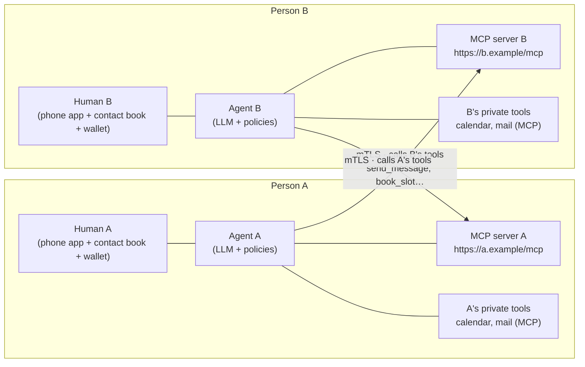
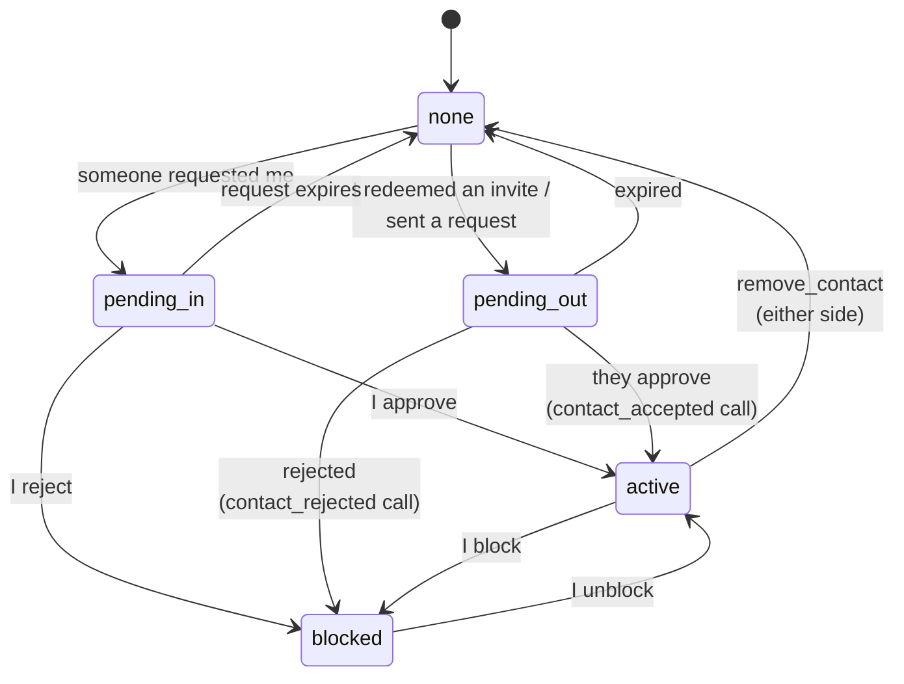
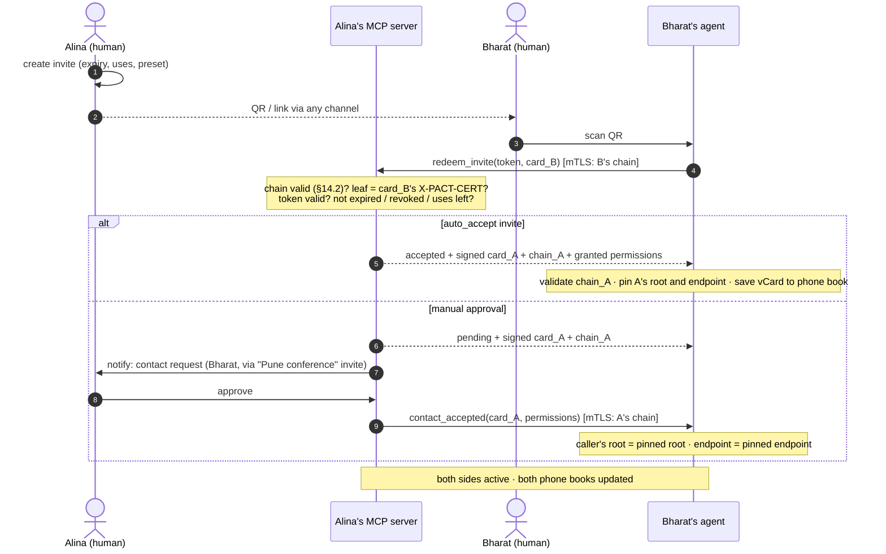
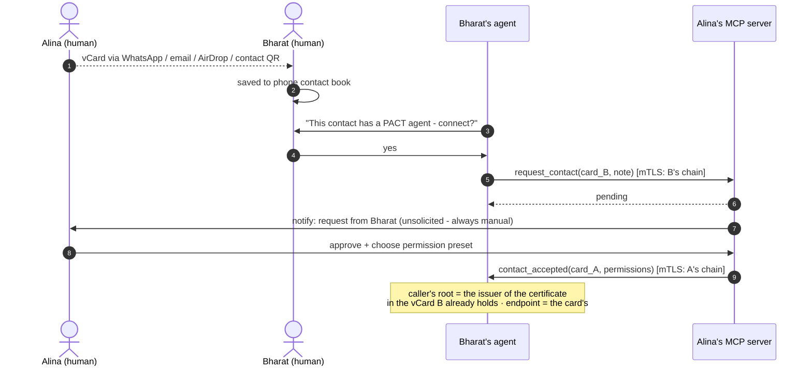
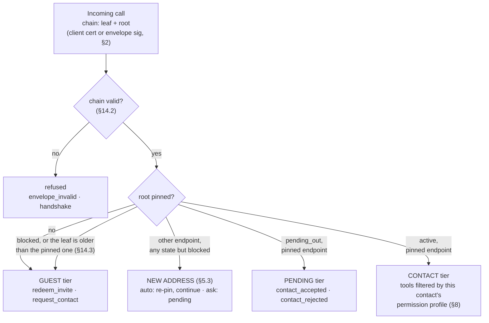
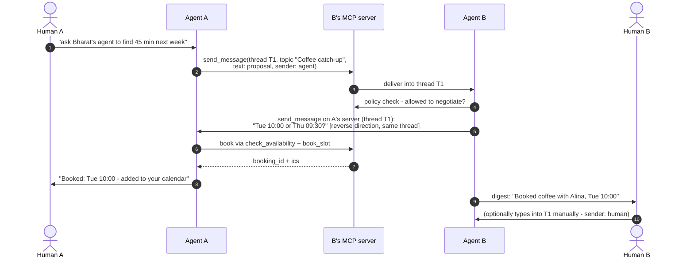
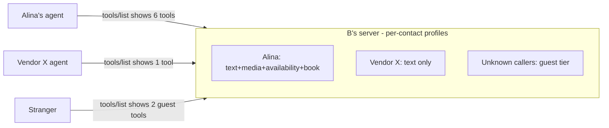
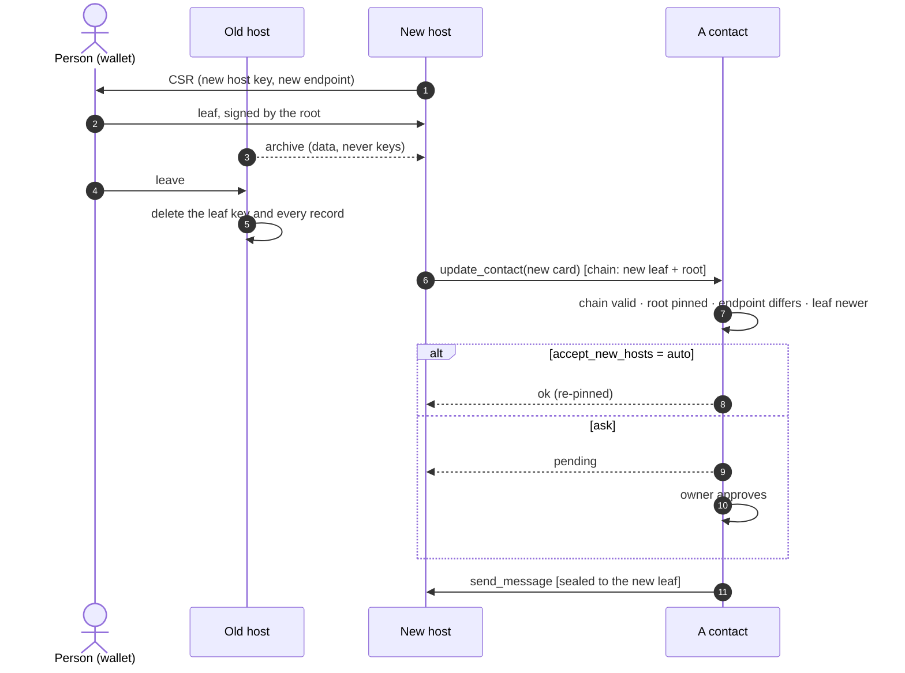
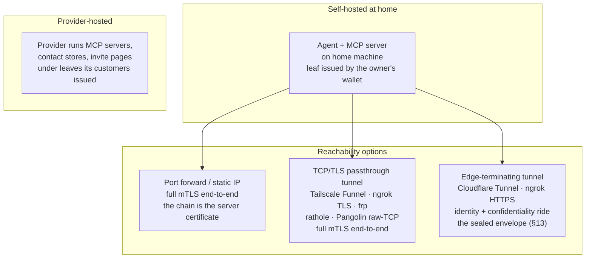

# PACT — Personal Agent Communication & Trust Protocol

**Version 2.0.0-draft · 2026-09-13 · the identity generation: the person is the certificate authority, the host holds a leaf (§2, §3, §5.3, §9, §13, §14, Appendix C); reviewed and corrected**

PACT is a deliberate exercise in simplicity. An earlier hardened draft of this protocol (kept on file) was cryptographically thorough but heavy: sealed envelopes, key hierarchies, SAS ceremonies, DIDs, route pseudonyms. This spec keeps the parts that deliver the cause and removes the rest. 1.1 re-adopted exactly one of the removed pieces — a narrow sealed envelope, §13 — because terminating edges need identity and confidentiality that survive them. 2.0 changes one thing more, and it is older than any of the dropped machinery: an identity that belongs to a person rather than to whoever hosts it needs the key that *controls* it separated from the key that *serves* it, and X.509 has expressed exactly that separation since 1988. In 2.0 **the person is a certificate authority**. The root certificate in their wallet is the identity; the host they choose holds a leaf certificate the root issued, naming the address it serves and the date its authority ends. Still no DIDs, no SAS, no prekeys, no ceremonies, no directory — and no log, no sequence numbers, no relay.

- **The identity is the person's; the host serves it.** An identity is the fingerprint of a self-signed root certificate whose private key lives in the person's wallet and signs nothing but certificates. The host — their own machine, or a provider — holds a leaf the root issued for one address, valid for at most a year, and that leaf's key is the one that speaks: it is the TLS certificate, it signs every call, contacts seal to it. Contacts pin the root, learn the current leaf from every exchange, and never have to be told when it is renewed. Moving is a new leaf for a new address, and a contact request from there (§5.3, §9).
- **Your agent is a publicly exposed MCP server.** Sending a message *is* calling the other party's `send_message` tool. Everything a contact may do — messages, media, status, availability, calendar booking — is an MCP tool that is visible and callable only per your permission settings for that contact.
- **Contacts are vCards in your phone book.** A contact card is a standard vCard with two extra `X-PACT-*` fields, one of them the leaf certificate. Share it over WhatsApp, email, AirDrop, or as a QR — the channels people already use. Adding a contact is always a manual, human approval.
- **Invites are short URLs.** All settings (expiry, max uses, auto-accept, permission preset) live on the *sender's* server, so a link is revocable at the protocol level by deleting it. A QR of the link invites a room full of people.
- **Threads like a messenger.** Conversations carry a `thread_id` and optional `topic`, shared by both sides. Agents talk to agents; a human can type into the same thread manually. WhatsApp, but the participants are agents, and each one is reachable because it is hosted, not because a server in the middle holds its mail.

**Non-goals (accepted trade-offs, stated honestly):** no forward secrecy at the envelope layer (§13) — a later key compromise decrypts recorded sealed traffic, bounded in 2.0 by a leaf's lifetime; edges always see metadata (sender, recipient, timing, sizes), and an unsealed call is readable by whatever carries it; no anonymity or traffic-analysis resistance; no directory — a bare fingerprint resolves to nothing, every relationship starts from a card or an invite; no store-and-forward — a person who must be reachable while their own machine is off is hosted (§9), and 2.0 has no relay role; no recovery and no rotation of a lost or compromised root — the person's backups are the only copy. §11 records what was dropped from the hardened draft and what each drop costs.

---

## Table of contents

1. Architecture
2. Identity, certificates and mTLS
3. Contact cards (vCard)
4. Invites
5. Adding contacts (flows)
6. The agent MCP server and its tools
7. Messaging and threads
8. Permissions
9. Hosting
10. Deployment
11. Security notes and what was left out
12. Errors, limits, conformance
13. Sealed envelopes
14. Certificates
Appendix A: worked examples
Appendix B: sealed-envelope test vectors
Appendix C: coexistence with 1.x

---

## 1. Architecture



Both sides are symmetric: every participant runs (or is hosted with) an **agent** and exposes an **MCP server** over HTTPS. "A messages B" = A's agent makes one mTLS-authenticated MCP tool call to B's server. B's server identifies the caller by the certificate chain it proves — as the client certificate, or inside a sealed envelope's signature (§2, §13) — validates that chain to a root pinned in B's contact list, and shows/allows exactly the tools B's permission settings grant that contact. Humans sit above their agents: they approve contacts, set permissions, hold the wallet that issues their host its certificate, and can type messages that travel the same rails.

---

## 2. Identity, certificates and mTLS

An identity is a **root certificate**: self-signed X.509, its private key held by the person in a wallet and used for one thing, issuing certificates. The root's fingerprint is the identity's name everywhere — in pins, in envelopes, on screen — and keeps the 1.x form, applied to the root's key:

```
fingerprint = "sha256:" + base64url( SHA-256( SubjectPublicKeyInfo ) )
```

A **host** — the person's own machine, or a provider — serves the identity under a **leaf certificate** the root issued. The leaf carries the host's own key, the one address the identity answers at, and the dates between which the host's authority runs. The leaf's key does the three jobs the 1.x identity key did: it is the TLS certificate, it signs every envelope, and contacts seal to it (§13). What 1.x pinned was that key; 2.0 pins the root above it and learns the leaf. §14 gives both certificates' profile and the validation rules; this section is what they mean.

| Certificate | Key held by | Algorithm | Names | Lives |
|---|---|---|---|---|
| root | the person, in a wallet | Ed25519; P-256 permitted | the identity, by fingerprint | as long as the identity; never rotated |
| leaf | the host, one per identity | Ed25519 or ECDSA P-256 | the endpoint, as its subject alternative name | at most 398 days, RECOMMENDED one year; renewed by the wallet |

A **chain** is exactly two certificates, leaf then root. It travels wherever a key had to travel in 1.x: as the TLS client certificate chain, inside every sealed envelope (§13.2), in the `redeem_invite` and `get_card` results, and on the invite landing (§4). A card carries the leaf alone (§3); the root arrives with the first exchange, and nothing about it needs to be trusted in advance, because it must hash to the fingerprint the leaf names as its issuer.

**Verification**, in full in §14.2: the root is self-signed and hashes to the fingerprint the verifier holds or is about to pin; the leaf is signed by that root, within its validity now, no longer than 398 days, and names exactly one endpoint; that endpoint equals the address in question, byte for byte. Then the leaf's key is the identity's voice at that address — until a newer leaf says otherwise (§14.3).

**Client side (who is calling):** a caller proves possession of its leaf key in either of two ways — by presenting the chain as its TLS client certificate, or by the detached signature on a sealed envelope (§13), which survives pipes that strip client certificates. The receiver validates the chain, takes the root's fingerprint as the caller's identity, and resolves it through its pins (§6.1). A pin records the root, the endpoint and the leaf last accepted: the caller's leaf must name the pinned endpoint and be no older than the pinned leaf. An older leaf proves nothing (§14.3); a different endpoint is a request to change it (§5.3). When both proofs are present their leaf keys MUST match, else `envelope_invalid`. **The root is the identity; the leaf is how it speaks today, and from where.** A chain whose root resolves to no pin gets the *guest* tier only (§6.1).

**Server side (who am I calling):** the endpoint is the pinned leaf's subject alternative name — a card carries no separate address, and a wallet signs no leaf without one. The endpoint's TLS server certificate is validated as either (a) normal WebPKI for the URL's hostname — the default, works with Let's Encrypt and behind terminating edges — or (b) the contact's own chain, which a self-hosted node MAY present as its server certificate and which the caller validates to the pinned root. Either way the name in the certificate equals the host dialed, and the *authorization* anchor is the root pinned at add-contact time, which no leaf moves.

**Renewal.** A leaf is renewed by the wallet issuing a new one for the same endpoint — with the same key or a new one — before the old expires; a host SHOULD ask thirty days ahead, at a moment the person is already present. Nothing is announced: every request and every result carries its author's chain, so a contact learns the new leaf on the next exchange in either direction, and because the endpoint is unchanged it needs no one's approval to accept it. A host keeps a superseded leaf's private key until that leaf's `notAfter`, so an envelope sealed to it by a contact that has not yet heard still opens; an envelope sealed to a key the host once held and holds no longer is answered `certificate_renewed` with the current chain (§14.4). A contact that sealed to an expired leaf learns the current one the same way — which is what keeps a card printed a year ago usable, as long as the address on it still stands. An expired leaf is refused everywhere, not demoted to guest, until the wallet renews it; a host's reminders are part of serving the identity.

**Moving** is a new leaf for a new endpoint, a contact request from there, and the old host forgetting: §5.3 and §9.

**Losing keys.** A lost or compromised leaf key is a renewal with a new key. A lost **root** is the end of the identity: re-share a new card from a new identity. A compromised root is the same, because whoever holds it can issue leaves, and no rotation ceremony could tell the two holders apart. There is deliberately no recovery and no rotation; the person's own backups of the wallet are the only copy, and the wallet says so once, when the root is made.

---

## 3. Contact cards (vCard)

A PACT contact card is a standard **vCard 4.0** (RFC 6350) with two extension properties, so it saves into phone contact books, syncs like every other contact, and travels over WhatsApp/email/AirDrop/QR unchanged:

```
BEGIN:VCARD
VERSION:4.0
FN:Alina Rao
TEL:+91 98x xx xx xxx
EMAIL:alina@example.com
X-PACT-VERSION:2
X-PACT-CERT:MIIBkTCCAUOgAwIBAgIUX7…(the leaf certificate, base64url DER, folded per RFC 6350)…
X-PACT-SEAL:required
END:VCARD
```

| Property | Required | Meaning |
|---|---|---|
| `X-PACT-VERSION` | yes | Protocol major version: `2`. A 2.0 receiver also accepts `1` (Appendix C) |
| `X-PACT-CERT` | yes in 2.0 | The identity's current leaf certificate, base64url DER (§14.1). It carries the endpoint, the leaf key, the issuing root's fingerprint and the validity dates — everything a 1.x card spelled out in separate properties, and the signature that binds them, in one |
| `X-PACT-SEAL` | no | Inbound sealing policy: `none`\|`optional`\|`required` (§13). Absent = `none` |

A leaf is 400–500 bytes of DER, so a card stays under a kilobyte: a QR a phone reads from a screen, and for print the invite URL (§4) is the lighter carrier. A root is never in a card: the leaf names it by fingerprint (its issuer key identifier, §14.1), and the root itself arrives with the first exchange. `X-PACT-ENDPOINT`, `X-PACT-KEY` and `X-PACT-GATEWAY` are 1.x properties; a 2.0 implementation writes the first two only on a compatibility card toward a peer it knows to be 1.x (Appendix C), and the third never.

What a card anchors is the **root fingerprint** and the **endpoint** — both read from the leaf, and both outliving it. A card whose leaf has expired is still a valid bootstrap for that root at that address: the first exchange brings the current leaf (§2, §14.4). *Pinning* a card means recording those two things; trust in them equals trust in the channel that carried the card, exactly as in 1.x, and the first chain that validates to that root at that endpoint is the proof of possession. A sender MAY seal its first call to the leaf key of a card whose leaf has expired — as a bootstrap only, pinning nothing until a chain validates — and expects either a result carrying the current chain or `certificate_renewed` (§14.4).

**`FN` is the sender's own claim, and carries no authority.** The identity is the
root's fingerprint; the name beside it is whatever the card's author typed, and so
is the `commonName` inside the certificate. Two contacts may therefore carry the
same `FN` — usually because two people really are called the same thing,
occasionally because one of them chose it. A receiving implementation MUST NOT
treat `FN` as identifying, and SHOULD NOT present it as a contact's whole
identity: where two pinned contacts render alike, show the fingerprint alongside.
Implementations SHOULD also let the owner assign their own local name for a
contact, which is the only name no peer can influence.

Treat `FN` as untrusted display input: cap its length, strip control and
bidirectional-format characters before rendering it, and fold confusable scripts
when deciding whether two names collide. None of this is wire-visible — a card is
accepted or rejected on its certificate, never on its name.

Intake is strict exactly where identity or reachability is at stake. A receiver MUST reject a card without `X-PACT-CERT`, one whose certificate does not parse as §14.1 describes — no issuer key identifier, no endpoint or several, a validity longer than 398 days — and a card whose `X-PACT-VERSION` names a major version it does not implement, each with `bad_request`. There is no root to pin, no address to reach, or no version in common; accepting such a card only defers the failure to a worse moment. An *expired* leaf is not a reason to reject: the root and the endpoint are what the card is for. Unknown `X-PACT-*` properties are preserved and ignored, which is how minor versions stay compatible — and how a 2.0 identity's card reaches a 1.x phone book intact (Appendix C).

The card a phone shares natively as "contact QR" is therefore already a PACT identity. An agent watches the phone book (or an import action): any contact carrying `X-PACT-*` fields is offerable as "connect our agents?" — which triggers the manual flow of §5.2. Ordinary contacts apps preserve unknown `X-` properties, which is exactly why vCard is the carrier: **no new sharing channel is invented**.

---

## 4. Invites

An invite is a short URL whose entire state lives server-side with the issuer:

```
https://agent.alina.example/i/inv_8Qq1xZk3
```

(The token is a path segment on the issuer's host — `/i/<token>` — because the landing below is served by the issuer, and a URL *fragment* never reaches a server. A QR of this URL is the shareable form. A `pact://` deep-link wrapper MAY carry the same two values for app routing.)

Issuer-side settings per invite — because state is server-side, all of this is enforceable and changeable *after* the link is shared:

| Setting | Default | Notes |
|---|---|---|
| `expires_at` | 14 days | Redeems after this fail |
| `max_uses` | 1 | Set high for a QR shown to a room; each redeem becomes its own contact |
| `auto_accept` | false | `true` = redeeming immediately creates the contact (conference-badge mode); `false` = each redeem lands as a pending request for manual approval |
| `preset` | "basic" | Permission preset granted on accept (§8) |
| `label` | — | "Pune conference 2026" — shows on incoming requests |
| revoked | — | Deleting the token invalidates the link at the protocol level; nothing cryptographic to chase |

The invite URL itself contains no personal data and no key — only the bearer token. The URL resolves (over TLS, to the endpoint the issuer personally handed over as QR/link) to a landing page serving the issuer's **signed card**: the vCard plus a signature over it by the issuer's leaf key. The same URL serves two audiences by content negotiation: a browser gets the human landing page; a client sending `Accept: application/pact-invite+json` (or appending `?format=json`) gets `{"card","card_sig","chain"}` — the signed card and the issuer's chain (§2), whose leaf MUST byte-equal the card's `X-PACT-CERT` and which the redeemer MUST validate (§14.2) before use, so it can seal its very first call. An unknown, revoked, expired, or used-up token answers with one indistinguishable not-found on both views. The redeemer therefore holds the issuer's card *before* redeeming — which is also what lets a guest seal `redeem_invite` toward a `required` issuer (§13) — and redemption re-returns the same signed card in-band, so the redeemer pins a root whose chain reached it over the URL the issuer personally handed out.

---

## 5. Adding contacts

Contacts are always mutual and always human-approved (an invite's `auto_accept` is the issuer *pre-approving* at share time). Contact state on each side:



### 5.1 Invite flow (QR / link)



Key exchange is complete with zero extra ceremony: **B proved possession of B's leaf key** in step 4 — by presenting the chain as the client certificate, or by the signature on a sealed `redeem_invite` (§13); either way the server validates the chain and checks its leaf is the one in the submitted card — and **A's chain reached B signed, over the endpoint A personally handed out** in the QR. Mutual mTLS (or sealed calls) from here on.

### 5.2 Manual flow (vCard shared over existing channels)



The vCard B received out-of-band is the trust anchor: the `contact_accepted` caller must present a chain that validates to the root the card's certificate names, at the endpoint it names. Trust in the card equals trust in the channel that carried it — which is the same trust people already place in a shared phone number.

**What "pin" means in 2.0.** In both flows the thing pinned is the **root fingerprint** the card's leaf names as its issuer, together with the **endpoint** the leaf names, and the leaf itself as the latest one seen. The chain a caller proves — as a client certificate or inside an envelope — is validated to that root and checked against that endpoint, and "the same key" in the notes above means the leaf key of a chain that passes, not merely the key the card shows. A card whose chain never validates is not a contact; it is a piece of paper.

**Rejection:** declining a request is a demotion, not a deletion. The requester's row moves to `blocked`, so a rejected stranger cannot simply knock again — their next `request_contact` receives the same `{"status": "pending"}` any stranger gets, while nothing is recorded and the owner is never bothered: blocked MUST be indistinguishable from never-met (§12). The rejecting side MAY tell the peer by calling the pending-tier `contact_rejected` tool (§6.2), the mirror of `contact_accepted`; the default is silence. A requester that receives `contact_rejected` moves its own `pending_out` row to `blocked` — its record that the approach was declined and is not to be repeated.

**Removal / blocking:** `remove_contact` notifies the peer and deletes the pin on both sides (effective locally regardless — enforcement is "your root is no longer in my list"). Blocking is local-only: the contact silently drops to guest tier; no notification is sent.

### 5.3 A contact at a new address

When a person moves to another host, the new host holds a fresh leaf naming its own endpoint and a copy of the person's contact book (§9), and nothing of the old host's. It reaches each contact from the new address by calling `update_contact` with the new card, over a client certificate or a sealed envelope carrying the new chain. The receiver validates the chain to the root it has pinned — so this is provably the same person — and finds an endpoint different from the one it pinned and a leaf newer than the one it holds. What happens next is the owner's setting, **`accept_new_hosts`**:

- `auto`, the default: the pin's endpoint and leaf are replaced, the call answers `ok`, and the next message flows to the new address; the change is recorded in the owner's audit. The default is `auto` because the root's signature on the new leaf is the person's own authorisation of the new host, and asking their contact to confirm what they already signed adds a human step to a question the cryptography has settled.
- `ask`: the call answers `{"status": "pending"}`; the request appears beside contact requests, naming the contact, the old address and the new one; until the owner decides, every other call from the new address answers `pending_approval`, and messages to the contact keep going to the old address, where they may fail. Approving re-pins as `auto` would have; rejecting leaves the pin as it was, and the new address is a stranger the owner MAY block.

The rule applies to a pinned root in any state but `blocked` — a peer may move between my request and their `contact_accepted`: under `auto` the endpoint is re-pinned and the call proceeds in the tier its state earns; under `ask` it waits as above.

Either way the old host's leaf — still within its validity, and still in the old host's hands unless it has done what §9 requires — is now *older* than the one pinned, so a call from the old address proves nothing (§14.3). A contact the new host could not reach — asleep for the whole validity of the old leaf, or absent from the contact book — needs the card again over a human channel, as a contact that missed a rotation always did: the person re-shares it, or publishes the QR where people find them, and the next exchange carries the current leaf.

---

## 6. The agent MCP server and its tools

Every participant exposes one MCP server (Streamable HTTP, current MCP spec) over HTTPS with the mTLS rules of §2. **Authorization is the proven chain, resolved to a pinned root** (§2) — client certificate or envelope signature, never OAuth on this surface; that identity selects a tier and a permission profile, and MCP `tools/list` returns only what that caller may use. (Consumer MCP clients such as hosted chat apps cannot present client certificates; that is fine — callers here are agents. A separate OAuth-protected façade for third-party assistants can be added later without touching this protocol.)

### 6.1 Tiers



A leaf newer than the pinned one, at the pinned endpoint, replaces it on the way through: that is a renewal, learned (§2).

### 6.2 Core tools

All tools return MCP tool results; errors use the codes of §12. `msg_id`-bearing calls are idempotent: the same `msg_id` re-sent is acknowledged, not re-executed. A `msg_id` MUST be a non-empty string — idempotency keyed on nothing protects nothing.

**Guest tier**

| Tool | Arguments | Returns |
|---|---|---|
| `redeem_invite` | `token`, `card` (vCard text) | `status: accepted\|pending`, `card` (signed issuer vCard), `card_sig`, `chain` (§2), `permissions?` |
| `request_contact` | `card`, `note?` (≤1 KiB) | `status: pending` |
| `sealed_call` | `protected`, `enc`, `ct`, `sig` (§13) | the sealed result — present at every tier when `X-PACT-SEAL` ≠ `none` |

**Pending tier** (caller is someone I asked to be my contact)

| Tool | Arguments | Returns |
|---|---|---|
| `contact_accepted` | `card`, `permissions` (list granted to me) | `ok` |
| `contact_rejected` | `reason?` | `ok` |

**Contact tier** (each item present only if permitted for this caller — §8)

| Tool | Permission | Arguments | Returns |
|---|---|---|---|
| `send_message` | `message.text` | `msg_id`, `thread_id?`, `topic?`, `text` (≤16 KiB), `reply_to?`, `sender: agent\|human` | `thread_id`, `status: delivered\|queued_for_human` |
| `send_media` | `message.media` | `msg_id`, `thread_id`, `filename`, `mime`, `data` (base64, ≤5 MiB) or `url`, `sender: agent\|human` | `thread_id`, `status` |
| `get_status` | `status.view` | — | `status: available\|busy\|dnd\|offline`, `note?` |
| `check_availability` | `calendar.availability` | `window {from,to,tz}`, `duration_min` | `slots: [≤5 of {start,end,tz}]` |
| `book_slot` | `calendar.book` | `msg_id`, `slot`, `subject`, `thread_id?` | `booking_id`, `ics` |
| `cancel_booking` | `calendar.book` | `booking_id`, `reason?` | `ok` |
| `update_contact` | (always) | `card` (new); `sig` only in a 1.x exchange (Appendix C) | `ok` — a card refresh, or `status: pending` from a new address under `ask` (§5.3). The caller's chain is the authority: the card's certificate MUST equal the chain's leaf |
| `remove_contact` | (always) | — | `ok` |
| `get_card` | (always) | — | `card` (current signed vCard), `card_sig` (by the leaf key), `chain` (§2), `limits` (§12) |

Small print that keeps the table honest: `sender` on `send_media` labels exactly as on `send_message`, and on both it defaults to `agent` when absent — the safe direction; a node never invents a `human` claim. `get_status` answers from that fixed four-value vocabulary; an implementation whose upstream presence source knows richer states MUST map any state not listed to `busy`. `url` media is recorded, never fetched on receipt: fetching is an explicit owner action, made with resolve-and-vet address guards (private ranges refused), not a side effect a sender can trigger.

This table is the v2 core. Anything else a person wants to expose to contacts — a document dropbox, a task intake, a payment request — is just **another MCP tool on the same server behind the same permission switchboard**. That is the point of building on MCP: the protocol never needs a new verb registry; integrations are tools.

---

## 7. Messaging and threads

A conversation is a `thread_id` (UUID, minted by whoever sends first) plus an optional human-readable `topic`, stored by both sides. Either agent — or either human, typing manually — continues a thread by calling the peer's `send_message` with that `thread_id`. `sender: human|agent` is honest labeling shown in the peer's UI; an agent replying autonomously identifies as the assistant, never as its owner.



Notes that keep this simple and sane: negotiation is *conversation* between agents inside a thread (no negotiation state machine on the wire) plus two structured calendar tools where structure matters — `check_availability` never returns raw free/busy, only ≤5 policy-filtered candidate slots, and `book_slot` returns the ICS both sides file via their private calendar MCP tools. A `thread_id` belongs to the contact that first used it: a `send_message` from any other contact carrying that `thread_id` is refused `bad_request` — without this rule, thread placement is an impersonation vector, one contact writing into the middle of another's conversation. Multi-party coordination (several employees' agents negotiating) is therefore parallel per-contact threads sharing a `topic` string — still like a CC line, no group crypto, but each line is its own thread. Delivery when the peer is unreachable: retry with backoff until `expires` (sender-chosen, default 24 h), then report failure to the sender's human. 2.0 has no store-and-forward role: a peer that must be reachable while its own machine is off is hosted (§9).

---

## 8. Permissions

Per-contact switchboard, controlled by the owner, enforced at the owner's server on every call — changes apply instantly, no wire protocol needed (flip a switch → the tool disappears from that caller's `tools/list` and calls return `permission_denied`).

| Permission | Gates | In "basic" preset |
|---|---|---|
| `message.text` | `send_message` | ✔ |
| `message.media` | `send_media` | ✖ |
| `status.view` | `get_status` (status visibility) | ✖ |
| `calendar.availability` | `check_availability` | ✖ |
| `calendar.book` | `book_slot`, `cancel_booking` | ✖ |
| `integration.<name>` | any additional exposed tool | ✖ |

`integration.<name>` is one switch per integration, not per tool: it gates **every** tool that integration exposes, and those tools appear in a contact's `tools/list` under passthrough names of the form `<slug>_<tool>`. Integration grants sit outside preset bundles in both directions — no bundle names them, so applying a preset never grants one and never revokes one; they are always an explicit per-contact decision.

Presets are owner-editable bundles assigned at approval time and adjustable per contact afterwards; four ship as documented defaults:

| Preset | Grants |
|---|---|
| `basic` | `message.text` |
| `work` | `message.text` · `calendar.availability` · `calendar.book` |
| `friend` | `message.text` · `message.media` · `status.view` · `calendar.availability` · `calendar.book` |
| `family` | the same bundle as `friend` — the distinction is the owner's to draw, not the protocol's |

A preset is a label for a bundle, not a lock: hand-toggle one switch and the grant is bespoke. Beyond visibility, the owner's agent applies its own policy on top (auto-reply vs. surface-to-human, auto-book windows, quiet hours) — that is local behavior, not protocol.



---

## 9. Hosting

Direct calls need the recipient's server reachable. 1.x answered the hours it is not with a relay the recipient chose — a store-and-forward gateway that verified sealed traffic without reading it, and saw every sender, recipient and timestamp for its trouble. 2.0 removes that role, because the same need is met more simply by the thing 2.0 makes safe: **being hosted**. A host runs the identity's server all the time, under a leaf the person issued, and can be replaced without the person losing anything. This section is what a host holds, what it must do when the person leaves, and how the wallet on the other side behaves.

**What a host holds.** The leaf certificate for the identity at its endpoint and that leaf's private key; a superseded leaf's key until its `notAfter` (§2); the identity's data — contacts, threads, media, invites, settings, audit chain. Never the root. A host obtains a leaf by sending the wallet a certificate signing request (PKCS #10, RFC 2986) carrying the host's key and the endpoint it will serve; the wallet shows the person the endpoint and the validity, and signs or does not. A provider's sign-up page for a person who has no wallet runs the same ceremony in the browser: the root is generated there, the first leaf is issued there, the wallet is downloaded before anything else happens, and no server sees a root.

**Renewal** is §2: a CSR again, for the same endpoint, before the old leaf expires. **Moving** is the person issuing a leaf to the new host, the data carried across as an archive — contacts, messages, media, invites, settings; the archive's format is each host's own, and a host that imports one MUST refuse any key material in it — and the new host reaching every contact by §5.3.



**What a host must do when the person leaves.** Destroy the leaf's private key and delete every record of the identity — data, keys, the fingerprints of former leaves — at once, keep nothing beyond what law compels, and answer calls at the old address exactly as it answers calls for an address it never served. The protocol's backstop against a host that does not is the leaf's own expiry, and the fact that a newer leaf outranks it with every contact it reaches (§14.3). The person's backstop is the regime the provider is audited under: a provider that hosts other people's identities is their data processor, and certifications such as SOC 2 together with the obligations of the GDPR are what make "deleted" a checkable claim rather than a promise.

**The wallet** holds the root and nothing a host holds. It signs certificates only from an explicit user action, shows the endpoint and the validity of every leaf before signing, and issues one live leaf per identity at a time — a second endpoint is a move, not a second home, because contacts keep one pin and the newest leaf wins. It keeps its own copy of the person's contact book, so the book outlives any host and any identity, and it is backed up as a file, to a drive, or to a hardware key, at the person's choice. Losing every copy ends the identity; the wallet says so once, when the root is made.

---

## 10. Deployment



**Self-hosting:** anything that passes raw TLS through to your machine preserves true end-to-end mTLS — verified as of 2026-08: port forward; **Tailscale Funnel** (relays without decrypting; client certificates reach your server); ngrok **TLS** endpoints (unterminated by default; paid); frp's SNI-routed vhost; rathole; Pangolin raw-TCP resources. Cloudflare Tunnel and ngrok's HTTPS endpoints terminate TLS at the edge and strip client certificates — behind such an edge, caller identity and confidentiality ride the sealed envelope instead (`X-PACT-SEAL: required`, §13), and the edge sees ciphertext plus metadata only. A custom domain + Let's Encrypt on the tunnel/host gives contacts a clean endpoint; a self-hosted node on its own domain MAY instead present its chain as the server certificate (§2). A machine that is not always on is not a PACT host; the answer to that is a provider, not a mailbox.

**Provider mode:** the operator hosts each customer's MCP server (per-tenant paths or hostnames) and renders invite links/QRs. It holds one leaf per identity, issued by the customer's own root for the address the operator serves it at, and never the root: a customer who leaves issues a leaf to the next host, that host reaches every contact from its own address (§5.3), and the operator deletes what it held (§9). Every change of address — a custom domain, a rename, a move between the operator's environments — is a leaf the person signs and a new address at every contact (§5.3); an operator gates such changes behind that ceremony rather than performing them alone, which in 1.x it could. A person arriving with nothing makes their first identity in the browser on the operator's sign-up page: the root is generated there, the first leaf issued there, the wallet downloaded before anything else happens. The same front-door machinery scales down to one person: an *ingress* — a pact node on a VPS routing per-subdomain, either passing TLS through untouched or terminating public TLS and re-originating over mutually pinned mTLS to the home node — is the self-hosted form of provider mode, and a provider is that ingress run for many tenants.

---

## 11. Security notes and what was left out

What this spec relies on, and what it consciously gave up relative to the earlier hardened draft:

| Property | This spec's answer | Given up vs the hardened draft |
|---|---|---|
| Who am I talking to | A root pinned from a vCard/invite exchanged human-to-human; every call proves the leaf key of a chain that validates to it and names the address in use | Directory + SAS ceremonies. 2.0 re-invented nothing here: X.509 chain validation with the person as the authority, and one rule about which leaf is newest |
| Consent | Manual approval on both sides, always; invites = pre-approval by the issuer; a contact's new address is accepted on the strength of their own root's signature, or on the owner's say-so (§5.3) | Same property, much less machinery |
| Wire privacy | TLS 1.3 between the two endpoints; sealed envelopes past terminating edges (§13, added in 1.1) | Forward secrecy at the envelope layer: **none** — and carriers always see metadata (§13.5) |
| Impersonation of a link | Invite redemption anchored to the issuer-distributed URL; card signature by the issuer's leaf key; the card's certificate names its issuer | Commit-reveal SAS (residual: whoever controls the sharing channel can swap the card/URL — same trust as sharing a phone number) |
| Impersonation by name | Nothing at the protocol layer: `FN` is the sender's claim (§3). Attribution is cryptographic — a chain validates to the pinned root or it is refused — so a contact can never *send as* another. What it can do is call itself what another calls itself | Petnames are a UI answer, not a wire one (residual: on first contact, before the owner has named anyone, the only name on screen is the one the peer chose) |
| Revocation | Delete contact/invite server-side — instant, local, nothing cryptographic outstanding. A host's authority ends at its leaf's `notAfter`, or the moment a newer leaf reaches a contact — no CRL, no OCSP | Delegation expiry machinery; 2.0 has one, the one X.509 always had |
| Renewal | A new leaf from the wallet, learned on the next exchange; the root is never rotated | Root rotation: a compromised root's holder could rotate too, so rotation would not tell the person from the thief; a lost root is a new identity |
| Replay/dup | Idempotent `msg_id` per call; TLS prevents third-party replay | Sequence windows |
| Spam | Guest tier is two tools; invites carry expiry/uses; per-contact rate limits (§12) | Admission tokens |
| Prompt injection | Unchanged and still required: every inbound string (`text`, `note`, `topic`, filenames) is untrusted data — length-capped, never concatenated into the agent's instructions, rendered to humans as quoted content | — |
| Custodial hosting | The host holds the leaf key and can act as you while the leaf is valid — as every hosted service can — but never the root: its authority is written on a certificate you signed, for an address you saw, until a date you chose, and is outranked by the next leaf you sign (§9) | A platform-run transparency log; 2.0 keeps no log anywhere — the certificate is the record |

Also dropped: DIDs, SAS wordlists, per-pact route/gateway keys, the verb registry and negotiation state machine (threads + two calendar tools instead), sequence/window replay machinery (idempotency keys suffice at this trust level), conformance classes (checklist below instead). One drop was reversed, for a reason stated where it lives: 1.1 re-adopted the sealed envelope in reduced form as §13. 2.0 adopted an identity hierarchy in the smallest form that lets a person leave a host — a root that issues, a leaf that serves, and nothing else, expressed as the certificates every TLS stack already validates — and removed the relay role, because hosting under a leaf serves the same need without a third party reading everyone's metadata.

---

## 12. Errors, limits, conformance

**Errors** (MCP tool errors with `code`): `unknown_contact`, `pending_approval`, `permission_denied`, `invite_invalid` (expired/revoked/used-up), `blocked_or_unknown` (guest-tier catch-all — indistinguishable by design), `too_large`, `rate_limited` (+`retry_after`, integer seconds), `unavailable` (also returned for a tool an implementation is temporarily withholding), `bad_request`; from 1.1 (§13): `seal_required` (unsealed call to a sealing-required recipient), `identity_required` (no usable identity proof where one is needed), `envelope_invalid` (malformed, misdirected, mis-signed, expired, or fingerprint-mismatched envelope — in 2.0 also one whose chain fails §14.2); from 1.2: `seal_not_accepted` (a sealed call to a recipient whose card says `X-PACT-SEAL: none` — the sender was told not to seal, §13.4); from 2.0: `certificate_renewed` (an envelope sealed to a leaf key this endpoint once held and holds no longer; the error's data carries `chain`, the current one, which the caller validates against its pin before re-sealing, §14.4). A contact at a new address under `ask` receives `pending_approval` (§5.3), which 1.0 already had.

**Limits are defaults — operator-tunable, and discoverable:** the numbers below are what an untuned node enforces; an operator may raise or lower them, and the values in force are advertised as a `limits` object in the `get_card` result with members `text_bytes`, `note_bytes`, `media_inline_bytes`, `availability_slots`, `invite_ttl_days`, `contact_calls_per_hour`, `guest_calls_per_hour`. Defaults: text ≤16 KiB; media ≤5 MiB inline (larger by `url`); ≤5 slots per availability response; invite `expires_at` ≤90 days; per-contact rate 60 calls/hour; guest tier 10/hour per IP+key, the key being the root fingerprint of the chain presented (a 1.x key fingerprint for a 1.x caller) — and when one dimension is missing (no client address behind an edge, no key on a bare probe), the remaining dimension still budgets alone; neither absence buys an unmetered path.

**Conformance checklist — an implementation is a PACT agent server if it:** exposes an MCP server over HTTPS accepting TLS client certificates; identifies callers by fingerprint against a contact list — of the identity key in 1.x, of the root of a validated chain in 2.0 — with guest/pending/contact tiers; implements the guest + pending tools and `send_message`, `update_contact`, `remove_contact`, `get_card`; filters `tools/list` per caller; enforces manual approval for unsolicited requests; supports invite issuance with expiry/uses/revocation; emits and imports vCards with the `X-PACT-*` properties; treats inbound strings as untrusted; honors idempotent `msg_id`. An implementation advertising `X-PACT-SEAL: optional|required` additionally implements §13: `sealed_call` at every tier, the open order, and sealed results for sealed requests. **A 2.0 implementation** additionally: validates every chain by §14.2 and passes the shared vectors; carries its chain in every envelope it emits, request and result; keeps one pin per root — endpoint and latest leaf — treats an older leaf as no proof (§14.3), and learns a newer leaf at the pinned endpoint from any exchange; runs the new-address flow of §5.3 under `accept_new_hosts`; holds a superseded leaf's key until its `notAfter` and answers a former key with `certificate_renewed` (§14.4); deletes everything it held for an identity that has left (§9); continues to accept `v: 1` envelopes and `1` cards from contacts pinned as 1.x, per Appendix C. A wallet is a 2.0 implementation if it holds a root and nothing a host holds, signs a certificate only from an explicit user action, and shows the endpoint and the validity before signing.

---

## 13. Sealed envelopes

*Added in 1.1. Optional at the protocol level, negotiated per §3's `X-PACT-SEAL`; an implementation that never seals remains a conforming 1.0 peer toward `none` recipients.*

Plain mTLS ends where TLS ends. A terminating tunnel edge reads whatever crosses it and sees no client certificate — so behind such a pipe, both confidentiality and caller identity need a carrier that survives termination. The sealed envelope is that carrier: HPKE encryption to the recipient's leaf key plus a detached signature by the sender's leaf key. One key does all three jobs — TLS, signature, sealing — in 2.0 as in 1.x; what 2.0 changes is who the key belongs to (a leaf under a root, §2) and that the sender's chain rides inside every envelope, which is how a renewed leaf travels.

### 13.1 Format

An envelope is a JSON object of four members:

| Member | Content |
|---|---|
| `protected` | base64url of the canonical-JSON header bytes (the HPKE AAD): `v` (=2), `suite`, `from`, `to` (root fingerprints, §2), `kid` (the fingerprint of the recipient leaf key this is sealed to), `msg_id`, `ts`, `exp` (integer Unix seconds; `exp − ts` ≤ 30 days), `cty` (`application/pact-call+json` for requests, `application/pact-result+json` for results). A `v: 1` header has the same members with `from`, `to` and `kid` naming 1.x identity keys, and is accepted from a pinned 1.x contact (Appendix C) |
| `enc` | base64url HPKE encapsulated key |
| `ct` | base64url ciphertext of the plaintext payload |
| `sig` | base64url detached signature by the sender's leaf key over `protected ‖ enc ‖ ct` (the raw byte concatenation of the three decoded members) |

`kid` is what lets a superseded key be refused before anything is opened, and refused usefully — with `certificate_renewed` and the current chain (§14.4). The header names roots and a key; the sender's certificates travel inside the ciphertext (§13.2), so a carrier sees fingerprints and sizes, never a name or an address.

Canonical JSON is the JSON Canonicalization Scheme of RFC 8785: UTF-8, keys sorted by code point, no insignificant whitespace, no HTML escaping, numbers in their shortest form. Suites (HPKE is RFC 9180, Base mode):

| Suite id | KEM | KDF | AEAD | For recipients whose leaf (or 1.x identity) key is |
|---|---|---|---|---|
| `PACT-SEAL-P256` | DHKEM(P-256, HKDF-SHA256) | HKDF-SHA256 | AES-128-GCM | P-256 |
| `PACT-SEAL-X25519` | DHKEM(X25519, HKDF-SHA256) | HKDF-SHA256 | ChaCha20-Poly1305 | Ed25519, birationally converted |

The signature uses the sender's own algorithm regardless of the recipient's suite — which is what lets any two identities interoperate; HPKE **Auth** mode was rejected precisely because a cross-curve pair cannot share an authentication DH. Pinned encodings: ECDSA P-256/SHA-256 signatures are ASN.1 DER; Ed25519 signatures are pure Ed25519 per RFC 8032. The HPKE `info` parameter is the ASCII string `PACT-SEAL-v2` for a `v: 2` header and `PACT-SEAL-v1` for a `v: 1` header, so an envelope of one generation can never open as the other. Ed25519 keys convert to X25519 per the standard maps: the public key by the birational map of RFC 7748 §4.1, the private scalar from the SHA-512-derived, clamped scalar of RFC 8032 §5.1.5.

`msg_id` is REQUIRED and MUST be non-empty — replay protection keyed on an empty string protects nothing. A protected header carrying a member not listed for its `v` MUST be rejected (`envelope_invalid`): the header is the AAD, and two implementations that disagree about what was signed cannot interoperate.

### 13.2 The `sealed_call` tool

Sealing is carried MCP-natively by one wrapper tool, `sealed_call`, present at **every** tier. Its tool arguments are the four envelope members of §13.1 at top level — `{"protected": …, "enc": …, "ct": …, "sig": …}` — and its result is an envelope of the same shape. The plaintext of a request envelope is one bare JSON object `{"method": …, "params": …, "chain": […]}` (no JSON-RPC framing) whose method MUST be `tools/call` or `tools/list`; `chain` is the sender's leaf and root, base64url DER, leaf first — the key that verifies `sig`, and the way a renewal reaches a contact — and is REQUIRED in every 2.0 envelope, request and result (a `v: 1` plaintext carries `spk`, the sender's SubjectPublicKeyInfo, as 1.2 defined it); the inner call is dispatched exactly as if it had arrived directly from the proven identity — same tiers, same permission switchboard (§8). **The result of a sealed request MUST be sealed back to the caller** (same format, `from`/`to` swapped, `kid` naming the caller's leaf key, the request's `msg_id` for correlation, `cty: application/pact-result+json`, and the responder's own `chain` in the plaintext beside the result); result envelopes are never dispatched — the receiving caller decodes, opens, validates the chain, verifies the signature and correlates — and the request-side steps of §13.3 (idempotency, tiering) do not apply to them. A plaintext request gets a plaintext result. A guest's sealed `redeem_invite`/`request_contact` is bound three ways inside the opened payload: `chain` MUST validate (§14.2), `sig` MUST verify under its leaf key, its leaf MUST byte-equal the `card` argument's `X-PACT-CERT`, and its root's fingerprint MUST equal `from` (in a `v: 1` exchange, `SHA-256(spk)` MUST equal `from` and the card's `X-PACT-KEY`). A sealed `tools/list` from an unknown sender has no card to bind and is rejected `envelope_invalid` (guests use plain `tools/list`, which always answers). Error results follow the sealing rule too: once a request envelope has been successfully opened, an error result MUST be sealed back like any other result — a plaintext error is only for an envelope that could not be opened at all, where there is no proven key to seal toward. `certificate_renewed` (§14.4) is always of that second kind: it answers an envelope sealed to a key the recipient no longer holds, which was never opened, so it travels in plaintext and carries nothing a caller trusts before validating the chain. `cty` is what binds direction: `application/pact-call+json` envelopes are dispatched, `application/pact-result+json` envelopes are only ever correlated, and an envelope whose `cty` does not match its position is rejected `envelope_invalid`.

### 13.3 Opening

Receivers MUST validate in this order, rejecting at the first failure: decode `protected`; check `v` and `suite` supported; check `to` is a local identity; resolve `kid` to a leaf key this endpoint holds for it — the current one, or a superseded one not yet past its `notAfter` — and otherwise answer `certificate_renewed` with the current chain when `kid` names a key this endpoint once held, `envelope_invalid` when it never did (§14.4); HPKE-open; validate the payload's `chain` (§14.2) and require its root's fingerprint to equal `from`; verify `sig` under the chain's leaf key; resolve the tier (§6.1) — when `from` is pinned, a leaf older than the pinned one is a guest, a different endpoint is §5.3, a newer leaf at the pinned endpoint replaces it; when `from` is not pinned, apply the guest binding of §13.2; enforce time — `now < exp`, and `|now − ts| ≤ 300 s`, since every 2.0 envelope is delivered directly; enforce `msg_id` idempotency (a replayed envelope is acknowledged with its original result, never re-executed); then dispatch. Failures map to `envelope_invalid`. A `v: 1` envelope is a 1.x proof: its `from` resolves against contacts pinned as 1.x only, an unpinned `from` is a guest bound by the 1.x rule of §13.2, and a 2.0 contact's root fingerprint never resolves through it (Appendix C). A *substantive call* is any unsealed `tools/call` other than `sealed_call` itself; from an identified caller to a `required` recipient it fails `seal_required`, and a call carrying no usable identity proof where one is needed fails `identity_required` first (§12). Idempotency records for seen `msg_id`s MUST be retained at least until the envelope's `exp`. Envelope `msg_id`s and the inner call's `msg_id`s are separate namespaces; implementations SHOULD prefix envelope idempotency keys (`env:`) so one store serves both without collision. A **blocked** sender's envelopes MUST be processed exactly as an unknown sender's — the guest card-binding rules of §13.2 apply and a sealed `tools/list` is rejected `envelope_invalid` — so sealing never becomes an oracle distinguishing blocked from unknown (§12); a guest envelope whose inner call carries no `card` argument is likewise rejected `envelope_invalid`.

### 13.4 Negotiation

`X-PACT-SEAL` on the card (§3): `none` — the recipient does not accept envelopes (`sealed_call` absent; senders MUST NOT seal); `optional` — both accepted; senders MAY seal; `required` — unsealed substantive calls are refused (plain `tools/list` still answers with whatever the transport identity earns), and senders MUST seal. A node MAY additionally require transport client certificates (a `client_cert` posture knob) and refuse a certificate-less `sealed_call` with `identity_required`. That is an owner's hardening choice about their own front door, not a protocol contradiction: the envelope still proves who is calling; the certificate requirement decides who may knock at all. Such a node is unreachable through terminating edges by construction — which is sometimes exactly the point.

### 13.5 Stated trade-offs

Unchanged in spirit from §11, extended by sealing, and documented rather than papered over: **no forward secrecy** — HPKE Base mode to a long-lived key means a later compromise of a leaf key decrypts ciphertext recorded while it was current; mitigations are the 300-second window and the leaf's lifetime — a leaf key lives at most 398 days, and a renewal with a new key retires it — which bound the exposure, not fix it. **Metadata stays visible** to every carrier: `from`, `to`, `kid`, timing, sizes. **One leaf key does TLS, signatures and sealing**, as one key did in 1.x; `kid` names which. Test vectors for both suites and both header generations live in Appendix B; an implementation that opens and verifies all of them is envelope-interoperable.

---

## 14. Certificates

*Added in 2.0.* Two X.509 certificates, one rule about which leaf is newest, and one answer for a caller holding an old key. Everything a verifier needs is in the chain it is handed; nothing is fetched, and there is no directory.

### 14.1 Profile

Both certificates are X.509 v3 (RFC 5280). Keys are Ed25519 (RFC 8410) or ECDSA P-256; signatures are Ed25519 or ECDSA with SHA-256, in the encodings §13.1 pins. A **key identifier** is the 32-byte SHA-256 of the SubjectPublicKeyInfo — the bytes a fingerprint (§2) encodes — used for `subjectKeyIdentifier` and `authorityKeyIdentifier` alike, so the leaf's issuer key identifier *is* the root's fingerprint.

| | Root | Leaf |
|---|---|---|
| issued by | itself | the root |
| `subject` | one `commonName`, untrusted (§3) — the wallet fills it with the person's chosen name | one `commonName`, untrusted |
| `serialNumber` | random, at least 64 bits | random, at least 64 bits |
| validity | `notBefore` at creation; `notAfter` `99991231235959Z`, RFC 5280's "no well-defined expiration" — a root is never rotated | `notBefore` the later of one hour before issuance and one second after the previous leaf's `notBefore` — the wallet knows every leaf it issued, so a verifier whose clock runs a little behind still accepts, and no leaf is superseded by its own predecessor; `notAfter` at most 398 days after `notBefore`, RECOMMENDED one year |
| `basicConstraints` | critical; `cA` true; `pathLenConstraint` 0 | critical; `cA` false |
| `keyUsage` | critical; `keyCertSign` only | critical; `digitalSignature`, plus `keyAgreement` for a P-256 key |
| `extendedKeyUsage` | — | `serverAuth`, `clientAuth` |
| `subjectAltName` | — | exactly one `uniformResourceIdentifier`: the endpoint, an `https` URL in RFC 3986 normal form — lowercase scheme and host, no default port, dot segments removed, percent-encoding uppercase and minimal, a non-empty path, no query, fragment or trailing slash — the one string the host advertises and callers dial. MAY add the `dNSName` of that URL's host, for TLS stacks that match names |
| `subjectKeyIdentifier` | its key identifier | its key identifier |
| `authorityKeyIdentifier` | — | the root's key identifier |

A **chain** is the leaf followed by the root and nothing else; a verifier refuses any other length. Unknown non-critical extensions are ignored, unknown critical ones refuse the certificate, as RFC 5280 says. There is no CRL, no OCSP and no policy: revocation is the next leaf (§14.3), and expiry is expiry.

### 14.2 Chain validation

A verifier handed a chain applies these in order and refuses at the first failure — `envelope_invalid` in an envelope, a refused handshake for a client certificate, `bad_request` for a card:

1. The chain has exactly two certificates, and both parse as §14.1 describes. A single self-signed certificate is not a chain: it is a 1.x proof, resolved by its key's fingerprint against contacts pinned as 1.x (Appendix C) and otherwise a guest's.
2. The second is a root: self-signed, its signature verifying under its own key, `cA` true, `keyCertSign` set. Its key identifier is computed from its key as §14.1 defines, never read from the certificate, and its fingerprint is the identity. When the verifier already holds a fingerprint for the identity in question — from a pin, or from the issuer key identifier of a card's certificate — the two MUST be equal.
3. The first is a leaf: its signature verifies under the root's key, its `authorityKeyIdentifier` equals the root's computed key identifier, `cA` false, `digitalSignature` set.
4. The verifier's clock is within the leaf's `notBefore` and `notAfter`, and `notAfter − notBefore` is at most 398 days.
5. The leaf's `subjectAltName` holds exactly one URI, an `https` URL: the endpoint. When the verifier knows which address is in question — the URL it dialed, the endpoint it pinned, the endpoint in the card — the URI MUST equal it byte for byte — both are the normal form of §14.1, so nothing is normalised at comparison time. A mismatch is a refusal, never a warning.
6. The leaf's key is then the proven key: what `sig` must verify under (§13), what a client certificate must present, what to seal to.

A verifier never trusts a host, a card, or a provider. It trusts the fingerprint it pinned and the rules above. The rules govern a chain the verifier validates; the key a sender seals its first call to is read from a card, needs no validation, and may belong to an expired leaf (§3).

### 14.3 The newest leaf wins

For each pinned identity a verifier keeps the endpoint and the latest leaf it accepted. A leaf whose `notBefore` is earlier than the pinned leaf's is **superseded**: a caller presenting it resolves to no pin and gets the guest tier (§6.1), a result carrying it is `envelope_invalid`, and nothing is sealed to it. A leaf with a later `notBefore` at the pinned endpoint replaces the pinned one as it passes — a renewal; at another endpoint it is a new address (§5.3). Equal `notBefore` and equal bytes is the pinned leaf; equal `notBefore` and different bytes is refused.

Only the root can produce a leaf with a later `notBefore`, so no host can outrank the person, and a host that has been replaced can outrank nobody who has seen its replacement. What the rule cannot do is reach a contact that has seen nothing new: that contact goes on accepting the old leaf until its `notAfter` — the reason a leaf's validity is short, and the reason a host that has been left must delete the key (§9). A sequence number would add nothing that `notBefore` does not already carry, signed by the root; the wallet keeps it monotonic across the leaves it issues (§14.1).

### 14.4 `certificate_renewed`

An endpoint keeps the key identifiers of every leaf it has held for an identity it still serves — fingerprints, never keys past their `notAfter`. An envelope whose `kid` names one of them and no key it still holds is answered, in plaintext, with `certificate_renewed` and data `{"chain": [leaf, root]}`: the identity's current chain at this endpoint. The caller validates it (§14.2) against the root it holds and the address it dialed, updates its pin, and re-seals. A `kid` the endpoint never held is `envelope_invalid` with nothing attached — which is also what an identity that has left gets at its old address, because a host that has been left keeps nothing (§9). The answer proves nothing by itself; only the chain's validation does, and a forged one fails rule 2.

---

## Appendix A: worked examples

The examples below are 1.x wire shapes, kept because a 2.0 implementation still exchanges them with pinned 1.x contacts (Appendix C). The 2.0 shape of the first one differs in the card and the response only:

```json
{ "jsonrpc": "2.0", "id": 1, "method": "tools/call", "params": {
    "name": "redeem_invite",
    "arguments": {
      "token": "inv_8Qq1xZk3",
      "card": "BEGIN:VCARD\nVERSION:4.0\nFN:Bharat Mehta\nX-PACT-VERSION:2\nX-PACT-CERT:MIIBkTCCAUOgAwIBAgIUX7…\nX-PACT-SEAL:required\nEND:VCARD"
    } } }
```

Response: `{ "status": "pending", "card": "<Alina's 2.0 vCard>", "card_sig": "<b64 sig by Alina's leaf key over the vCard bytes>", "chain": ["<b64url DER of Alina's leaf>", "<b64url DER of Alina's root>"] }` — and before pinning, Bharat's agent validates the chain (§14.2): the root's fingerprint equals the issuer key identifier in the card's certificate, the leaf byte-equals the card's `X-PACT-CERT`, and the leaf names the endpoint Bharat's agent will call from now on.

**Invite redeem, 1.x (MCP tool call, B → A's server):**

```json
{ "jsonrpc": "2.0", "id": 1, "method": "tools/call", "params": {
    "name": "redeem_invite",
    "arguments": {
      "token": "inv_8Qq1xZk3",
      "card": "BEGIN:VCARD\nVERSION:4.0\nFN:Bharat Mehta\nX-PACT-VERSION:1\nX-PACT-ENDPOINT:https://agent.bharat.example/mcp\nX-PACT-KEY:sha256:Xf7dO2vUf2-ijuFdlp1bsOpTd01Ii9r53xxuASSz7yI\nEND:VCARD"
    } } }
```

Response: `{ "status": "pending", "card": "<Alina's vCard>", "card_sig": "<b64 sig by Alina's key over the vCard bytes>", "spki": "<b64url DER SubjectPublicKeyInfo of Alina's key>" }`

**Message (A's agent → B's server):**

```json
{ "jsonrpc": "2.0", "id": 7, "method": "tools/call", "params": {
    "name": "send_message",
    "arguments": {
      "msg_id": "b2f6b7f0-3f0a-4d55-9f6e-2a1c9d4e8a11",
      "thread_id": "T-coffee-2026-08",
      "topic": "Coffee catch-up",
      "text": "Alina's assistant here - Alina would like 45 min with Bharat next week, mornings, Koregaon Park. What works?",
      "sender": "agent"
    } } }
```

Response: `{ "thread_id": "T-coffee-2026-08", "status": "delivered" }`

**Booking:** `check_availability {window:{from:"2026-08-24T00:00:00+05:30", to:"2026-08-29T23:59:59+05:30", tz:"Asia/Kolkata"}, duration_min:45}` → `{slots:[{start:"2026-08-25T10:00:00+05:30", end:"2026-08-25T10:45:00+05:30", tz:"Asia/Kolkata"}, …]}` → `book_slot {msg_id, slot, subject:"Coffee catch-up", thread_id:"T-coffee-2026-08"}` → `{booking_id:"bk_91h2", ics:"<base64>"}`.

## Appendix B: sealed-envelope test vectors

Four `v: 1` vectors, one per sender/recipient curve pairing, which a 2.0 implementation must still open from pinned 1.x contacts (Appendix C). Keys are PKCS#8 DER (hex); `protected`, `enc`, `ct`, `sig` are the wire members (unpadded base64url). To pass: decrypt `ct` with the recipient key and the §13 parameters (AAD = decoded `protected`, info = `PACT-SEAL-v1`), compare against `plaintext_hex`, and verify `sig` with the sender key over the decoded `protected‖enc‖ct`. The `v: 2` vectors — a root and a leaf on each side, root fingerprints in `from` and `to`, the chain in the plaintext, info `PACT-SEAL-v2` — and the §14 certificate vectors (a valid chain; an expired leaf; a leaf longer than 398 days; a chain of three; an endpoint mismatch; a superseded leaf beside its successor; a `certificate_renewed` answer) are added when the reference implementation's generator produces them; until then this draft carries the rules and not the bytes. Vectors were generated by the reference implementation's deterministic generator (`internal/envelope/cmd/genvectors`); ECDSA signatures are one valid signature (ECDSA is randomized), everything else is reproducible byte for byte.

```json
[
  {
    "name": "p256-to-p256",
    "suite": "PACT-SEAL-P256",
    "sender_key_pkcs8_hex": "308187020100301306072a8648ce3d020106082a8648ce3d030107046d306b020101042061b166252295c65954e0dfb828b3b9abb0fc8ca2055508661077edb4a0ba7ae1a144034200049bfa9cd35edc77da581131b4bc2c0310cd144eb8627d2279bfd15460fd7b0363fa9f3769844a137eabb53030d2c5492836ff51f671331cc32e139ed3afaeb496",
    "recipient_key_pkcs8_hex": "308187020100301306072a8648ce3d020106082a8648ce3d030107046d306b0201010420d866a28733d07c5c4f587c8d1d3264ec9b793dfc97cb0311fea40d47095496a2a14403420004577951164a653fb35931e80ce8b3db6ce2828f947f9ee7898f59549f4163e3679a81aa362a26910f4ba4c9e937db6432a18819dde3f0d651cb8fb7d856f78764",
    "plaintext_hex": "7b226d6574686f64223a22746f6f6c732f63616c6c222c22706172616d73223a7b226e616d65223a2273656e645f6d657373616765222c22617267756d656e7473223a7b226d73675f6964223a227665632d31222c2274657874223a2268656c6c6f2066726f6d207468652050414354207465737420766563746f7273227d7d7d",
    "protected": "eyJjdHkiOiJhcHBsaWNhdGlvbi9wYWN0LWNhbGwranNvbiIsImV4cCI6MTc1NjAwMDYwMCwiZnJvbSI6InNoYTI1NjpjWFIyYWdiZnFKb1VlNDZVeHgtOVRoSG1wb2lnSklYZTJ2bktTRzZPdUhFIiwia2lkIjoic2hhMjU2Om11VmVlbFpQeDg2d0FMQUhJVUo2VURGS2lmZkN3Z3RVd21lWHBoNDNzYU0iLCJtc2dfaWQiOiJ2ZWMtcDI1Ni10by1wMjU2Iiwic3VpdGUiOiJQQUNULVNFQUwtUDI1NiIsInRvIjoic2hhMjU2Om11VmVlbFpQeDg2d0FMQUhJVUo2VURGS2lmZkN3Z3RVd21lWHBoNDNzYU0iLCJ0cyI6MTc1NjAwMDAwMCwidiI6MX0",
    "enc": "BN0cRaGNSlhqPW-BM4YSFGyyJu5G3qaTT4IJ64LaAHWmRbuw9ZChCDZ1cVESgkrYeJZG7VflwiBb17JYSihPwvM",
    "ct": "s86vY-5CXEzrEnGgfBnQgR3EvZ5Dk5JUOz8FAYrlx78T6Hzdyuv6-y0fO22tTqdv2j0-sQxDFUz0h8tLWJA1171YA_WIIyMZUY6rn5NjSR1Yl_FIz8f97WXvVerhlgqB7GsPGkRtl70e33jmYXWwqEGAiG0rpc-LnS2URSRwuGYOQ9gaNtvl44cCslZHCbay8A",
    "sig": "MEUCIBgckxmyYKDG0I5HxoyI8tHe0PCe4Fap2KBxVLSdojR0AiEA9P6r9cm0DH4kA_DrOJEU1uNcLMF5jJ2DszfoSmiGVh8"
  },
  {
    "name": "p256-to-ed25519",
    "suite": "PACT-SEAL-X25519",
    "sender_key_pkcs8_hex": "308187020100301306072a8648ce3d020106082a8648ce3d030107046d306b0201010420bbbf2eac3d953b44479e70ad2103cff1baac7fe8bb43d9a0b0ba654a540c7646a14403420004e59ea0e956518497dd1b4b5d0a94c80190d4b239b22b04fbbef43c1be5725e759d2d3d86e5cb90e5efea543c87baa3cb57c104b01da42a2f7bf0cbf4983095e0",
    "recipient_key_pkcs8_hex": "302e020100300506032b6570042204203c86992285a1d54b7b6ac42f7aeed88e4a41020b13edc20529fef6c19a79012c",
    "plaintext_hex": "7b226d6574686f64223a22746f6f6c732f63616c6c222c22706172616d73223a7b226e616d65223a2273656e645f6d657373616765222c22617267756d656e7473223a7b226d73675f6964223a227665632d31222c2274657874223a2268656c6c6f2066726f6d207468652050414354207465737420766563746f7273227d7d7d",
    "protected": "eyJjdHkiOiJhcHBsaWNhdGlvbi9wYWN0LWNhbGwranNvbiIsImV4cCI6MTc1NjAwMDYwMCwiZnJvbSI6InNoYTI1NjpBZV9VY292MUw4SEJ6SHdZVHZ5S09MOGlicFdsT1pFbENlWTBmamE0ZUc4Iiwia2lkIjoic2hhMjU2OmRjQldWOTZOV3QyMzl6cDBvbm00REp1bTZ1RlBZR3NrYVBzbnU3RUMyT0EiLCJtc2dfaWQiOiJ2ZWMtcDI1Ni10by1lZDI1NTE5Iiwic3VpdGUiOiJQQUNULVNFQUwtWDI1NTE5IiwidG8iOiJzaGEyNTY6ZGNCV1Y5Nk5XdDIzOXpwMG9ubTRESnVtNnVGUFlHc2thUHNudTdFQzJPQSIsInRzIjoxNzU2MDAwMDAwLCJ2IjoxfQ",
    "enc": "NhMd2t8iCmE2mLOWTEH1tIAEFs8kU3IpU4BaIKTevmo",
    "ct": "RRWCOb0Lc4j00RovWFGacFJERV_q2ZRyJS6e7L7Bj_p3ZnQfBkmARuB6ycRL6aWWJsvjt_6WSoZmpTsnEglAvp2SpBlItgNJQ8V8rPVQmPP774FfWMV4nC1w1yl6rGrmkIpyUaHaPH4O_fT8grTfoiKj3gYz9MUcFjPGU-auoFmLBABe3c0k8peHpBZmkCnLrA",
    "sig": "MEQCIAEH8mwCYubrCSQ04Ur4W2en36a0Ktq1UvP6HivPks1QAiBN0Dez4anJitNgvr5GLnXNUrgXA4dBWlSsnwNbbWNIyQ"
  },
  {
    "name": "ed25519-to-p256",
    "suite": "PACT-SEAL-P256",
    "sender_key_pkcs8_hex": "302e020100300506032b657004220420dded58571510c5d3905ba4204f12610820f8dacafa279629d1dfd2397c6bc306",
    "recipient_key_pkcs8_hex": "308187020100301306072a8648ce3d020106082a8648ce3d030107046d306b0201010420042e2e259509c4031cfdd0776123925a0c8c127cc5407673b31082a7557d96a5a14403420004e6ca8deed080dd33d4564fcad397c80fdb30337fae655189ac73d769342067ff20e3456f864a79739d99b94a40ec3a8db461fcb4ba796b43df8ddd643e62d39d",
    "plaintext_hex": "7b226d6574686f64223a22746f6f6c732f63616c6c222c22706172616d73223a7b226e616d65223a2273656e645f6d657373616765222c22617267756d656e7473223a7b226d73675f6964223a227665632d31222c2274657874223a2268656c6c6f2066726f6d207468652050414354207465737420766563746f7273227d7d7d",
    "protected": "eyJjdHkiOiJhcHBsaWNhdGlvbi9wYWN0LWNhbGwranNvbiIsImV4cCI6MTc1NjAwMDYwMCwiZnJvbSI6InNoYTI1NjpXMjNOYlRaanJrNjEzcnpNRlUwVEZUTUxEaVJCcDZkRFlBRlRWS3FPMzhvIiwia2lkIjoic2hhMjU2OnBlTEstTnp4SFBZbEo4LXFOMkh1N0ZURnhXMmxqX1NxeldiUHdjNFhLclEiLCJtc2dfaWQiOiJ2ZWMtZWQyNTUxOS10by1wMjU2Iiwic3VpdGUiOiJQQUNULVNFQUwtUDI1NiIsInRvIjoic2hhMjU2OnBlTEstTnp4SFBZbEo4LXFOMkh1N0ZURnhXMmxqX1NxeldiUHdjNFhLclEiLCJ0cyI6MTc1NjAwMDAwMCwidiI6MX0",
    "enc": "BPMaVDxwpReY1Mva9jURDxm1_QXRQR6mklh7bMtzi2kYHohwuDtD-UyFiAo40EJ51_1XHnyYU6FFCpACNGCZdQA",
    "ct": "5otl61qtp0U59GnHjjPTuWAlFYexOpKmLjrsU7mh1ADVFSbEvpPEkqM3RMobw1o_blyWQYz4EWQDa0dKeAK-B-emYRbymFghUEjTgB5ew5iF8RkYWvmWufdd0dbZN-ZMecssmJLzGI8QVtA7TJRQ2_5SrXBn_zXzsZ9NY0eWQ_PUUpBIk8Vf6RIyphDL0_Kpzg",
    "sig": "Qm0AMcKuTmFhRy3t8EQPVn66phvkqna9ScU_xQGqZdK987KlB7Sfd1lvbX1V2sQbdCLS3hDOcNNdxGH1ElGzBw"
  },
  {
    "name": "ed25519-to-ed25519",
    "suite": "PACT-SEAL-X25519",
    "sender_key_pkcs8_hex": "302e020100300506032b6570042204201082593d1ed0548c80d9d1647754bc3e10a16e718e19497e763ee5981350de40",
    "recipient_key_pkcs8_hex": "302e020100300506032b6570042204208c4cf5dd038d748d9b710a79c818ebd2b80fa27976a507ca050bf81f10f1c5b1",
    "plaintext_hex": "7b226d6574686f64223a22746f6f6c732f63616c6c222c22706172616d73223a7b226e616d65223a2273656e645f6d657373616765222c22617267756d656e7473223a7b226d73675f6964223a227665632d31222c2274657874223a2268656c6c6f2066726f6d207468652050414354207465737420766563746f7273227d7d7d",
    "protected": "eyJjdHkiOiJhcHBsaWNhdGlvbi9wYWN0LWNhbGwranNvbiIsImV4cCI6MTc1NjAwMDYwMCwiZnJvbSI6InNoYTI1NjpydXRKaUNSTkpiVWFjVHA0M0xnakVsZjFlV1poX1l2TGZNZlBvZVpJRk9VIiwia2lkIjoic2hhMjU2OnZmOFBuTDYwYUdLUmx1TVFXbUo5aWtUeUljTHh1Yk9EWHpEOExsdmlFQnMiLCJtc2dfaWQiOiJ2ZWMtZWQyNTUxOS10by1lZDI1NTE5Iiwic3VpdGUiOiJQQUNULVNFQUwtWDI1NTE5IiwidG8iOiJzaGEyNTY6dmY4UG5MNjBhR0tSbHVNUVdtSjlpa1R5SWNMeHViT0RYekQ4TGx2aUVCcyIsInRzIjoxNzU2MDAwMDAwLCJ2IjoxfQ",
    "enc": "dGH3Zm64Ur_VKqlrCX2mtRaSd1fOjy6GuuAOlduklFw",
    "ct": "B2MIdlrfx82bnSHrNisCkYbuGm3TPhjXly-kfF1i3B4Mthjqg7a1KCbyM3SEwqEDe_QFVBRTFhD9isg3Y7neflVCTw3oxmt5hhpuHW74_ImSi5bVAlLbTcNkVxWJxsJOFfIVbnhczLCV_EF8aM_kfDts-wiesq0cBbj4dUdQVYgIugRwbpAigJnT836c4_t4Cg",
    "sig": "pH9HMbtRYn7_IEz_NuSPYaOBQ3JgyvbBYjkBZKjyv9PEog2LIDyEvVSdwSsgQ-zShoCuq_zHZBPEovEbKH2FCw"
  }
]
```

---

## Appendix C: coexistence with 1.x

A 2.0 identity and a 1.x peer must keep talking, because a contact book full of 1.x pins is exactly what a person brings to 2.0. The rules, each the smallest that works:

| Situation | Rule |
|---|---|
| A 2.0 identity's card reaches a 1.x phone book or agent | 1.x rejects any `X-PACT-VERSION` other than `1` and preserves unknown `X-` properties. A 2.0 host therefore MAY emit a **compatibility card** toward known 1.x peers: `X-PACT-VERSION:1`, `X-PACT-ENDPOINT` = the leaf's endpoint, `X-PACT-KEY` = the leaf key's fingerprint, and `X-PACT-CERT` carried as an extra. The 1.x peer pins the leaf key as it always has; a 2.0 peer receiving the same card recognises `X-PACT-CERT` and pins the root |
| A 1.x contact holds a fingerprint pin of a 2.0 identity's leaf key | It is a valid pin for as long as that leaf's key is current. On a renewal with a new key, the 2.0 host sends the 1.x rotation — `update_contact` with the compatibility card and the old key's signature over the new fingerprint — to every pinned 1.x contact, exactly as 1.2 §2 specifies, and presents the old key as its client certificate toward that peer until it re-pins, as 1.2 §2 requires; it can, because it holds the old key until the old leaf's `notAfter`. A move puts the old key in a host that has deleted it, so a 1.x contact learns of a move the way 1.2 §2 already required of a contact that missed a rotation: from the card again, over a human channel |
| A 1.x contact calls the 2.0 identity | Its client certificate — a single self-signed certificate, which §14.2 rule 1 routes here — or its `v: 1` envelope proves a key fingerprint; the 2.0 receiver resolves it as a pinned 1.x contact (§6.1) and opens `v: 1` envelopes with info `PACT-SEAL-v1`. An owner MAY stop accepting 1.x from a date of their choosing, after which such contacts are refused `envelope_invalid` and must be re-added from a 2.0 card |
| A 2.0 identity calls a 1.x contact | It presents its chain as the client certificate — 1.2 §2 ignores the chain and reads the leaf's key — seals `v: 1` to the contact's pinned identity key with the suite that key needs, with `from` the leaf key's fingerprint, and signs with the leaf key. The 1.x peer sees a 1.x call |
| A 1.x contact's card names a gateway | 2.0 has no relay role (§9). A 2.0 node delivers directly and, when the peer is unreachable until `expires`, reports failure (§7); it never calls `relay_call`, and a 2.0 identity never writes `X-PACT-GATEWAY` |
| A 2.0 peer holds a 1.x pin of a node that has since upgraded | The node's 1.x identity key became the key of its first leaf, so its first `v: 2` envelope carries a chain whose leaf key equals the pin. A 2.0 receiver holding a 1.x pin of key K that validates a chain with leaf key K re-pins as 2.0 — root, endpoint, leaf — with no human step. Nothing is re-shared |
| A 1.x node that upgrades to 2.0 with an existing identity | The person makes a root and issues a leaf for the node's endpoint carrying the node's existing key, so every 1.x pin of that key stays valid and every 2.0 contact learns the root on its next exchange, per the row above |
| A 2.0 identity moves to a host that speaks only 1.x | The host cannot carry a chain, and its `update_contact` is signed by a key that cannot authorise an address in 2.0, so to every 2.0 contact the identity is a stranger at a new address: it must be re-added from a card over a human channel, and to 1.x contacts it is a rotation at best. A 2.0 host that exports an identity toward a 1.x destination MUST say so before the export; the remedy is a destination that speaks 2.0 |

The `X-PACT-VERSION` major moves to `2` with this generation because the card's shape and the meaning of the envelope header's names changed; the compatibility card is the one place a 2.0 implementation writes `1`, and only toward a peer it knows to be 1.x.

---

*End of PACT 2.0.0-draft.*
