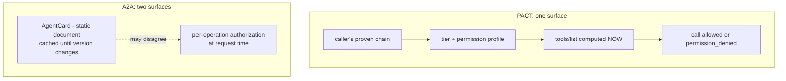

# PACT: Landscape, Comparison & Roadmap

**Companion document to PACT 2.1.3 — informative throughout.**
**Date:** 2026-09-22. Research re-verified as of this date; §12 records what was checked against a
primary source, what rests on a secondary one, and what is carried forward unverified.

This document carries the material that informed the design but does not bind implementers. The
normative protocol is defined solely by `SPEC.md`. **Citation convention: `SPEC §n` (or
`SPEC §§n, m`) refers to the specification; a bare `§n` refers to a section of this document.**
One section states a recommendation — §6.3, on whether to adopt A2A — and it says so in its own
words: it is a recommendation the owner may take or leave, and nothing in `SPEC.md` changes on
its strength.

> **What changed in this revision, and why it needed one.** The previous revision (2026-08-23)
> described itself as a companion to "the PACT 1.0 specification" and stated two design decisions as
> live: **DD1**, "layer on A2A v1.0 as a formal extension," and **DD3**, "identity is a per-person
> keypair expressed as a DID." Neither is true of shipped PACT. Both belonged to the *hardened
> draft* — `archive/hardened-draft-spec.md` — which was superseded by the 1.0 that actually shipped,
> a deliberate simplification that dropped DIDs, the verb registry and the negotiation state machine,
> and by the 2.0 that made the person a certificate authority. Its review disposition documented
> that superseded draft while appearing to document the shipped one. A reader opening this file to
> ask "how does PACT relate to A2A and ANP?" was therefore given the answer the project had already
> stopped acting on. That failure mode — a document whose framing is stale while its prose is
> confident — is the reason §12 exists.

---

## 1. The requirement, as 2.1.3 states it

Each person has a personal assistant agent. Person B's agent contacts Person A's agent over the
internet — to book an appointment or pass a message — and it may do so **only after both humans have
approved each other**. At that point each side holds the other's pinned root certificate; every call
afterwards proves a certificate chain that validates to it.

The requirement as shipped, in the specification's own terms:

- **The identity is the person's; the host serves it.** An identity is the fingerprint of a
  self-signed X.509 root whose private key lives in the person's wallet and signs nothing but
  certificates. A host holds a leaf the root issued for one address (SPEC §2).
- **Your agent is a publicly exposed MCP server.** Sending a message *is* calling the peer's
  `send_message` tool. Everything a contact may do is an MCP tool, visible and callable only per that
  contact's permission settings (SPEC §§6, 8).
- **Contacts are vCards.** Shared over WhatsApp, email, AirDrop or QR. Adding one is always a manual,
  human approval (SPEC §§3, 5).
- **Delivery is direct.** There is no relay and no store-and-forward. A person who must be reachable
  while their own machine is off is hosted, under a leaf they issued and can revoke by issuing the
  next one (SPEC §§7, 9).

And the non-goals, which matter more to this document than the goals, because most of what follows
compares PACT against systems that chose the opposite (`SPEC.md`, front matter):

> no forward secrecy at the envelope layer; edges always see metadata; no anonymity or
> traffic-analysis resistance; **no directory — a bare fingerprint resolves to nothing, every
> relationship starts from a card or an invite**; no store-and-forward; no recovery and no rotation
> of a lost or compromised root; no post-quantum cryptography yet.

---

## 2. The axis: open-network versus closed-network

Almost every difference between PACT and the protocols it is compared with reduces to one choice,
and reading the comparison without it produces a long list of things PACT appears to be missing but
in fact declined.

**ANP and A2A are open-network protocols.** They assume an agent may be found and called by a party
it has never met. Everything else in them follows from that assumption:

| Because a stranger may call | ANP provides | A2A provides |
|---|---|---|
| …it must be able to find you | `/.well-known/agent-descriptions`, a crawlable JSON-LD manifest; search-agent registration and indexing | `AgentCard` at an IANA-registered well-known URI |
| …it must understand what you do | Agent Description Protocol: JSON-LD over schema.org vocabulary | declared `skills` with descriptions and examples |
| …it must know how to authenticate | `did:wba` — a name resolves to keys with no prior contact | `securitySchemes` (OAuth2, API key, mTLS, HTTP) declared on the card |
| …you may share no schema with it | meta-protocol negotiation: the two agents negotiate a protocol in natural language and generate code for it | a fixed generic envelope (Message / Part / Artifact) plus a formal extension mechanism |
| …it may hand you long work | — | the Task lifecycle, streaming, and push-notification webhooks |
| …it may need to pay you | an agent-payment protocol | the AP2 / x402 extension |

**PACT is a closed-network protocol.** No relationship exists without prior human consent on both
sides. The specification is explicit that this is a choice and not an omission: *"no directory — a
bare fingerprint resolves to nothing, every relationship starts from a card or an invite."*

So the ANP machinery above is not a feature list PACT forgot. **It is the machinery a network needs
precisely because it has no consent gate.** PACT replaced all of it with a single human act, and the
trade is real in both directions:

**What closing buys.** Spam resistance by construction rather than by admission control: an
unrecognised caller reaches a guest tier of two tools at ten calls per hour, and the `blocked_or_unknown`
error is, in the spec's words, *"indistinguishable by design."* No directory exists to attack,
subpoena, censor or mine. No semantic self-description is published, so there is no capability
surface for a stranger's model to probe and no injection surface in the description itself. There is
no registry operator to trust or to become.

**What closing gives up.** Cold reach, entirely — you cannot be found, only introduced. Any
machine-readable advertisement of capability to a party you have not met. Any role in an open agent
economy, including discovery-driven commerce. And ecosystem interoperability: the installed base of
A2A-speaking enterprise agents cannot reach a PACT node at all, which SPEC §6 concedes directly —
*"Consumer MCP clients such as hosted chat apps cannot present client certificates."*

Both halves of that trade are load-bearing in §5 and §6. The first half is why most of ANP's
surface should not be copied. The second half is the strongest argument in this document for doing
something about A2A.

---
## 3. Landscape, September 2026

### 3.1 Agent-to-agent protocols

**A2A (Agent2Agent)** — the adoption winner, and the only system in this survey whose installed base
is a strategic fact for PACT. Originally Google, donated to the Linux Foundation (June 2025);
**joined the Agentic AI Foundation on 2026-08-27**, alongside MCP. Maintained by a Technical Steering
Committee with representatives from AWS, Cisco, Google, IBM Research, Microsoft, Salesforce, SAP and
ServiceNow. **Six official SDKs** — Python, JavaScript, Java, C#/.NET, Go and **Rust** (the previous
revision said five; Rust has since shipped). Deployed in Azure AI Foundry, Copilot Studio, Amazon
Bedrock AgentCore and Google Cloud.

Mechanics that matter here:

- **AgentCard** at a well-known URI, declaring `skills`, `securitySchemes` (including a first-class
  mutual-TLS scheme), and supported bindings. Optionally **signed** — ECDSA P-256 / SHA-256, with the
  public key certificate in the card and a base64url signature.
- **Authenticated extended AgentCard**, available when `capabilities.extendedAgentCard` is true,
  fetched with credentials and — normatively — *"Clients retrieving this extended card SHOULD replace
  their cached public Agent Card with the content received from this endpoint for the duration of
  their authenticated session or until the card's version changes."*
- **Task lifecycle**: `SUBMITTED → WORKING → {COMPLETED | FAILED | CANCELED | REJECTED}`, with
  `INPUT_REQUIRED` and `AUTH_REQUIRED` as interrupted states. `contextId` groups related tasks.
- **Eleven binding-independent operations** — `SendMessage`, `SendStreamingMessage`, `GetTask`,
  `ListTasks`, `CancelTask`, `SubscribeToTask`, four push-notification-config operations, and
  `GetExtendedAgentCard` — mapped onto three bindings: JSON-RPC 2.0, gRPC, and HTTP+JSON/REST.
- **Three update mechanisms**: polling, SSE streaming, and push-notification webhooks (POST to a
  client-registered URL, with bearer-token or mTLS auth on the callback).
- **A formal extension mechanism.** Extensions are URIs declared in the card's capabilities and
  activated by clients through the `A2A-Extensions` header; `required: true` is supported and
  unsupported required extensions fail with `ExtensionSupportRequiredError`. Extensions may be
  data-only, profile-based, **method extensions introducing entirely new RPC methods**, or
  **state-machine extensions adding new task states or transitions**. They may not modify core data
  structure definitions, add enum values to protocol types, or change type validations; custom
  attributes go in the `metadata` map. Official extensions live under the
  `https://a2a-protocol.org/extensions/` prefix with a tiered governance lifecycle.

What A2A does **not** have, and this list is the reason PACT is not simply an A2A profile: no
pairing or consent handshake; no key-exchange primitive (an mTLS scheme can be *declared*, but its
provisioning is out of scope); no end-to-end encryption — TLS is hop-by-hop, so any terminating
gateway reads plaintext; no NAT-traversal or peer-to-peer story; **no per-caller capability
filtering** — the AgentCard is a static document and the specification defines no mechanism for
returning different skill lists to different authenticated callers; and **no revocation protocol** —
authorization is enforced per operation at request time, but no lifecycle or revocation semantics are
specified.

**ANP (Agent Network Protocol)** — philosophically the closest prior art to PACT's ambitions, and
the furthest from PACT's method. Three layers: an identity-and-encrypted-communication layer, a
meta-protocol layer, and an application protocol layer.

- **Identity: `did:wba`**, a DID method extending `did:web` for agents. `did:wba:example.com` resolves
  to `https://example.com/.well-known/did.json`; path-type DIDs encode segments with colons that
  become URL path separators, and a host's port is percent-encoded. The default `e1_` profile binds
  the DID to its key: the document must carry a `DataIntegrityProof` with an Ed25519 signature, and
  the RFC 7638 thumbprint must equal the fingerprint segment in the DID path.
- **Authentication** is RFC 9421 HTTP Message Signatures: `Signature-Input` (with `keyid` as a full
  DID URL, `created`, `expires`, optional `nonce`), `Signature`, and RFC 9530 `Content-Digest` when
  there is a body. The server resolves the DID document, verifies, and returns a token via
  `Authentication-Info` for subsequent requests — identity, authorization and data exchange in one
  round trip.
- **Key rotation is identity rotation.** Because the fingerprint is *in* the path, "when a binding key
  changes, the path-type DID must be changed to the new DID," and an upper-level name service is
  expected to keep the human-readable reference stable. This is the exact inverse of PACT, where the
  root never rotates and the leaf beneath it does.
- **Privacy by multi-DID**: a master DID for stable relationships plus scenario-specific sub-DIDs with
  separate key pairs, deactivated and replaced periodically. Compartmentalisation rather than
  unlinkability.
- **Discovery**: active, by fetching `/.well-known/agent-descriptions` (a JSON-LD CollectionPage
  manifest of Agent Description document URLs, paginated); and passive, by registering an AD URL with
  a search-service agent that crawls and indexes it the way a search engine indexes pages.
- **Agent Description Protocol**: JSON-LD self-description over schema.org vocabulary plus ANP terms —
  metadata, capabilities, interface specifications, security credentials, contact details.
- **Meta-protocol negotiation**: agent A sends natural-language requirements and candidate protocols,
  B evaluates with an LLM, they converge or terminate, both generate and deploy protocol-handling
  code, and the outcome may be cached and reused.
- **Authorization** distinguishes low-risk operations the agent may authorise itself from high-risk
  ones requiring explicit human verification through a `humanAuthorization` mechanism.

**ANP's messaging suite (1.1)** is where the previous revision's most consequential claim lived, and
it holds up. The suite splits into nine profiles — **P1** Core Binding (JSON-RPC 2.0), **P2** Identity
and Discovery, **P3** Direct Messaging Base, **P4** Group Messaging Base, **P5** Direct End-to-End
Encryption, **P6** Group End-to-End Encryption, **P7** Attachments and Object Transfer, **P8**
Federation and Cross-Domain, **P9** Message Mentions.

- **P5** establishes sessions with an **"X3DH-like"** mechanism over `keyAgreement` keys (X25519) taken
  from DID documents, with a **Prekey Bundle "used for asynchronous offline link building,"** and
  protects messages with a **"Double Ratchet-like"** construction giving *"per-message key rolling,
  out-of-order tolerance and replay protection."* `did:wba` authentication keys are the identity
  anchor.
- **P6** takes **MLS** directly as the group key state machine, with `did:wba` as identity anchor, MLS
  `PrivateMessage` as the message format, `KeyPackage` / `Commit` / `Welcome` / `External Commit` for
  membership, and group state bound cryptographically to `group_did`, `group_state_version` and
  `policy_hash`.

**Every one of P1–P9 is marked Draft**, and ANP-06, the meta-protocol specification, explicitly
disclaims defining any of it: it *"does not define … a new DID method or a new identity
authentication mechanism; a new end-to-end encryption algorithm."* The honest reading is that ANP has
designed forward secrecy and group security where PACT has deferred both — as a draft, against
community implementations, with the maturity caveat below still standing. **Verdict unchanged from
the previous revision: mine it for design patterns; do not take it as a dependency.** §5.2 records
what is worth mining.

**MCP (Model Context Protocol)** — agent↔tool, not agent↔agent, and institutionally converged with
A2A under the AAIF. Current specification remains **2026-07-28**. JSON-RPC 2.0, a stateless
self-contained request model with per-request capability negotiation. Servers offer Resources,
Prompts and Tools; clients offer **Elicitation** (server-initiated requests for user input).
**Tasks are an extension, not core** — "asynchronous execution of long-running operations, with
polling, mid-flight input, and durable handles" — as are **MCP Apps** (inline interactive UI) and
**Skills over MCP** (structured agent-workflow instructions), all opt-in and negotiated at
initialization. The specification states security principles (user consent, data privacy, tool
safety) but notes it "cannot enforce these security principles at the protocol level." It says
nothing about mTLS or client certificates; mainstream hosted MCP clients cannot present them, so
mTLS on a public MCP endpoint works only between parties who control both ends. In PACT, MCP is both
the inward private tool layer (calendar, mail) and the outward contact-facing surface — the second of
which is PACT's own choice, not something MCP specifies.

**AGNTCY (Cisco → Linux Foundation)** — "Internet of Agents" infrastructure, explicitly a carrier for
A2A and MCP payloads rather than a rival to them. **SLIM** (Secure Low-Latency Interactive Messaging)
is now at IETF as `draft-mpsb-agntcy-slim-01`, with a companion survey draft
`draft-mpsb-agntcy-messaging-01`: gRPC over **HTTP/2 and HTTP/3**, a data plane routing on metadata
only, a session layer with reliable delivery and **MLS-based end-to-end encryption** with secure group
management, and a control plane orchestrating routing nodes. Plus OASF agent schemas, a federated
Agent Directory Service, SPIFFE/SPIRE identity federation and Agent Badges as W3C Verifiable
Credentials. Enterprise-shaped and with no consumer pairing story — but SLIM remains the most
production-grade design in the field for carrying ciphertext through relays that cannot read it, and
its choice of MLS independently corroborates ANP P6's.

**DIDComm v2** — DIF Approved status; the closest complete blueprint for a security layer built on
pairwise DIDs, out-of-band invitations, sender-authenticated encryption (ECDH-1PU authcrypt), DID
rotation, and mediators with store-and-forward pickup. The previous revision called its ecosystem
low-activity; that needs softening. A 2026 adoption survey drew responses from deployments across
digital identity, government services, enterprise credentialing, financial services, AI agents and
cross-organizational data exchange, and **DIF is exploring IETF as the venue for a v3** with a session
construct, better binary support and leaner messages. Implementations remain at uneven maturity and
conformance. PACT's position is unchanged: adopt the shapes on modern primitives (HPKE, JOSE) rather
than depend on DIDComm stacks.

**Dead or niche, unchanged:** IBM ACP merged into A2A (August 2025) — do not build on it. NEAR AITP
(crypto-centric, negligible traction). Agora (academic meta-protocol negotiation; influential idea
only — and note that ANP has now shipped a draft of essentially that idea). Coral Protocol
(MCP-native thread runtime plus a token; centralized, niche). Eclipse LMOS (Web-of-Things, DID
identity, work in progress). **ANEX** still deserves its mention as direct prior art for the verb
design — a draft spec for exactly this vision, personal-agent handshake and scheduling as the
flagship use case — and it is now definitively dormant: **3 stars, last commit 2024-12-10**, no code
pushed in twenty-one months.

### 3.2 Identity and key-exchange building blocks

**mTLS with per-peer trust** works in two shapes: a small private CA per person (friendship = exchange
of CA certificates; leaves rotate freely) or pinned self-signed keys with a key-continuity rule.
PACT 2.0 chose the first and expressed it in the certificates every TLS stack already validates: the
person *is* the CA, the host holds a leaf. The fundamental limit is unchanged — channel-level mTLS
dies at any TLS-terminating intermediary — and it is exactly why SPEC §13's sealed envelope exists.
**IETF WIMSE** reached the same conclusion for workloads and is standardising application-level proof
tokens: `draft-ietf-wimse-wpt-01` defines a Workload Proof Token, a signed JWT binding a workload's
authentication to a specific HTTP request, alongside `draft-ietf-wimse-arch-07` and workload-credential
drafts. The architecture document is expected to advance toward RFC across 2026–2027.

**SPIFFE/SPIRE federation** remains architecturally a friending system for infrastructure: a trust
domain per party, trust-bundle exchange as the accept ceremony, auto-refreshed bundles, short-lived
auto-rotated credentials, and unfriending by dropping the federation entry. Too heavy to run per
consumer; the model — trust root per party, consent-time exchange, short-lived operational
credentials — is precisely what PACT's root/leaf split implements at human scale.

**Signal-family machinery.** Signal shipped **Automatic Key Verification** in August 2026: key
transparency over a cryptographically verifiable log of identifier-to-key changes, with **Cloudflare
and Trail of Bits as independent auditors**, and auditor-visible data cryptographically protected so
auditors never see phone numbers or usernames in plaintext. Users verify from a contact's safety
number screen and see "Encryption verified." Its own stated limits are instructive for PACT: it
requires the other party's phone number, does not cover username-only connections, and *"does not
confirm the real-world identity of the person controlling an account."* WhatsApp's open-source `akd`
and Apple's Contact Key Verification shipped the same construction earlier. Matrix contributed
cross-signing — verify the human once, devices inherit — implemented through master, self-signing and
user-signing keys. **PACT deliberately has none of this**, because it has no directory for a
transparency log to make honest: the pin *is* the verification, established once by a human act.
Key transparency is the answer to "how do I run a key directory nobody has to trust"; PACT's answer
is to not run one.

**Tailnet Lock** is the best shipped consumer precedent for the trust shape PACT uses, and is now
generally available on Tailscale's Personal and Enterprise plans: with it enabled, nodes refuse any
node key not signed by a key held on a machine the tailnet already trusts — verifiable chains, TOFU,
and no central trust after setup. Tailscale node sharing remains the best shipped "friend request" UX
precedent.

**Privacy Pass** is now **RFC 9576** (architecture), deployed by Cloudflare across Turnstile, Privacy
Proxy and Privacy Gateway, and by hCaptcha and Kagi. It remains the right primitive if PACT ever
needs anonymous admission tokens on a public-facing route — which, today, it does not have.

**OAuth 2.1 / GNAP / vendor agent-identity work** model user→client authorization or agent→website
identification, not symmetric peer trust. Relevant to PACT only on the optional public façade
discussed in §6.

### 3.3 Products: who does assistant-to-assistant today?

**The previous revision's headline claim has been falsified, and the correction matters.** It read:
"no shipping product does true assistant-to-assistant negotiation between two different people's
agents as its core loop." That is no longer true.

**Blockit** (founded by a former Sequoia partner; **$5M seed led by Sequoia, January 2026**) is built
around exactly that loop: when both parties are Blockit users, *the two agents access both calendars
and negotiate a time directly, with no human in the middle*. The company reports **100,000+ meetings
coordinated with zero humans in the loop**. Users invoke it by CC'ing it on email or messaging it in
Slack; it reads the thread, proposes times, negotiates with the other side, handles time zones and
required-versus-optional attendees, sends the invite, and reschedules on its own.

The replacement claim is narrower and stronger: **the loop ships — but only inside one vendor's
walls.** Blockit is single-platform (both parties must be Blockit users), closed, hosted, with no
consent gate, no end-to-end encryption, no self-hosting and no cross-vendor path. That is precisely
the thing PACT is built to un-wall, and it is now demonstrated demand rather than a hypothesis. §9
and §10 treat it as a strategic fact rather than a table row.

| Product / project | What it actually does | Agents of two people talk? | Open / self-host | Status 2026-09 |
|---|---|---|---|---|
| **Blockit** | AI calendar network; two users' agents negotiate a time directly | **Yes — its core loop**, same-platform only | No | **Alive; $5M seed (Sequoia, Jan 2026); 100k+ meetings** |
| Cal.com | Open scheduling infra; **v6.3 shipped Cal.com Agents (Mar 2026)** — scheduling via Slack, Telegram, CLI | No — agent→booking API, no cross-user negotiation | Yes (AGPL) | Alive; best OSS substrate for one side |
| Skej / Howie | Email-CC scheduling assistant personas | No; two on one thread negotiate emergently, unauthenticated | No | Alive |
| Reclaim.ai | Calendar optimization, booking links | No | No | Alive; absorbed Clockwise (sunset Mar 2026) |
| Motion | AI calendar + task/project optimization | No | No | Alive |
| Clara Labs | Human-in-loop email scheduling | No — emails the human | No | Alive, niche |
| Ohai.ai | SMS household assistant | Cross-household sync marketed, unverified | No | Alive |
| x.ai (Amy) | Email-CC scheduling assistant | Same-platform shortcut claimed (unverified) | No | Dead (2021) |
| Microsoft Copilot Studio | First-party A2A support for org agents | Enterprise maker-configured, not personal | No | Alive |
| Amazon Bedrock AgentCore | Hosts agents; A2A support | Enterprise, not personal | No | Alive |
| Google Gemini scheduling | Inserts your slots into Gmail; human clicks | No recipient-side agent | No | Alive |
| Lindy / Zapier Agents / Dust | Multi-agent within one account or org | No cross-user | No | Alive |
| Personal AI | Humans DM your persona; your AI replies | Human→your-AI, one platform | No | Alive (enterprise pivot) |
| Amazon Alexa+ | Orchestrates business partner agents | Consumer→business, proprietary | No | Alive |
| **OpenClaw** | Leading self-hosted personal agent; **2.0 (v2026.8.1), Aug 2026**; ~145k+ stars | Agent-to-agent within one instance; no cross-instance identity or protocol | Yes (MIT) | Very alive |
| Moltbook | Social network of OpenClaw agents; API-key auth | Broadcast/social, not tasked negotiation | Partially | **Acquired by Meta (Mar 2026), into Meta Superintelligence Labs** |
| MindRoom | Agents as first-class Matrix users; bridges to Slack, Telegram, Discord, WhatsApp, IRC, email | Transport and federation solved; no negotiation semantics, no consent model | Yes | **Alive and shipping (PyPI 2026.9.x)** |
| AgentMail | Persistent inbox per agent; agent↔agent over email | Yes, but unstructured, no E2EE, no consent model | No | Alive (**$6M seed, General Catalyst + YC, Mar 2026**) |
| NANDA (MIT) | Index ("DNS for agents"); **AgentFacts signed as W3C VCs v2**, short-lived (<5 min) credentials, revocation via VC Status Lists; hosted at 15 universities | Discovery/trust layer only | Yes | Academic momentum |
| ERC-8004 | On-chain identity + reputation + validation registries; explicitly composable with A2A | Identity layer only, crypto-adjacent | Yes | **Live on Ethereum mainnet since Jan 2026; also Avalanche, BNB Chain** |
| ANEX | Draft spec: personal-agent handshake + scheduling | On paper, exactly this | Yes | **Dormant — 3 stars, last commit 2024-12-10** |

The OpenClaw ecosystem remains the clearest proof of *supply*: a very large installed base of
self-hosted personal agents with no native cross-instance identity or protocol, improvising with API
keys. Blockit is now the clearest proof of *demand*. PACT sits between them and is the only thing in
this table that is simultaneously open, self-hostable, consent-gated and end-to-end encrypted.

### 3.4 Deployment infrastructure

**Gateways.** **agentgateway** (Rust; originally Solo.io, **now a Linux Foundation project**, with
contributors from AWS, Cisco, Huawei, IBM, Microsoft, Red Hat, Shell and Zayo) is an AI-native proxy
routing MCP, A2A and LLM traffic. **IBM ContextForge** (`mcp-context-forge`) is a gateway, registry
and proxy that federates MCP, A2A and REST/gRPC behind one endpoint with centralized discovery,
guardrails and plugins. Both are the closest prior art to a hosted PACT provider's data plane; PACT
needs neither today, because it has no relay role.

**Tunnels — re-verified, and one correction of emphasis.** The specification's SPEC §10 divides these into
edges that pass TLS through (true end-to-end mTLS survives) and edges that terminate it (identity and
confidentiality must ride the sealed envelope instead). That division holds, with one qualification
worth recording because it is easy to misconfigure:

- **Tailscale Funnel** preserves end-to-end mTLS **only in raw TCP mode**. With `--tcp`, Funnel
  *"proxies the TCP connection by verifying a valid SNI name in the TLS ClientHello, then proxying the
  encrypted TCP connections to your Tailscale node, without doing any TLS termination itself"* — so
  client certificates do reach your server, and SPEC §10's claim is correct. In its **default HTTPS mode**
  (and with `--tls-terminated-tcp`), *"the Tailscale server running on your device … terminates the
  TLS connection and passes the decrypted request to the local service"* — TLS ends at `tailscaled`
  on your own machine, and the client certificate does not reach the service behind it. Tailscale's
  relays do not decrypt in either mode. Funnel listens only on ports 443, 8443 and 10000.
- **ngrok** terminates at the edge when a Terminate-TLS traffic-policy action is configured; it can
  perform mTLS itself at the edge (`mutual_tls_certificate_authorities`) and forward verified client
  certificate details to the upstream **in request headers** — which is edge-verified identity, not
  end-to-end. Unterminated TLS endpoints remain the option that preserves end-to-end mTLS.
- **Cloudflare Tunnel** terminates TLS at the edge and strips client certificates; behind it, PACT
  requires `X-PACT-SEAL: required` and the edge sees ciphertext plus metadata only. Note also that
  Cloudflare's Authenticated Origin Pulls are *not compatible* with Tunnel-connected origins at all,
  since Tunnel is outbound-only and offers no inbound listener for Cloudflare to present a
  certificate to.
- **Pangolin** (Fossorial; AGPL-3.0, WireGuard-based, self-hosted on your own VPS) remains the leading
  self-hosted identity-aware ingress and the natural shape for a self-hosted PACT ingress. **frp** and
  **rathole** remain the minimal DIY relays.

**True P2P.** **Iroh reached 1.0 on 2026-06-15** after four years and 65 pre-releases: endpoints are
ed25519 public keys used directly as the QUIC handshake identity ("dial keys, not IPs"), a direct
QUIC/UDP hole punch succeeds roughly 90% of the time with fallback to stateless encrypted relays that
cannot decrypt, wire-protocol stability is guaranteed, and official bindings exist for Python,
Node.js, Swift and Kotlin. Its public relays report over 200 million endpoints created in 30 days.
PACT does not use it — 2.0 removed the relay role and delivers directly over HTTPS — but Iroh remains
the reference answer if a future profile ever needs NAT traversal without a hosted address.

**Offline delivery.** DIDComm mediator + Message Pickup 3.0 remains the purpose-built pattern, with
NATS JetStream or MQTT persistent sessions as pragmatic equivalents. **PACT 2.0 deliberately has
none of it** (SPEC §9): there is no store-and-forward gateway "that would see every sender, recipient and
timestamp for its trouble." Being hosted is the answer instead.

---
## 4. Comparison

Legend: **✅** has it · **🟡** partial · **❌** missing · **⛔** **non-goal by decision** — declined in
`SPEC.md` with a stated rationale, not absent by oversight. The distinction is the whole point of §2:
scoring PACT ❌ on a directory would read as a deficiency when it is the premise.

Rows are re-derived from what PACT 2.1.3 actually commits to, plus the three capabilities this
document was written to assess (open reach, task lifecycle, forward secrecy). The previous revision
had no PACT column at all and scored everyone against hardened-draft requirements.

| Requirement | **PACT 2.1.3** | A2A v1.0 | MCP 2026-07 | ANP 1.1 | DIDComm v2 | AGNTCY/SLIM | Matrix | Iroh | Blockit | OpenClaw eco |
|---|---|---|---|---|---|---|---|---|---|---|
| Person-owned identity, host-independent | ✅ root CA in wallet, leaf at host (SPEC §§2, 9) | 🟡 signed cards | ❌ | ✅ DID | ✅ DID | 🟡 VC badges | ✅ MXID + cross-sign | 🟡 node key | ❌ vendor account | ❌ API keys |
| Consent gate before any contact | ✅ mutual human approval, always (SPEC §5) | ❌ | ❌ | ❌ | 🟡 OOB invitation | ❌ | 🟡 room invite | ❌ | ❌ | ❌ |
| Mutual key exchange + pinning | ✅ pin the root, learn each leaf (SPEC §14.3) | 🟡 mTLS declarable, unprovisioned | ❌ | ✅ | ✅ | ✅ MLS | ✅ | ✅ key = address | ❌ | ❌ |
| Per-caller capability surface | ✅ `tools/list` computed per contact (SPEC §§6, 8) | ❌ static card, no filtering | 🟡 per-session | ❌ | ❌ | ❌ | 🟡 room power levels | n/a | ❌ | ❌ |
| Instant revocation | ✅ delete contact; tool vanishes (SPEC §§8, 11) | ❌ unspecified | ❌ | 🟡 deactivate sub-DID | ✅ rotate/revoke | ✅ MLS remove | ✅ | n/a | 🟡 vendor | ❌ |
| E2EE past a terminating edge | ✅ sealed envelope, HPKE (SPEC §13) | ❌ hop-by-hop TLS | ❌ | ✅ P5 | ✅ authcrypt | ✅ MLS | ✅ | ✅ | ❌ | ❌ |
| Forward secrecy | ❌ **deferred by decision** (SPEC §13.5) | ❌ | ❌ | ✅ P5 ratchet (draft) | ❌ | ✅ MLS | ✅ | ✅ QUIC | ❌ | ❌ |
| Group / multi-party security | ❌ parallel 1:1 threads (SPEC §7) | 🟡 contextId grouping | ❌ | ✅ P6 MLS (draft) | 🟡 | ✅ MLS | ✅ | n/a | 🟡 n-way | ❌ |
| Long-running task handle | ❌ `queued_for_human`, no id | ✅ Task lifecycle | 🟡 Tasks extension | 🟡 | ❌ | 🟡 | ❌ | n/a | 🟡 internal | ❌ |
| Streaming / push updates | ❌ | ✅ SSE + webhooks | 🟡 progress | 🟡 | ❌ | ✅ | ✅ | ✅ | n/a | ❌ |
| Structured artifacts / parts | 🟡 text + media (SPEC §6.2) | ✅ Part / Artifact | ✅ content types | ✅ | ✅ | ✅ | ✅ | n/a | n/a | 🟡 |
| Open discovery of strangers | ⛔ **"no directory"** (front matter) | ✅ well-known card | 🟡 registries | ✅ well-known + crawl | 🟡 | ✅ directory | ✅ | ❌ | ❌ vendor-internal | ❌ |
| Machine-readable capability advertising | ⛔ guest tier is two tools (SPEC §6.1) | ✅ skills | ✅ `tools/list` | ✅ JSON-LD ADP | ❌ | ✅ OASF | ❌ | n/a | ❌ | ❌ |
| Protocol negotiation with a stranger | ⛔ conversation in a thread (SPEC §7) | 🟡 extensions | ❌ | ✅ meta-protocol | ❌ | ❌ | ❌ | n/a | ❌ | ❌ |
| Store-and-forward when offline | ⛔ **no relay role** (SPEC §9) | 🟡 push hooks | 🟡 tasks | 🟡 | ✅ pickup | 🟡 | ✅ | 🟡 | ✅ hosted | ❌ |
| Directory key transparency | ⛔ no directory to make honest | ❌ | ❌ | ❌ | ❌ | ❌ | ❌ | n/a | ❌ | ❌ |
| Anonymity / traffic analysis resistance | ⛔ stated non-goal (front matter) | ❌ | ❌ | 🟡 sub-DIDs | 🟡 pairwise | 🟡 metadata routing | ❌ | 🟡 | ❌ | ❌ |
| Post-quantum | ⛔ **deferred, path recorded** (SPEC §13.5) | ❌ | ❌ | ❌ | ❌ | 🟡 | ❌ | 🟡 | ❌ | ❌ |
| Self-host behind NAT | ✅ tunnels + sealed envelope (SPEC §10) | 🟡 BYO | 🟡 BYO | 🟡 | ✅ | 🟡 | ✅ | ✅ | ❌ | ✅ |
| Provider-hostable, and leaveable | ✅ leaf + archive + move (SPEC §9) | ✅ | ✅ | 🟡 | 🟡 | ✅ | ✅ | ✅ | 🟡 no exit | 🟡 |
| Ecosystem adoption | ❌ **one implementation** | ✅ strong | ✅ strong | 🟡 W3C CG, drafts | 🟡 DIF | 🟡 LF/IETF | ✅ | ✅ | 🟡 funded | ✅ large |

**What the table says.** PACT owns four rows outright that nothing else in the survey holds together
— person-owned host-independent identity, a consent gate, a per-caller capability surface, and
instant revocation — and it is the only column combining them with E2EE past a terminating edge. It
is last in the table on the row that decides whether any of that reaches anyone: **ecosystem
adoption, where it has exactly one implementation.** Eight rows are ⛔ rather than ❌, and confusing
those two categories is the single most common way to misread this protocol.

---

## 5. Where PACT is lacking

Two lists. They have opposite answers, and separating them is the main analytical claim of this
document.

### 5.1 Lacking by thesis — adding it would delete the premise

Each of these is something ANP or A2A has and PACT does not, where the absence *is* the design. They
are listed so that nobody re-proposes them as gaps.

| Absent | Present in | Why adding it breaks PACT |
|---|---|---|
| A crawlable index of who exists | ANP `/.well-known/agent-descriptions`; A2A well-known card; NANDA | The spam model *is* the absence of one. "A bare fingerprint resolves to nothing." A published index means unsolicited reach, and the guest tier's two tools become the whole front door |
| A stranger-callable capability surface | A2A `skills`; ANP ADP | SPEC §6.1 gives an unpinned chain the guest tier only, and SPEC §12 makes `blocked_or_unknown` "indistinguishable by design." Advertising capability to strangers is an oracle about who you are and what you run |
| Semantic self-description in JSON-LD | ANP ADP | Same as above, plus a new untrusted-content surface: a description a stranger's model reads is a description an attacker writes |
| Natural-language protocol negotiation | ANP meta-protocol | SPEC §7 already negotiates — *as conversation inside a thread*, "no negotiation state machine on the wire." That works because both sides already consented. Between strangers it would need the whole apparatus PACT removed |
| Reputation, ranking, search | ERC-8004, NANDA | There is no population to rank. Trust in PACT is a human act with a cryptographic record, not a score |

The right way to read ANP, therefore, is not as a superset of PACT. **It is what PACT would have to
become if it removed the consent gate** — and nearly all of ANP's complexity is the cost of that
removal.

### 5.2 Lacking incidentally — extendable today, thesis intact

These are real gaps. None of them requires a directory, a stranger, or an open network; every one is
about two parties who have *already* consented.

**1. No task handle. The clearest gap, and it is visible in the code.**
`send_message` returns `status: delivered | queued_for_human` (SPEC §6.2). In the reference node that is
literally all there is — `internal/messaging/service.go:122` declares
`Status string // delivered | queued_for_human`. A request parked for a human has **no id, no state,
no way to poll, and no way to cancel**. `msg_id` provides idempotency — a replay is acknowledged, not
re-executed — which is replay protection, not progress tracking. A sender whose agent restarts, or
whose owner moves host, has no protocol-level way to ask "what happened to the thing I asked for?"
A2A's Task object with `INPUT_REQUIRED` is precisely this, and `queued_for_human` is precisely
`INPUT_REQUIRED` without a handle.

**2. No streaming and no push.** A2A has `SendStreamingMessage`, `SubscribeToTask` and
push-notification webhooks with their own auth. SPEC §7 retries with backoff until `expires`
(default 24 h) and then reports failure to the sender's human. For a long negotiation or a slow tool,
the peer learns nothing until it completes.

**3. No structured artifacts.** `text` capped at 16 KiB plus `send_media` (SPEC §6.2), against A2A's
Part (text / file / data) and Artifact. Two consented agents exchanging a structured proposal today
must encode it in prose or a media blob. Note that SPEC §6.2 already anticipates the answer — *"anything
else a person wants to expose to contacts … is just another MCP tool"* — so this is additive work,
not architectural.

**4. No forward secrecy — and this is where ANP is genuinely ahead.** SPEC §13.5 is explicit: HPKE Base
mode to a long-lived leaf key means *"a later compromise of a leaf key decrypts ciphertext recorded
while it was current,"* bounded only by the 300-second skew window and the leaf's ≤398-day life.
**ANP 1.1 P5 designs X3DH-like session establishment with prekey bundles and Double-Ratchet-like
per-message key rolling.** Critically, **a ratchet between two mutually pinned contacts needs no
directory, no DID and no open network** — it is the one item on ANP's list that is entirely
independent of the open-network thesis, and therefore the one most worth mining. The counterweight
is maturity: P5 is a Draft profile against community implementations, while PACT's sealing layer is
shipped, vectored in Appendix B and proven by two independent ports.

**5. No group security.** SPEC §7 is honest that multi-party is "parallel per-contact threads sharing a
`topic` string — still like a CC line, no group crypto." **ANP P6 and AGNTCY/SLIM independently both
chose MLS (RFC 9420)**, and Matrix is heading the same way. Two unrelated designs converging on the
same answer is a strong signal about what the eventual answer is, if PACT ever needs real groups.

**6. Metadata linkability — an admitted weakness with an unexplored remedy.** SPEC §13.5 concedes a
carrier *"can tie every message to one recipient key for that leaf's life."* ANP's multi-DID strategy
— a master DID plus scenario sub-DIDs with distinct keys — targets exactly this. PACT's structural
analogue would be a **leaf per contact** rather than a leaf per identity, which would unlink
correlation across contacts at the cost of more certificates. It is worth naming that this collides
with a current rule: SPEC §9 states the wallet *"issues one live leaf per identity at a time … and MUST
NOT issue a second while one is live except as its replacement,"* because contacts keep one pin and
the newest leaf wins. Per-contact leaves would need SPEC §14.3's newest-leaf-wins rule scoped per contact.
That is a real design question, not a small one — recorded here, not answered.

**7. Payments.** SPEC §6.2's "integrations are tools" already covers the mechanism. AP2 is at v0.2 with
its **A2A x402 extension described as production-ready** and named deployments (PayPal with Google
Cloud's Conversational Commerce Agent; a Mastercard Agent Pay pilot), and x402 itself has Stripe and
Cloudflare support. If PACT ever wants a payment request between contacts, it is an
`integration.<name>` tool behind the SPEC §8 switchboard, and the wire format can be borrowed rather than
invented.

---
## 6. The A2A question

The question this section answers, in the form it was asked: *if we keep PACT's network layer and
swap its agent layer for A2A, what value does that provide?*

### 6.1 Does the seam exist?

The proposal assumes PACT has two separable layers — a network layer (X.509 identity, mTLS, sealed
envelopes, the consent gate) and an agent layer (MCP tools, messages, threads) — with a clean seam
between them. **It does not, and the reason is the most important structural fact about this
protocol.**

SPEC §6: *"Authorization is the proven chain, resolved to a pinned root … that identity selects
a tier and a permission profile, and MCP `tools/list` returns only what that caller may use."*
SPEC §8: *"flip a switch → the tool disappears from that caller's `tools/list` and calls return
`permission_denied`."*

The permission switchboard is not a layer sitting above the agent layer. **It is the agent layer's
surface.** `tools/list`, computed per caller at call time, is simultaneously the capability
advertisement, the enforcement point, and the owner-facing UI. Revocation is not a message; it is the
absence of a tool on the next call.

A2A's counterpart is the AgentCard, and its properties are the opposite ones. From the specification:
it *"does not define per-caller skill filtering or dynamic capability exposure. The Agent Card is a
static document."* The authenticated extended card *"MAY return different details based on client
authentication level"* but there is *"no normative mechanism for filtering skills by caller
identity, role, or permission level"* — and it is fetched once and cached, *"for the duration of
their authenticated session or until the card's version changes."* On revocation the spec has *"no
normative language addressing revocation of client access, token invalidation, or real-time
permission revocation."*

A2A does enforce authorization per operation — *"Servers MUST return an authorization error when the
authenticated client lacks required permissions"* — so a revoked caller is still refused. What is
lost is different and specific: **the caller's view of what it may do, and the owner's single
switchboard that produces it.**

There is a further consideration that decides the matter. A2A extensions **can** add new RPC methods
and new task states, so a PACT-over-A2A extension is buildable — that was the old DD1 plan. But an
extension declared `required: true` at the contact tier means **every PACT peer needs an A2A stack
that implements a non-standard extension**. A vanilla Copilot Studio or Bedrock agent still cannot
talk to a PACT contact, because it does not implement the extension that carries the consent gate,
the sealed envelope and the switchboard.

**So the interop benefit accrues at the guest tier, where PACT carries almost no traffic, while the
cost is paid at the contact tier, where it carries all of it.** That asymmetry is the finding.

### 6.2 Three options, costed

**Option A — an A2A façade beside the MCP surface, guest tier only.**
A separate A2A endpoint serving a public AgentCard with a small skill set: "request to become a
contact" (an A2A-native `request_contact`), and optionally a slot-free meeting enquiry that lands in
the owner's queue as a contact request. Authentication by A2A's own declared schemes. The contact
tier is untouched: still MCP, still mTLS, still sealed envelopes, still the switchboard.

*Cost:* a new public surface with its own authentication and its own abuse surface, and node work to
build it. **No change to SPEC §§2, 6, 8, 13 or 14. No re-pin of the Wasm core, no new Appendix B
vectors, no `PROOFS.md` churn, no change to either identity port.** SPEC §6 already blesses exactly this
shape: *"A separate OAuth-protected façade for third-party assistants can be added later without
touching this protocol."*

*Buys:* reachability from the installed base — Copilot Studio, Bedrock AgentCore, Azure AI Foundry,
and anything else speaking A2A. A stranger's enterprise agent can ask, in a protocol it already
speaks, to become your contact. **This is the cold-start path PACT currently lacks entirely**, and
§2 records that it lacks it by construction.

*Risk, stated plainly:* it makes a node discoverable and pokeable in a way it is not today. At
present a stranger needs your card or an invite URL to know you exist at all. A façade trades a
measure of that for reach, and the guest tier's rate limits and two-tool surface become
load-bearing in a way they have never been tested for. That is the honest price of Option A, and it
is an owner's judgement, not a technical necessity.

**Option B — A2A as the contact-tier wire, PACT as a required extension (the old DD1).**

*Cost:* SPEC §§6, 7 and SPEC §8 rewritten; the SPEC §12 conformance checklist re-derived; `PROOFS.md` re-derived;
SPEC §13.2's inner payload re-specified — it currently pins `method` to `tools/call` or `tools/list` —
and therefore Appendix B's envelope vectors re-cut and the Wasm core re-pinned; the node's harness
and the cloud's conformance battery rewritten against a new surface. This is a release, not a
mapping layer.

*Buys:* the Task lifecycle, streaming, push and artifacts, for free and maintained by someone else.
But **only between PACT peers**, because the extension is required — so the interop that motivates
the whole exercise is not, in fact, bought.

*Verdict:* it pays the highest price available for the benefit that matters least.

**Option C — adopt A2A's semantics without its wire.**
Take the object model into PACT natively: a `task_id` on results that today say only
`queued_for_human`, a small task state machine borrowed from A2A's (`working`, `input_required`,
`completed`, `failed`, `canceled`), and `get_task` / `cancel_task` as new tools behind the SPEC §8
switchboard. Optionally borrow Part/Artifact shape for structured replies.

*Cost:* additive only — new tools in SPEC §6.2, task states in SPEC §7, new errors in SPEC §12. No envelope change,
no certificate change, no re-pin. Moderate, and entirely inside PACT's existing extension story
("integrations are tools").

*Buys:* it closes §5.2 items 1–3, which are the real functional gaps, using a model the A2A Technical
Steering Committee has already stress-tested rather than one invented here. And it composes: if
Option A is built later, the façade maps onto it one-to-one, because the semantics are already A2A's.

*Does not buy:* interop. Nothing outside PACT can speak to it.

### 6.3 Recommendation

**This subsection is a recommendation, not a decision.** It is informative like the rest of this
document; nothing in `SPEC.md` changes on its strength, and the owner may take it or leave it. If it
is ever adopted, it becomes a plan item under `pact-gateway/docs/release/` and is argued there.

**Do C, then A. Refuse B.**

- **C first**, because it closes the gaps that are actually costing something today — a request
  parked for a human with no handle, no cancel and no way to ask what became of it — and it costs an
  additive spec change with no re-pin and no certificate work.
- **A second**, because reachability is the strategic gap and nothing else on the list addresses it.
  §2's accounting is that PACT gave up cold reach entirely; a guest-tier façade buys some of it back
  at a price paid outside the security-critical surface.
- **Refuse B.** It spends the per-caller switchboard — which §4's matrix shows is one of only four
  rows PACT owns outright, and which the gap analysis of every prior revision of this document called
  PACT's genuinely novel contribution — to buy interop at a tier that carries no traffic.

**What ANP contributes to this recommendation is separate and narrower**: not its architecture, which
§5.1 explains PACT should not adopt, but two specific constructions from its messaging profiles —
**P5's ratchet** as the shape of an eventual answer to SPEC §13.5's admitted lack of forward secrecy, and
**P6's use of MLS** as the shape of an eventual answer to SPEC §7's lack of group security. Both are
independent of the open-network thesis; both are Draft; neither is urgent; both should be mined
rather than depended on.

---
## 7. Design decisions of 2.1.3

These replace the DD1–DD8 of the previous revision, which described the hardened draft. Each is
stated as the shipped specification holds it, with the section that binds it.

**DD1 — PACT is a closed network, and nearly everything else follows.** No relationship exists
without prior human consent on both sides; there is no directory, and a bare fingerprint resolves to
nothing. *This replaces the previous DD1 ("layer on A2A v1.0 as a formal extension"), which was
never argued down on its own merits, and the evidence for that is checkable: the hardened draft
carried a normative "§8 Message layer: A2A profile" and defined PACT as "an extension profile of
A2A version 1.0"; shipped `SPEC.md` contains no A2A at all; and no document in this repository
gives a reason for the removal. SPEC §11's list of what 1.0 dropped names DIDs, SAS wordlists,
per-pact route keys, the verb registry and the negotiation state machine — but not A2A, which
appears to have left as collateral of the verb registry. §6 above is the argument it never
received.* (Front matter; SPEC §5; SPEC §6.1)

**DD2 — The person is a certificate authority; the host holds a leaf.** An identity is the
fingerprint of a self-signed X.509 root whose key lives in the person's wallet and signs nothing but
certificates. The host serves the identity under a leaf naming one endpoint, valid for at most 398
days. The leaf's key does three jobs — TLS, envelope signature, sealing target — and the newest leaf
at the pinned endpoint wins. *This replaces the previous DD3 ("identity is a DID with short-lived
delegated agent keys"): X.509 has expressed the control/serve separation since 1988, and every TLS
stack already validates it.* (SPEC §§2, 9, 14)

**DD3 — Capabilities are MCP tools behind a per-contact switchboard.** Everything a contact may do is
a tool; `tools/list` is computed per caller at call time; revoking a permission removes the tool.
There is no verb registry, and new integrations need no protocol change. (SPEC §§6, 8)

**DD4 — Channel security where it survives, message security where it does not.** mTLS end-to-end
where the transport permits it; past a terminating edge, the sealed envelope carries both identity
and confidentiality — HPKE Base to the recipient's leaf key plus a detached signature by the
sender's. Stated non-goal: no forward secrecy. (SPEC §§13, 13.5)

**DD5 — The consent gate is the spam model.** An unpinned chain reaches a guest tier of two tools at
ten calls per hour; `blocked_or_unknown` is indistinguishable by design; invites carry expiry, use
counts and server-side revocation. No admission tokens, no reputation, no ranking. (SPEC §§5, 6.1, 12)

**DD6 — Negotiation is conversation, not a state machine.** Agents negotiate inside a thread, with
two structured calendar tools where structure genuinely matters — `check_availability` returns at
most five policy-filtered slots and never raw free/busy. (SPEC §7)

**DD7 — Direct delivery only; being hosted is the answer to being offline.** No relay, no
store-and-forward, no gateway that would see every sender, recipient and timestamp. A host runs the
identity under a leaf the person issued and can be replaced without the person losing anything;
moving is a new leaf, an archive carrying contacts and conversations and no keys, and a new-address
contact request to everyone. (SPEC §§7, 9)

**DD8 — Nothing is recoverable that cannot be proven.** No root rotation and no recovery: a
compromised root's holder could rotate too, so rotation could not distinguish the person from the
thief. The person's backups are the only copy, and the wallet says so once. (SPEC §§2, 11)

---

## 8. Build vs reuse

| Layer | Decision | Basis |
|---|---|---|
| Identity, certificates, chain validation | **Built** — `pact-identity`, Rust core to Wasm plus an independent Go port, both against Appendix B | The parity requirement is the point: two ports holding each other honest |
| Sealing | **Built thin** on HPKE (RFC 9180) + standard signature primitives | Broad, maintained library support in both ports' ecosystems |
| Tool/message surface | **Reused: MCP** (Streamable HTTP) | Integrations become tools; no verb registry to maintain |
| Contact format | **Reused: vCard** with `X-PACT-*` properties | Shares the channels people already use |
| Transport security | **Reused: TLS 1.3 / mTLS**; WebPKI or the contact's own chain | Every stack validates X.509 already |
| Reachability for self-hosters | **Reused:** raw-TCP tunnels for end-to-end mTLS; terminating edges with `X-PACT-SEAL: required` | SPEC §10, and §3.4 above for the per-vendor detail |
| Task semantics *(if §6.3's Option C is taken)* | **Reuse the model, not the wire:** A2A's Task states | Stress-tested by the A2A TSC; composes with a later façade |
| Ecosystem reach *(if §6.3's Option A is taken)* | **Reuse: A2A** at the guest tier only | The installed base is the whole reason |
| Forward secrecy *(not scheduled)* | **Mine ANP P5's shape** when it is taken up | SPEC §13.5 records the deferral; §5.2 item 4 records why P5 is the pattern |
| Group security *(not scheduled)* | **Mine MLS (RFC 9420)** when it is taken up | ANP P6 and AGNTCY/SLIM converged on it independently |
| Directory, key transparency, relay, mailbox | **Not built, by decision** | ⛔ rows in §4; see DD1 and DD7 |

---

## 9. Roadmap

Phases are stated as what would be true at the end, not as dates.

**Now — one implementation, shipped and proven.** Node, identity library with two ports, cloud
platform, protocol with vectors. The state to hold: every claim in the documents true of the code.

**Next — close the incidental gaps (§5.2 items 1–3).** Task handles, cancel, and structured replies
between consented contacts. This is §6.3's Option C: additive, no re-pin, no certificate work.

**Then — reach (§6.3's Option A), if the owner wants it.** A guest-tier A2A façade, so that an agent
in the existing ecosystem can ask to become a contact. This is the only item on this roadmap that
changes PACT's strategic position rather than its feature list, and the reason is §10's first
paragraph.

**Later, and unscheduled — the deferred cryptography.** Post-quantum first, on the path SPEC §13.5 already
records (sealing before signatures; a hybrid KEM in the leaf; the card as a pointer). Forward secrecy
and group security after, on the shapes §8 names. None of these is urgent; all of them are recorded
so that they are not reinvented.

**Not on the roadmap, deliberately:** a directory, a relay, a mailbox, reputation, discovery, or any
form of stranger-callable surface beyond a façade's contact request. §5.1 says why.

---

## 10. What to watch

**Blockit, first and hardest.** A Sequoia-funded company reports 100,000+ meetings negotiated between
two people's agents with no human in the loop. That is PACT's flagship use case, shipping, at scale,
today — inside one vendor's walls. It resolves the open question the previous revision left ("is
there demand for this?") in the affirmative and replaces it with a sharper one: *whether an open,
consent-gated, self-hostable network can reach people faster than a closed one can enclose them.*
Every argument in §6.3 for buying reachability rests on this paragraph.

**A2A↔MCP convergence under the AAIF.** Both are now AAIF projects; A2A joined on 2026-08-27. A
merged or harmonised surface would change the shape of §6's options — possibly making Option A
cheaper and Option C redundant. Keep any façade surface small so a retarget is easy.

**ANP's profiles leaving Draft.** P5 (ratchet) and P6 (MLS) are the two constructions §8 names for
mining. If they stabilise and gain implementations, the cost of adopting their shapes drops.

**MLS spreading.** ANP P6, AGNTCY/SLIM and Matrix all point one way. If PACT ever needs real groups,
this is the answer it should expect to reach.

**Meta and Moltbook.** Moltbook is inside Meta Superintelligence Labs as of March 2026. A proprietary
consumer agent network from Meta is the scenario in which PACT's counter-position — open, E2EE,
self-hostable, consent-gated — stops being a differentiator and becomes the only alternative.

**OpenClaw's installed base.** Still the largest population of self-hosted personal agents with no
cross-instance identity or protocol. Still the most natural distribution channel PACT has.

**IETF WIMSE**, as a possible future replacement for ad-hoc infrastructure-auth patterns, and
**Privacy Pass (RFC 9576)**, if a façade ever needs anonymous admission tokens.

---

## 11. History: the v0.1 → hardened-draft review

**This section documents a specification that was superseded and never shipped.** It is retained
because the review was thorough and its findings shaped what came after, and because the previous
revision presented it as the disposition of *shipped* PACT — which is the error this revision exists
to correct.

Draft v0.1 underwent a three-lens adversarial review: protocol completeness (P1–P37),
security/cryptography (S1–S32), and editorial readiness (E1–E25). Its findings were dispositioned
into **the hardened draft** (`archive/hardened-draft-spec.md`), not into `SPEC.md`. The hardened
draft was then set aside: PACT 1.0 was a deliberate simplification that removed DIDs, SAS
ceremonies, key transparency, per-pact route keys, the verb registry, the negotiation state machine,
prekeys and sequence-window machinery. PACT 1.1 re-adopted exactly one of the removed pieces, the
sealed envelope, in reduced form. PACT 2.0 introduced the root/leaf certificate hierarchy.

The full disposition table is preserved in `archive/design-study-v0.1.md` and in this file's git
history. Two of its findings remain live against shipped PACT and are carried into §5.2 above rather
than left here: **S6** (no forward secrecy — deferred then, deferred now, SPEC §13.5) and **S14/S17**
(metadata exposure — admitted then, admitted now, SPEC §13.5 and §5.2 item 6). Everything else in that
table refers to machinery that no longer exists.

---

## 12. Verification ledger

This revision was asked to re-verify every row. That instruction is only meaningful if the result is
checkable, so this ledger records what each claim actually rests on. **Primary** means the project's
own specification, documentation, repository or announcement. **Secondary** means reporting or
third-party documentation. **Carried** means retained from the 2026-08-23 revision without
re-verification, and it is stated as such rather than silently upgraded.

| Subject | Basis | Note |
|---|---|---|
| A2A objects, operations, bindings, task states, auth model | **Primary** — `a2a-protocol.org` specification | Fetched 2026-09-22 |
| A2A extended card, per-caller filtering, revocation | **Primary** — same, queried specifically | The three quotations in §6.1 are load-bearing and were fetched directly |
| A2A extension mechanism and limits | **Primary** — `a2a-protocol.org/latest/topics/extensions/` | The four named examples are the ones the page lists |
| A2A governance (AAIF, 2026-08-27), TSC, six SDKs | **Primary** — `a2a-protocol.org` | Corrects "five SDKs" in the previous revision |
| ANP architecture, `did:wba`, discovery, ADP, meta-protocol | **Primary** — ANP 1.1 white paper and `did-method` spec | Fetched 2026-09-22 |
| ANP P1–P9, P5 ratchet, P6 MLS, all-Draft status | **Primary** — ANP `instant-messaging` overview | The `/specs/1.1/message/` index returned HTTP 403; the overview page carried the same material |
| ANP-06 disclaiming encryption | **Primary** — ANP-06 | Why the white paper's single "ECDHE" line is not the whole story |
| MCP 2026-07-28, Tasks as extension, Elicitation, Apps, Skills | **Primary** — `modelcontextprotocol.io/specification/latest` | Version unchanged since the previous revision |
| AGNTCY/SLIM IETF drafts, MLS, HTTP/2 and HTTP/3 | **Secondary** — datatracker listings via search | Draft names `draft-mpsb-agntcy-slim-01`, `draft-mpsb-agntcy-messaging-01` seen; draft bodies not read in full |
| DIDComm v2 status, 2026 adoption survey, v3 at IETF | **Secondary** — DIF blog and repositories via search | Softens the previous revision's "low-activity" characterisation |
| Iroh 1.0 (2026-06-15), ~90% hole-punch, bindings, relay scale | **Secondary** — project blog and roadmap via search | Figures are the project's own, reported second-hand |
| Signal AKV (Aug 2026), auditors, stated limits | **Secondary** — Signal blog and support article via search | The limits quoted are Signal's own wording |
| WIMSE `draft-ietf-wimse-wpt-01`, `arch-07` | **Secondary** — datatracker via search | |
| Privacy Pass RFC 9576 and deployments | **Secondary** — RFC listing and Cloudflare docs via search | |
| Tailnet Lock general availability | **Secondary** — Tailscale docs and announcement via search | |
| SPIFFE/SPIRE federation, Matrix cross-signing | **Secondary** — project docs via search | Model unchanged; no material 2026 change found |
| **Tailscale Funnel TLS behaviour, both modes** | **Primary** — Tailscale Funnel KB and CLI reference | Checked specifically because SPEC §10 makes a claim about it. **SPEC §10 is correct** for raw `--tcp`; the default HTTPS mode terminates on-device. Recorded in §3.4 because the distinction is easy to misconfigure |
| ngrok edge mTLS and TLS termination | **Secondary** — ngrok documentation via search | Enough to confirm SPEC §10's division; the header-forwarding detail is ngrok's own wording |
| Cloudflare Tunnel termination; AOP incompatible with Tunnel | **Secondary** — Cloudflare docs via search | The AOP point is new and strengthens SPEC §10 rather than challenging it |
| Pangolin (AGPL-3.0, WireGuard, Fossorial) | **Secondary** — project and third-party writeups via search | **TLS-passthrough and client-certificate behaviour NOT verified.** The previous revision's characterisation is carried; do not cite it as checked |
| **Blockit** — loop, funding, 100k+ meetings | **Secondary** — TechCrunch and the company's own blog via search | Load-bearing for §3.3, §9 and §10. Figures are the company's own claim, reported by a third party; treat as a vendor claim, not a measurement |
| Cal.com v6.3 Agents (Mar 2026) | **Secondary** — Cal.com release blog via search | |
| AgentMail $6M seed (Mar 2026) | **Secondary** — TechCrunch via search | |
| MindRoom shipping (PyPI 2026.9.x) | **Secondary** — PyPI listing and project docs via search | Upgraded from "young" to "alive and shipping" |
| OpenClaw 2.0 (v2026.8.1), star count; Moltbook → Meta | **Secondary** — project and press via search | |
| NANDA AgentFacts as W3C VCs, 15 institutions | **Secondary** — project papers and site via search | |
| ERC-8004 mainnet (Jan 2026), Avalanche, BNB | **Secondary** — ecosystem writeups via search | Upgraded from "real deployments" to named chains |
| **ANEX dormancy** | **Primary** — GitHub API on the repository | 3 stars, last commit 2024-12-10, not archived |
| agentgateway at the Linux Foundation; ContextForge scope | **Secondary** — Linux Foundation press and IBM docs via search | |
| Schedulers (Skej, Howie, Reclaim, Motion, Ohai, Clara, x.ai) | **Carried / secondary** — aggregator reviews only | Positions unchanged from the previous revision; **no vendor-primary verification.** Ohai's cross-household sync remains unverified, as before |
| **DD1's claim that A2A was never argued down** | **Primary** — `archive/hardened-draft-spec.md` and `SPEC.md` | The hardened draft has a normative "§8 Message layer: A2A profile"; shipped `SPEC.md` has no A2A; SPEC §11's drop list omits it; no rationale found anywhere in the repository |
| Every PACT claim in this document | **Primary** — `SPEC.md` 2.1.3, cited by section | The `queued_for_human` claim in §5.2 additionally checked against the reference node at `internal/messaging/service.go:122` |

---

## 13. Sources

**Protocols and specifications.** `a2a-protocol.org` (specification, extensions, governance) ·
`modelcontextprotocol.io` (specification 2026-07-28, extensions overview) ·
`agent-network-protocol.com` (ANP 1.1 white paper, `did:wba` method, ANP-06, instant-messaging
profiles) · `datatracker.ietf.org` (`draft-mpsb-agntcy-slim`, `draft-mpsb-agntcy-messaging`,
`draft-ietf-wimse-wpt`, `draft-ietf-wimse-arch`, RFC 9576) · `identity.foundation` (DIDComm v2) ·
W3C AI Agent Protocol Community Group · the RFCs cited throughout SPEC §§13 and 14.

**Security machinery.** `signal.org` (Automatic Key Verification, August 2026) · `github.com/facebook/akd` ·
`security.apple.com` (Contact Key Verification) · `matrix.org` (cross-signing) · `spiffe.io`
(federation) · `tailscale.com` (Tailnet Lock, node sharing) · `privacypass.github.io` and Cloudflare
Privacy Pass documentation.

**Infrastructure.** `iroh.computer` · `agentgateway.dev` and Linux Foundation press ·
`github.com/IBM/mcp-context-forge` · Cloudflare Tunnel and SSL/TLS documentation · Tailscale Funnel
KB and CLI reference · ngrok traffic-policy documentation · `github.com/fosrl/pangolin` · frp,
rathole.

**Market.** TechCrunch (Blockit, January 2026; AgentMail and Moltbook→Meta, March 2026) ·
`blockit.com` · `cal.com` release notes (v6.3) · Project NANDA (`projectnanda.org`, MIT Media Lab) ·
ERC-8004 ecosystem documentation · `github.com/openclaw/openclaw` · `github.com/mindroom-ai/mindroom` ·
`github.com/ammonhaggerty/ANEX` · vendor pages for the scheduling products named in §3.3.

*End of companion document.*
