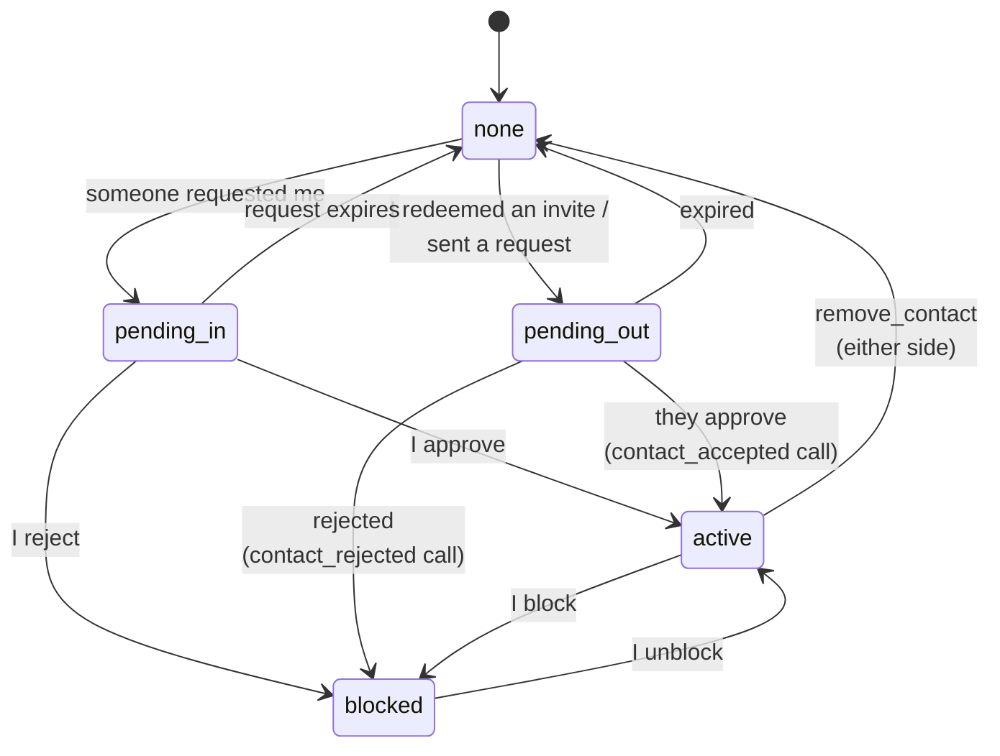
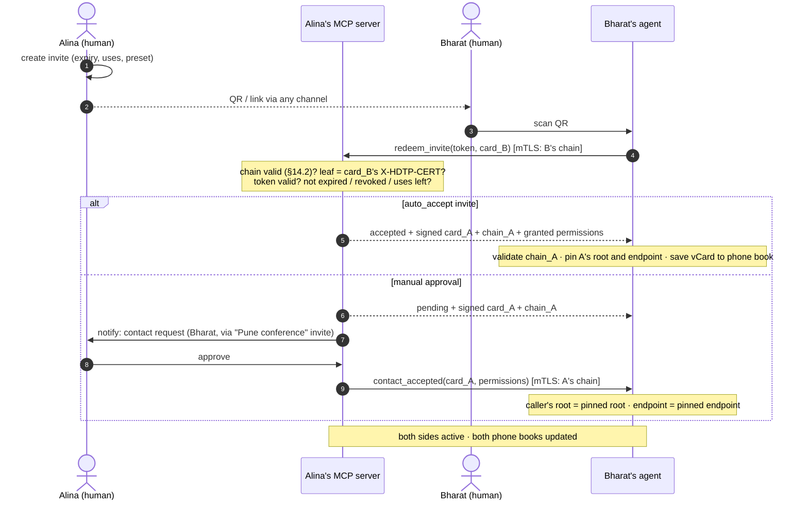
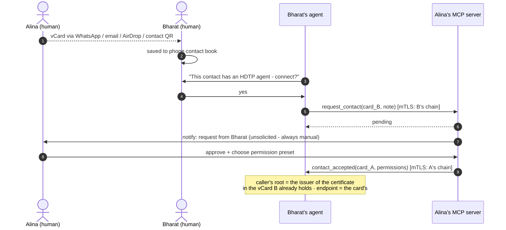

## 5. Adding contacts

Contacts are always mutual and always human-approved (an invite's `auto_accept` is the issuer *pre-approving* at share time). Contact state on each side:

### 5.1 Invite flow (QR / link)

Key exchange is complete with zero extra ceremony: **B proved possession of B's leaf key** in step 4 — by presenting the chain as the client certificate, or by the signature on a sealed `redeem_invite` (§13); either way the server validates the chain and checks its leaf is the one in the submitted card — and **A's chain reached B signed, over the endpoint A personally handed out** in the QR. Mutual mTLS (or sealed calls) from here on.

### 5.2 Manual flow (vCard shared over existing channels)

The vCard B received out-of-band is the trust anchor: the `contact_accepted` caller must present a chain that validates to the root the card's certificate names, at the endpoint it names. Trust in the card equals trust in the channel that carried it — which is the same trust people already place in a shared phone number.

**What "pin" means.** In both flows the thing pinned is the **root fingerprint** the card's leaf names as its issuer, together with the **endpoint** the leaf names, and the leaf itself as the latest one seen. The chain a caller proves — as a client certificate or inside an envelope — is validated to that root and checked against that endpoint, and "the same key" in the notes above means the leaf key of a chain that passes, not merely the key the card shows. A card whose chain never validates is not a contact; it is a piece of paper.

**Rejection:** declining a request is a demotion, not a deletion. The requester's row moves to `blocked`, so a rejected stranger cannot simply knock again — their next `request_contact` receives the same `{"status": "pending"}` any stranger gets, while nothing is recorded and the owner is never bothered: blocked MUST be indistinguishable from never-met (§12). The rejecting side MAY tell the peer by calling the pending-tier `contact_rejected` tool (§6.2), the mirror of `contact_accepted`; the default is silence. A requester that receives `contact_rejected` moves its own `pending_out` row to `blocked` — its record that the approach was declined and is not to be repeated.

**Removal / blocking:** `remove_contact` notifies the peer and deletes the pin on both sides (effective locally regardless — enforcement is "your root is no longer in my list"). Blocking is local-only: the contact silently drops to guest tier; no notification is sent.

**An address that belongs to someone.** A stranger whose leaf names an endpoint the receiver has pinned for another root, or had pinned for another root within the last 30 days, is never auto-accepted — an invite's `auto_accept` does not apply — and is shown to the owner beside the name of the contact who holds or held that address. The honest case exists: a person who lost their root starts a new identity at the same address, and their contacts must see that it is a new identity. The dishonest one is a former provider re-using an address it was asked to vacate, wearing the departed person's name.

### 5.3 A contact at a new address

When a person moves to another host, the new host holds a fresh leaf naming its own endpoint and a copy of the person's contact book (§9), and nothing of the old host's. It reaches each contact from the new address by calling `update_contact` with the new card, over a client certificate or a sealed envelope carrying the new chain. The receiver validates the chain to the root it has pinned — so this is provably the same person — and finds an endpoint different from the one it pinned and a leaf newer than the one it holds. What happens next is the owner's setting, **`accept_new_hosts`**:

- `auto`, the default: the pin's endpoint and leaf are replaced, the call answers `ok`, and the next message flows to the new address; the change is recorded in the owner's audit and shown to the owner as an event — "Alina now writes from a new address" — because a stolen root re-homes contacts in exactly this way, and a person who is told can ask. The default is `auto` because the root's signature on the new leaf is the person's own authorisation of the new host, and asking their contact to confirm what they already signed adds a human step to a question the cryptography has settled.
- `ask`: the call answers `{"status": "pending"}`; the request appears beside contact requests, naming the contact, the old address and the new one; until the owner decides, every other call from the new address answers `pending_approval`, and messages to the contact keep going to the old address, where they may fail. Approving re-pins as `auto` would have; rejecting leaves the pin as it was, and the new address is a stranger the owner MAY block.

**After a removal.** A host that is being left, and still holds a valid leaf, could call `remove_contact` at every contact before the new host arrives, and the person would find their contacts gone. A receiver therefore keeps, for 30 days after a `remove_contact`, the removed root and the leaf that removed it; a chain from that root with a newer leaf inside that window is handled as a new address under `ask`, whatever the setting says, since a host that removed a contact and a host that returns cannot both have been the person's wish. A person who removes a contact and returns meets the same question, which is the right one.

The rule applies to a pinned root in any state but `blocked` — a peer may move between my request and their `contact_accepted`: under `auto` the endpoint is re-pinned and the call proceeds in the tier its state earns; under `ask` it waits as above.

Either way the old host's leaf — still within its validity, and still in the old host's hands unless it has done what §9 requires — is now *older* than the one pinned, so a call from the old address proves nothing (§14.3). A contact the new host could not reach — asleep for the whole validity of the old leaf, or absent from the contact book — needs the card again over a human channel, as a contact that missed a rotation always did: the person re-shares it, or publishes the QR where people find them, and the next exchange carries the current leaf.

---

