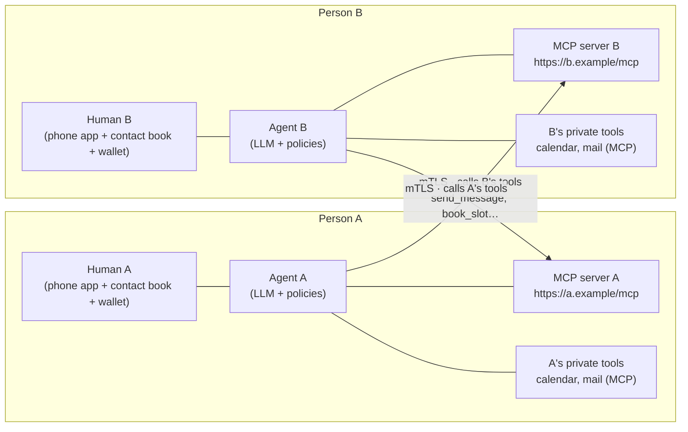

## 1. Architecture

Both sides are symmetric: every participant runs (or is hosted with) an **agent** and exposes an **MCP server** over HTTPS. "A messages B" = A's agent makes one mTLS-authenticated MCP tool call to B's server. B's server identifies the caller by the certificate chain it proves — as the client certificate, or inside a sealed envelope's signature (§2, §13) — validates that chain to a root pinned in B's contact list, and shows/allows exactly the tools B's permission settings grant that contact. Humans sit above their agents: they approve contacts, set permissions, hold the wallet that issues their host its certificate, and can type messages that travel the same rails.

---

