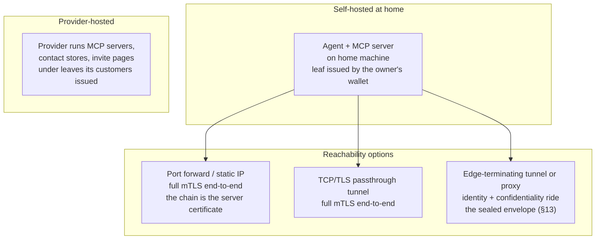

## 10. Deployment

**Self-hosting:** anything that passes TLS through to the machine unterminated — a forwarded port, or a tunnel that routes TLS by its server name without decrypting it — preserves end-to-end mTLS, and the caller's client certificate reaches the server. A tunnel or proxy that terminates TLS at its edge strips client certificates; behind such an edge, caller identity and confidentiality ride the sealed envelope instead (`X-HDTP-SEAL: required`, §13), and the edge sees ciphertext plus metadata only. A custom domain + Let's Encrypt on the tunnel/host gives contacts a clean endpoint; a host on its own domain MAY instead present its chain as the server certificate (§2). A machine that is not always on is not an HDTP host; a person whose machine is not always on is hosted by a provider (§9).

**Provider mode:** the operator hosts each customer's MCP server (per-tenant paths or hostnames) and renders invite links/QRs. It holds one leaf per identity, issued by the customer's own root for the address the operator serves it at, and never the root: a customer who leaves issues a leaf to the next host, that host reaches every contact from its own address (§5.3), and the operator deletes what it held (§9). Every change of address — a custom domain, a rename, a move between the operator's environments — is a leaf the person signs and a new address at every contact (§5.3); an operator gates such changes behind that ceremony rather than performing them alone. A person arriving with nothing makes their first identity in the browser on the operator's sign-up page: the root is generated there, the first leaf issued there, the root's backup file (§9) downloaded before anything else happens. The same front-door machinery scales down to one person: an *ingress* — an HDTP host on a VPS routing per-subdomain, either passing TLS through untouched or terminating public TLS and re-originating over mutually pinned mTLS to the home machine — is the self-hosted form of provider mode, and a provider is that ingress run for many tenants.

---

