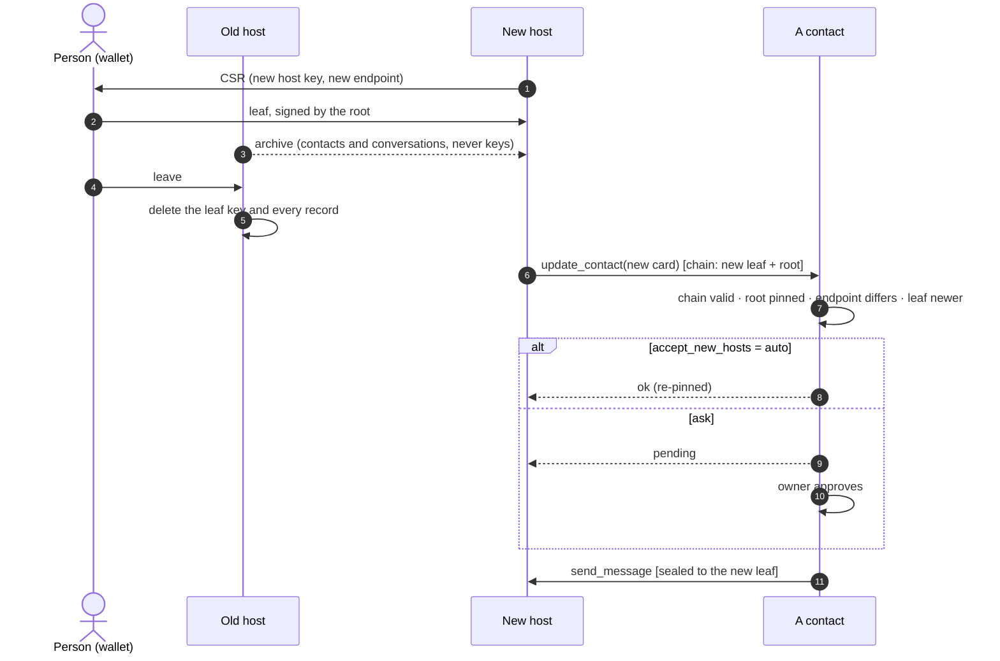

## 9. Hosting

Direct calls need the recipient's server reachable. The hours it is not are answered by the thing a person-held root makes safe: **being hosted**. A host runs the identity's server all the time, under a leaf the person issued, and can be replaced without the person losing anything. There is no relay role, and no store-and-forward gateway that would see every sender, recipient and timestamp for its trouble: a host delivers directly and, when the peer is unreachable until `expires`, reports failure (§7). It never writes a gateway property on a card, and never honours one a card names (§3). This section is what a host holds, what it must do when the person leaves, and how the wallet on the other side behaves.

**What a host holds.** The leaf certificate for the identity at its endpoint and that leaf's private key; a superseded leaf's key until its `notAfter` (§2); the identity's data — contacts, threads, media, invites, settings, audit log. Never the root. A host obtains a leaf by sending the wallet a certificate signing request (PKCS #10, RFC 2986) carrying the host's key and the endpoint it will serve; the wallet shows the person the endpoint and the validity, and signs or does not. A provider's sign-up page for a person who has no wallet runs the same ceremony in the browser: the root is made or derived there (§2.1), the first leaf is issued there, a copy is downloaded before anything else happens, and no server sees a root. The ceremony runs in a document the provider's page cannot read — served from an origin that is not the provider's, pinned by integrity hash, and top-level rather than framed, because WebAuthn in a cross-origin frame depends on the embedder delegating permission, which not every browser allows. It hands the page back only the leaf; a page that could read the root would be the provider seeing it.

**Renewal** is §2: a CSR again, for the same endpoint, before the old leaf expires. A renewal SHOULD carry a fresh key, so that a leaf key compromised without anyone noticing dies with its leaf; a suspected compromise is the same act done at once, and the new leaf outranks the stolen one with every contact it reaches (§14.3). A leaf's key does not outlive its leaf: a host MUST stop using the key of a leaf that has expired and MUST destroy it, keeping the key id so that an envelope still sealed to it is answered `certificate_renewed` (§14.4) — past its date every verifier refuses the leaf (§14.2 rule 4), so the key can do nothing legitimate, and a renewal has never needed it. **Moving** is the person issuing a leaf to the new host, the data carried across as an archive — the person's contacts and their conversations, with the media in them, and nothing that is the host's own: no settings, no credentials, no invites, no record of the host's leaves; an archive is the export of §9.2, a host that makes one MUST NOT put key material of any kind in it, and a host that imports one MUST refuse any key material in it and MUST refuse, rather than ignore, anything else it does not recognise — and the new host reaching every contact by §5.3, *before* the person tells the old host to leave, so that no contact meets a gap. A host imports the archive by §9.2: the person sees every contact before one is written, an imported leaf never replaces a pin the host validated itself, and the import ends with a new leaf from the person's wallet.



**What a host must do when the person leaves.** Destroy the leaf's private key and delete every record of the identity — data, keys, the fingerprints of former leaves — at once, keep nothing beyond what law compels, and answer calls at the old address exactly as it answers calls for an address it never served. The protocol's backstop against a host that does not is the leaf's own expiry, and the fact that a newer leaf outranks it with every contact it reaches (§14.3). Outside the protocol, the person's backstop is the regime the provider is audited under: a provider that hosts other people's identities is their data processor, and its audits and legal obligations are what make deletion checkable. An address an identity has vacated MUST NOT be assigned to another identity until the last leaf issued for it has expired, so a contact that missed the move never reaches a stranger where it expects a friend. A host that exports an identity toward a destination that cannot carry its chain MUST say so before the export; the remedy is a destination that can.

**The wallet** holds the root and nothing a host holds. It signs certificates only from an explicit user action, in a window of its own that no page can draw over, and before signing it shows the endpoint the leaf will name, the origin of the page that asked (a difference between the two is shown, not hidden — a provider's portal and the addresses it serves are often different hosts), whether that endpoint's host is one it has issued to before, and the validity. It verifies the CSR's own signature, so the key it certifies is one the host proved it holds, and refuses a CSR whose key is a root. Issuing a leaf to a *new* endpoint requires a deliberate act by the person again — the passphrase, the hardware key, or a fresh user-verified assertion in a wallet that has no passphrase — even in an unlocked session; a renewal for the same endpoint needs the click alone. It issues one live leaf per identity at a time — a second endpoint is a move, not a second home, because contacts keep one pin and the newest leaf wins — and MUST NOT issue a second while one is live except as its replacement. At rest the root is under a key derived from a passphrase with a memory-hard function, optionally wrapped by a hardware key — and better, the root is not at rest in the wallet at all: held in a hardware key, or derived from a passkey on each use (§2.1). A root generated in a hardware key has no copy anywhere, which is the one defence against a root fought over by two holders (§14.3); a derived root has exactly one, the file below, which only the person holds. Unlocked, or reconstructed, it lives for the signing and nowhere a page can reach; a wallet that must hold it in software SHOULD hold it in a handle it cannot itself read back. It keeps its own copy of the person's contact book, so the book outlives any host and any identity, and a ledger of the leaves it has issued — each entry the endpoint and the dates, never the leaf itself, which is the host's to serve and grants nothing. The ledger and the contact book live in the wallet's **record**: under the store key of §2.1 for a wallet with a credential, and beside the file under the recovery key for one without. The book leaves and enters the wallet as a §9.2 export holding contacts only — a book; inside the record it keeps the wallet's own form. The **file** is the backup of the root and nothing else — the root's private key, its certificate and, for a derived root, the PRF secret of §2.1 — sealed under a **recovery key** held by nobody but the person — generated by a wallet that has a credential, shown once and offered as a file; in a wallet without one, a command-line tool, a passphrase the person chooses. A wallet MUST NOT write a leaf, a ledger entry or a contact into the file, and writes it once, when the root is made, and again only when the root is re-bound or a hardware key takes it. Losing the credential is not losing the root: the file and the recovery key open the record through the PRF secret, and the wallet then **re-binds** — it makes a new credential, seals the root into a new record under the store key that credential derives, carries the ledger and the contacts, deletes the old record and writes a fresh file — and from then on the new credential opens the root as the lost one derived it. A wallet MAY hold a root at rest in that way and in no other, on the person's act; a re-bound root is indistinguishable on the wire (§2.1). Losing every copy — the credential, and the file or its recovery key — ends the identity; the wallet says so once, when the root is made.

### 9.1 Signing requests

A host asks a web wallet for a leaf with a **signing request**: an HTML form submitted by top-level navigation, `POST`, `application/x-www-form-urlencoded`, to the wallet's signing address. Nothing of it is carried in the URL. Its body has these fields:

| Field | What it holds |
|---|---|
| `csr` | the certificate signing request, base64url PKCS #10, at most 4096 bytes: the host's key and the endpoint the leaf will name |
| `purpose` | `renew` or `move` |
| `expect_root` | the fingerprint of the identity's root, which the wallet proves by §2.2 |
| `root_cert` | optional: base64url DER of the root certificate, at most 4096 bytes, when the host holds it; it hashes to `expect_root` |
| `redirect` | the absolute URL the answer returns to: `https`, or `http` to a loopback host (`localhost`, `127.0.0.0/8`, `::1`); no userinfo, no fragment, at most 2048 bytes |
| `state` | 32 random bytes, base64url without padding — exactly 43 characters — minted by the host for this request; the wallet echoes it and reads nothing in it |
| `recipient` | at most 200 characters: what the host calls itself, which is the host's own claim |
| `valid_days` | the validity the host suggests, in days: a decimal integer from 1 to 398, with no leading zero |
| `expires` | an RFC 3339 instant in UTC — ending in `Z`, with a fraction of a second, where there is one, after a `.` and never a `,` — at most ten minutes after the request is made |

A wallet MUST refuse a request that is not a top-level navigation, as the browser's fetch metadata reports it (`Sec-Fetch-Mode: navigate`, `Sec-Fetch-Dest: document`), so that a script on another page cannot probe it. A wallet MUST refuse a request whose `Origin` is absent, `null`, or different from the origin of `redirect`: the host that asks is the host that collects. A wallet MUST refuse a request with a field the table above does not list, a field that is not a string, or a field that breaks the table, and a request that has expired or expires more than ten minutes ahead. A wallet MUST refuse a request whose CSR fails the checks of §9 — its own signature, and a key that is not a root — or names an endpoint that is not in the normal form of §14.1 or fails the address guard of §3.

A wallet MUST prove the root against `expect_root` (§2.2) before it signs. It MUST show the person the asking origin, the `recipient` as the host's own claim, the endpoint, the validity and whether the host is new. The person chooses the validity; `valid_days` is a suggestion.

It answers by navigating the top-level browsing context to `redirect` with the fragment `chain=<leaf>.<root>&state=<state>`, the two certificates base64url DER, or `error=<code>&state=<state>` — `cancelled` when the person declines — and to no other destination; a request it refuses gets no answer at its `redirect`. The wallet MUST NOT keep anything of the request once it has answered, and MUST NOT write its body to a log. Only the chain and the state travel, and the chain is public: it certifies a key only the host holds (§9's proof of possession), so a page that collected it could not use it.

A host MUST accept an answer only once, only with the `state` it minted for a pending request, and only a chain whose leaf carries that request's key and validates at its endpoint (§14.2). A captured request can be replayed until `expires`, and a replay still needs the person's act and yields a leaf only for the asking host's own key. A fragment reaches no server log and no `Referer`; a host SHOULD read it in the page, clear it from the address bar, and submit it to itself under the person's own session. A page that sets `Referrer-Policy: no-referrer` makes its browser send `Origin: null` on the form, which every wallet refuses, so the page that submits a signing request has to relax that policy.

### 9.2 The export

An **export** is the file that carries a person's contacts, conversations and files from one host to another, and the archive of §9 is an export. It is one zip file, and it is **not encrypted**, so that any host can import it. It holds no key of any kind — neither the host's nor the person's — and is not the file of §9 that backs up a root: a wallet's export of its root (§2.1) is that file, and never this one. The name of the file is not significant; an importer reads nothing from it.

```
manifest.json      format version, owner, time, counts, the sha256 of each text member
contacts.csv       one row per contact
threads.csv        one row per thread; several threads per contact
messages.jsonl     one JSON object per line: bodies, replies, attachments
media/
media/<sha256>     one file per attachment, named by the sha256 of its bytes
```

The wallet's contact book travels in the same format: a **book** is an export holding `manifest.json` and `contacts.csv` only, whose manifest counts zero threads, messages and media.

**`manifest.json`** is one JSON object with exactly these members:

```json
{ "hdtp_export": 1, "owner": "sha256:…", "owner_name": "Alina", "exported_at": "2026-09-27T10:00:00Z",
  "tool": "…", "counts": { "contacts": 12, "threads": 30, "messages": 812, "media": 9 },
  "files": { "contacts.csv": "<sha256 hex>", "threads.csv": "<sha256 hex>", "messages.jsonl": "<sha256 hex>" } }
```

`hdtp_export` is `1`, the only version there is. `owner` is the fingerprint of the exporting identity's root, and the only place the file says whose it is; `owner_name` is that identity's display name and `tool` the writer's name and version, both informative. `exported_at` is the time of the export. Every time in an export — `exported_at`, `added`, `created_at`, `last_at` and a message's `time` — is an RFC 3339 instant in UTC: it ends in `Z`, and a fraction of a second, where there is one, follows a `.` and never a `,`. `counts` counts the rows, lines and media files, and `counts.media` is the number of `media/` members. `files` maps each text member the file holds — `contacts.csv`, `threads.csv`, `messages.jsonl` — to the lowercase hex sha256 of its bytes, and lists nothing else: a media member is bound by its own name, which is the sha256 of its bytes, and by `counts.media`, so the number of files an export carries is not bounded by the size of its manifest.

**`contacts.csv`**, like `threads.csv`, is UTF-8 CSV as RFC 4180 describes it, and its first row is exactly this header:

```
root,endpoint,name,display_name,status,was_active,permissions,their_permissions,leaf,root_cert,added
```

| Column | What it holds |
|---|---|
| `root` | the contact's fingerprint; unique in the file, and never `owner` |
| `endpoint` | the contact's endpoint, in the normal form of §14.1, passing the address guard of §3 |
| `name` | the owner's own name for the contact, at most 200 characters |
| `display_name` | the contact's name for themselves, at most 200 characters |
| `status` | `active`, `blocked` or `pending_out`; a request received and not yet decided stays with the host that received it |
| `was_active` | `true` or `false`: whether this was ever a contact, which decides what an unblock restores |
| `permissions` | what the owner grants the contact: the names of §8, separated by spaces |
| `their_permissions` | what the contact last said it grants, the same way; informative only |
| `leaf`, `root_cert` | optional, base64url DER; `root_cert` hashes to `root` |
| `added` | RFC 3339 |

**`threads.csv`** has exactly the header `id,contact,topic,created_at,last_at`: `id` is unique in the file, `contact` is a `root` from `contacts.csv`, `topic` is the thread's topic (§7), and the times are RFC 3339.

**`messages.jsonl`** holds one JSON object per line, with exactly these members:

```json
{"id":"…","thread":"<thread id>","contact":"sha256:…","msg_id":"…","direction":"in|out",
 "sender":"agent|human","time":"RFC 3339","body":"text, at most 16 KiB, any lines",
 "reply_to":"<msg_id>|null","status":"delivered|queued|failed|read",
 "attachments":[{"file":"<sha256>","filename":"a.pdf","mime":"application/pdf","size":12345}]}
```

`id` is unique in the file; `msg_id` is the message's own idempotency id (§6.2); `body` is the text alone, and the file a message carried is its `attachments`, naming a `media/` member by `file`. `attachments` holds at most one element, because a message carries at most one file (`send_media`, §6.2), and a message that carries one has an empty `body`, because `send_media` carries no caption; a media message that carried a link rather than bytes travels with `attachments: []` and the link as its body. An exporter MUST NOT leave out a media file it holds for a message it exports: a file it cannot include is a reason to refuse the export, never to omit the file. `direction` is `in` or `out`, `sender` is `agent` or `human` (§7), `time` is RFC 3339, `status` is one of the four shown, and `reply_to` is a `msg_id` in the file or `null`. An outgoing message that was never delivered travels with `status: queued`.

**`media/<sha256>`** is the bytes of one file, at most 5 MiB (§12's inline limit), named by the lowercase hex sha256 of those bytes.

**Spreadsheet formulas.** A writer MUST write a CSV cell that begins with `=`, `+`, `-`, `@`, `'`, a tab or a carriage return with one `'` before it, and a reader strips one leading `'`. base64url DER cannot begin that way: it starts with `M`, from its first byte `0x30`.

**Unencrypted.** Every surface that writes an export MUST tell the person, before the file is written, that it is not encrypted, that anyone who gets it can read what it holds — their contact list and all their conversations and files for a full export, their contact list for a book — and that it holds no keys, so it cannot be used to speak as them. The words need not be these, for a full export:

> This file is not encrypted. Anyone who gets it can read your contact list and all your conversations and files. It holds no keys, so it cannot be used to speak as you. Keep it where you keep private documents, and delete it once it has been imported.

and for a book:

> This file is not encrypted. Anyone who gets it can read your contact list. It holds no keys, so it cannot be used to speak as you. Keep it where you keep private documents, and delete it once it has been imported.

A host that delivers an export over a network MUST NOT keep it at rest: it builds the file when the signed-in person asks and streams it to them. The duty of §9 toward a destination that cannot carry the identity's chain is unchanged; it concerns the chain, not the encryption.

**Validation.** An importer MUST check the whole file before it writes anything, and MUST refuse the whole file if any check below fails:

| Check | Rule |
|---|---|
| Names | An importer MUST refuse any entry whose name is not exactly `manifest.json`, `contacts.csv`, `threads.csv`, `messages.jsonl`, `media/`, or `media/` followed by 64 lowercase hex digits — so no `..`, no absolute path, no backslash and no other file — and it MUST read the zip's central directory as the only index |
| Duplicates | An importer MUST refuse a file in which one name appears twice |
| Members | An importer MUST refuse a file that lacks a member; a file MAY omit `threads.csv`, `messages.jsonl` and `media/` only when its manifest counts them zero, which is what a book does |
| Entry kinds | An importer MUST refuse an encrypted entry, a symbolic link (a Unix mode in the external attributes), and any directory but `media/` |
| Sizes | An importer MUST count sizes by the bytes it actually decompresses, never by the sizes a header states, and MUST refuse a manifest over 64 KiB, a `contacts.csv` over 4 MiB or 5000 rows, a `threads.csv` over 16 MiB, a line of `messages.jsonl` over 64 KiB, a media file over 5 MiB, and anything over a ceiling of the host's own (below) |
| Hashes | An importer MUST refuse a text member that `manifest.files` does not list or whose sha256 differs from it, a listed member the file lacks, a `files` entry that names anything but a text member, a media member whose name is not the lowercase hex sha256 of its bytes, and counts that differ from what the file holds — `counts.media` included, which is the number of media members |
| Owner | An importer MUST refuse a file whose `owner` is not the root of the identity importing it, and a contact row whose `root` is `owner` |
| Rows | An importer MUST refuse a header that is not exactly the one shown, a row or a message that breaks what its column or member holds above, a message with a member not listed or one missing, and a message with more than one attachment, a message that carries an attachment and a `body` that is not empty, and a time that is not an RFC 3339 instant in UTC ending in `Z`, or whose fraction follows anything but a `.` |
| References | An importer MUST refuse a thread whose `contact`, a message whose `thread`, `contact` or non-null `reply_to`, or an attachment whose `file` names nothing in the file, and a media file that nothing names |
| Key material | An importer MUST refuse any cell, any string member of the manifest or of a message, and any media file that decodes as a private key — PKCS #8 or SEC1, in DER or PEM — and MUST parse a certificate only as a certificate of §14.1's profile |

A refusal names the member, and the row or line and the column where there is one; a refusal for a ceiling of the host's own names that ceiling (below).

**Import.** A host imports a file that passed validation in this order:

1. It MUST show the person the contacts, and write nothing until the person agrees.
2. It merges the rows with the pins it already holds. An imported leaf MUST NOT replace a pin the host validated itself, and a row's `leaf` is pinned only when `[leaf, root_cert]` validates at the row's `endpoint` (§14.2).
3. It writes the contacts, which are recognised at once in the status their rows give, then the threads, the messages and the files. A host MUST NOT send a message it imported, whatever its `status`: retries belonged to the host that exported it.
4. The import MUST end with a request for a new leaf for the importing endpoint, which the host mints itself with `expect_root` equal to `owner` — `move` for an identity new to the host, `renew` for one it already serves — and which the person completes in their wallet (§9.1).
5. Once that leaf is installed, the host MUST call `update_contact` at every imported contact that is not blocked and whose leaf it holds (step 2), since a contact whose leaf it does not hold cannot be sealed to, and MUST report every other contact that is not blocked as unreached, without retrying it; that contact stays pinned by its root. A contact that pins the identity takes the new address by §5.3. A contact that refuses the call — `update_contact` is a contact-tier tool, and that contact does not hold the identity as one — MUST then be sent `request_contact`, which that contact decides under its own policy.

**What a contact controls.** Some of what an export carries is the contact's own — the name they give themselves, the permissions they say they grant, the messages they sent — and none of it may stop the owner taking their export. A writer MUST write `reply_to` as `null` when the message it names is not in the file. A writer MUST drop from `their_permissions` every name that is not a permission of §8 and every name repeated, since the column is informative. A writer MUST truncate `display_name` to 200 characters, since it is the contact's own claim. A writer MUST leave out a message whose `body`, or whose media file, the key-material check above would refuse, with the attachment it carried, and MUST list each message it leaves out, by its `id` and the reason, in the report it gives the person; it never leaves one out silently. The importer's checks are unchanged, so a file that breaks any of these was not written by a conforming writer, and is refused as hostile.

**Ceilings.** A host MAY set import ceilings of its own, on the whole file and on counts — contacts, threads, lines of `messages.jsonl`, the characters of an `id` — and MUST name the ceiling in each refusal it makes for one. A host MUST NOT refuse to write an export because the file would exceed an import ceiling of its own, of any kind, the whole-file ceiling included; it MAY warn the person that the file exceeds them, naming each. A person must always be able to leave with their data (§9, Moving). A writer MAY refuse a file its container cannot represent — a zip over 4 GiB without zip64 — naming why.

**The owner's own strings.** A writer MUST refuse to write a manifest whose `owner_name` or `tool` the key-material check above would refuse, naming the member: those are the owner's and the host's own, not a contact's, so there is nothing to leave out.

---

