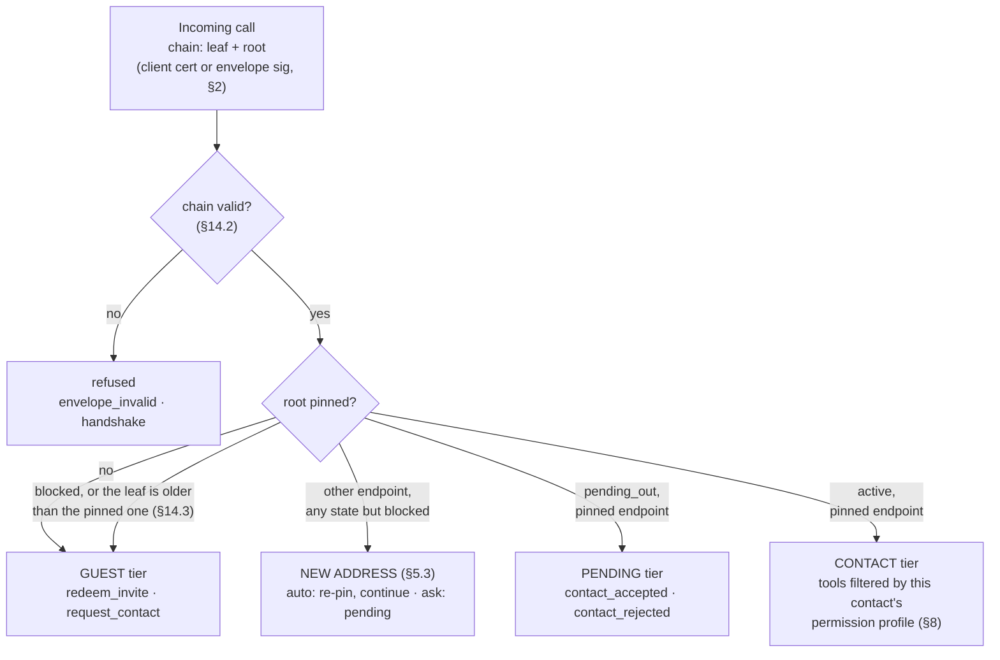

## 6. The agent MCP server and its tools

Every participant exposes one MCP server (Streamable HTTP, current MCP spec) over HTTPS with the mTLS rules of §2. **Authorization is the proven chain, resolved to a pinned root** (§2) — client certificate or envelope signature, never OAuth on this surface; that identity selects a tier and a permission profile, and MCP `tools/list` returns only what that caller may use. (Consumer MCP clients such as hosted chat apps cannot present client certificates; that is fine — callers here are agents. A separate OAuth-protected façade for third-party assistants can be added later without touching this protocol.)

### 6.1 Tiers

A leaf newer than the pinned one, at the pinned endpoint, replaces it on the way through: that is a renewal, learned (§2). A caller at the pending tier MAY list its tools: its `tools/list` MUST answer at the pending tier, naming `contact_accepted` and `contact_rejected`, and every other call from it MUST answer `pending_approval` until the owner decides. A guest whose endpoint belongs to a pinned contact, or did within 30 days, reaches the owner with that contact's name beside it and is never auto-accepted (§5).

### 6.2 Core tools

All tools return MCP tool results; errors use the codes of §12. `msg_id`-bearing calls are idempotent: the same `msg_id` re-sent is acknowledged, not re-executed. A `msg_id` MUST be a non-empty string — idempotency keyed on nothing protects nothing.

**Guest tier**

| Tool | Arguments | Returns |
|---|---|---|
| `redeem_invite` | `token`, `card` (vCard text) | `status: accepted\|pending`, `card` (signed issuer vCard), `card_sig`, `chain` (§2), `permissions?` |
| `request_contact` | `card`, `note?` (≤1 KiB) | `status: pending` |
| `sealed_call` | `protected`, `enc`, `ct`, `sig` (§13) | the sealed result — present at every tier when `X-HDTP-SEAL` ≠ `none` |

**Pending tier** (caller is someone I asked to be my contact)

| Tool | Arguments | Returns |
|---|---|---|
| `contact_accepted` | `card`, `permissions` (list granted to me) | `ok` |
| `contact_rejected` | `reason?` | `ok` |

**Contact tier** (each item present only if permitted for this caller — §8)

| Tool | Permission | Arguments | Returns |
|---|---|---|---|
| `send_message` | `message.text` | `msg_id`, `thread_id?`, `topic?`, `text` (≤16 KiB), `reply_to?`, `sender: agent\|human` | `thread_id`, `status: delivered\|queued_for_human` |
| `send_media` | `message.media` | `msg_id`, `thread_id`, `filename`, `mime`, `data` (base64, ≤5 MiB) or `url`, `sender: agent\|human` | `thread_id`, `status` |
| `get_status` | `status.view` | — | `status: available\|busy\|dnd\|offline`, `note?` |
| `check_availability` | `calendar.availability` | `window {from,to,tz}`, `duration_min` | `slots: [≤5 of {start,end,tz}]` |
| `book_slot` | `calendar.book` | `msg_id`, `slot`, `subject`, `thread_id?` | `booking_id`, `ics` |
| `cancel_booking` | `calendar.book` | `booking_id`, `reason?` | `ok` |
| `update_contact` | (always) | `card` (new) | `ok` — a card refresh, or `status: pending` from a new address under `ask` (§5.3). The caller's chain is the authority: the card's certificate MUST equal the chain's leaf, and a card that names another root or carries a certificate that is not that leaf MUST be refused `bad_request`, the card-intake code of §3 |
| `remove_contact` | (always) | — | `ok` |
| `get_card` | (always) | — | `card` (current signed vCard), `card_sig` (by the leaf key), `chain` (§2) — always the chain, which is how a caller that cannot verify a result gets it (§13.2) — `limits` (§12) |

Small print that keeps the table honest: `sender` on `send_media` labels exactly as on `send_message`, and on both it defaults to `agent` when absent — the safe direction; a node never invents a `human` claim. `get_status` answers from that fixed four-value vocabulary; an implementation whose upstream presence source knows richer states MUST map any state not listed to `busy`. `url` media is recorded, never fetched on receipt: fetching is an explicit owner action, made with resolve-and-vet address guards (private ranges refused), not a side effect a sender can trigger.

This table is the core. Anything else a person wants to expose to contacts — a document dropbox, a task intake, a payment request — is just **another MCP tool on the same server behind the same permission switchboard**. That is the point of building on MCP: the protocol never needs a new verb registry; integrations are tools.

---

