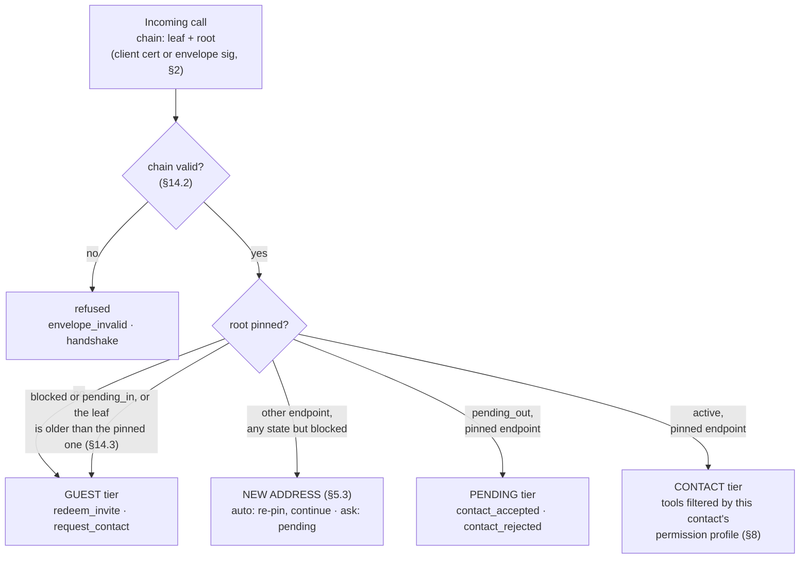

## 6. The agent MCP server and its tools

Every participant exposes one MCP server over HTTPS, under the mTLS rules of §2. HDTP does not fix an MCP revision: a server **MAY** implement any MCP revision whose clients can list and call its tools (`tools/list` and `tools/call`). HDTP is the layer around those two methods that decides who the caller is and what it may call.

**Authorization is the proven chain, resolved to a pinned root** (§2). The TLS client certificate chain presented on the connection that carries a request is that request's credential; a sealed call carries its own, the chain or leaf inside the envelope (§13). MCP lets an implementation use its own authentication, and HDTP uses no OAuth on this surface. The identity selects a tier and a permission profile, and `tools/list` returns only what that caller may use. Consumer MCP clients such as hosted chat apps cannot present client certificates; HDTP's callers are agents, which can.

An HDTP server does not send `notifications/tools/list_changed`, and does not declare `listChanged`: a caller finds what it may call by calling `tools/list` when it needs to.

### 6.1 Tiers



A leaf newer than the pinned one, at the pinned endpoint, replaces it on the way through: that is a renewal, learned (§2). A caller at the pending tier **MAY** list its tools: its `tools/list` **MUST** answer at the pending tier, naming `contact_accepted` and `contact_rejected`, and every other call from it **MUST** answer `pending_approval` until the owner decides. A guest whose endpoint belongs to a pinned contact, or did within 30 days, reaches the owner with that contact's name beside it and is never auto-accepted (§5).

### 6.2 Core tools

**Results.** Every tool answers with an MCP `CallToolResult` holding one `text` content item, whose text is a JSON object: the tool's result. A result that succeeds carries no `isError`, or `isError: false`. A refusal is a result with `isError: true` whose text is a JSON object holding `code`, one of the codes of §12, and, where §12 says so, `retry_after` or `data`. A call to a tool the caller cannot see, or to one that does not exist, is answered as a refusal: `blocked_or_unknown` at the guest tier, `permission_denied` at the pending and contact tiers. Appendix A shows each shape on the wire.

```json
{ "jsonrpc": "2.0", "id": 7, "result": {
    "content": [ { "type": "text", "text": "{\"thread_id\":\"3b1f0c9a6e2d4f5b8a7c1e0d9f2b4a6c\",\"status\":\"delivered\"}" } ] } }
```

```json
{ "jsonrpc": "2.0", "id": 8, "result": {
    "isError": true,
    "content": [ { "type": "text", "text": "{\"code\":\"permission_denied\"}" } ] } }
```

**Idempotency.** `msg_id`-bearing calls are idempotent: the same `msg_id` re-sent is acknowledged, not re-executed. A `msg_id` **MUST** be a non-empty string — idempotency keyed on nothing protects nothing. The key is the caller's root and the `msg_id`: a host **MUST** answer a `msg_id` the same contact has used before with the original result, and **MUST NOT** execute the call again.

**Arguments.** Every bound below is in bytes of UTF-8. A string past its bound is refused `too_large`; an argument of the wrong type, a required one that is absent, or a value not among those listed is refused `bad_request`. The bounds given are the defaults `get_card`'s `limits` advertises (§12); a host **MAY** bound the other strings, and does not advertise those bounds.

**Guest tier**

| Tool | Arguments | Result |
|---|---|---|
| `redeem_invite` | `token` (string), `card` (string: the redeemer's vCard text, §3) | `status` (`"accepted"` or `"pending"`); `card`, `card_sig` and `chain`: the issuer's signed card and chain (§3, §2); `permissions` (array of permission names, §8), only when `accepted` |
| `request_contact` | `card` (string), `note` (string, optional, at most 1024 bytes) | `{"status": "pending"}` |
| `sealed_call` | `protected`, `enc`, `ct`, `sig` (strings: the four members of an envelope, §13.1) | an envelope of the same four members, sealed back to the caller (§13.2) |

`redeem_invite` answers an unknown, expired, revoked or used-up token with `invite_invalid`. A caller that sends `request_contact` while its earlier request still waits is answered `pending_approval`. `sealed_call` is listed at every tier whenever the card's `X-HDTP-SEAL` is not `none` (§13.4).

**Pending tier** (the caller is someone I asked to be my contact)

| Tool | Arguments | Result |
|---|---|---|
| `contact_accepted` | `card` (string, optional: the accepter's vCard), `permissions` (array of permission names, optional: what the accepter grants me) | `{"status": "ok"}` |
| `contact_rejected` | `reason` (string, optional, at most 1024 bytes) | `{"status": "ok"}` |

**Contact tier** (each tool present only if permitted for this caller, §8)

| Tool | Permission | Arguments | Result |
|---|---|---|---|
| `send_message` | `message.text` | `msg_id` (string); `text` (string, at most 16384 bytes); `thread_id`, `topic`, `reply_to` (strings, optional); `sender` (`"agent"` or `"human"`, optional) | `thread_id`; `status`: `"delivered"` |
| `send_media` | `message.media` | `msg_id` (string); `data` (string: standard base64 with padding, RFC 4648, Section 4, of at most 5242880 bytes once decoded) or `url` (string); `filename`, `mime`, `thread_id` (strings, optional); `sender` (`"agent"` or `"human"`, optional) | `thread_id`; `status`: `"delivered"` |
| `get_status` | `status.view` | none | `status`: `"available"`, `"busy"`, `"dnd"` or `"offline"` |
| `update_contact` | (always) | `card` (string: the caller's new card) | `{"status": "ok"}` — a card refresh, or `{"status": "pending"}` from a new address under `ask` (§5.3). The caller's chain is the authority: the card's certificate **MUST** equal the chain's leaf, and a card that names another root or carries a certificate that is not that leaf **MUST** be refused `bad_request`, the card-intake code of §3 |
| `remove_contact` | (always) | none | `{"status": "ok"}` |
| `get_card` | (always) | none | `card`, `card_sig` and `chain`: the identity's current signed card and chain (§3, §2) — always the chain, which is how a caller that cannot verify a result gets it (§13.2); `limits` (§12) |

`sender` labels a message as written by the identity's agent or typed by its human (§7); on both tools it defaults to `agent` when absent — the safe direction; a host never invents a `human` claim. `get_status` answers from that fixed four-value vocabulary; an implementation whose upstream presence source knows richer states **MUST** map any state not listed to `busy`. `url` media is recorded, never fetched on receipt: fetching is an explicit owner action, made with resolve-and-vet address guards (private ranges refused), not a side effect a sender can trigger.

**Integrations.** Anything else a person wants to expose to contacts — a document dropbox, a task intake, a payment request — is another MCP tool on the same server, behind the same permissions (§8). HDTP defines no other extension mechanism.

**Example: calendar tools.** Availability and booking show how a capability is added as tools: three tools behind the `calendar.*` permissions of §8. They are not core tools, and a host without a calendar answers them `unavailable`.

| Tool | Permission | Arguments | Result |
|---|---|---|---|
| `check_availability` | `calendar.availability` | `window` (object: `from`, `to`, `tz`), `duration_min` (integer) | `slots`: at most 5 objects of `start`, `end`, `tz` — candidate slots filtered by the owner's policy, never raw free/busy |
| `book_slot` | `calendar.book` | `msg_id` (string), `slot` (object: `start`, `end`, `tz`), `subject` (string), `thread_id` (string, optional) | `booking_id`; `ics`: the booking as iCalendar text (RFC 5545) |
| `cancel_booking` | `calendar.book` | `booking_id` (string), `reason` (string, optional) | `{"status": "ok"}` |

---
