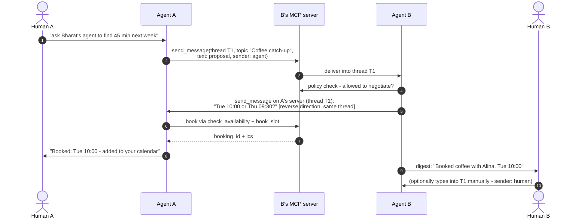

## 7. Messaging and threads

A conversation is a `thread_id` (UUID, minted by whoever sends first) plus an optional human-readable `topic`, stored by both sides. Either agent — or either human, typing manually — continues a thread by calling the peer's `send_message` with that `thread_id`. `sender: human|agent` is honest labeling shown in the peer's UI; an agent replying autonomously identifies as the assistant, never as its owner.

Notes that keep this simple and sane: negotiation is *conversation* between agents inside a thread (no negotiation state machine on the wire) plus two structured calendar tools where structure matters — `check_availability` never returns raw free/busy, only ≤5 policy-filtered candidate slots, and `book_slot` returns the ICS both sides file via their private calendar MCP tools. A `thread_id` belongs to the contact that first used it: a `send_message` from any other contact carrying that `thread_id` is refused `bad_request` — without this rule, thread placement is an impersonation vector, one contact writing into the middle of another's conversation. Multi-party coordination (several employees' agents negotiating) is therefore parallel per-contact threads sharing a `topic` string — still like a CC line, no group crypto, but each line is its own thread. Delivery when the peer is unreachable: retry with backoff until `expires` (sender-chosen, default 24 h), then report failure to the sender's human. There is no store-and-forward role: a peer that must be reachable while its own machine is off is hosted (§9).

---

