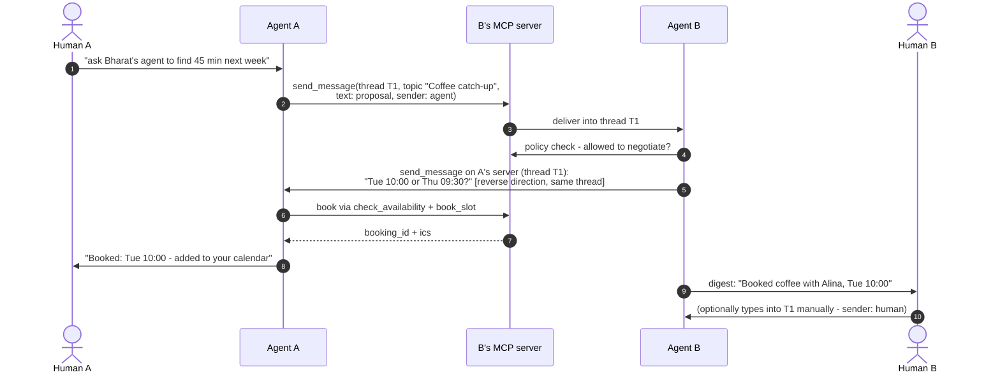

## 7. Messaging and threads

A conversation is a `thread_id` plus an optional human-readable `topic`, stored by both sides. A `thread_id` is a unique string chosen by whoever sends first; a `send_message` that carries none is placed in a new thread whose `thread_id` the receiving host assigns and returns. Messages are stored under their `thread_id` and grouped by it when read. A thread's `topic` is the one given when the thread was created. Either agent — or either human, typing manually — continues a thread by calling the peer's `send_message` with that `thread_id`. `sender: human|agent` is honest labeling shown in the peer's UI; an agent replying autonomously identifies as the assistant, never as its owner.

Negotiation is *conversation* between agents inside a thread; there is no negotiation state machine on the wire. Where structure helps, it is a tool: the calendar example of §6.2 answers availability with at most 5 policy-filtered candidate slots, never raw free/busy, and a booking with the iCalendar text both sides file through their own calendar tools. A `thread_id` belongs to the contact that first used it: a `send_message` from any other contact carrying that `thread_id` is refused `bad_request` — without this rule, thread placement is an impersonation vector, one contact writing into the middle of another's conversation. Multi-party coordination (several people's agents negotiating) is therefore parallel per-contact threads sharing a `topic` string: there is no group cryptography, and each contact's thread is its own. When the peer is unreachable, the sending host retries with backoff until a deadline it sets locally — for example, 24 hours — and then reports the failure to its owner. There is no store-and-forward role: a peer that must be reachable while its own machine is off is hosted (§9).

---

