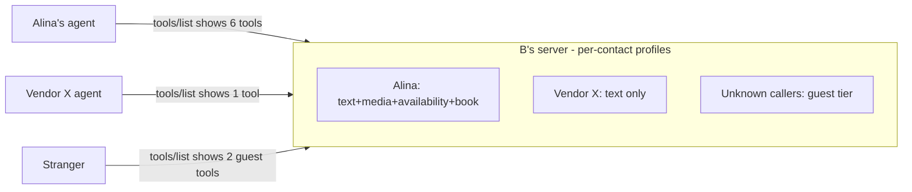

## 8. Permissions

Per-contact switchboard, controlled by the owner, enforced at the owner's server on every call — changes apply instantly, no wire protocol needed (flip a switch → the tool disappears from that caller's `tools/list` and calls return `permission_denied`).

| Permission | Gates | In "basic" preset |
|---|---|---|
| `message.text` | `send_message` | ✔ |
| `message.media` | `send_media` | ✖ |
| `status.view` | `get_status` (status visibility) | ✖ |
| `calendar.availability` | `check_availability` | ✖ |
| `calendar.book` | `book_slot`, `cancel_booking` | ✖ |
| `integration.<name>` | any additional exposed tool | ✖ |

`integration.<name>` is one switch per integration, not per tool: it gates **every** tool that integration exposes, and those tools appear in a contact's `tools/list` under passthrough names of the form `<slug>_<tool>`. Integration grants sit outside preset bundles in both directions — no bundle names them, so applying a preset never grants one and never revokes one; they are always an explicit per-contact decision.

Presets are owner-editable bundles assigned at approval time and adjustable per contact afterwards; four ship as documented defaults:

| Preset | Grants |
|---|---|
| `basic` | `message.text` |
| `work` | `message.text` · `calendar.availability` · `calendar.book` |
| `friend` | `message.text` · `message.media` · `status.view` · `calendar.availability` · `calendar.book` |
| `family` | the same bundle as `friend` — the distinction is the owner's to draw, not the protocol's |

A preset is a label for a bundle, not a lock: hand-toggle one switch and the grant is bespoke. Beyond visibility, the owner's agent applies its own policy on top (auto-reply vs. surface-to-human, auto-book windows, quiet hours) — that is local behavior, not protocol.

---

